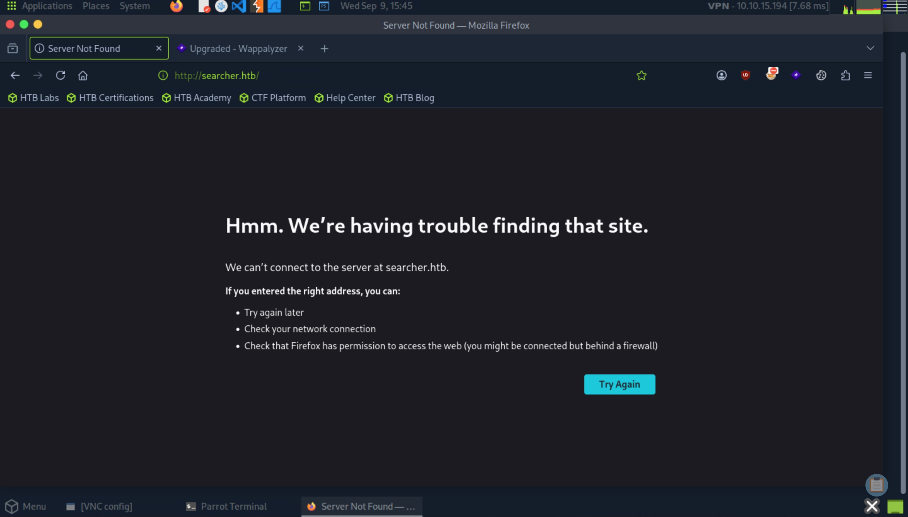
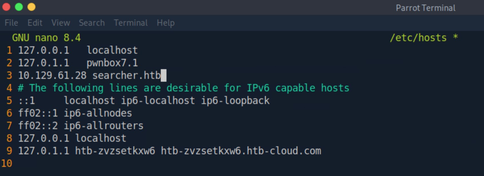
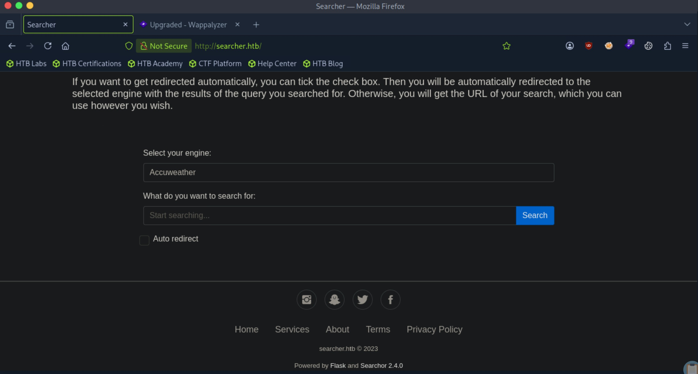
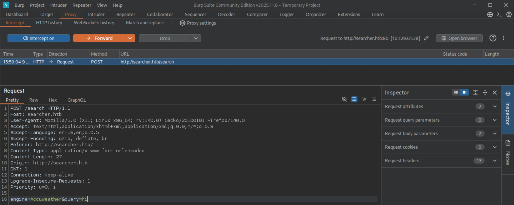
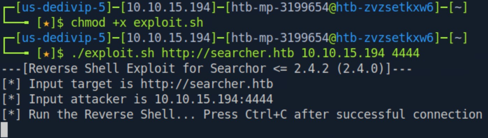
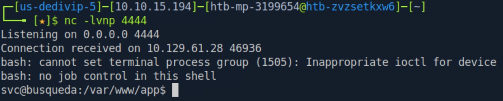
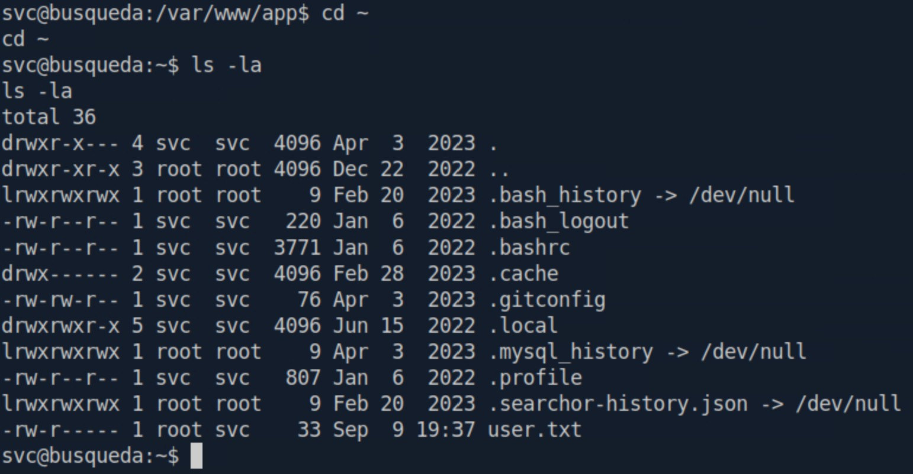
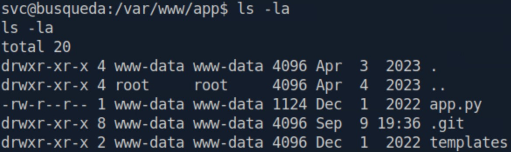
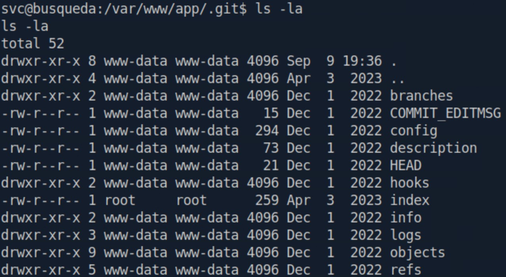
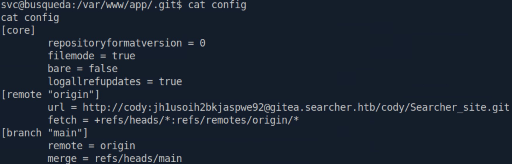

# Busqueda - Easy

## User Flag

Target IP: **10.129.61.28**

Let's first start with a basic Nmap scan to get to know what ports are open on the target machine: 
```
sudo nmap --open 10.129.61.28 -vvv
```

From the output, we see that port 22 (SSH) and port 80 (http) is open. 
```
Starting Nmap 7.95 ( https://nmap.org ) at 2026-09-09 15:39 EDT
Initiating Ping Scan at 15:39
Scanning 10.129.61.28 [4 ports]
Completed Ping Scan at 15:39, 0.05s elapsed (1 total hosts)
Initiating Parallel DNS resolution of 1 host. at 15:39
Completed Parallel DNS resolution of 1 host. at 15:39, 0.00s elapsed
DNS resolution of 1 IPs took 0.00s. Mode: Async [#: 2, OK: 0, NX: 1, DR: 0, SF: 0, TR: 1, CN: 0]
Initiating SYN Stealth Scan at 15:39
Scanning 10.129.61.28 [1000 ports]
Discovered open port 80/tcp on 10.129.61.28
Discovered open port 22/tcp on 10.129.61.28
Completed SYN Stealth Scan at 15:39, 0.23s elapsed (1000 total ports)
Nmap scan report for 10.129.61.28
Host is up, received reset ttl 63 (0.010s latency).
Scanned at 2026-09-09 15:39:03 EDT for 0s
Not shown: 998 closed tcp ports (reset)
PORT   STATE SERVICE REASON
22/tcp open  ssh     syn-ack ttl 63
80/tcp open  http    syn-ack ttl 63

Read data files from: /usr/bin/../share/nmap
Nmap done: 1 IP address (1 host up) scanned in 0.40 seconds
           Raw packets sent: 1004 (44.152KB) | Rcvd: 1001 (40.048KB)
```

Now, let's navigate to ```http://10.129.61.28:80``` to see what kind of application is being hosted by the target machine.

Firefox tells us that it can't find the site. Let's add the url ```searcher.htb``` to our ```/etc/hosts``` file on our attack box and try again.





Now we see the website displayed on our browser. Navigating to the bottom, we also see that the website is powered by Flask and Searchor 2.4.0.



Since we have the version number of Searchor conveniently displayed for us, I looked for publicly listed vulnerabilities for Searchor 2.4.0. It turns out that Searchor 2.4.0 contains a critical arbitrary code execution vulnerability tracked as CVE-2023-43364, caused by a usage of Python's insecure function ```eval()``` to handle user input in ```src/searchor/main.py```. This vulnerability can be used to escape the string context and inject malicious code to be ran on the target system.

Let's intercept a request sent from us to the website and look at it closer. My instincts tell me that we can manipulate the 'query' paramter in the POST request. 



I could've continued with manual exploitation of the vulnerability, but looking online, I found a [PoC](https://github.com/nikn0laty/Exploit-for-Searchor-2.4.0-Arbitrary-CMD-Injection) for CVE-2023-43364. I downloaded the exploit, ran it, and got a reverse shell back as the ```svc``` user.





Navigating to the home directory for this user, we can get the user flag. Nice!



## Root Flag

Let's dig around this machine more. I was interested in the directory the shell dropped us in: ```/var/www/app```. Running ```ls -la```, we see that there is a hidden ```.git``` directory, indicating a git repository. Let's look into it.



Running ```ls -la``` again in the ```.git``` directory immediately gets us some interesting results. One that catches my eye is the ```config``` file, which looks promising for valuable information.



Looking into the contents of the ```config``` file, two things stand out. A set of credentials are revealed, and a new subdomain: ```gitea.searcher.htb```, which we should immediately add to ```/etc/hosts```.




