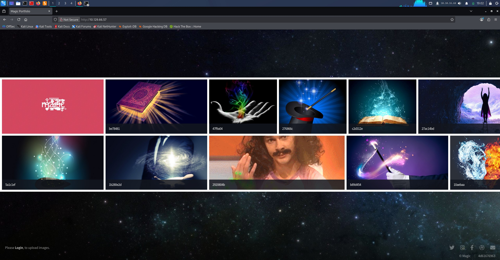
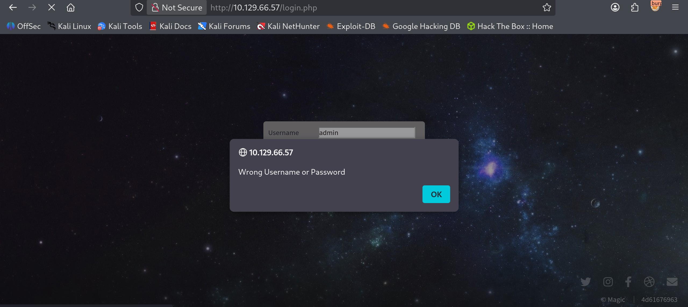
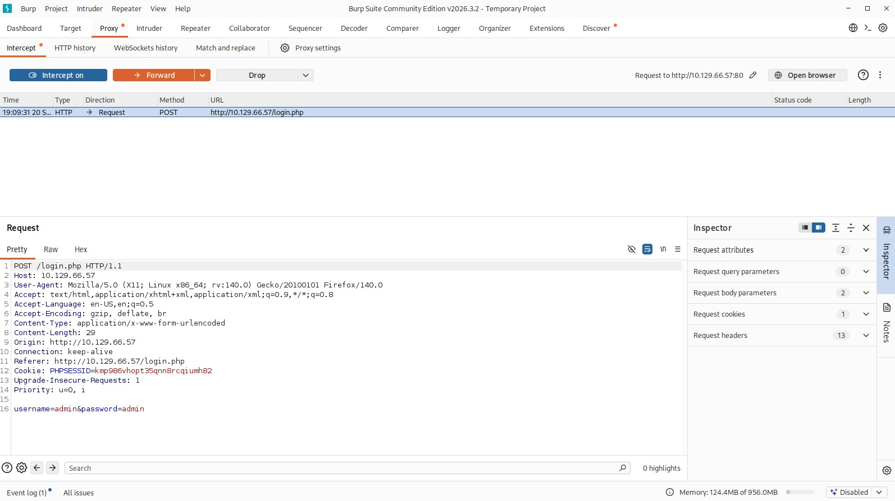
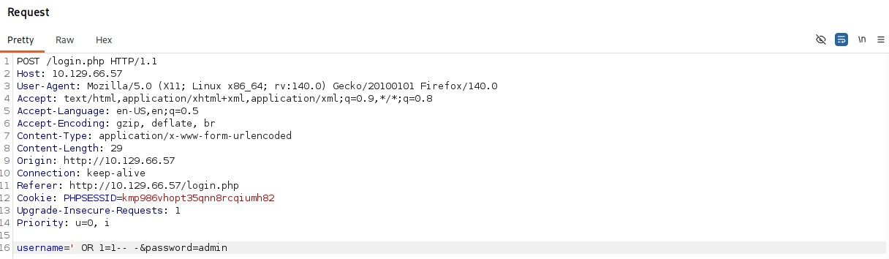
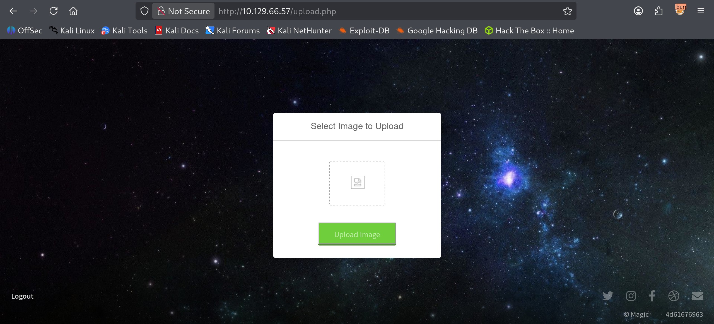

# Magic - Medium

Target IP: **10.129.66.57**

## User Flag

Initial scan: ```sudo nmap -sC -sV 10.129.66.57 -v```

Output shows standard port 22 for ssh and port 80 running Apache 2.4.29.

```
PORT   STATE SERVICE VERSION
22/tcp open  ssh     OpenSSH 7.6p1 Ubuntu 4ubuntu0.3 (Ubuntu Linux; protocol 2.0)
| ssh-hostkey: 
|   2048 06:d4:89:bf:51:f7:fc:0c:f9:08:5e:97:63:64:8d:ca (RSA)
|   256 11:a6:92:98:ce:35:40:c7:29:09:4f:6c:2d:74:aa:66 (ECDSA)
|_  256 71:05:99:1f:a8:1b:14:d6:03:85:53:f8:78:8e:cb:88 (ED25519)
80/tcp open  http    Apache httpd 2.4.29 ((Ubuntu))
|_http-server-header: Apache/2.4.29 (Ubuntu)
| http-methods: 
|_  Supported Methods: GET HEAD POST OPTIONS
|_http-title: Magic Portfolio
Service Info: OS: Linux; CPE: cpe:/o:linux:linux_kernel
```

Let's navigate to the website.

It seems like an image gallery with the option to upload images if we login.



We can log in after pressing the log in button on the bottom left corner. Let's see if we can get a free win with common credentials.

It doesn't work, so let's try something else.



Let's capture a dummy request and see what it does. It sets a ```PHPSESSID``` for us.



A weird behavior that I noticed from the log in page was that if both the username and password were typed in and one was wrong, it displays an error message in an alert box, but if only the password was typed, it still processes the request but just returns us back to the log in page without an error message. This lead me to believe that not entering the username was probably breaking the underlying SQL query.

Let's try a basic SQLi payload.



After forwarding the request, we successfully log in. We are redirected to ```/upload.php```.



## Root Flag

## Contact

Email: <johnyang4406@gmail.com>, <john_s_yang@brown.edu>

LinkedIn: <https://www.linkedin.com/in/john-yang-747726292/>

HackTheBox: <https://profile.hackthebox.com/profile/019c423f-9b9b-708f-8b31-55983b89dddd?utm_medium=copy_url/>
