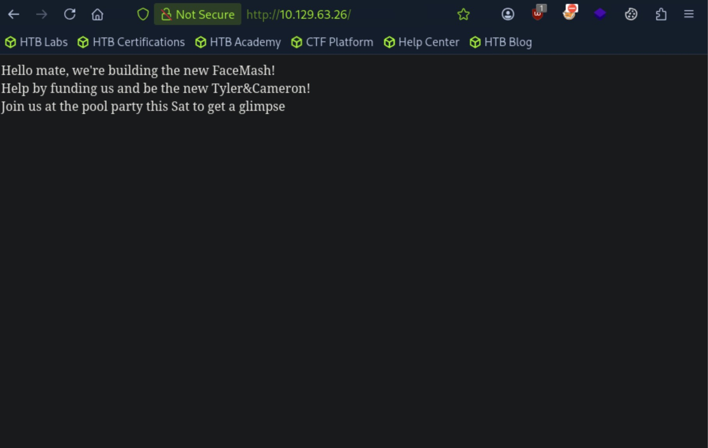
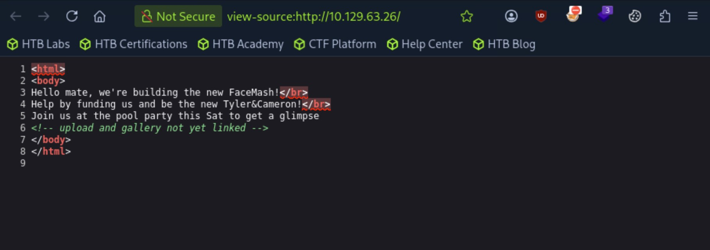
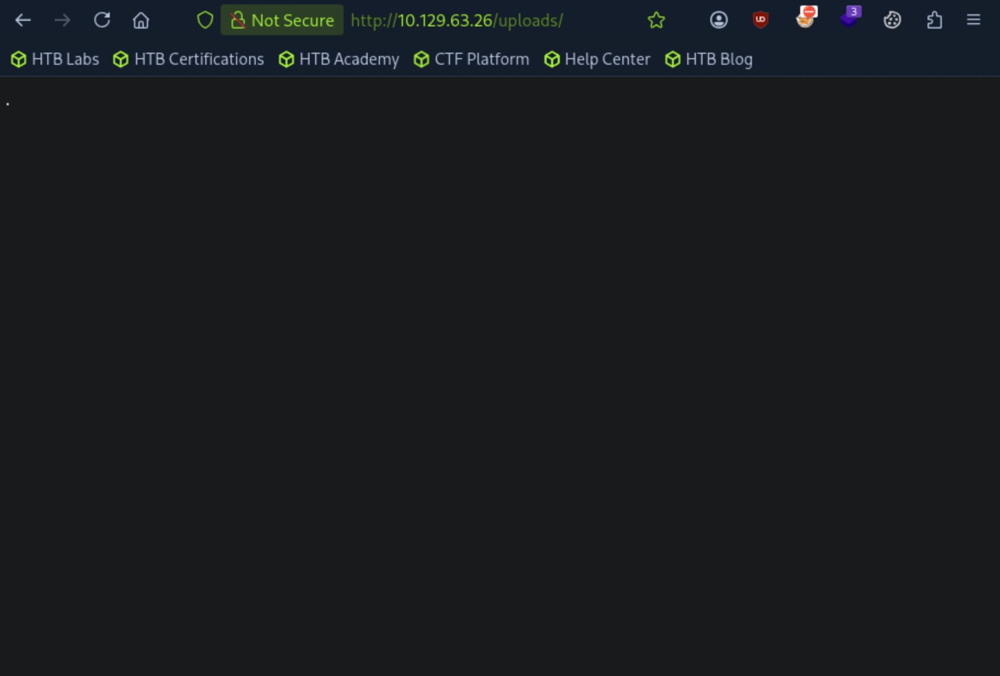
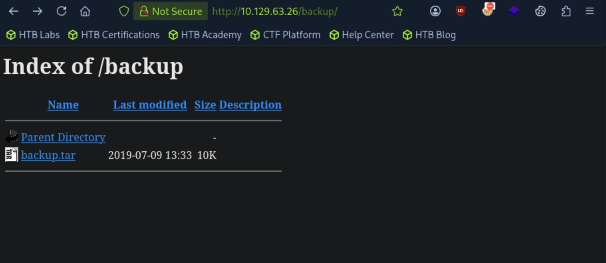

# Networked - Easy

Target IP: **10.129.63.26**

## User Flag

Initial scan: ```sudo nmap --open 10.129.63.26 -vvv```

Output shows standard port 22 for ssh and 80 for http.

```
Starting Nmap 7.95 ( https://nmap.org ) at 2026-09-13 13:03 EDT
Initiating Ping Scan at 13:03
Scanning 10.129.63.26 [4 ports]
Completed Ping Scan at 13:03, 0.04s elapsed (1 total hosts)
Initiating Parallel DNS resolution of 1 host. at 13:03
Completed Parallel DNS resolution of 1 host. at 13:03, 0.00s elapsed
DNS resolution of 1 IPs took 0.00s. Mode: Async [#: 2, OK: 0, NX: 1, DR: 0, SF: 0, TR: 1, CN: 0]
Initiating SYN Stealth Scan at 13:03
Scanning 10.129.63.26 [1000 ports]
Discovered open port 22/tcp on 10.129.63.26
Discovered open port 80/tcp on 10.129.63.26
Completed SYN Stealth Scan at 13:03, 5.05s elapsed (1000 total ports)
Nmap scan report for 10.129.63.26
Host is up, received echo-reply ttl 63 (0.0074s latency).
Scanned at 2026-09-13 13:03:38 EDT for 5s
Not shown: 987 filtered tcp ports (no-response), 10 filtered tcp ports (host-prohibited), 1 closed tcp port (reset)
Some closed ports may be reported as filtered due to --defeat-rst-ratelimit
PORT   STATE SERVICE REASON
22/tcp open  ssh     syn-ack ttl 63
80/tcp open  http    syn-ack ttl 63

Read data files from: /usr/bin/../share/nmap
Nmap done: 1 IP address (1 host up) scanned in 5.19 seconds
           Raw packets sent: 1992 (87.624KB) | Rcvd: 19 (1.296KB)
```

Connect and service scan: ```sudo nmap -sC -sV 10.129.63.26 -v```

Output shows a website being hosted on Apache 2.4.6 on port 80, and port 443 is closed.

```
PORT    STATE  SERVICE VERSION
22/tcp  open   ssh     OpenSSH 7.4 (protocol 2.0)
| ssh-hostkey: 
|   2048 22:75:d7:a7:4f:81:a7:af:52:66:e5:27:44:b1:01:5b (RSA)
|   256 2d:63:28:fc:a2:99:c7:d4:35:b9:45:9a:4b:38:f9:c8 (ECDSA)
|_  256 73:cd:a0:5b:84:10:7d:a7:1c:7c:61:1d:f5:54:cf:c4 (ED25519)
80/tcp  open   http    Apache httpd 2.4.6 ((CentOS) PHP/5.4.16)
|_http-title: Site doesn't have a title (text/html; charset=UTF-8).
| http-methods: 
|_  Supported Methods: GET HEAD POST OPTIONS
|_http-server-header: Apache/2.4.6 (CentOS) PHP/5.4.16
443/tcp closed https
```

Let's navigate to the website.

The website only shows us text, potentially for a new application that is being built.



Looking at the page source of the website, there is a comment talking about an upload and gallery not yet linked. This leads me to believe that there might be some interesting directories we could enumerate for.



So, let's do just that: ```ffuf -w directory-list-2.3-medium.txt:FUZZ -u http://10.129.63.26/FUZZ -ic -t 10```

We get a hit on two directories, ```/uploads``` and ```/backup```.

```
        /'___\  /'___\           /'___\       
       /\ \__/ /\ \__/  __  __  /\ \__/       
       \ \ ,__\\ \ ,__\/\ \/\ \ \ \ ,__\      
        \ \ \_/ \ \ \_/\ \ \_\ \ \ \ \_/      
         \ \_\   \ \_\  \ \____/  \ \_\       
          \/_/    \/_/   \/___/    \/_/       

       v2.1.0-dev
________________________________________________

 :: Method           : GET
 :: URL              : http://10.129.63.26/FUZZ
 :: Wordlist         : FUZZ: /usr/share/wordlists/dirbuster/directory-list-2.3-medium.txt
 :: Follow redirects : false
 :: Calibration      : false
 :: Timeout          : 10
 :: Threads          : 10
 :: Matcher          : Response status: 200-299,301,302,307,401,403,405,500
________________________________________________

                        [Status: 200, Size: 229, Words: 33, Lines: 9, Duration: 10ms]
uploads                 [Status: 301, Size: 236, Words: 14, Lines: 8, Duration: 7ms]
backup                  [Status: 301, Size: 235, Words: 14, Lines: 8, Duration: 10ms]
                        [Status: 200, Size: 229, Words: 33, Lines: 9, Duration: 8ms]
:: Progress: [220547/220547] :: Job [1/1] :: 1470 req/sec :: Duration: [0:02:47] :: Errors: 0 ::
```

Let's navigate to each.

The ```/uploads``` directory seems to be blank, with nothing in the page source either.



The ```/backup``` directory is interesting. It has directory listing enabled, and there is a file named ```backup.tar``` that we can download onto our attack box.



Let's save the ```.tar``` file onto our attack box and unzip it.

```
┌─[us-dedivip-5]─[10.10.15.194]─[htb-mp-3199654@htb-dmk8phjrwb]─[~]
└──╼ [★]$ tar -xvf backup.tar
index.php
lib.php
photos.php
upload.php
```

We get four ```.php``` files, which seem to be a part of the source code of the planned website.

Let's check out each.

```index.php``` is just the page source code of the original website.

```
┌─[us-dedivip-5]─[10.10.15.194]─[htb-mp-3199654@htb-dmk8phjrwb]─[~]
└──╼ [★]$ cat index.php 
<html>
<body>
Hello mate, we're building the new FaceMash!</br>
Help by funding us and be the new Tyler&Cameron!</br>
Join us at the pool party this Sat to get a glimpse
<!-- upload and gallery not yet linked -->
</body>
</html>
```

```lib.php``` seems to be defining functions for filtering and validation on uploaded files.

```
┌─[us-dedivip-5]─[10.10.15.194]─[htb-mp-3199654@htb-dmk8phjrwb]─[~]
└──╼ [★]$ cat lib.php
<?php

function getnameCheck($filename) {
  $pieces = explode('.',$filename);
  $name= array_shift($pieces);
  $name = str_replace('_','.',$name);
  $ext = implode('.',$pieces);
  #echo "name $name - ext $ext\n";
  return array($name,$ext);
}

function getnameUpload($filename) {
  $pieces = explode('.',$filename);
  $name= array_shift($pieces);
  $name = str_replace('_','.',$name);
  $ext = implode('.',$pieces);
  return array($name,$ext);
}

function check_ip($prefix,$filename) {
  //echo "prefix: $prefix - fname: $filename<br>\n";
  $ret = true;
  if (!(filter_var($prefix, FILTER_VALIDATE_IP))) {
    $ret = false;
    $msg = "4tt4ck on file ".$filename.": prefix is not a valid ip ";
  } else {
    $msg = $filename;
  }
  return array($ret,$msg);
}

function file_mime_type($file) {
  $regexp = '/^([a-z\-]+\/[a-z0-9\-\.\+]+)(;\s.+)?$/';
  if (function_exists('finfo_file')) {
    $finfo = finfo_open(FILEINFO_MIME);
    if (is_resource($finfo)) // It is possible that a FALSE value is returned, if there is no magic MIME database file found on the system
    {
      $mime = @finfo_file($finfo, $file['tmp_name']);
      finfo_close($finfo);
      if (is_string($mime) && preg_match($regexp, $mime, $matches)) {
        $file_type = $matches[1];
        return $file_type;
      }
    }
  }
  if (function_exists('mime_content_type'))
  {
    $file_type = @mime_content_type($file['tmp_name']);
    if (strlen($file_type) > 0) // It's possible that mime_content_type() returns FALSE or an empty string
    {
      return $file_type;
    }
  }
  return $file['type'];
}

function check_file_type($file) {
  $mime_type = file_mime_type($file);
  if (strpos($mime_type, 'image/') === 0) {
      return true;
  } else {
      return false;
  }  
}

function displayform() {
?>
<form action="<?php echo $_SERVER['PHP_SELF']; ?>" method="post" enctype="multipart/form-data">
 <input type="file" name="myFile">
 <br>
<input type="submit" name="submit" value="go!">
</form>
<?php
  exit();
}


?>
```

```upload.php``` seems to be the source code of the planned ```/uploads``` directory, and it uses the functions defined in ```lib.php``` to perform validation on uploaded files.

```
┌─[us-dedivip-5]─[10.10.15.194]─[htb-mp-3199654@htb-dmk8phjrwb]─[~]
└──╼ [★]$ cat upload.php 
<?php
require '/var/www/html/lib.php';

define("UPLOAD_DIR", "/var/www/html/uploads/");

if( isset($_POST['submit']) ) {
  if (!empty($_FILES["myFile"])) {
    $myFile = $_FILES["myFile"];

    if (!(check_file_type($_FILES["myFile"]) && filesize($_FILES['myFile']['tmp_name']) < 60000)) {
      echo '<pre>Invalid image file.</pre>';
      displayform();
    }

    if ($myFile["error"] !== UPLOAD_ERR_OK) {
        echo "<p>An error occurred.</p>";
        displayform();
        exit;
    }

    //$name = $_SERVER['REMOTE_ADDR'].'-'. $myFile["name"];
    list ($foo,$ext) = getnameUpload($myFile["name"]);
    $validext = array('.jpg', '.png', '.gif', '.jpeg');
    $valid = false;
    foreach ($validext as $vext) {
      if (substr_compare($myFile["name"], $vext, -strlen($vext)) === 0) {
        $valid = true;
      }
    }

    if (!($valid)) {
      echo "<p>Invalid image file</p>";
      displayform();
      exit;
    }
    $name = str_replace('.','_',$_SERVER['REMOTE_ADDR']).'.'.$ext;

    $success = move_uploaded_file($myFile["tmp_name"], UPLOAD_DIR . $name);
    if (!$success) {
        echo "<p>Unable to save file.</p>";
        exit;
    }
    echo "<p>file uploaded, refresh gallery</p>";

    // set proper permissions on the new file
    chmod(UPLOAD_DIR . $name, 0644);
  }
} else {
  displayform();
}
?>
```

```photos.php```seems to be the source code for the "gallery" that was mentioned on the home page, where the uploaded images are displayed.

```
┌─[us-dedivip-5]─[10.10.15.194]─[htb-mp-3199654@htb-dmk8phjrwb]─[~]
└──╼ [★]$ cat photos.php 
<html>
<head>
<style type="text/css">
.tg  {border-collapse:collapse;border-spacing:0;margin:0px auto;}
.tg td{font-family:Arial, sans-serif;font-size:14px;padding:10px 5px;border-style:solid;border-width:1px;overflow:hidden;word-break:normal;border-color:black;}
.tg th{font-family:Arial, sans-serif;font-size:14px;font-weight:normal;padding:10px 5px;border-style:solid;border-width:1px;overflow:hidden;word-break:normal;border-color:black;}
.tg .tg-0lax{text-align:left;vertical-align:top}
@media screen and (max-width: 767px) {.tg {width: auto !important;}.tg col {width: auto !important;}.tg-wrap {overflow-x: auto;-webkit-overflow-scrolling: touch;margin: auto 0px;}}</style>
</head>
<body>
Welcome to our awesome gallery!</br>
See recent uploaded pictures from our community, and feel free to rate or comment</br>
<?php
require '/var/www/html/lib.php';
$path = '/var/www/html/uploads/';
$ignored = array('.', '..', 'index.html');
$files = array();

$i = 1;
echo '<div class="tg-wrap"><table class="tg">'."\n";

foreach (scandir($path) as $file) {
  if (in_array($file, $ignored)) continue;
  $files[$file] = filemtime($path. '/' . $file);
}
arsort($files);
$files = array_keys($files);

foreach ($files as $key => $value) {
  $exploded  = explode('.',$value);
  $prefix = str_replace('_','.',$exploded[0]);
  $check = check_ip($prefix,$value);
  if (!($check[0])) {
    continue;
  }
  // for HTB, to avoid too many spoilers
  if ((strpos($exploded[0], '10_10_') === 0) && (!($prefix === $_SERVER["REMOTE_ADDR"])) ) {
    continue;
  }
  if ($i == 1) {
    echo "<tr>\n";
  }

echo '<td class="tg-0lax">';
echo "uploaded by $check[1]<br>";
echo "";
echo "</td>\n";


  if ($i == 4) {
    echo "</tr>\n";
    $i = 1;
  } else {
    $i++;
  }
}
if ($i < 4 && $i > 1) {
    echo "</tr>\n";
}
?>
</table></div>
</body>
</html>
```

If we form a POST request that uploads reverse shell code by bypassing all the filters, we might be able to get access.

A prerequisite to that is to take a close look at the source code, particularly ```upload.php``` and ```lib.php``` to understand the filtering that is happening.

Let's start with the functions defined in ```lib.php```.


## Root Flag

## Contact

Email: <johnyang4406@gmail.com>, <john_s_yang@brown.edu>

LinkedIn: <https://www.linkedin.com/in/john-yang-747726292/>

HackTheBox: <https://profile.hackthebox.com/profile/019c423f-9b9b-708f-8b31-55983b89dddd?utm_medium=copy_url/>
