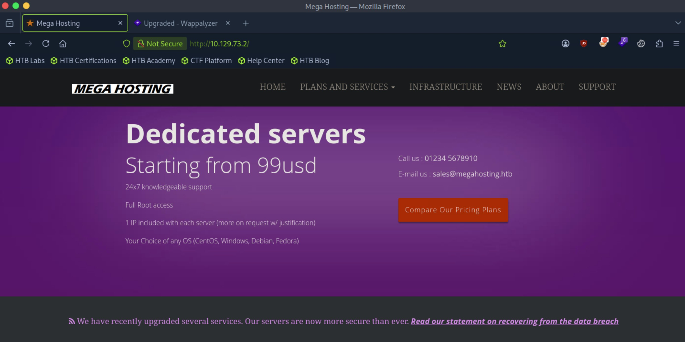
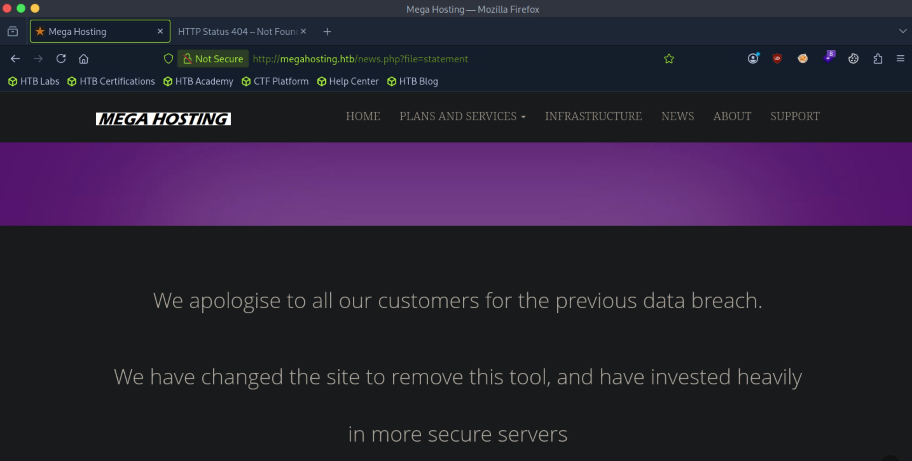
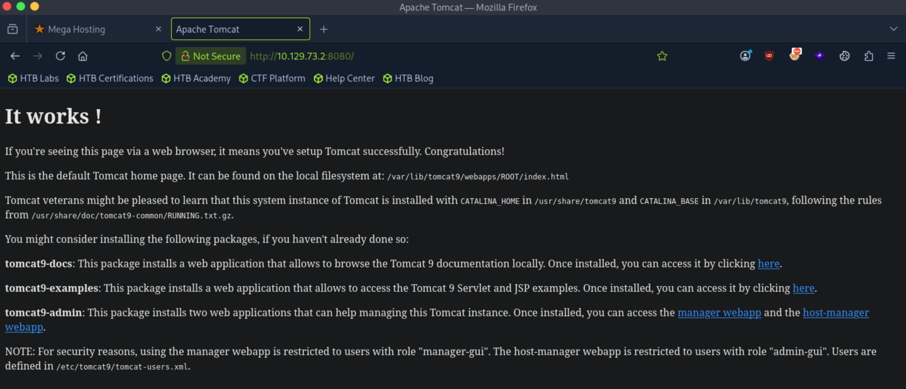
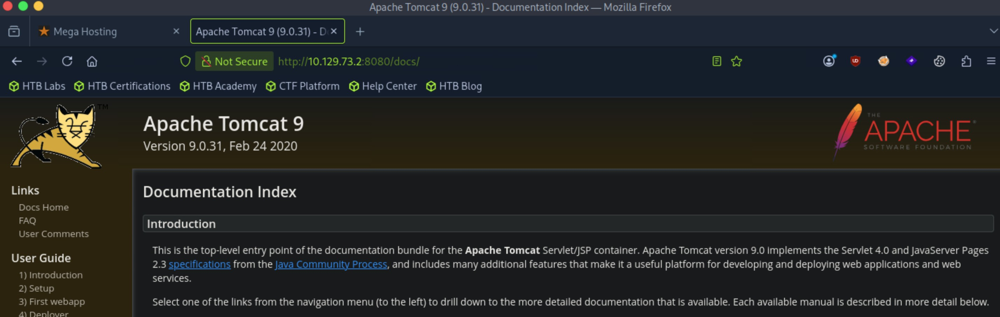
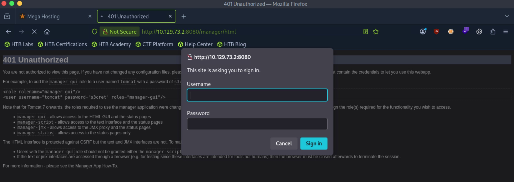

# Tabby - Easy

Target IP: **10.129.73.2**

## User Flag

Initial scan: ```sudo nmap -sC -sV -p- 10.129.73.2 -v```

Output shows standard port 22 for ssh, port 80 running Apache 2.4.41, and port 8080 running Apache Tomcat.

```
PORT     STATE SERVICE VERSION
22/tcp   open  ssh     OpenSSH 8.2p1 Ubuntu 4 (Ubuntu Linux; protocol 2.0)
| ssh-hostkey: 
|   3072 45:3c:34:14:35:56:23:95:d6:83:4e:26:de:c6:5b:d9 (RSA)
|   256 89:79:3a:9c:88:b0:5c:ce:4b:79:b1:02:23:4b:44:a6 (ECDSA)
|_  256 1e:e7:b9:55:dd:25:8f:72:56:e8:8e:65:d5:19:b0:8d (ED25519)
80/tcp   open  http    Apache httpd 2.4.41 ((Ubuntu))
| http-methods: 
|_  Supported Methods: GET HEAD POST OPTIONS
|_http-title: Mega Hosting
|_http-server-header: Apache/2.4.41 (Ubuntu)
|_http-favicon: Unknown favicon MD5: 338ABBB5EA8D80B9869555ECA253D49D
8080/tcp open  http    Apache Tomcat
|_http-title: Apache Tomcat
| http-methods: 
|_  Supported Methods: OPTIONS GET HEAD POST
Service Info: OS: Linux; CPE: cpe:/o:linux:linux_kernel
```

Let's navigate to the website at port 80. We are greeted with this home page.



Some on the buttons direct us to ```megahosting.htb```, so let's add it to our ```/etc/hosts``` file.

The site mostly seems static but there is one interesting functionality. Clicking on "News" leads us to ```/news.php```, where a ```file``` parameter is inputted and displays us a file. In this case, a file going by ```statement``` is pulled up.



That is interesting, but it's not clear yet how we can exploit this, so let's pivot.

Navigating to port 8080 shows us the successful installation message.



On ```/docs```, we can see the version number, 9.0.31.



There doesn't seem to be any relevant CVEs for this version.

We can navigate to ```/manager``` and try to log in with some common credentials, but none of them work.



This leads me to believe there is extra enumeration to be done on the main website.

Directory enumeration gets us some interest results, but we are restricted from viewing it.

```
┌─[us-dedivip-5]─[10.10.15.194]─[htb-mp-3199654@htb-5bpnwm2tct]─[~]
└──╼ [★]$ ffuf -w /usr/share/wordlists/dirbuster/directory-list-2.3-small.txt -u http://megahosting.htb/FUZZ -ic -ac

        /'___\  /'___\           /'___\       
       /\ \__/ /\ \__/  __  __  /\ \__/       
       \ \ ,__\\ \ ,__\/\ \/\ \ \ \ ,__\      
        \ \ \_/ \ \ \_/\ \ \_\ \ \ \ \_/      
         \ \_\   \ \_\  \ \____/  \ \_\       
          \/_/    \/_/   \/___/    \/_/       

       v2.1.0-dev
________________________________________________

 :: Method           : GET
 :: URL              : http://megahosting.htb/FUZZ
 :: Wordlist         : FUZZ: /usr/share/wordlists/dirbuster/directory-list-2.3-small.txt
 :: Follow redirects : false
 :: Calibration      : true
 :: Timeout          : 10
 :: Threads          : 40
 :: Matcher          : Response status: 200-299,301,302,307,401,403,405,500
________________________________________________

                        [Status: 200, Size: 14175, Words: 2135, Lines: 374, Duration: 9ms]
files                   [Status: 301, Size: 318, Words: 20, Lines: 10, Duration: 10ms]
assets                  [Status: 301, Size: 319, Words: 20, Lines: 10, Duration: 6ms]
                        [Status: 200, Size: 14175, Words: 2135, Lines: 374, Duration: 7ms]
:: Progress: [87651/87651] :: Job [1/1] :: 6060 req/sec :: Duration: [0:00:15] :: Errors: 0 ::
```

Subdomain enumeration doesn't get us anything back.

I tried fuzzing for the ```file``` parameter in the aforementioned ```/news.php```, but nothing new comes back either.

## Root Flag

## Contact

Email: <johnyang4406@gmail.com>, <john_s_yang@brown.edu>

LinkedIn: <https://www.linkedin.com/in/john-yang-747726292/>

HackTheBox: <https://profile.hackthebox.com/profile/019c423f-9b9b-708f-8b31-55983b89dddd?utm_medium=copy_url/>
